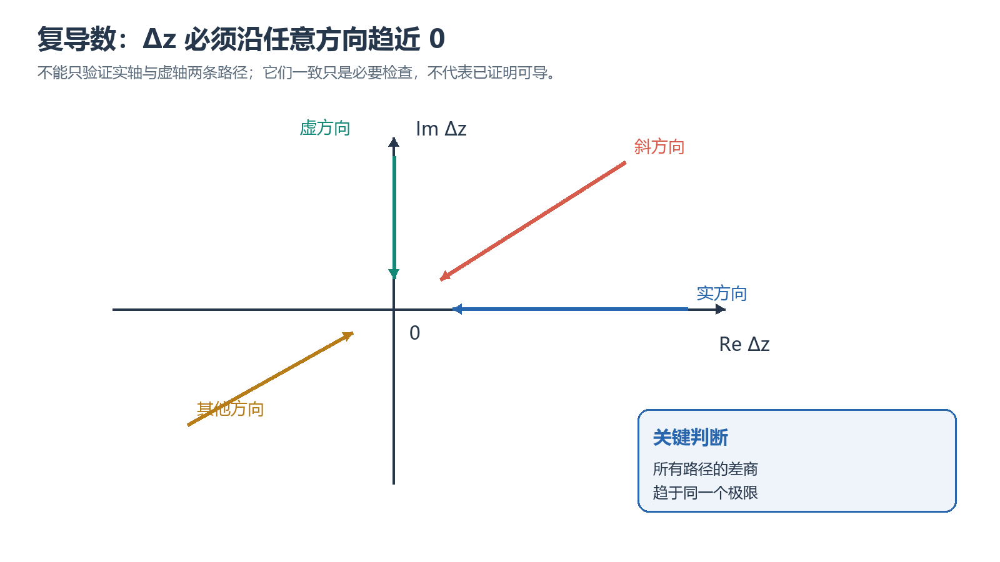

# 第二章 解析函数

## 本章要学什么

本篇围绕一个可检验问题展开：**区分复可导、解析和调和函数并完成 CR 判定**。学习顺序不是目录堆叠，而是先建立对象和判断标准，再处理典型情境，最后用题源练习、变式和错误审查检查迁移能力。

学完后应能：

- 解释本篇核心对象、模型或操作流程；
- 在条件变化时选择合适公式、方法或排查层；
- 完成至少一道需要推导、比较、综合、边界判断或错误审查的题目；
- 用结果检查、单位核对、证据链或成功判据审查结论。

> 阅读顺序：复导数 → CR → 解析性 → 初等函数 → 调和。

## 本章学习地图

| 学习阶段 | 要回答的核心问题 | 学完后的可见成果 |
| --- | --- | --- |
| 基础模型 | 对象是什么、条件是什么？ | 能写出定义、变量和适用范围 |
| 机制与方法 | 为什么这样推导或操作？ | 能展示关键步骤并说明理由 |
| 典型情境 | 条件变化后如何处理？ | 能完成题源题并审查边界 |
| 综合检验 | 结论是否可信、流程是否闭合？ | 能给出可复核答案、判据或证据 |

**前置知识与资料边界：** 复变课件。

## 1. 本章知识框架

本章的依赖链是“复导数定义 → Cauchy–Riemann 条件 → 解析函数 → 初等函数与调和函数”。判定题必须区分某一点复可导、某区域解析和偏导存在这三个层次。
## 2.1 可导与解析

### 1. 复导数

设函数 $w=f(z)$ 定义在区域 $D$ 上，$z_0\in D$。若极限

$$
\lim_{\Delta z\to 0}\frac{f(z_0+\Delta z)-f(z_0)}{\Delta z}
$$

存在，则称 $f$ 在 $z_0$ 处**复可导**，导数记为

$$
f'(z_0)=\lim_{\Delta z\to 0}\frac{f(z_0+\Delta z)-f(z_0)}{\Delta z}.
$$

关键点：$\Delta z\to 0$ 可以沿复平面中的任意路径。因此，复可导比一元实函数可导严格得多。

<!-- study-note-illustration:2026-10-04:complex-derivative-paths -->

**读图提示：**各色箭头代表增量沿不同方向趋近于零；复导数要求差商在所有路径上趋于同一个极限。只检验实轴和虚轴两条路径相同，仍不足以证明复可导。

来源：依据本篇笔记相邻段落自绘的教学示意；不是教材原图或实测记录。

<!-- /study-note-illustration -->

##### 基础检查：1. 复导数

**题目：** 区分一点可导与邻域解析

**解析：** 对 $f(z)=\bar z$，在任意点 CR 条件都不能同时成立，因此不存在复可导点；这说明不能把实变量可微直接当作复可导。

### 2. 可导、解析与整函数

- **在一点可导**：差商在该点的极限存在。
- **在一点解析**：函数在该点的某个邻域内处处可导。
- **在区域 $D$ 内解析**：函数在 $D$ 的每一点都可导。
- **整函数**：函数在整个复平面 $\mathbb C$ 上解析。

注意：在一点可导不等于在该点解析，因为解析要求一个邻域内都可导。

##### 基础检查：2. 可导、解析与整函数

**题目：** 用 CR 条件判定解析性

**解析：** $f(z)=z^2$ 写成 $u=x^2-y^2,v=2xy$，有 $u_x=v_y=2x$、$u_y=-v_x=-2y$，且偏导连续，因此在整个复平面解析。

### 3. 典型反例

#### 例 1：$f(z)=\overline z$ 处处不可导

令 $\Delta z=\Delta x+i\Delta y$，则

$$
\frac{f(z_0+\Delta z)-f(z_0)}{\Delta z}
=\frac{\overline{\Delta z}}{\Delta z}
=\frac{\Delta x-i\Delta y}{\Delta x+i\Delta y}.
$$

- 沿 $\Delta y=0$ 趋近，极限为 $1$；
- 沿 $\Delta x=0$ 趋近，极限为 $-1$。

两条路径所得极限不同，所以 $f(z)=\overline z$ 在任何点都不可导。这也说明：实部和虚部具有连续偏导，并不能单独保证复可导。

##### 典型题：例 1：$f(z)=\overline z$ 处处不可导（练习与解析）

#### 例 2：$f(z)=|z|^2$ 只在原点可导

利用 $|z|^2=z\overline z$，可得

$$
\frac{f(z_0+\Delta z)-f(z_0)}{\Delta z}
=\overline{z_0}+z_0\frac{\overline{\Delta z}}{\Delta z}+\overline{\Delta z}.
$$

- 当 $z_0=0$ 时，极限为 $0$，所以 $f'(0)=0$；
- 当 $z_0
e 0$ 时，极限依赖趋近方向，所以不可导。

因此，该函数只在 $0$ 点可导，却在 $\mathbb C$ 上处处不解析。

##### 典型题：例 2：$f(z)=|z|^2$ 只在原点可导（练习与解析）

### 4. 导数运算法则

若相关导数存在，则

$$
(f\pm g)'=f'\pm g',
$$

$$
(fg)'=f'g+fg',
$$

$$
\left(\frac{f}{g}\right)'=\frac{f'g-fg'}{g^2},\qquad g
e 0,
$$

$$
[f(g(z))]'=f'(g(z))g'(z).
$$

若 $z=\varphi(w)$ 与 $w=f(z)$ 在相应邻域内互为反函数，且 $\varphi'(w)
e 0$，则

$$
f'(z)=\frac{1}{\varphi'(w)},\qquad w=f(z).
$$

由此可知：多项式是整函数；有理函数 $P(z)/Q(z)$ 在 $Q(z)
e 0$ 的区域内解析。

##### 基础检查：4. 导数运算法则

**题目：** 区分一点可导与邻域解析

**解析：** 对 $f(z)=\bar z$，在任意点 CR 条件都不能同时成立，因此不存在复可导点；这说明不能把实变量可微直接当作复可导。

### 5. 奇点

若 $f$ 在 $z_0$ 不解析，但 $z_0$ 的每个邻域内都有 $f$ 的解析点，则称 $z_0$ 为 $f$ 的**奇点**。

易错点：$z_0$ 是奇点，只表示 $f$ 在 $z_0$ 不解析，并不能直接推出 $f$ 在 $z_0$ 不可导。

---

##### 基础检查：5. 奇点

**题目：** 区分一点可导与邻域解析

**解析：** 对 $f(z)=\bar z$，在任意点 CR 条件都不能同时成立，因此不存在复可导点；这说明不能把实变量可微直接当作复可导。

## 2.2 Cauchy-Riemann 条件

设

$$
f(z)=u(x,y)+iv(x,y),\qquad z=x+iy.
$$

### 1. 直角坐标形式

函数 $f$ 在点 $z=x+iy$ 可导，当且仅当 $u,v$ 在点 $(x,y)$ 可微，且满足 Cauchy-Riemann 方程：

$$
\frac{\partial u}{\partial x}=\frac{\partial v}{\partial y},
\qquad
\frac{\partial u}{\partial y}=-\frac{\partial v}{\partial x}.
$$

此时导数可以写成

$$
f'(z)=\frac{\partial u}{\partial x}+i\frac{\partial v}{\partial x}
=\frac{\partial v}{\partial y}-i\frac{\partial u}{\partial y}.
$$

实用判定法：若 $u,v$ 的一阶偏导在某邻域内连续，并且满足 C-R 方程，则 $f$ 在该邻域内解析。

##### 基础检查：1. 直角坐标形式

**题目：** 区分一点可导与邻域解析

**解析：** 对 $f(z)=\bar z$，在任意点 CR 条件都不能同时成立，因此不存在复可导点；这说明不能把实变量可微直接当作复可导。

### 2. 为什么只满足 C-R 方程还不够

函数

$$
f(z)=\sqrt{|xy|},\qquad z=x+iy
$$

在原点的四个一阶偏导都为 $0$，所以形式上满足 C-R 方程。但沿 $y=kx$、$x\to 0^+$，有

$$
\frac{f(z)-f(0)}{z}=\frac{\sqrt{k}}{1+ik},
$$

其值随 $k$ 改变，因此 $f$ 在原点不可导。

结论：**C-R 方程加上实部、虚部可微**才构成充要条件；只有点上的偏导和 C-R 等式并不充分。

##### 基础检查：2. 为什么只满足 C-R 方程还不够

**题目：** 区分一点可导与邻域解析

**解析：** 对 $f(z)=\bar z$，在任意点 CR 条件都不能同时成立，因此不存在复可导点；这说明不能把实变量可微直接当作复可导。

### 3. 极坐标形式

若 $z=re^{i\theta}$、$r>0$，则 C-R 方程为

$$
\frac{\partial u}{\partial r}=\frac{1}{r}\frac{\partial v}{\partial \theta},
\qquad
\frac{\partial v}{\partial r}=-\frac{1}{r}\frac{\partial u}{\partial \theta}.
$$

### 4. 常见应用

#### 判断含参数函数的解析性

对

$$
f(z)=x^2+axy+by^2+i(cx^2+dxy+y^2),
$$

分别求 $u_x,u_y,v_x,v_y$，再比较同类项。由 C-R 方程得到

$$
a=2,\qquad b=-1,\qquad c=-1,\qquad d=2.
$$

##### 典型题：判断含参数函数的解析性（练习与解析）

#### 等势线与流线正交

若 $f=u+iv$ 解析且 $f'(z)
e 0$，则曲线族 $u(x,y)=C_1$ 与 $v(x,y)=C_2$ 相互正交。因为

$$
\nabla u\cdot\nabla v
=u_xv_x+u_yv_y
=u_x(-u_y)+u_yu_x=0.
$$

##### 典型题：等势线与流线正交（练习与解析）

#### 导数恒为零

若区域 $D$ 上处处有 $f'(z)=0$，则由 C-R 方程可得

$$\nu_x=u_y=v_x=v_y=0,
$$

故 $f$ 在连通区域 $D$ 上为常数。

##### 典型题：导数恒为零（练习与解析）

#### 模恒定的解析函数

若 $f$ 在区域 $D$ 内解析，且 $|f(z)|$ 恒为常数，则 $f$ 为常数。

- 若 $|f|=0$，结论显然；
- 若 $|f|=C>0$，则 $f$ 无零点，且 $\overline f=C^2/f$ 解析；
- $f=u+iv$ 与 $\overline f=u-iv$ 同时解析，C-R 方程推出 $u,v$ 均为常数。

---

##### 典型题：模恒定的解析函数（练习与解析）

##### 基础检查：4. 常见应用

**题目：** 区分一点可导与邻域解析

**解析：** 对 $f(z)=\bar z$，在任意点 CR 条件都不能同时成立，因此不存在复可导点；这说明不能把实变量可微直接当作复可导。

## 2.3 初等函数

### 1. 指数函数

定义

$$
e^z=e^{x+iy}=e^x(\cos y+i\sin y).
$$

主要性质：

$$
|e^z|=e^x,
$$

$$
\operatorname{Arg}(e^z)=y+2k\pi,\qquad k\in\mathbb Z,
$$

$$
e^{z_1+z_2}=e^{z_1}e^{z_2},
$$

$$
e^{z+2\pi i}=e^z,
$$

$$
(e^z)'=e^z.
$$

因此 $e^z$ 是以 $2\pi i$ 为周期的整函数，并且永远不等于 $0$。

##### 基础检查：1. 指数函数

**题目：** 区分一点可导与邻域解析

**解析：** 对 $f(z)=\bar z$，在任意点 CR 条件都不能同时成立，因此不存在复可导点；这说明不能把实变量可微直接当作复可导。

### 2. 对数函数

由 $e^w=z$ 解出

$$
w=\ln|z|+i\operatorname{Arg}z.
$$

#### 多值对数

$$
\operatorname{Ln}z=\ln|z|+i(\arg z+2k\pi),\qquad k\in\mathbb Z.
$$

##### 典型题：多值对数（练习与解析）

#### 对数主值

取

$$
\arg z\in(-\pi,\pi],
$$

定义

$$
\ln z=\ln|z|+i\arg z.
$$

对数主值在割平面 $\mathbb C\setminus(-\infty,0]$ 上解析，并满足

$$
\frac{d}{dz}\ln z=\frac{1}{z}.
$$

在任何不经过原点的单连通区域内，只要连续选取辐角，就能得到一个解析的对数分支。

##### 典型题：对数主值（练习与解析）

#### 多值运算的注意事项

作为值集合，有

$$
\operatorname{Ln}(z_1z_2)=\operatorname{Ln}z_1+\operatorname{Ln}z_2.
$$

但主值一般不满足

$$
\ln(z_1z_2)=\ln z_1+\ln z_2,
$$

两边可能相差 $2k\pi i$。同样，不能把多值等式直接当作普通单值等式使用。

常见值：

$$
\operatorname{Ln}i=i\left(\frac{\pi}{2}+2k\pi\right),
$$

$$
\operatorname{Ln}1=2k\pi i,
$$

$$
\operatorname{Ln}(-1)=i(\pi+2k\pi).
$$

##### 典型题：多值运算的注意事项（练习与解析）

##### 基础检查：2. 对数函数

**题目：** 区分一点可导与邻域解析

**解析：** 对 $f(z)=\bar z$，在任意点 CR 条件都不能同时成立，因此不存在复可导点；这说明不能把实变量可微直接当作复可导。

### 3. 幂函数

对 $a
e 0$，定义复幂

$$
a^b=e^{b\operatorname{Ln}a}.
$$

- $b\in\mathbb Z$ 时，$a^b$ 为单值；
- $b=p/q$ 为既约有理数且 $q>0$ 时，$a^b$ 有 $q$ 个不同值；
- 对课件所讨论的非有理指数，通常产生无穷多个值。

固定 $\operatorname{Ln}a$ 的一个值后，关于 $z$ 的函数

$$
a^z=e^{z\operatorname{Ln}a}
$$

为整函数，且

$$
(a^z)'=a^z\operatorname{Ln}a.
$$

在选定的对数分支上，

$$
z^b=e^{b\operatorname{Ln}z},
\qquad
(z^b)'=bz^{b-1}.
$$

典型例子：

$$
i^i=e^{i\operatorname{Ln}i}=e^{-\pi/2-2k\pi},\qquad k\in\mathbb Z.
$$

因此 $i^i$ 虽然是实数，但有无穷多个正实值。

### 4. 三角函数与双曲函数

复三角函数定义为

$$
\cos z=\frac{e^{iz}+e^{-iz}}{2},
\qquad
\sin z=\frac{e^{iz}-e^{-iz}}{2i}.
$$

它们都是整函数，并满足

$$
(\cos z)'=-\sin z,
\qquad
(\sin z)'=\cos z,
$$

$$
e^{iz}=\cos z+i\sin z,
$$

$$
\sin^2z+\cos^2z=1.
$$

当 $z=x+iy$ 时，

$$
\cos(x+iy)=\cos x\cosh y-i\sin x\sinh y.
$$

这表明复三角函数一般无界。例如 $|\sin(iy)|$ 与 $|\cos(iy)|$ 在 $y\to+\infty$ 时趋于无穷。

双曲函数定义为

$$
\cosh z=\frac{e^z+e^{-z}}{2},
\qquad
\sinh z=\frac{e^z-e^{-z}}{2},
$$

$$
\tanh z=\frac{e^z-e^{-z}}{e^z+e^{-z}}.
$$

其中 $\cosh z$ 为偶函数，$\sinh z$ 为奇函数，并且

$$
(\cosh z)'=\sinh z,
\qquad
(\sinh z)'=\cosh z.
$$

两类函数的联系为

$$
\cos(iy)=\cosh y,
\qquad
\sin(iy)=i\sinh y,
$$

$$
\cosh(iy)=\cos y,
\qquad
\sinh(iy)=i\sin y.
$$

##### 基础检查：4. 三角函数与双曲函数

**题目：** 区分一点可导与邻域解析

**解析：** 对 $f(z)=\bar z$，在任意点 CR 条件都不能同时成立，因此不存在复可导点；这说明不能把实变量可微直接当作复可导。

### 5. 反三角函数

反三角函数通常通过对数函数表示，因此也是多值函数。例如，由 $z=\tan w$ 可得

$$
\operatorname{Arctan}z
=\frac{1}{2i}\operatorname{Ln}\left(\frac{1+iz}{1-iz}\right).
$$

处理反三角函数时，需要同时关注对数的分支和分母为零的点。

---

##### 基础检查：5. 反三角函数

**题目：** 区分一点可导与邻域解析

**解析：** 对 $f(z)=\bar z$，在任意点 CR 条件都不能同时成立，因此不存在复可导点；这说明不能把实变量可微直接当作复可导。

## 2.4 调和函数

| col1 | col2 | col3 |
| ---- | ---- | ---- |
|      |      |      |
|      |      |      |

### 1. Laplace 方程与调和函数

若 $f=u+iv$ 解析，且相关二阶偏导连续，则由 C-R 方程可得

$$
\frac{\partial^2u}{\partial x^2}
+\frac{\partial^2u}{\partial y^2}=0,
$$

$$
\frac{\partial^2v}{\partial x^2}
+\frac{\partial^2v}{\partial y^2}=0.
$$

记 Laplace 算子为

$$
\Delta=\frac{\partial^2}{\partial x^2}
+\frac{\partial^2}{\partial y^2}.
$$

若实函数 $u$ 在区域 $D$ 内具有二阶连续偏导，且满足

$$
\Delta u=0,
$$

则称 $u$ 是 $D$ 内的**调和函数**。

解析函数的实部和虚部一定调和，但一个函数调和并不自动保证它在任意区域内都有全局共轭调和函数；区域的拓扑结构也很重要。

##### 基础检查：1. Laplace 方程与调和函数

**题目：** 由调和函数构造共轭调和函数

**解析：** 给定 $u=x^2-y^2$，由 $v_y=u_x=2x$ 得 $v=2xy+\phi(x)$；再由 $v_x=-u_y=2y$ 得 $\phi_1(x)=0$，故 $v=2xy+C$。

### 2. 共轭调和函数

若 $u$ 在区域 $D$ 内调和，并且 $u+iv$ 解析，则称 $v$ 为 $u$ 的**共轭调和函数**。

由 C-R 方程，$v$ 应满足

$$
v_x=-u_y,
\qquad
v_y=u_x.
$$

若 $v$ 是 $u$ 的共轭调和函数，则 $-u$ 是 $v$ 的共轭调和函数，因为

$$
-i(u+iv)=v-iu
$$

仍然解析。

在单连通区域内，给定调和函数 $u$，其共轭调和函数 $v$ 存在，并且只相差一个实常数。因此对应的解析函数 $f=u+iv$ 只相差一个纯虚常数。

### 3. 构造共轭调和函数

#### 方法一：偏积分法

1. 由 $v_x=-u_y$ 对 $x$ 积分：

   $$
   v(x,y)=\int -u_y(x,y)\,dx+\phi(y).
   $$
2. 对上式求 $v_y$，再与 $v_y=u_x$ 比较，求出 $\phi'(y)$。
3. 积分得到 $\phi(y)$，保留任意实常数。

也可以先从 $v_y=u_x$ 出发，对 $y$ 积分。

##### 典型题：方法一：偏积分法（练习与解析）

#### 方法二：线积分法

由

$$
dv=-u_y\,dx+u_x\,dy
$$

得到

$$
v(x,y)=\int_{(x_0,y_0)}^{(x,y)}(-u_y\,dx+u_x\,dy)+C.
$$

在单连通区域内，由于 $u$ 调和，该积分与路径无关。实际计算时通常选取先水平、后竖直的折线路径。

##### 典型题：方法二：线积分法（练习与解析）

##### 基础检查：3. 构造共轭调和函数

**题目：** 由调和函数构造共轭调和函数

**解析：** 给定 $u=x^2-y^2$，由 $v_y=u_x=2x$ 得 $v=2xy+\phi(x)$；再由 $v_x=-u_y=2y$ 得 $\phi_1(x)=0$，故 $v=2xy+C$。

### 4. 典型例题

#### 例 1：由辐角构造解析函数

在右半平面 $x>0$ 上，给定

$$\nu(x,y)=\arctan\frac{y}{x}.
$$

验证 $\Delta u=0$ 后，由 C-R 方程可得

$$
v(x,y)=-\frac{1}{2}\ln(x^2+y^2)+C.
$$

因此

$$
f(z)=u+iv
=\arg z-i\ln|z|+iC
=-i\ln z+iC,
$$

其中 $\ln z$ 表示右半平面上选定的解析对数分支。

##### 典型题：例 1：由辐角构造解析函数（练习与解析）

#### 例 2：构造满足初值的解析函数

给定

$$\nu(x,y)=e^x\cos y+x+y,
$$

求满足 $f(0)=1$ 的解析函数 $f=u+iv$。

由 C-R 方程可得

$$
v(x,y)=e^x\sin y-x+y+C.
$$

再由 $f(0)=1$ 得 $C=0$，于是

$$
f(z)=e^z+(1-i)z.
$$

##### 典型题：例 2：构造满足初值的解析函数（练习与解析）

##### 基础检查：4. 典型例题

**题目：** 区分一点可导与邻域解析

**解析：** 对 $f(z)=\bar z$，在任意点 CR 条件都不能同时成立，因此不存在复可导点；这说明不能把实变量可微直接当作复可导。

### 5. 单连通条件为何重要

函数 $\ln(x^2+y^2)$ 在 $\mathbb C\setminus\{0\}$ 上调和，但在整个穿孔平面上没有单值的全局共轭调和函数。原因是绕原点一周后，辐角会增加 $2\pi$，无法全局连续选取。

若把区域限制在不包围原点的单连通子区域内，例如右半平面，就可以选取连续辐角，从而构造共轭调和函数。

---

##### 基础检查：5. 单连通条件为何重要

**题目：** 区分一点可导与邻域解析

**解析：** 对 $f(z)=\bar z$，在任意点 CR 条件都不能同时成立，因此不存在复可导点；这说明不能把实变量可微直接当作复可导。

## 三、常用解题流程

### 1. 判断函数在一点是否可导

1. 优先写差商定义。
2. 若怀疑不可导，选两条简单路径趋近，如横轴、纵轴或 $y=kx$。
3. 若两条路径极限不同，立即判定不可导。
4. 若使用 C-R 条件，不仅要验证方程，还要确认 $u,v$ 在该点可微。

##### 基础检查：1. 判断函数在一点是否可导

**题目：** 用 CR 条件判定解析性

**解析：** $f(z)=z^2$ 写成 $u=x^2-y^2,v=2xy$，有 $u_x=v_y=2x$、$u_y=-v_x=-2y$，且偏导连续，因此在整个复平面解析。

### 2. 判断函数在区域内是否解析

1. 写成 $f=u+iv$。
2. 求 $u_x,u_y,v_x,v_y$。
3. 检查一阶偏导的连续性。
4. 解 C-R 方程，得到解析区域。
5. 必要时写出 $f'(z)=u_x+iv_x$。

### 3. 处理对数、幂与反函数

1. 先判断题目讨论的是多值函数、主值还是某个解析分支。
2. 明确辐角范围与割线。
3. 用指数函数表示目标函数。
4. 运算结束后检查是否遗漏 $2k\pi i$ 或分支限制。

##### 基础检查：3. 处理对数、幂与反函数

**题目：** 区分一点可导与邻域解析

**解析：** 对 $f(z)=\bar z$，在任意点 CR 条件都不能同时成立，因此不存在复可导点；这说明不能把实变量可微直接当作复可导。

### 4. 由实部或虚部构造解析函数

1. 先验证给定函数满足 Laplace 方程。
2. 检查区域是否单连通。
3. 用 C-R 方程的偏积分法或线积分法求共轭调和函数。
4. 加上任意常数。
5. 尽量将结果改写为只含 $z$ 的形式。
6. 用初值条件确定常数。

---

##### 基础检查：4. 由实部或虚部构造解析函数

**题目：** 用 CR 条件判定解析性

**解析：** $f(z)=z^2$ 写成 $u=x^2-y^2,v=2xy$，有 $u_x=v_y=2x$、$u_y=-v_x=-2y$，且偏导连续，因此在整个复平面解析。

## 四、易错点速查

- 复导数的极限必须与趋近方向无关。
- 一点可导不代表在该点解析。
- 满足 C-R 方程不一定可导，还需要实部、虚部可微。
- 奇点处不解析，但未必不可导。
- 对数函数、一般幂函数和反三角函数通常是多值函数。
- 多值对数的集合等式不能直接当作对数主值等式。
- 复三角函数在复平面上一般无界。
- 调和函数只有在合适的区域，尤其是单连通区域内，才能保证存在全局共轭调和函数。
- 共轭调和函数只在相差一个实常数的意义下唯一。
- 构造解析函数后，应尽量把含 $x,y$ 的表达式整理成仅含 $z$ 的表达式。

---

## 五、本章核心公式

$$
f'(z_0)=\lim_{\Delta z\to0}\frac{f(z_0+\Delta z)-f(z_0)}{\Delta z}
$$

$$\nu_x=v_y,\qquad u_y=-v_x
$$

$$
f'(z)=u_x+iv_x=v_y-iu_y
$$

$$\nu_r=\frac{1}{r}v_\theta,\qquad v_r=-\frac{1}{r}u_\theta
$$

$$
e^z=e^x(\cos y+i\sin y)
$$

$$
\operatorname{Ln}z=\ln|z|+i(\arg z+2k\pi)
$$

$$
a^b=e^{b\operatorname{Ln}a}
$$

$$
\cos z=\frac{e^{iz}+e^{-iz}}{2},\qquad
\sin z=\frac{e^{iz}-e^{-iz}}{2i}
$$

$$
\Delta u=u_{xx}+u_{yy}=0
$$

$$
v_x=-u_y,\qquad v_y=u_x
$$

<!-- study-notes-integrated:2026-10-06 -->

## 综合题与解析

#### 综合自测题 1

**题目：** 复导数

**解析：** 判断 f(z)=ar z 在 z=0 是否复可导。

#### 综合自测题 2

**题目：** C-R 条件

**解析：** 对 f(z)=z² 写出 u、v 并验证 C-R 条件。

#### 综合自测题 3

**题目：** 调和函数

**解析：** 判断 u=x²−y² 是否调和，并求其共轭调和函数。
## 六、练习提示与常见问题

- 先写对象、已知条件和求解目标，再选择公式、规则或操作。
- 任何结论都要检查适用条件；资料缺页、版本变化、现场读数或官方规则不明确时标记“待核实”。
- 不要把一次计算、一次波形或一个网页提示直接当作充分证据。

## 七、隔日复习与自测

### 换一组条件再判断（20分钟）

改变本篇核心题目的一个关键条件，重新判断方法、结果和边界，并记录哪些结论依赖模型条件。

### 闭卷解释关键问题（20分钟）

1. 本篇的核心对象、输入和输出分别是什么？
2. 哪个条件一旦改变，原方法最先失效？
3. 如何用独立计算、图表、实验记录或官方资料检查结果？

### 周末/阶段复盘（15分钟）

闭卷画出本篇学习地图，重做下面两道题，只看题源不看解析；最后列出一个仍需查阅的问题。

## 八、学习安排与阅读资料

### 阅读资料

- 复变课件。
- 当前项目原始 PDF、课程讲义、实验指导书或官方资料。

### 细节查阅

争议内容优先回到题源原文核对条件、符号、版本和题图，不用记忆补齐缺失信息。

## 九、自测参考答案

### 题目一

对照定义、边界和反例修正答案，不能只写最终数值。

### 题目二

undefined

## 深度题源检验

> 题源：复变课件（按项目原始资料和课程题意整理）

**题目一：** 围绕“区分复可导、解析和调和函数并完成 CR 判定”构造需要推导、比较和边界判断的题目，给出对象、条件、目标和验收标准。

**解析：** 先识别模型和适用条件，再展示步骤，最后用单位、极限情况或反例检查。

**题目二：** undefined

**解析：** undefined

<!-- study-notes-v2-rebuilt:2026-10-07 -->
