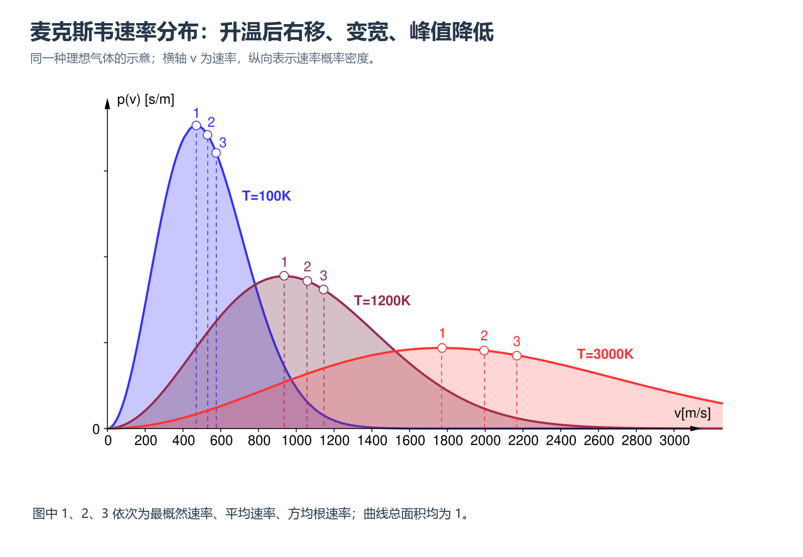

# 第九章｜气体动理论：从宏观状态到分子运动统计

## 本章要学什么

本章回答一个贯穿问题：**如何把压强、温度、密度等宏观量，追溯为分子运动、碰撞和统计分布的结果，并在条件变化时选择正确模型？** 学习路径从状态参量和理想气体模型出发，经过速率分布、外场分布和压强微观解释，再进入能量、真实气体、碰撞与输运，最后用课后题型完成综合检验。

学完后应能：

- 识别理想气体、等温大气、真实气体和稀薄气体近似的适用条件；
- 在 $p,V,T,N,\nu$、数密度、分子质量和摩尔质量之间正确换算，并用单位和数量级检查结果；
- 区分最概然速率、平均速率、方均根速率、平均平动动能和总内能；
- 从分子碰壁和能量均分出发解释压强、温度与内能公式；
- 用比例关系处理平均自由程、碰撞频率和输运系数，并审查结论的边界。

## 本章学习地图

| 学习阶段 | 要回答的核心问题 | 学完后的可见成果 |
| --- | --- | --- |
| 宏观模型 | 状态量怎样描述气体，公式何时能用？ | 能列状态方程并判断封闭、平衡、准静态条件 |
| 统计分布 | 分子速率和外场位置怎样分布？ | 能由分布函数求区间概率、特征速率和高度变化 |
| 微观解释 | 压强、温度、内能怎样从分子运动得到？ | 能写出推导链并区分平动能与总能量 |
| 碰撞与输运 | 分子多久碰撞一次，怎样搬运动量和能量？ | 能用 $\lambda,z,\eta,\kappa,D$ 做比例判断和量纲检查 |
| 综合检验 | 条件变了，原结论还成立吗？ | 能完成题源题、指出模型边界并纠正错误解答 |

**前置知识与资料边界：** 高中力学中的动量、功和能量，基本积分与概率密度；题目、符号和编号以项目内的《大物第九章PDF.pdf》为主。

**建议顺序：** 先读第一节建立符号和模型，再读第二、三节理解统计分布，接着读第四、五节完成微观解释，最后用第五节的题型模板和章末检验回收全章。
## 一、宏观状态与理想气体模型

### 本章路线

**路线：** 先确定系统边界、状态参量和单位，再区分平衡态、准静态过程与非静态过程，最后用理想气体物态方程连接两态变化、混合和数密度。

> **本章要解决的问题：** 面对一个气体状态变化题，怎样判断对象、约束和适用公式，而不是看到压强、体积、温度就机械套式？
>
> **本章学完应会：** 能写出状态量定义和 SI 单位，判断过程是否可用连续状态路径描述，并对封闭气体、充放气和混合气体分别列出正确方程。
#### 0. 常量、符号与适用条件

本章默认使用开尔文温标和 SI 单位；理想气体模型要求分子体积与相互作用可忽略，碰撞近似弹性。常用关系为 $pV=\nu RT=NkT$，后续微观公式都应先检查这些条件。
##### 小练习：模型条件检查
> **题源：** 大物第九章 PDF，理想气体模型概念题改写。
>
> **题目：** 列出本章直接使用 $pV=\nu RT$ 前必须检查的三个条件，并说明碰撞近似在这里扮演什么角色。
>
> **解析：** 至少检查气体足够稀薄、分子自身占据体积和分子间作用可忽略、状态可用平衡参量描述；碰撞近似通常取碰撞时间短且碰撞过程近似弹性，使分子运动统计模型可用。
#### 1. 状态参量、平衡态与准静态过程

#### 1.1 状态参量

描述宏观状态的主要参量是：

- 体积 $V$：气体分子能够活动的空间；单位 $\mathrm{m^3}$。
- 压强 $p$：单位面积器壁受到的垂直作用力；$1\,\mathrm{Pa}=1\,\mathrm{N\,m^{-2}}$。
- 温度 $T$：衡量分子无规则热运动剧烈程度的状态参量，必须使用开尔文温标。

气体占据空间与容器几何容积通常相同，但若容器中有隔板或液体，要辨别“气体实际可活动体积”。

##### 小练习：状态量与单位
> **题源：** 大物第九章 PDF，课后题 9-1 类（按题意改写）。
>
> **题目：** $0.50\,\mathrm{mol}$ 理想气体处于 $T=300\,\mathrm K$、$V=12.5\,\mathrm L$ 的状态，求压强，并说明为什么不能直接把 $12.5$ 代入 SI 公式。
>
> **解析：** 先换算 $V=1.25\times10^{-2}\,\mathrm{m^3}$，再用 $p=\nu RT/V$，得 $p\approx9.98\times10^4\,\mathrm{Pa}$。升不是 SI 体积单位，直接代入会使结果差 $10^3$ 倍。
#### 1.2 平衡态与准静态

- 平衡态：宏观参量不随时间变化，且各处均匀一致；微观分子仍在不停运动。
- 准静态过程：变化足够慢，过程中每一时刻都无限接近平衡态，可以把每一步看作一个平衡态，用状态方程连续计算。
- 非静态过程：变化太快，中间状态不能用单一的平衡参量描述。

##### 小练习：准静态不等于静止
> **题源：** 大物第九章 PDF，平衡态与准静态过程概念题改写。
>
> **题目：** 活塞缓慢上移时，气体内部每一时刻都近似有确定的 $p,V,T$；突然抽走挡块时则不能如此处理。分别判断两种过程能否用连续的 $p$-$V$ 路径描述，并说明理由。
>
> **解析：** 缓慢上移近似准静态，可把过程分成连续平衡态；突然抽走挡块是非静态过程，中间状态存在明显空间和时间不均匀，不能把每一时刻都当作单一平衡态。
#### 1.3 温标与热力学第零定律

热平衡具有传递性：若系统 A、B 分别与系统 C 达到热平衡，则 A 与 B 也处于热平衡。温度是表征热平衡的状态参量。

理想气体温标可由定容气体温度计定义：

$$
\frac{T}{T_3}=\frac{pV}{p_3V_3},\qquad T_3=273.16\,\mathrm K.
$$

##### 小练习：温度的判据
> **题源：** 大物第九章 PDF，热平衡与温标概念题改写。
>
> **题目：** 若系统 A 与 C 达到热平衡，B 也与 C 达到热平衡，能否据此判定 A 与 B 达到热平衡？这条结论依赖哪个定律？
>
> **解析：** 可以。这是热力学第零定律的传递性，它使温度成为判断热平衡的状态参量，而不是把“温度”仅当作读数工具。
#### 1.4 理想气体物态方程

$$
pV = \nu RT = (m/M)RT = NkT \tag{9-3}
$$

常用推论：

- 同一气体定量：$pV/T = \text{常量}$。
- 定温：$pV=\text{常量}$（玻意耳定律）。
- 定容：$p/T=\text{常量}$。
- 定压：$V/T=\text{常量}$。
- 数密度：$n=p/(kT)$。
- 摩尔体积：$V_{m}=RT/p$。

混合气体：各组分分别满足 $p_jV=\nu_jRT$，总压强 $p=\sum_jp_j$（道尔顿分压定律），总物质的量 $\nu=\sum_j\nu_j$。

**状态变化题的固定步骤**：

1. 写清初态、末态的 $p,V,T$，所有温度换成 K。
2. 对同一封闭气体使用 $p_{1}V_{1}/T_{1}=p_{2}V_{2}/T_{2}$。
3. 若充气、放气或混合，分别列各部分的物质的量/质量，再用 $pV=\nu RT$。
4. 检查单位：压强 Pa、体积 $\mathrm{m^3}$、摩尔质量 $\mathrm{kg\,mol^{-1}}$。

---

##### 小练习：状态变化的模型选择
> **题源：** 大物第九章 PDF，课后题 9-1、9-2 类（按题意改写）。
>
> **题目：** 同一封闭气体由 $(p_1,V_1,T_1)$ 变到 $(p_2,V_2,T_2)$；若过程中另有一部分气体逸出，原来的两态关系应如何修改？
>
> **解析：** 未逸出时用 $p_1V_1/T_1=p_2V_2/T_2$；逸出后物质的量不再相同，应分别列各部分的 $pV=\nu RT$，再根据守恒关系或混合规则求末态，不能机械套用定量气体公式。
### 本章小结

本节的主线是“先确定对象，再使用公式”。状态方程 $pV=\nu RT=NkT$ 只有在气体状态可由平衡参量描述、单位统一且模型条件成立时才可直接使用；若物质的量变化或系统由多个部分组成，必须分别列式。

### 本章练习与检验

#### 练习：含逸出气体的两态变化
> **题源：** 大物第九章 PDF，课后题 9-1、9-2 类（按题意改写）。
>
> **题目：** 一容器中理想气体先由 $(p_1,V_1,T_1)$ 变到 $(p_2,V_2,T_2)$，中途有一部分气体逸出。请写出不逸出时的两态关系，并说明逸出后应增加哪一个未知量或守恒方程。
>
> **解析：** 封闭时 $p_1V_1/T_1=p_2V_2/T_2$；逸出后 $\nu_1\ne\nu_2$，应写 $p_1V_1=\nu_1RT_1$、$p_2V_2=\nu_2RT_2$，再结合逸出量或质量守恒求解。检查点是不能把“同一气体”误读成“物质的量不变”。
## 二、麦克斯韦速率分布与玻耳兹曼分布

### 本章路线

**路线：** 先把 $f(v)\,\mathrm dv$ 读成概率，再掌握麦克斯韦分布的峰值、平均和方均根三种速率，最后把统计分布推广到保守外力场和大气压强。

> **本章要解决的问题：** 怎样从“分布函数”读出区间分子数、温度和分子质量的影响，并判断大气压强为什么随高度下降？
>
> **本章学完应会：** 能正确区分概率、分子数和平均量，比较不同温度/气体的分布曲线，并在等温重力场中写出玻耳兹曼分布和压强随高度的关系。
#### 2. 麦克斯韦速率分布

#### 2.1 速率分布函数的定义

$f(v)dv = dN/N$：速率位于 $[v,v+dv]$ 的分子占总数的比例。

归一化条件：$\int_0^\infty f(v)dv=1$。

速率在 $[v_{1},v_{2}]$ 内的分子数：

$$
\Delta N=N\int_{v_{1}}^{v_{2}}f(v)dv.
$$

##### 小练习：概率与分子数
> **题源：** 大物第九章 PDF，速率分布概念题改写。
>
> **题目：** 速率落在 $[v_1,v_2]$ 的分子数如何由 $f(v)$ 表示？若 $N$ 加倍而温度和气体种类不变，区间内分子数与区间概率分别如何变化？
>
> **解析：** $\Delta N=N\int_{v_1}^{v_2}f(v)\,\mathrm dv$。概率不变，分子数随总数 $N$ 加倍；$f(v)$ 是归一化概率密度，不是直接的分子数密度。
#### 2.2 麦克斯韦速率分布律

$$
f(v)=4\pi\left(\frac{m_0}{2\pi kT}\right)^{3/2}v^2e^{-\frac{m_0v^2}{2kT}} \tag{9-6}
$$

曲线特征：$v=0$ 时 $f=0$，先升后降，在最概然速率处达到峰值，曲线下面积为 1。温度升高，峰向右移动且变平；分子质量增大，曲线向左且峰值较高。

最概然速率（峰值对应的速率）：

$$
v_{p} = \sqrt{2kT/m_{0}}=\sqrt{2RT/M}.
$$

平均速率：

$$
\bar v=\sqrt{\frac{8kT}{\pi m_0}}=\sqrt{\frac{8RT}{\pi M}}\approx1.128v_p.
$$

方均根速率：

$$
v_{\mathrm{rms}}=\sqrt{\langle v^2\rangle}=\sqrt{\frac{3kT}{m_0}}=\sqrt{\frac{3RT}{M}}\approx1.225v_p.
$$

三者关系：$v_{p} < \bar v < v_{\mathrm{rms}}$。

##### 小练习：三种速率的选择
> **题源：** 大物第九章 PDF，课后题 9-4、9-5 类（按题意改写）。
>
> **题目：** $T=300\,\mathrm K$ 的氮气中，分别求最概然速率、平均速率和方均根速率的表达式，并判断大小规律。
>
> **解析：** $v_p=\sqrt{2RT/M}$，$\bar v=\sqrt{8RT/(\pi M)}$，$v_{\mathrm{rms}}=\sqrt{3RT/M}$，且 $v_p<\bar v<v_{\mathrm{rms}}$。题目问“峰值位置”才用 $v_p$，问“均方根”不能误用平均速率。
#### 2.3 统计平均的一般写法

若物理量是速率的函数 $g(v)$，则

$$
\langle g(v)\rangle=\int_0^\infty g(v)f(v)\,dv.
$$

特别地：

- $\langle v^r\rangle=\int_0^\infty v^rf(v)\,dv$。
- $\text{平均平动动能}=\left\langle(1/2)m_0v^2\right\rangle=(1/2)m_0\langle v^2\rangle$。
- 不要把 “平均值的函数”与“函数的平均值” 混淆，例如 $\langle 1/v\rangle$ 一般不等于 $1/\bar v$。

**速率区间小宽度近似**：若 $\Delta v$ 很小，$\Delta N\approx Nf(v)\Delta v$。比较两个窄区间的分子数时，直接比较 $f(v)\Delta v$。

##### 小练习：平均值的函数不能互换
> **题源：** 大物第九章 PDF，统计平均题改写。
>
> **题目：** 已知 $\langle v\rangle$，能否直接用 $1/\langle v\rangle$ 代替 $\langle1/v\rangle$？请用统计平均的定义说明。
>
> **解析：** 一般不能。$\langle g(v)\rangle=\int_0^\infty g(v)f(v)\,\mathrm dv$，因此 $\langle1/v\rangle$ 应对 $1/v$ 加权积分，不能把函数先取平均再代入。
#### 2.4 典型题型

1. **求某速率区间分子数**：先求 $N=pV/(kT)$，再乘 $\int f(v)\,dv$；区间很窄时用 $Nf(v)\Delta v$。
2. **已知两个统计速率求温度**：分别代入 $\bar v\propto\sqrt{T/M}$、$v_{\mathrm{rms}}\propto\sqrt{T/M}$，按题设相等或成比列方程。
3. **比较不同气体曲线**：同温下质量小者的三种特征速率均较大，曲线向右；同气体升温也向右移。
4. **任意给定分布函数**：先用 $\int f(v)\,dv=1$ 求常数，再按定义算平均速率、方均根速率和区间概率。

---

<!-- study-note-illustration:2026-10-04:maxwell-boltzmann-reference -->

**读图提示：**观察温度升高时曲线峰值右移、降低并变宽；图中的 1、2、3 依次对应最概然速率、平均速率与方均根速率。横轴表示速率，不是某一方向的速度分量；曲线下的总概率为 1。

来源：[Wikimedia Commons 原图页面](https://commons.wikimedia.org/wiki/File:Maxwell-Boltzmann-Distribution.svg)，作者 Fleshgrinder；[CC0 1.0](https://creativecommons.org/publicdomain/zero/1.0/)。改动：白底排版并添加中文标题及读图提示，未改动原图曲线。

<!-- /study-note-illustration -->

##### 小练习：窄速率区间比较
> **题源：** 大物第九章 PDF，麦克斯韦分布图像题改写。
>
> **题目：** 两个宽度相同且很窄的速率区间分别位于分布峰值两侧，如何不做积分就比较其中分子数？温度升高后结论是否一定不变？
>
> **解析：** 窄区间内 $\Delta N\approx Nf(v)\Delta v$，可直接比较对应位置的 $f(v)$。升温会改变整条分布曲线，区间所处相对位置可能变化，因此不能只凭原温度下的峰值位置外推。
#### 3. 玻耳兹曼分布与大气压强

#### 3.1 玻耳兹曼分布律

在保守外力场中，势能为 $E_{p}(x,y,z)$，单位体积分子数为

$$
n(x,y,z)=n_0e^{-\frac{E_p(x,y,z)}{kT}} \tag{9-13}
$$

含速度和位置的完整分布可写成“麦克斯韦速度因子 × 势能因子”：

$$
dN=n_0\left(\frac{m_0}{2\pi kT}\right)^{3/2}e^{-\frac{m_0v^2/2+E_p}{kT}}\,dv_x\,dv_y\,dv_z\,dV.
$$

重力场中 $E_{p}=m_{0}gh$，因此

$$
n(h)=n_{0}e^{-\frac{m_{0}gh}{kT}}.
$$

对宏观压强同样有

$$
p(h)=p_0e^{-\frac{Mgh}{RT}}\qquad\text{（等温大气公式）}.
$$

若 $p(h)/p_{0}=\alpha$：

$$
h=-(RT/(Mg))\ln \alpha.
$$

##### 小练习：外场中的数密度
> **题源：** 大物第九章 PDF，课后题 9-8 类（按题意改写）。
>
> **题目：** 在恒温重力场中，气体分子势能随高度增加。写出数密度随高度的变化形式，并说明指数衰减的条件。
>
> **解析：** $n(h)=n_0e^{-Mgh/(RT)}$。该式要求近似等温、稀薄且可用理想气体统计描述；若温度随高度显著变化，应使用积分形式而不能直接套常温指数式。
#### 3.2 涨落

宏观量是大量分子统计平均的结果。若某区间的平均分子数为 $\Delta N$，典型涨落量级约为 $\pm \sqrt{\Delta N}$，相对涨落约 $1/\sqrt{\Delta N}$；分子数越多，宏观规律越稳定。

---

##### 小练习：平均量与瞬时量
> **题源：** 大物第九章 PDF，涨落概念题改写。
>
> **题目：** 为什么平衡态中宏观压强可以近似稳定，而单个分子碰撞器壁产生的力却是离散、瞬时变化的？
>
> **解析：** 宏观压强是大量分子碰撞效应的统计平均；分子数越多，相对涨落通常越小，因此平均量稳定不等于微观量没有波动。
### 本章小结

速率分布描述的是大量分子的统计规律，不是单个分子的确定轨迹。$f(v)$ 的面积给概率，乘以 $N$ 才得到分子数；三种特征速率大小规律固定为 $v_p<\bar v<v_{\mathrm{rms}}$。温度升高使分布向高速侧展开；重力场则通过势能差使高处数密度和压强按指数衰减。

### 本章练习与检验

#### 练习：分布曲线的条件变化
> **题源：** 大物第九章 PDF，麦克斯韦分布与大气压强综合题（按题意改写）。
>
> **题目：** 同一气体从 $T$ 升到 $4T$，分别判断 $v_p,\bar v,v_{\mathrm{rms}}$ 如何变化；若在等温大气中高度增加到使压强变为原来的 $1/2$，写出高度表达式。
>
> **解析：** 三种速率都按 $\sqrt T$ 变化，因此均变为原来的 2 倍；大气部分由 $p/p_0=e^{-Mgh/(RT)}$ 得 $h=(RT/Mg)\ln2$。前者来自速率分布，后者来自外场中的势能分布，不能混用两个公式的物理对象。
## 三、压强、温度与内能的微观解释

### 本章路线

**路线：** 先从分子与器壁碰撞的动量交换得到压强公式，再用各向同性和能量均分把压强连接到温度，最后用自由度确定理想气体内能。

> **本章要解决的问题：** 为什么宏观压强与温度能由微观速度平方的平均量表示，而且不同种类气体在同温下的平均平动动能相同、速率却不同？
>
> **本章学完应会：** 能说明 $1/3$ 的来源，推出 $pV=NkT$，区分分子质量对速率的影响与温度对平均平动能的影响，并用自由度计算内能变化。
#### 4. 理想气体压强的微观解释

#### 4.1 压强公式

对理想气体进行弹性碰撞和各向同性统计平均，可得

$$
p=\frac13nm_0\langle v^2\rangle=\frac13\rho\langle v^2\rangle \tag{9-18}
$$

其中 $\rho=nm_{0}=m/V$ 是气体密度。

由于 $v_{\mathrm{rms}}^2=\langle v^2\rangle$，也可写为

$$
p=(1/3)\rho v_{\mathrm{rms}}^2.
$$

压强的微观意义：单位时间内单位面积器壁获得的平均冲量；它是大量分子碰壁的统计结果，不能赋予单个分子“压强”。

##### 小练习：压强的微观来源
> **题源：** 大物第九章 PDF，理想气体压强推导题改写。
>
> **题目：** 从分子碰壁的动量变化出发，说明为什么各向同性气体满足 $p=\frac13nm_0\langle v^2\rangle$，并指出 $1/3$ 的来源。
>
> **解析：** 器壁法向冲量只取速度在法向的分量；各向同性给出 $\langle v_x^2\rangle=\langle v_y^2\rangle=\langle v_z^2\rangle=\langle v^2\rangle/3$，故出现 $1/3$。
#### 4.2 由压强公式推出物态方程

由 $p=(1/3)nm_{0}\langle v^2\rangle$ 和 $m_{0}\langle v^2\rangle/2=3kT/2$，得到

$$
p=nkT.\tag{9-22}
$$

再用 $n=N/V=\nu N_A/V$、$k=R/N_A$，得到 $pV=\nu RT$。

##### 小练习：两条路径到同一结论
> **题源：** 大物第九章 PDF，压强微观解释与物态方程综合题改写。
>
> **题目：** 将 $p=\frac13nm_0\langle v^2\rangle$ 与 $\frac12m_0\langle v^2\rangle=\frac32kT$ 联立，推出 $p=nkT$，再结合 $n=N/V$ 得到什么？
>
> **解析：** 联立后 $p=nkT$；代入 $n=N/V$ 得 $pV=NkT$，再用 $N=\nu N_A$、$R=N_Ak$ 得 $pV=\nu RT$。这说明宏观状态方程可由微观统计关系推出。
#### 4.3 由压强求平均速率或密度

遇到“压强、密度、速率”互求，优先用：

$v_{\mathrm{rms}}=\sqrt{3p/\rho}$，或 $\rho=pM/(RT)$。

---

##### 小练习：比例关系审查
> **题源：** 大物第九章 PDF，课后题 9-17 类（按题意改写）。
>
> **题目：** 同温下两种理想气体压强相同，摩尔质量分别为 $M_1,M_2$。比较它们的方均根速率和密度，并说明不能只看压强下结论。
>
> **解析：** $v_{\mathrm{rms}}\propto M^{-1/2}$，所以轻分子速率大；$\rho=pM/(RT)$，所以重分子密度大。相同压强不意味着速率或密度相同。
#### 5. 温度的微观本质

理想气体分子的平均平动动能：

$$
\langle\varepsilon_{\mathrm{tr}}\rangle=\frac12m_0\langle v^2\rangle=\frac32kT \tag{9-21}
$$

所以温度是大量分子平均平动动能的量度，温度越高，热运动越剧烈。该结论是统计平均，不表示每个分子的动能都等于 $(3/2)kT$。

常见换算：

- 给定平均平动动能 $\varepsilon$：$T=2\varepsilon/(3k)$。
- $1\,\mathrm{eV}$ 对应的温度约 $7.74\times10^3\,\mathrm K$（按平均平动动能定义）。
- 室温下 $(3/2)kT$ 约 $0.039\,\mathrm{eV}$（$T\approx300\,\mathrm K$）。

---

##### 小练习：温度与平均平动动能
> **题源：** 大物第九章 PDF，温度微观本质题改写。
>
> **题目：** 若某气体温度从 $T$ 升到 $4T$，平均平动动能和方均根速率分别变为多少？
>
> **解析：** 平均平动动能与 $T$ 成正比，变为 4 倍；方均根速率与 $\sqrt T$ 成正比，变为 2 倍。两个量对温度的依赖不同，不能把“能量变 4 倍”误写成“速率也变 4 倍”。
#### 6. 自由度、能量均分与内能

#### 6.1 自由度

常温、刚性分子且忽略振动时：

| 分子       | 平动自由度 | 转动自由度 | 总自由度 i |
| ---------- | ---------: | ---------: | ---------: |
| 单原子     |          3 |          0 |          3 |
| 刚性双原子 |          3 |          2 |          5 |
| 刚性多原子 |          3 |          3 |          6 |

振动自由度在高温下可能被激发；每个振动模式通常包含一个动能和一个势能二次项，不能在未说明时随意加入。

##### 小练习：自由度的温度边界
> **题源：** 大物第九章 PDF，能量均分与内能题改写。
>
> **题目：** 为什么双原子刚性分子在常温下常取 $i=5$，而在更高温度下不能无条件坚持这个取值？
>
> **解析：** 常温下通常计入 3 个平动和 2 个转动自由度，振动模态近似未被激发；温度升高后振动自由度可能参与，$i$ 会改变，必须结合模型适用范围判断。
#### 6.2 能量均分定理

平衡态下，每个独立二次型自由度的平均能量为 $(1/2)kT$。因此分子平均热运动能量

$$
\langle \varepsilon\rangle=(i/2)kT \tag{9-25}
$$

平动部分始终为 $(3/2)kT$，与分子种类无关；转动、振动部分取决于自由度。

##### 小练习：平均平动动能
> **题源：** 大物第九章 PDF，课后题 9-11、9-13 类（按题意改写）。
>
> **题目：** 在相同温度下，氦气与氮气分子的平均平动动能是否相同？它们的方均根速率是否相同？
>
> **解析：** 平均平动动能都为 $\frac32kT$，与气体种类无关；方均根速率为 $\sqrt{3kT/m_0}$，分子质量不同则速率不同。
#### 6.3 理想气体内能

刚性理想气体的内能为所有分子热运动能量之和：

$$
U=\frac{i}{2}NkT=\frac{i}{2}\nu RT=\frac{i}{2}\frac{m}{M}RT \tag{9-26, 9-27}
$$

典型结果：

- 单原子：$U=(3/2)\nu RT$。
- 刚性双原子：$U=(5/2)\nu RT$。
- 刚性多原子：$U=3\nu RT$。

理想气体内能只由温度和物质的量（以及自由度）决定，与 $p,V$ 无关。对固定气体，$\Delta U=(i/2)\nu R\Delta T$。

**内能题步骤**：先辨认分子类型确定 $i$，再用 $U=(i/2)\nu RT$；若有能量输入 $Q$ 且无其他能量损失，令 $Q=\Delta U$。

---

##### 小练习：内能的自由度账本
> **题源：** 大物第九章 PDF，课后题 9-14、9-16 类（按题意改写）。
>
> **题目：** $\nu$ mol 单原子理想气体温度由 $T_1$ 变为 $T_2$，求内能变化；若改为常温双原子刚性气体，结果如何改变？
>
> **解析：** 单原子气体 $\Delta U=\frac32\nu R(T_2-T_1)$；双原子刚性气体常温取 $i=5$，则 $\Delta U=\frac52\nu R(T_2-T_1)$。关键不是背“气体内能公式”，而是先确定自由度模型。
### 本章小结

微观解释形成一条完整链条：碰壁动量变化 $
ightarrow p=\frac13nm_0\langle v^2\rangle$；能量均分 $
ightarrow \frac12m_0\langle v^2\rangle=\frac32kT$；二者联立 $
ightarrow p=nkT$；再依据自由度得到 $U=\frac i2\nu RT$。同温不代表不同气体速率相同，必须区分能量、速率和总内能三个层次。

### 本章练习与检验

#### 练习：同温不同气体的比较
> **题源：** 大物第九章 PDF，课后题 9-11、9-13、9-14、9-17 类（按题意改写）。
>
> **题目：** 同温同压下，比较氦气与氮气的平均平动动能、方均根速率、数密度和质量密度；再说明若比较等质量样品的总内能，还需知道什么。
>
> **解析：** 平均平动动能均为 $\frac32kT$；$v_{\mathrm{rms}}\propto M^{-1/2}$，氦气更快；$n=p/(kT)$，数密度相同；$\rho=pM/(RT)$，氮气质量密度更大。等质量样品的总内能还取决于自由度和物质的量，不能只凭同温判断。
## 四、真实气体、平均自由程与碰撞

### 本章路线

**路线：** 先判断理想模型在什么条件下失效，再用范德瓦耳斯方程表达有限体积和分子作用的修正，最后用平均自由程和碰撞频率刻画分子运动的稀疏程度。

> **本章要解决的问题：** 低温、高压或微小容器中，哪些理想化假设先失效？如何通过 $\lambda$ 和 $z$ 判断分子是否会频繁碰撞？
>
> **本章学完应会：** 能解释真实气体偏离的两个主要来源，正确区分摩尔体积与总容积形式，并用 $\lambda\propto T/(d^2p)$ 做条件变化和工程数量级判断。
#### 7. 真实气体与范德瓦耳斯方程

#### 7.1 真实气体偏离理想气体

高压或低温时，分子自身体积和分子间吸引力不可忽略。等温线可出现气液共存的水平段；临界温度以上不能仅靠加压使气体液化。

临界点由临界参量 $(p_{c},V_{c},T_{c})$ 描述：$T>T_{c}$ 时只有气态；$T<T_{c}$ 可出现气态、液态和气液共存区域。

##### 小练习：何时不能用理想模型
> **题源：** 大物第九章 PDF，真实气体概念题改写。
>
> **题目：** 低温高压下，分子间作用和分子自身占据体积分别会造成什么方向的偏离？为什么稀薄高温下理想气体近似更可靠？
>
> **解析：** 分子间吸引使实际压强偏低，有限分子体积使可用体积小于容器体积；高温使作用相对不显著、低压使分子间距大，二者都使理想近似更可靠。
#### 7.2 范德瓦耳斯方程

对 1 mol 气体：

$$
\left(p+\frac{a}{V_m^2}\right)(V_m-b)=RT \tag{9-29}
$$

其中 $b$ 修正分子自身占据的体积，$a/V_{m}^2$ 修正分子间吸引力造成的压强降低。

对 $\nu$ mol 气体：

$$
\left[p+a\left(\frac{\nu}{V}\right)^2\right](V-\nu b)=\nu RT.
$$

对质量 $m$ 的气体（$\nu=m/M$）：

$$
\left[p+a\left(\frac{m}{MV}\right)^2\right]\left(V-\frac{m}{M}b\right)=\frac{m}{M}RT.
$$

使用时注意 $a,b$ 必须与方程的摩尔形式或总量形式相匹配。

---

##### 小练习：变量版本不能混用
> **题源：** 大物第九章 PDF，真实气体方程题改写。
>
> **题目：** 使用摩尔体积 $V_m$ 时，范德瓦耳斯方程如何写？若改用总容积 $V$ 和物质的量 $\nu$，哪些项必须同步修改？
>
> **解析：** 摩尔形式为 $\left(p+a/V_m^2\right)(V_m-b)=RT$；总量形式中排斥修正应写为 $V-\nu b$，吸引修正为 $a\nu^2/V^2$。不能把摩尔形式的 $a/V_m^2$ 直接与总 $V$ 混搭。
#### 8. 平均自由程与平均碰撞频率

#### 8.1 定义与公式

- 平均自由程 $\lambda$：连续两次碰撞之间自由路程的平均值。
- 平均碰撞频率 $z$：单位时间内平均碰撞次数。

两者关系：

$$
\lambda=\bar v/z \tag{9-31}
$$

对有效直径为 $d$ 的硬球分子：

$$
z=\sqrt2\,\pi d^2n\bar v.\tag{9-32}
$$

$$
\lambda=\frac{1}{\sqrt2\,\pi d^2n} \tag{9-35}
$$

$$
\lambda=\frac{kT}{\sqrt2\,\pi d^2p} \tag{9-36}
$$

对同一种气体，$\lambda\propto T/p$、$z\propto p/\sqrt{T}$；温度不变时，分别化为 $\lambda\propto1/p$、$z\propto p$。

平均速率用 $\bar v=\sqrt{8RT/(\pi M)}$，不要误用 $v_{\mathrm{rms}}$。

##### 小练习：平均自由程的变量关系
> **题源：** 大物第九章 PDF，课后题 9-18 至 9-22 类（按题意改写）。
>
> **题目：** 在温度不变时把压强提高到原来的 4 倍，平均自由程和碰撞频率如何变化？
>
> **解析：** $\lambda=kT/(\sqrt2\pi d^2p)$，故 $\lambda$ 变为原来的 $1/4$；若平均速率不变，$z=\bar v/\lambda$ 变为原来的 4 倍。
#### 8.2 典型判断

- 定容升温：$n=N/V$ 不变，故 $\lambda$ 不变；$\bar v\propto\sqrt{T}$，所以 $z=\bar v/\lambda\propto\sqrt{T}$。
- 等压升温：$n=p/(kT)\propto1/T$，故 $\lambda\propto T$；$\bar v\propto\sqrt{T}$，所以 $z\propto1/\sqrt{T}$。
- 低压真空中 $\lambda$ 可大于容器尺寸，分子在碰壁前很少彼此碰撞。

##### 小练习：定容与等压升温
> **题源：** 大物第九章 PDF，平均自由程比例题改写。
>
> **题目：** 分别讨论定容升温和等压升温时 $\lambda$ 的变化，指出两种情况下结论为何不同。
>
> **解析：** $\lambda\propto T/p$。定容时 $p\propto T$，故 $\lambda$ 近似不变；等压时 $p$ 不变，故 $\lambda\propto T$ 增大。必须先写约束关系再代入比例。
#### 8.3 反求分子直径

已知 $\lambda,n$：$d=\sqrt{1/(\sqrt2\,\pi n\lambda)}$。

若给密度 $\rho$ 和摩尔质量 $M$，先用 $n=\rho N_{A}/M$。

---

##### 小练习：由自由程反推直径
> **题源：** 大物第九章 PDF，课后题 9-21、9-22 类（按题意改写）。
>
> **题目：** 已知 $T,p,\lambda$，如何求有效分子直径 $d$？写出量纲检查。
>
> **解析：** $d=\sqrt{kT/(\sqrt2\pi p\lambda)}$。$kT/p$ 的量纲是体积，除以 $\lambda$ 得面积，再开方得到长度，结果量纲应为米。
### 本章小结

理想气体近似在高温、低压、分子间距较大时更可靠；真实气体的修正必须保持变量版本一致。平均自由程由数密度、分子直径和温度共同决定，碰撞频率满足 $z=\bar v/\lambda$。定容升温时 $p$ 与 $T$ 同比例，$\lambda$ 可近似不变；等压升温时 $\lambda$ 随 $T$ 增大。

### 本章练习与检验

#### 练习：平均自由程的两种升温情形
> **题源：** 大物第九章 PDF，课后题 9-18 至 9-22 类（按题意改写）。
>
> **题目：** 同一种气体分子直径不变，分别在定容和等压条件下升温至原来的 $2$ 倍。比较两种情况下的 $\lambda$ 与 $z$，并写出你的比例推理。
>
> **解析：** 定容时 $p$ 也变为 2 倍，$\lambda\propto T/p$ 不变；$\bar v\propto\sqrt T$，故 $z$ 变为 $\sqrt2$ 倍。等压时 $\lambda$ 变为 2 倍，$z\propto\bar v/\lambda$ 变为 $1/\sqrt2$ 倍。核心是先保留约束条件，再做比例。
## 五、气体输运与综合解题

### 本章路线

**路线：** 先理解黏性、热传导和扩散都是分子跨越平均自由程搬运物理量的结果，再用课后题通用模板处理状态变化、大气、真空、速率、内能、碰撞和输运系数问题，最后用公式表和错误审查收束全章。

> **本章要解决的问题：** 面对综合题，如何先识别“搬运的是什么量”和“约束改变了什么”，再选择公式并检查方向、单位与模型边界？
>
> **本章学完应会：** 能判断三种输运定律的方向和物理量，联立 $D,\eta,\kappa,\lambda,z$ 处理比例题，并用“对象—条件—公式—结果—边界”五步审查解答。
#### 9. 气体输运过程

输运的统一观点：分子热运动把某种物理量从高处带到低处。

#### 9.1 黏性（内摩擦）

牛顿黏性定律：

$$
dF=\eta|du/dz|\,dS \tag{9-37}
$$

$\eta$ 为黏度，单位 $\mathrm{Pa\,s}$；方向总是阻碍相对运动。

动量输运形式：

$$
dI=-\eta\frac{du}{dz}\,dS\,dt.
$$

气体动理论给出：

$$
\eta=(1/3)\rho\bar v\lambda \tag{9-40}
$$

代入 $\rho=nm_{0}$、$\lambda=1/(\sqrt2\,\pi d^2n)$ 可见在中等压强范围内，黏度对压强近似不敏感，主要随温度升高而增大。

##### 小练习：黏性定律的方向
> **题源：** 大物第九章 PDF，输运定律题改写。
>
> **题目：** 两层气体的流速沿 $y$ 方向增加，即 $\mathrm du/\mathrm dy>0$。黏性应力方向如何判断？负号表示什么？
>
> **解析：** 黏性应力 $\tau=-\eta\,\mathrm du/\mathrm dy$，方向指向减小流速梯度的方向；负号表示输运总是抵抗梯度，而不是说明黏度为负。
#### 9.2 热传导

傅里叶定律：

$$
dQ=-\kappa\frac{dT}{dz}\,dS\,dt \tag{9-41}
$$

$\kappa$ 为热导率，单位 $\mathrm{W\,m^{-1}\,K^{-1}}$。

动理论表达式：

$$
\kappa=\frac13\rho c_v\bar v\lambda
=\frac13n\left(\frac{i}{2}k\right)\bar v\lambda.
$$

其中 $c_v$ 是单位质量定容比热；后一种写法使用每个分子的定容热容 $c_{v,\mathrm{particle}}=\frac{i}{2}k$。

在常压范围，$n\lambda$ 近似不变，所以 $\kappa$ 对压强近似不敏感；在极低压、$\lambda$ 大于板间距时，参与输运的分子数随 $p$ 减少，$\kappa\propto p$。

保温判断：当 $\lambda\ge L$（两壁间距）时，可进入低压分子流区域。由 $\lambda=kT/(\sqrt2\,\pi d^2p)$ 得

$$
p\le kT/(\sqrt2\,\pi d^2L).
$$

##### 小练习：热流方向与系数
> **题源：** 大物第九章 PDF，输运系数题改写。
>
> **题目：** 温度沿 $x$ 方向递增时，热流方向如何判断？由 $\kappa=\frac13\rho c_v\bar v\lambda$ 比较稀薄气体的热传导能力时应同时看哪些量？
>
> **解析：** 傅里叶定律 $q_x=-\kappa\,\mathrm dT/\mathrm dx$，热流指向低温侧；比较时不能只看密度，还要看比热、平均速率和平均自由程的共同影响。
#### 9.3 扩散

斐克定律：

$$
dm=-D\frac{d\rho}{dz}\,dS\,dt \tag{9-45}
$$

$D$ 为扩散系数，单位 $\mathrm{m^2\,s^{-1}}$。

动理论表达式：

$$
D=(1/3)\bar v\lambda \tag{9-47}
$$

扩散方向总是由高密度向低密度。若已知 $D$、黏度 $\eta$、分子质量等，可联立 $D=(1/3)\bar v\lambda$ 和 $\eta=(1/3)\rho\bar v\lambda$，先求 $\lambda$、再求 $n$ 或分子数。

---

##### 小练习：三种输运的共同结构
> **题源：** 大物第九章 PDF，黏性、热传导与扩散综合题改写。
>
> **题目：** 写出扩散系数 $D$ 与平均自由程、平均速率的关系，并说明它与黏度、热导率公式的共同微观因素。
>
> **解析：** $D=\frac13\bar v\lambda$。三者都由分子跨越平均自由程搬运某种物理量产生，区别在于搬运的是质量、动量还是能量。
#### 10. 课后题通用解题模板

#### A. 压强、体积、温度变化（9-1、9-2 类）

写状态方程 $pV=\nu RT$。若是气压计夹气泡，先把气泡体积写成“管截面积 × 气柱长度”，再使用等温条件 $pV=\text{常量}$，并把水银柱给出的压强差与气泡气体压强叠加。

##### 小练习：状态方程的适用边界
> **题源：** 大物第九章 PDF，课后题 9-1、9-2 类（按题意改写）。
>
> **题目：** 解状态变化题前列出“对象—约束—未知量”三项，并说明何时必须改用各部分物质的量分别列式。
>
> **解析：** 对象是同一封闭气体且物质的量不变时，用两态式；充放气、混合或分隔系统时，物质的量发生改变或对象不唯一，必须分部分列 $pV=\nu RT$。
#### B. 大气压强随高度（9-8 类）

等温大气直接用 $p=p_{0}e^{-\frac{Mgh}{RT}}$。题目给“降到地面 75%”时令 $\alpha=0.75$。

##### 小练习：大气压强的高度尺度
> **题源：** 大物第九章 PDF，课后题 9-8 类（按题意改写）。
>
> **题目：** $T=273.15\,\mathrm K$、摩尔质量为 $M$ 的等温大气中，压强降为地面值的 $0.75$ 时高度是多少？
>
> **解析：** $p/p_0=e^{-Mgh/(RT)}$，故 $h=-(RT/Mg)\ln0.75$。温度必须用 K，且该结果依赖等温近似。
#### C. 真空中分子数（9-9、9-10 类）

先求体积 $V$，再用 $N=pV/(kT)$；若求单位体积分子数，直接用 $n=p/(kT)$。

##### 小练习：真空腔内的分子数
> **题源：** 大物第九章 PDF，课后题 9-9、9-10 类（按题意改写）。
>
> **题目：** 体积 $V$ 的真空腔维持压强 $p$、温度 $T$，求分子数并说明若题目问数密度应怎样改写。
>
> **解析：** $N=pV/(kT)$；数密度直接为 $n=p/(kT)$。两者区别是是否再乘以总体积。
#### D. 分子速率（9-4、9-5、9-17、9-22 类）

按题目关键词选：

- “最概然”用 $v_{p}$；
- “平均速率”用 $\bar v$；
- “方均根”用 $v_{\mathrm{rms}}$；
- “平均平动动能”用 $(3/2)kT$，与气体种类无关。

##### 小练习：关键词与公式
> **题源：** 大物第九章 PDF，课后题 9-4、9-5、9-17、9-22 类（按题意改写）。
>
> **题目：** 将“最概然、平均、方均根、平均平动动能”四个关键词分别匹配到正确公式，并指出哪一项与气体种类无关。
>
> **解析：** 依次对应 $v_p,\bar v,v_{\mathrm{rms}},\frac32kT$；在相同温度下，平均平动动能与气体种类无关，三种速率都依赖分子质量。
#### E. 内能与能量输入（9-11、9-13、9-14、9-15、9-16 类）

先确定 $i$，用 $U=(i/2)\nu RT$。能量全部转化为内能时令 $\Delta E=\Delta U$。同温比较不同分子：平动能相同，但总平均动能和内能要看自由度与物质的量。

##### 小练习：内能变化的先后顺序
> **题源：** 大物第九章 PDF，课后题 9-11、9-13、9-14、9-15、9-16 类（按题意改写）。
>
> **题目：** 面对“加热后内能增加多少”的问题，先写哪三个判断步骤？
>
> **解析：** 先确定系统和物质的量，再判断自由度 $i$，最后确认温度变化并代入 $\Delta U=\frac i2\nu R\Delta T$；若题目给的是外界输入能量，还要判断功是否参与能量分配。
#### F. 平均自由程、碰撞频率（9-18 至 9-22 类）

统一使用：

$$
\lambda=\frac{kT}{\sqrt2\pi d^2p},\qquad z=\frac{\bar v}{\lambda}.
$$

改变一个变量时，先写比例关系，再代入数值，避免重复计算。

##### 小练习：比例法优先
> **题源：** 大物第九章 PDF，课后题 9-18 至 9-22 类（按题意改写）。
>
> **题目：** 若只改变 $p$、$T$ 或分子直径 $d$ 中的一个，怎样快速判断 $\lambda$ 和 $z$ 的变化而不重复计算？
>
> **解析：** 先写 $\lambda\propto T/(d^2p)$、$z\propto d^2p\bar v/T$，保持其余量不变后直接比较比例；最后再用量纲或数量级检查。
#### G. 输运系数（9-23 至 9-25 类）

联立：

$$
D=\frac13\bar v\lambda,\qquad\eta=\frac13\rho\bar v\lambda,\qquad\rho=m_0n,\qquad n=\frac{p}{kT}.
$$

热水瓶/杜瓦瓶题先判断 $\lambda\ge L$，再用 $p\le kT/(\sqrt2\,\pi d^2L)$。

---

##### 小练习：平均自由程的工程判据
> **题源：** 大物第九章 PDF，课后题 9-23 至 9-25 类（按题意改写）。
>
> **题目：** 若容器特征长度为 $L$，什么时候可以认为分子几乎不碰撞就穿过容器？如何由此给出压强上限的数量级条件？
>
> **解析：** 当 $\lambda\ge L$ 时碰撞很少；由 $\lambda=kT/(\sqrt2\pi d^2p)$ 得 $p\le kT/(\sqrt2\pi d^2L)$。这是输运模型与真空工程判断的连接。
#### 11. 最容易出错的地方

1. 温度必须用 K，不能直接把摄氏温度代入 $pV=\nu RT$、麦克斯韦分布或自由程公式。
2. $m$（总质量）、$m_{0}$（分子质量）、$M$（摩尔质量）不要混淆：$m_{0}=M/N_{A}$。
3. $v_{p}$、$\bar v$、$v_{\mathrm{rms}}$ 不是同一个速率；只有 $v_{\mathrm{rms}}$ 与 $\langle v^2\rangle$ 直接相关。
4. $(3/2)kT$ 是平均平动动能，不是每个分子的实际动能，也不是双原子分子的总平均能量。
5. 内能使用自由度 $i$；双原子刚性分子常温下取 $i=5$，不可直接取 3。
6. 速率分布函数的面积是概率，乘以 $N$ 才是分子数。
7. 平均自由程中的碰撞截面是 $\pi d^2$，还要有相对运动带来的 $\sqrt{2}$ 因子。
8. 范德瓦耳斯方程中的 $V_{m}$ 是摩尔体积；若用总 $V$，必须同时写出 $\nu$ 的修正。
9. 输运定律中的负号表示输运方向总是从高值区域指向低值区域。

#### 12. 一页公式表

9. 输运定律中的负号表示输运方向总是从高值区域指向低值区域。
8. 范德瓦耳斯方程中的 $V_{m}$ 是摩尔体积；若用总 $V$，必须同时写出 $\nu$ 的修正。
7. 平均自由程中的碰撞截面是 $\pi d^2$，还要有相对运动带来的 $\sqrt{2}$ 因子。
6. 速率分布函数的面积是概率，乘以 $N$ 才是分子数。
5. 内能使用自由度 $i$；双原子刚性分子常温下取 $i=5$，不可直接取 3。
4. $(3/2)kT$ 是平均平动动能，不是每个分子的实际动能，也不是双原子分子的总平均能量。
3. $v_{p}$、$\bar v$、$v_{\mathrm{rms}}$ 不是同一个速率；只有 $v_{\mathrm{rms}}$ 与 $\langle v^2\rangle$ 直接相关。
2. $m$（总质量）、$m_{0}$（分子质量）、$M$（摩尔质量）不要混淆：$m_{0}=M/N_{A}$。
1. 温度必须用 K，不能直接把摄氏温度代入 $pV=\nu RT$、麦克斯韦分布或自由程公式。

### 本章小结

气体输运的统一图景是：分子在无规则运动中跨越平均自由程，把质量、动量或能量从高值区域带向低值区域。扩散系数、黏度和热导率都含有 $\bar v\lambda$，但对应的被输运量不同。综合解题时，先识别对象和约束，再选择公式；最后至少做一次单位、数量级、极限情况或方向检查。

### 本章练习与检验

#### 练习：三种输运系数的比较
> **题源：** 大物第九章 PDF，课后题 9-23 至 9-25 类（按题意改写）。
>
> **题目：** 在同一稀薄气体模型下，写出 $D,\eta,\kappa$ 的微观表达式，并说明当压强降低时，为什么不能只凭“密度变小”就判断三者都变小。
>
> **解析：** $D=\frac13\bar v\lambda$，$\eta=\frac13\rho\bar v\lambda$，$\kappa=\frac13\rho c_v\bar v\lambda$。降压时 $\rho$ 减小而 $\lambda$ 增大，二者可能相互抵消；必须结合具体模型和状态约束判断，不能只看一个因子。

#### 综合检验：从状态量到微观量
> **题源：** 大物第九章 PDF，课后题 9-1、9-4、9-8、9-18、9-23 类综合改写。
>
> **题目：** 某理想气体的 $p,V,T$ 已知。请依次给出数密度、方均根速率、平均自由程和碰撞频率的计算路径，并列出每一步的适用条件。
>
> **解析：** 先用 $n=p/(kT)$；再根据摩尔质量用 $v_{\mathrm{rms}}=\sqrt{3RT/M}$；用分子直径求 $\lambda=kT/(\sqrt2\pi d^2p)$；最后用 $z=\bar v/\lambda$。需要已知或可由题设得到 $M,d$，并假定理想气体/稀薄气体近似有效。
## 六、练习提示与常见问题

- 先写“研究对象、已知量、未知量、约束条件”，再选公式；不要先找看起来相似的式子。
- 温度进入 $pV=\nu RT$、麦克斯韦分布、大气压强和自由程公式时，一律先换成 K。
- $m$、$m_0$、$M$、$\nu$、$N$、$n$ 的含义不同；每次换算都写出 $m_0=M/N_A$、$n=N/V$ 或 $N=\nu N_A$。
- $v_p$、$\bar v$、$v_{\mathrm{rms}}$ 不能互换；题目关键词决定公式。
- 看到“缓慢”只能说明可能准静态，不能自动推出可逆或无耗散；本章重点是是否能用平衡态参量描述。
- 平均自由程和输运系数优先用比例关系，最后再做量纲和数量级检查。

## 七、隔日复习与自测

### 换一组条件再判断（20分钟）

把章末题中的一个条件改掉：例如由定容改为等压、由同温改为同压、由理想气体改为高压真实气体。闭卷写出公式是否仍适用、哪个比例关系改变，以及应增加哪条方程。

### 闭卷解释下面六个问题（20分钟）

1. 为什么平衡态中宏观压强稳定，但微观碰撞仍然涨落？
2. 为什么 $v_p<\bar v<v_{\mathrm{rms}}$？三者分别对应什么统计对象？
3. 压强公式中的 $1/3$ 从哪里来？
4. 为什么同温下不同气体平均平动动能相同而方均根速率不同？
5. 定容升温和等压升温时平均自由程为什么有不同变化？
6. 黏性、热传导和扩散分别搬运什么量？负号表示什么？

### 周末/阶段复盘（15分钟）

闭卷画出“状态方程—速率分布—压强/温度—自由度—碰撞—输运”的依赖链，任选一道课后题只看题源重做；最后记录一个仍需回到 PDF 核对的符号或条件。

## 八、学习安排与阅读资料

### 阅读资料

- 项目原始资料：`大物第九章PDF.pdf`。
- 章内图片：`images/study-note-figures/maxwell-boltzmann-reference.png`，用于核对速率分布曲线形状与三种特征速率的位置。
- 第十章热力学笔记：用于比较热力学宏观过程与本章微观统计解释之间的衔接，但不替代本章题源。

### 细节查阅

遇到题号、公式编号、图像或条件存在歧义时，回到原始 PDF 核对题干、符号和单位；不要用记忆补齐缺失条件。若题目超出理想气体、等温大气或稀薄气体模型，应显式标注“需要更换模型”。

## 九、自测参考答案

### 第一组：宏观模型与分布

- **状态变化题：** 封闭定量气体用 $p_1V_1/T_1=p_2V_2/T_2$；充放气或混合时分别列 $pV=\nu RT$。
- **分布题：** $f(v)\,\mathrm dv$ 是概率，区间分子数为 $N\int f(v)\,\mathrm dv$；三种速率都按 $\sqrt{T/M}$ 缩放。
- **大气题：** 等温重力场中 $p(h)=p_0e^{-Mgh/(RT)}$，故 $h=-(RT/Mg)\ln[p(h)/p_0]$。

### 第二组：微观解释与能量

- **压强：** 各向同性给出三个方向速度平方平均相等，法向分量占总平方平均的 $1/3$，得到 $p=\frac13nm_0\langle v^2\rangle$。
- **温度：** 平均平动动能 $\frac12m_0\langle v^2\rangle=\frac32kT$；它不等同于某个分子的实际瞬时动能。
- **内能：** $U=\frac i2\nu RT$，先判断自由度；常温双原子刚性气体通常取 $i=5$，但高温振动自由度参与时需重新判断。

### 第三组：真实气体、碰撞与输运

- **范德瓦耳斯方程：** 先确认使用摩尔体积还是总容积，修正项必须成套转换。
- **自由程：** $\lambda=kT/(\sqrt2\pi d^2p)$，$z=\bar v/\lambda$；比例题先处理约束，再代数值。
- **输运：** $D=\frac13\bar v\lambda$，$\eta=\frac13\rho\bar v\lambda$，$\kappa=\frac13\rho c_v\bar v\lambda$；负号表示从高值向低值输运。

### 综合自测题：答案要点

1. 由 $p,V,T$ 求数密度、速率、平均自由程和碰撞频率时，依次检查 $M,d$ 是否已知，且模型是否满足理想/稀薄近似。
2. 同温同压比较两种气体时，先区分平均平动能、速率、数密度和质量密度，分别使用 $kT$、$M^{-1/2}$、$p/(kT)$ 和 $pM/(RT)$。
3. 变更定容/等压等约束后，先重写 $p(T)$，再把它代入 $\lambda\propto T/p$ 和 $z\propto\bar v/\lambda$；不能沿用原条件下的结论。

## 结构核验记录

| 主要章节 | 章节范围 | 路线 | 学习单元/正文 | 正文小练习 | 本章小结 | 本章练习与检验 |
| --- | --- | --- | --- | --- | --- | --- |
| 一、宏观状态与理想气体模型 | 一至本章小结前 | 已有，含问题与成果 | 有，状态参量、平衡态、温标、物态方程 | 有，紧跟对应单元 | 有 | 有 |
| 二、麦克斯韦速率分布与玻耳兹曼分布 | 二至本章小结前 | 已有，含问题与成果 | 有，速率分布、统计平均、外场分布、涨落 | 有，紧跟对应单元 | 有 | 有 |
| 三、压强、温度与内能的微观解释 | 三至本章小结前 | 已有，含问题与成果 | 有，压强、温度、自由度、内能 | 有，紧跟对应单元 | 有 | 有 |
| 四、真实气体、平均自由程与碰撞 | 四至本章小结前 | 已有，含问题与成果 | 有，真实气体、范德瓦耳斯、自由程、碰撞频率 | 有，紧跟对应单元 | 有 | 有 |
| 五、气体输运与综合解题 | 五至本章小结前 | 已有，含问题与成果 | 有，输运定律、题型模板、易错点、公式表 | 有，紧跟对应单元 | 有 | 有 |

