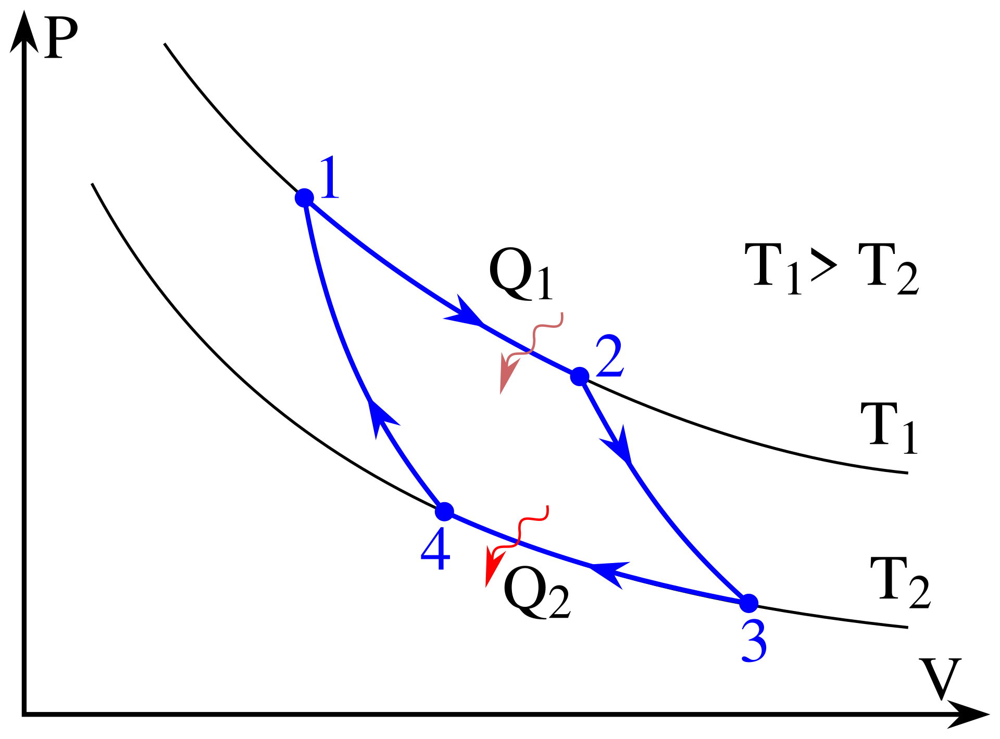

# 第十章｜热力学基础：从第一定律到熵

## 本章要学什么

本章围绕一个贯穿问题展开：**一个热力学系统吸收了多少热量、对外做了多少功，最后为什么会发生这样的状态变化？**

先用热力学第一定律建立能量账本，再分别分析等体、等压、等温、绝热和多方过程；随后把单个过程连接成循环，理解热机、卡诺循环、制冷机和热泵；最后用热力学第二定律与熵判断过程方向、可逆性和不可逆损失。

学完后，应能：

- 统一判断 $Q$、$W$、$\Delta U$ 的正负，并正确使用 $Q=\Delta U+W$。
- 从状态方程和过程条件求出 $p,V,T$ 的变化，计算功、热量和内能变化。
- 读懂 $p$-$V$ 图，把曲线下面积与功联系起来。
- 区分热机效率、制冷系数和热泵供热系数，并用绝对温度计算。
- 用熵变和熵增加原理判断可逆、不可逆及自发方向。

> 阅读顺序：热力学第一定律 → 理想气体典型过程 → 循环过程与热机 → 第二定律与熵 → 综合解题、复习与自测。

## 本章学习地图

本章不是把公式分成几组孤立记忆，而是沿着同一条能量与方向链逐层推进：

```text
系统边界与符号约定
        ↓
Q、W、ΔU 的能量账本
        ↓
等体/等压/等温/绝热过程
        ↓
p-V 图、循环、热机与制冷机
        ↓
第二定律、可逆性与熵
        ↓
过程量综合题与熵变综合题
```

| 学习阶段               | 要回答的核心问题                             | 学完后的可见成果                       |
| ---------------------- | -------------------------------------------- | -------------------------------------- |
| 热力学基本量与第一定律 | 热量、功和内能怎样收支？                     | 能写出符号约定并用第一定律求未知量     |
| 理想气体典型过程       | 过程条件改变后，哪些量固定、哪些量变化？     | 能为每类过程选公式，并用初末状态检查   |
| 循环与热机             | 回到初态后，净热量和净功有什么关系？         | 能逐段计算循环并求效率或制冷系数       |
| 第二定律与熵           | 为什么有些过程能发生，有些过程不能自发发生？ | 能判断方向、可逆性和总熵变符号         |
| 综合解题               | 如何避免只套公式而忽略条件？                 | 能从状态、过程、能量、方向四层核验答案 |

> 每章的固定读法：先看本章路线和“本章要解决的问题”，再读概念与推导；接着看一个小例子，最后完成本章练习与章末小结。公式旁边的条件比公式本身更重要。

## 一、热力学第一定律：内能、功与热量

### 本章路线

**先固定系统边界和正负号 → 再区分状态函数与过程量 → 再由 $p$-$V$ 图计算功 → 最后用第一定律闭合能量账本。**

> 本章要解决的问题：系统吸收的热量去了哪里？为什么同样的初末状态，沿不同路径所需的热量和功可能不同？
>
> 本章学完应会：写出第一定律，说明 $Q$、$W$、$\Delta U$ 的符号，判断内能是否只由温度决定，并从 $p$-$V$ 图计算准静态过程的功。

### 先固定系统边界与符号

本章约定：$Q>0$ 表示系统从外界吸热，$Q<0$ 表示系统放热；$W>0$ 表示系统对外做功，$W<0$ 表示外界对系统做功。$U$ 表示内能，$\Delta U=U_2-U_1$ 是初末两态的内能变化。沿用第九章记号：$p$ 为压强、$V$ 为体积、$T$ 为绝对温度，$\nu$ 为物质的量、$R$ 为摩尔气体常量，理想气体满足 $pV=\nu RT$。于是热力学第一定律写成

$$
Q=\Delta U+W.
$$

这里的 $Q$ 和 $W$ 是过程量，只有在过程发生时才有意义；$U$ 是状态函数，只由系统状态决定。写题时先问“系统是谁”，再判断热量和功进入系统还是离开系统。

> 你要抓住的结论：第一定律是能量守恒，不是某一种具体过程的公式。过程条件决定 $W$ 和 $\Delta U$ 如何计算，第一定律负责把它们和 $Q$ 联系起来。

#### 小例子：四类过程的符号判定

> 题源：《大物第十章PDF.pdf》思考题10-7，按教材符号约定整理

**题目：** 分别判断下列过程中 $Q$、$W$、$\Delta U$ 和 $\Delta T$ 的正负：

1. 等体降压；
2. 等压压缩；
3. 理想气体绝热膨胀；
4. 理想气体按 $pV^2=\text{常量}$ 膨胀，且气体为双原子理想气体。

**解析：** 1. 等体降压时 $W=0$；由 $pV=\nu RT$ 可知 $T$ 降低，所以 $\Delta U<0$、$Q=\Delta U<0$。

2. 等压压缩时 $V$ 减小，故 $T$ 减小；$W=p\Delta V<0$，$\Delta U<0$，并由 $Q=\Delta U+W$ 得 $Q<0$。
3. 绝热膨胀时 $Q=0$、$W>0$，所以 $\Delta U=-W<0$，温度下降。
4. 由 $pV^2=\text{常量}$ 与状态方程 $pV=\nu RT$ 可知，膨胀时温度降低，故 $W>0$、$\Delta U<0$。但第一定律只给出 $Q=\Delta U+W$，还不能据此判断两项谁的绝对值更大；热量符号留到本章“多方过程”中，学过热容后再判断。

### 先认识热容与比热容比的符号

在计算升温所需的热量前，先区分“热量”和“热容”：$Q$ 是某一过程传递的能量；热容 $C=\mathrm dQ/\mathrm dT$ 表示**指定过程**中温度变化 $1\,\mathrm K$ 对应的热量变化，单位为 $\mathrm{J\,K^{-1}}$。单位质量的热容称为比热容 $c$；**每摩尔**的热容称为摩尔热容 $C_m=C/\nu$，单位为 $\mathrm{J\,mol^{-1}\,K^{-1}}$。这里 $\nu$ 是气体的物质的量（单位 mol），$R$ 是摩尔气体常量。

热容依赖过程条件：下标 $V$ 表示**体积不变**，下标 $p$ 表示**压强不变**，下标 $m$ 表示**每摩尔**。因此 $C_{V,m}$ 是摩尔定容热容，$C_{p,m}$ 是摩尔定压热容；同一气体升高相同温度时，等压还需要膨胀做功，因而理想气体满足迈耶关系 $C_{p,m}=C_{V,m}+R$。本笔记后文若省略 $m$，写 $C_V$、$C_p$，仍指这两个**摩尔**热容，而非整份气体的总热容。

$\gamma$（读作“伽马”）是**比热容比**，定义为

$$
\gamma=\frac{C_{p,m}}{C_{V,m}}>1.
$$

它是无量纲的比值，不是第三种热容；在准静态绝热过程关系 $pV^\gamma=\text{常量}$ 中作为指数。按本章理想气体模型，$i$ 为分子自由度数：单原子气体 $i=3$、双原子刚性气体通常取 $i=5$（忽略振动自由度），于是

$$
C_{V,m}=\frac{i}{2}R,
\qquad
C_{p,m}=\frac{i+2}{2}R,
\qquad
\gamma=\frac{i+2}{i}.
$$

例如双原子气体有 $C_{V,m}=5R/2$、$C_{p,m}=7R/2$、$\gamma=7/5$。这些近似值要结合温度范围和教材采用的自由度模型使用。

### 内能是状态函数

内能是系统内部微观运动和相互作用所对应能量的总和。对理想气体，分子间相互作用可以忽略，因此内能只由温度决定：

$$
\Delta U=\nu C_{V,m}(T_2-T_1).
$$

单原子理想气体的自由度为 $i=3$，有

$$
U=\frac{i}{2}\nu RT=\frac{3}{2}\nu RT.
$$

这里 $C_{V,m}$ 正是上面定义的摩尔定容热容，故 $\Delta U=\nu C_{V,m}\Delta T$ 是“物质的量 × 每摩尔每开尔文的内能变化 × 温度变化”。判断理想气体内能变化时，不能只看压强或体积，必须通过状态方程判断温度是否改变。

#### 小练习：同热量下不同气体的温升

> 题源：《大物第十章PDF.pdf》思考题10-3

**题目：** 物质的量相同的氧气、氮气和二氧化碳，在相同初状态下进行等体吸热过程，吸收热量相同。按教材本节的多原子气体简化模型，比较三种气体的温度升高量和压强增加量。

**解析：** 等体过程中 $W=0$，所以 $Q=\Delta U=\nu C_{V,m}\Delta T$。氧气、氮气可近似看作双原子气体，$C_{V,m}=5R/2$；教材在此采用“多原子气体取 $C_{V,m}=3R$”的简化值来处理二氧化碳；这不是说二氧化碳分子是非线性的。二氧化碳本身是线性分子，若按忽略振动的刚性线性分子模型处理，应取 $5R/2$；做教材题时先确认题目采用的模型。因此按教材近似，在相同 $Q$、$\nu$ 下，$\Delta T=Q/(\nu C_{V,m})$，氧气和氮气温升相同，二氧化碳温升较小。等体时 $\Delta p=\nu R\Delta T/V$，所以压强增加量的大小规律与温升相同：氧气、氮气相同，二氧化碳较小。

### 功与 $p$-$V$ 图

准静态过程中，气体对外做的微功为

$$
\mathrm dW=p\,\mathrm dV,
$$

因此从状态 1 到状态 2 的功为

$$
W=\int_{V_1}^{V_2}p\,\mathrm dV.
$$

在 $p$-$V$ 图上，功等于过程曲线与体积轴之间的有向面积。膨胀时 $\mathrm dV>0$，$W>0$；压缩时 $\mathrm dV<0$，$W<0$。只有在过程路径已知时，才能计算功；同一初末状态的不同路径一般有不同功。

#### 小练习：同初末状态的两条路径

> 题源：《大物第十章PDF.pdf》例10-2的路径比较思想

**题目：** 某理想气体从状态 $1:(p_1,V_1)=(2.0\times10^5\,\mathrm{Pa},1.0\,\mathrm L)$ 变到状态 $2:(p_2,V_2)=(1.0\times10^5\,\mathrm{Pa},3.0\,\mathrm L)$。路径 A 为 $p$-$V$ 图上的直线；路径 B 先等压膨胀到 $V_2$，再等体降压到 $p_2$。分别求两条路径的功，并比较内能变化和吸热量。

**解析：** 路径 A 的功为梯形面积：$W_A=(p_1+p_2)(V_2-V_1)/2=300\,\mathrm J$。路径 B 中第一段等压膨胀，$W_{B1}=p_1(V_2-V_1)=400\,\mathrm J$；第二段等体，$W_{B2}=0$，所以 $W_B=400\,\mathrm J$。

两条路径的初末状态相同，因此理想气体的 $\Delta U$ 相同；但 $Q=\Delta U+W$，所以 $Q_B-Q_A=W_B-W_A=100\,\mathrm J$。这正是功和热量是过程量、内能是状态函数的具体体现。

### 本章小结

第一定律的使用顺序不是“看到数字就代入”，而是：确定系统和符号 → 判断状态函数/过程量 → 根据路径求功 → 根据温度求内能 → 用 $Q=\Delta U+W$ 求热量或检验结果。$Q$、$W$ 依赖路径，$U$ 依赖状态；这是后面所有过程题的基础。

### 本章练习与检验

#### 练习：第一定律的符号判定

> 题源：《大物第十章PDF.pdf》思考题10-7

**题目：** 对上一个问题的四种过程，分别写出 $Q$、$W$、$\Delta U$ 的关系，并说明哪一种情况下不能只凭“绝热”判断温度变化。

**解析：** 等体降压：$W=0$，$Q=\Delta U<0$；等压压缩：$W<0$、$\Delta U<0$、$Q<0$；绝热膨胀：$Q=0$、$W>0$、$\Delta U<0$；$pV^2$ 多方膨胀：$W>0$、$\Delta U<0$，而 $Q$ 的符号要由多方指数与气体热容共同判断。绝热条件只给出 $Q=0$，不能直接推出 $\Delta U=0$ 或 $T$ 不变。

#### 练习：两条路径的热量差

> 题源：《大物第十章PDF.pdf》例10-2与习题10-1的共同考点

**题目：** 如果两条路径连接相同初末状态，且路径 B 在整个膨胀区间的压强都高于路径 A，证明 $W_B>W_A$，并说明 $Q_B-Q_A$ 与它们的关系。

**解析：** 由功的面积表达式，$W=\int p\,\mathrm dV$。在相同的 $V_1$ 到 $V_2$ 区间内，若 $p_B(V)>p_A(V)$ 且为膨胀过程，则 $W_B-W_A=\int_{V_1}^{V_2}[p_B(V)-p_A(V)]\,\mathrm dV>0$。因为初末状态相同，$\Delta U_B=\Delta U_A$，所以 $Q_B-Q_A=W_B-W_A>0$。

## 二、理想气体的典型过程

### 本章路线

**先看哪一个状态量保持不变 → 再写状态方程 → 再求功和内能 → 最后用第一定律检查热量。**

> 本章要解决的问题：等体、等压、等温和绝热过程的差别是什么？为什么“温度不变”“没有热量交换”和“内能不变”不能互相替换？
>
> 本章学完应会：根据过程条件写出对应状态关系、功、热量和内能变化；知道绝热方程需要准静态条件，知道多方过程如何统一表示。

### 等体过程：$V$ 不变

因为 $\mathrm dV=0$，所以

$$
W_V=0,
\qquad
Q_V=\Delta U=\nu C_{V,m}(T_2-T_1).
$$

理想气体状态方程给出 $p/T=\text{常量}$。等体加热时，热量全部用于增加内能，温度升高，压强也升高。

#### 小练习：等体与等压加热的定量比较

> 题源：《大物第十章PDF.pdf》习题10-2

**题目：** $1.0\,\mathrm{mol}$ 单原子理想气体从 $300\,\mathrm K$ 加热到 $350\,\mathrm K$，分别经历等体和等压过程。求两种过程中 $Q$、$W$、$\Delta U$，并比较吸热量。

**解析：** 两种路径初末温度相同，因此 $\Delta U=\nu C_V\Delta T=\frac32R\times50=623.6\,\mathrm J$。

等体：$W_V=0$，$Q_V=\Delta U=623.6\,\mathrm J$。

等压：$W_p=\nu R\Delta T=415.7\,\mathrm J$，$Q_p=\nu C_p\Delta T=\frac52R\times50=1039.3\,\mathrm J$。等压过程多吸收的 $415.7\,\mathrm J$ 正好转化为对外做功。

### 等压过程：$p$ 不变

等压过程中 $V/T=\text{常量}$，功为

$$
W_p=p(V_2-V_1)=\nu R(T_2-T_1).
$$

内能和吸热量分别为

$$
\Delta U=\nu C_{V,m}(T_2-T_1),
\qquad
Q_p=\nu C_{p,m}(T_2-T_1).
$$

由 $C_{p,m}=C_{V,m}+R$ 可直接验证 $Q_p=\Delta U+W_p$。

#### 小练习：同一温升下的热量分配

> 题源：《大物第十章PDF.pdf》习题10-2

**题目：** 若把上题的单原子气体换成 $0.50\,\mathrm{mol}$ 双原子理想气体，等压升温 $100\,\mathrm K$。求 $W$、$\Delta U$、$Q$，并验证第一定律。

**解析：** 双原子气体 $C_V=5R/2$、$C_p=7R/2$。因此 $W=\nu R\Delta T=415.7\,\mathrm J$，$\Delta U=\nu C_V\Delta T=\frac12\times\frac52R\times100=1039.3\,\mathrm J$，$Q=\nu C_p\Delta T=1455.0\,\mathrm J$。验证：$\Delta U+W=1455.0\,\mathrm J=Q$。

### 等温过程：$T$ 不变

对理想气体，等温意味着内能不变：

$$
\Delta U_T=0.
$$

由状态方程 $pV=\nu RT$ 和功的积分式，准静态等温过程有

$$
W_T=\nu RT\ln\frac{V_2}{V_1},
\qquad
Q_T=W_T.
$$

等温膨胀时系统吸热并对外做功；等温压缩时系统放热，功为负。

#### 小练习：等温压缩的热量与功

> 题源：《大物第十章PDF.pdf》习题10-3

**题目：** $2.0\,\mathrm{mol}$ 氮气在 $300\,\mathrm K$、$1.013\times10^5\,\mathrm{Pa}$ 下被可逆等温压缩到压强 $2.026\times10^5\,\mathrm{Pa}$。求气体对外做功和放出的热量。

**解析：** 等温理想气体有 $\Delta U=0$，且 $V_2=V_1/2$。

$$
W=\nu RT\ln\frac{V_2}{V_1}=2R\times300\times\ln\frac12\approx-3459\,\mathrm J.
$$

因此 $Q=W\approx-3459\,\mathrm J$，气体放出热量的大小为 $3.46\,\mathrm{kJ}$。

### 绝热过程：$Q=0$

绝热只表示系统与外界没有热量交换，不能直接推出内能不变。由第一定律，绝热过程满足

$$
\Delta U=-W.
$$

对于准静态理想气体绝热过程，进一步有

$$
pV^\gamma=\text{常量},
\qquad
TV^{\gamma-1}=\text{常量},
\qquad
T^\gamma p^{1-\gamma}=\text{常量}.
$$

这些关系不能随意用于快速、强烈非平衡的绝热过程。绝热膨胀时系统对外做功，内能减少，温度下降。

### 多方过程：统一的过程表示

多方过程用一个指数 $n$ 描述压强随体积的变化，$n$ 称为**多方指数**（不要和物质的量 $\nu$ 混淆）：

$$
pV^n=\text{常量}.
$$

不同的 $n$ 对应不同过程：$n=0$ 是等压，$n=1$ 是等温，$n\to\infty$ 可对应等体，$n=\gamma$ 是准静态绝热。对 $n\ne1$，功可写为

$$
W=\frac{p_2V_2-p_1V_1}{1-n}.
$$

沿该过程定义的摩尔热容记为 $C_n=\mathrm dQ/(\nu\,\mathrm dT)$，下标 $n$ 提醒我们它依赖所选过程；当 $n\ne1$ 且热容可视为常数时，

$$
C_n=C_{V,m}+\frac{R}{1-n}
=R\frac{\gamma-n}{(\gamma-1)(1-n)}.
$$

这不是“气体自身固定的热容”：同一种气体沿不同过程可以有不同 $C_n$，甚至是负值。等温过程 $\mathrm dT=0$，不能把 $n=1$ 代入该式。现在可回看本章开头 $pV^2=\text{常量}$ 的双原子气体膨胀：$n=2$、$\gamma=7/5$，故 $C_n=1.5R>0$；由于 $\Delta T<0$，$Q=\nu C_n\Delta T<0$。

#### 小练习：绝热过程与多方过程的边界

> 题源：《大物第十章PDF.pdf》思考题10-6、习题10-6

**题目：** 双原子理想气体按 $pV^2=\text{常量}$ 缓慢膨胀。判断温度变化和热量符号；若把“缓慢”去掉，哪些结论仍然成立，哪些不能直接使用？

**解析：** 由 $pV=\nu RT$ 得 $T\propto V^{-1}$，所以膨胀时温度下降。对双原子气体，$\gamma=7/5$、多方指数 $n=2$，多方热容 $C_n=R(\gamma-n)/[(\gamma-1)(1-n)]=1.5R>0$；由于 $\Delta T<0$，故 $Q<0$。

去掉“缓慢”后，状态方程仍适用于平衡态初末状态，第一定律仍成立，但准静态功的积分 $W=\int p\,\mathrm dV$ 和多方路径方程不一定适用；必须有足够的过程信息才能求功和热量。

### 本章小结

典型过程的判断口诀是：等体先写 $W=0$；等压先写 $W=p\Delta V$；等温对理想气体先写 $\Delta U=0$；绝热先写 $Q=0$，只有准静态时才追加 $pV^\gamma=\text{常量}$。过程条件必须先于公式。

### 本章练习与检验

#### 练习：推导多方过程热容并分类

> 题源：《大物第十章PDF.pdf》10.2节多方过程公式

**题目：** 对理想气体多方过程 $pV^n=\text{常量}$，推导摩尔热容 $C_n$，并说明 $C_n$ 何时为正、零或负。

**解析：** 为求“摩尔”热容，先取 $\nu=1\,\mathrm{mol}$，由 $pV=RT$ 得 $T V^{n-1}=\text{常量}$，所以 $dV/V=dT/[(1-n)T]$。又有 $dW=p\,dV=R T\,dV/V=R\,dT/(1-n)$，而 $dU=C_VdT$。第一定律给出 $dQ=(C_V+R/(1-n))dT$，整理得

$$
C_n=\frac{C_p-nC_V}{1-n}=R\frac{\gamma-n}{(\gamma-1)(1-n)}.
$$

当 $n<1$ 或 $n>\gamma$ 时 $C_n>0$；$n=\gamma$ 时为绝热过程，$C_n=0$；$1<n<\gamma$ 时 $C_n<0$。负热容并不违反能量守恒，它表示温度变化方向与吸热方向相反。

#### 练习：自由膨胀的状态变化

> 题源：《大物第十章PDF.pdf》思考题10-8

**题目：** 绝热容器被隔板分成两半，左侧充满理想气体，右侧为真空。抽去隔板后气体自由膨胀达到平衡。求温度和压强的变化，并说明为什么不能直接使用 $pV^\gamma=\text{常量}$。

**解析：** 容器绝热且右侧真空，气体没有热交换，$Q=0$；真空没有反力，气体不对外做功，$W=0$。由第一定律 $\Delta U=0$，理想气体内能只由温度决定，所以 $T_2=T_1$。总体积加倍，而物质的量和温度不变，因此 $p_2=p_1/2$。过程不是准静态，不能把每个中间状态当作平衡态，所以不能使用 $pV^\gamma=\text{常量}$。

## 三、循环过程与卡诺循环

### 本章路线

**先分段计算每一步 → 再利用循环回到初态的条件 → 最后计算效率、制冷系数并比较可逆上限。**

> 本章要解决的问题：系统一圈走完后为什么 $\Delta U=0$，但仍然可以对外做净功？卡诺循环为什么给出热机效率上限？
>
> 本章学完应会：逐段计算循环中的 $Q_i,W_i,\Delta U_i$，使用 $\Delta U_{\text{循环}}=0$，并区分热机、制冷机和热泵的性能指标。

### 循环过程的能量关系

循环结束时系统回到初态，状态函数内能满足

$$
\Delta U_{\text{循环}}=0.
$$

因此

$$
Q_{\text{总}}=W_{\text{总}}.
$$

热机从高温热源吸收 $Q_h$，向低温热源放出 $Q_c$，净功为

$$
W=Q_h-Q_c,
\qquad
\eta=\frac{W}{Q_h}=1-\frac{Q_c}{Q_h}.
$$

#### 小练习：矩形循环的逐段账本

> 题源：《大物第十章PDF.pdf》例10-4的计算方法

**题目：** 单原子理想气体完成一个矩形 $p$-$V$ 循环：两段等压、两段等体。设吸热段的温度变化分别为 $+600\,\mathrm K$ 和 $+150\,\mathrm K$，放热段温度变化分别为 $-450\,\mathrm K$ 和 $-300\,\mathrm K$，物质的量为 $6.50\,\mathrm{mol}$。求总吸热、总放热、净功和效率。

**解析：** 单原子气体 $C_V=3R/2$、$C_p=5R/2$。两段吸热量为 $Q_{in}=\nu C_p(600)+\nu C_V(150)\approx9.32\times10^4\,\mathrm J$；两段放热量的大小为 $Q_{out}=\nu C_V(450)+\nu C_p(300)\approx7.70\times10^4\,\mathrm J$。净功 $W=Q_{in}-Q_{out}=1.62\times10^4\,\mathrm J$，效率 $\eta=W/Q_{in}\approx17.4\%$。先逐段列账再求总量，能避免把某一段的放热误当成总热量。

### 卡诺循环：可逆过程的组合

卡诺循环由两个等温过程和两个准静态绝热过程组成：

1. 高温等温膨胀：从高温热源吸热；
2. 绝热膨胀：温度从高温降到低温；
3. 低温等温压缩：向低温热源放热；
4. 绝热压缩：温度从低温升回高温。



卡诺循环可逆，因此

$$
\frac{Q_h}{T_h}=\frac{Q_c}{T_c}.
$$

热机效率为

$$
\eta_C=1-\frac{T_c}{T_h}.
$$

温度必须用 K。卡诺定理说明：在相同高、低温热源之间工作的热机中，可逆热机效率最高；不可逆因素只会降低实际效率。

#### 小练习：提高卡诺效率的两种方案

> 题源：《大物第十章PDF.pdf》习题10-16

**题目：** 一卡诺热机低温热源为 $7^\circ\mathrm C$，初始效率为 $40\%$，现要提高到 $50\%$。分别求：

1. 保持低温热源不变时，高温热源需要提高到多少；
2. 保持高温热源不变时，低温热源需要降低到多少；
3. 从工程可行性角度比较两种方案。

**解析：** 先换算 $T_c=280.15\,\mathrm K$。初始效率 $0.4=1-T_c/T_h$，得 $T_h=466.92\,\mathrm K$。

方案1：$0.5=1-T_c/T_h\prime$，所以 $T_h\prime=560.30\,\mathrm K$，高温端需提高约 $93.38\,\mathrm K$。

方案2：$0.5=1-T_c\prime/466.92$，所以 $T_c\prime=233.46\,\mathrm K$，低温端需降低约 $46.69\,\mathrm K$。实际工程中降低冷源温度往往更困难，且会增加材料与散热要求；选择方案还要考虑设备边界，不能只比较温差。

### 制冷机和热泵

制冷机消耗外界输入功 $W$，从低温物体吸热 $Q_c$，向高温热源放热 $Q_h$。制冷系数为

$$
\varepsilon=\frac{Q_c}{W}.
$$

热泵更关注向高温处供热，供热系数为

$$
\varepsilon_h=\frac{Q_h}{W}=\varepsilon+1.
$$

#### 小练习：卡诺制冷机的最大制冷量

> 题源：《大物第十章PDF.pdf》习题10-18

**题目：** 可逆卡诺制冷机冷藏室温度为 $-10^\circ\mathrm C$，环境温度为 $11^\circ\mathrm C$。若每消耗 $1.0\times10^3\,\mathrm J$ 的功，求从冷藏室最多取出的热量。

**解析：** $T_c=263.15\,\mathrm K$、$T_h=284.15\,\mathrm K$。卡诺制冷系数为 $\varepsilon_C=T_c/(T_h-T_c)=263.15/21\approx12.53$。因此 $Q_c=\varepsilon_CW\approx1.253\times10^4\,\mathrm J$。这是可逆制冷机的理论上限，实际值必低于它。

### 本章小结

循环题的核心不是背效率公式，而是先逐段建立能量账本，再用循环闭合条件检查。卡诺效率中的温度必须使用绝对温度；制冷机和热泵的分子不同，分别关注从低温处吸收的热量和向高温处提供的热量。

### 本章练习与检验

#### 练习：循环效率的可逆上限

> 题源：《大物第十章PDF.pdf》例10-4与例10-5的共同考点

**题目：** 为什么同样的净功不等于同样的热机效率？请用 $\eta=W/Q_{in}$ 解释，并说明如何用逐段热量符号判断 $Q_{in}$。

**解析：** 循环净功只由总吸热和总放热之差决定：$W=Q_{in}-Q_{out}$。效率还要除以吸收热量 $Q_{in}$，所以两个循环即使 $W$ 相同，只要吸热总量不同，效率就不同。逐段计算时只把 $Q_i>0$ 的段相加得到 $Q_{in}$，把 $Q_i<0$ 的段的绝对值相加得到 $Q_{out}$，不要把代数和直接当分母。

#### 练习：热机与制冷机的指标不能混用

> 题源：《大物第十章PDF.pdf》思考题10-14、10-15

**题目：** 同一可逆装置在热机模式和制冷机模式下，为什么温差增大对热机有利，却不一定对制冷机有利？分别写出性能指标。

**解析：** 热机效率为 $\eta_C=1-T_c/T_h$，在 $T_h$ 增大或 $T_c$ 减小时提高。制冷机系数为 $\varepsilon_C=T_c/(T_h-T_c)$，温差越大，分母越大，制冷系数越低；同样的制冷量需要更多输入功。因此不能把“热机效率高”直接理解成“制冷机更省功”。

## 四、热力学第二定律与熵

### 本章路线

**先观察自然过程的方向性 → 再学习开尔文表述与克劳修斯表述 → 再区分可逆和不可逆 → 最后用熵把方向性写成不等式。**

> 本章要解决的问题：第一定律允许的过程为什么不一定能自发发生？怎样用一个状态量判断过程方向和不可逆程度？
>
> 本章学完应会：解释第二定律的两种表述，判断可逆/不可逆过程，计算熵变并使用孤立系统熵不减原则。

### 自然过程的方向性

热量会自发地从高温物体传向低温物体，气体会自发地向真空膨胀，摩擦会把有序机械能耗散为内能。反向过程并不违反第一定律，但不能在不留下其他影响的情况下自发完成。

> 你要抓住的结论：第一定律回答“能不能守恒”，第二定律回答“能不能自发发生、方向朝哪里”。

#### 小练习：判断违反哪条定律

> 题源：《大物第十章PDF.pdf》思考题10-10

**题目：** 判断下列说法：

1. 功可以全部转化为热，但热不能在循环中全部转化为功；
2. 理想气体等温膨胀时吸收的热量全部变成功，因而违反第二定律；
3. 逆向卡诺循环把热量从低温物体送到高温物体，因此违反克劳修斯表述。

**解析：** 1. 正确，但“热不能全部转化为功”必须限定为从单一热源吸热并循环做功；功转热可以完全实现。

2. 错误。理想气体可逆等温膨胀有 $\Delta U=0$，吸热全部转化为功，但系统同时发生体积变化，不是从单一热源循环取热做功，因此不违反第二定律。
3. 错误。逆向卡诺循环需要消耗外界功，正是第二定律允许的制冷方式。

### 第二定律的两种表述

开尔文表述：不可能从单一热源吸收热量，使之完全变为有用功而不产生其他影响。

克劳修斯表述：热量不可能自动从低温物体传到高温物体；若要实现反向传热，必须消耗外界功。

两种表述看似不同，实质上都在描述自然过程的方向限制。制冷机并不违反克劳修斯表述，因为它消耗了外界输入功。

### 可逆过程与不可逆过程

可逆过程要求系统和外界都能通过无限小的改变回到原状态，并且不留下任何宏观痕迹。准静态且无摩擦、无有限温差传热等理想条件下的过程才可能接近可逆。真实过程通常含有摩擦、湍流、有限温差传热、自由膨胀和混合等不可逆因素。

#### 小练习：区分准静态与可逆

> 题源：《大物第十章PDF.pdf》思考题10-16

**题目：** 判断下列过程是否可逆，并说明理由：

1. 无摩擦活塞、无外加压力，气体缓慢膨胀；
2. 活塞摩擦很大，但膨胀极慢；
3. 无摩擦，通过调节外加压力使气体缓慢膨胀。

**解析：** 1. 只有“无摩擦、无限小压强差、过程足够缓慢”等条件同时满足时，才可视为接近可逆；题目若强调缓慢且无摩擦，可判为可逆理想化过程。

2. 不可逆。摩擦会产生耗散，即使过程很慢也不能通过无限小改变完全反向恢复。
3. 若外压可以连续、无限小地调节，且无摩擦、无有限温差传热，则可逆；“缓慢”本身不是充分条件。

### 熵的定义与熵增加原理

熵的微分定义为

$$
\mathrm dS=\frac{\mathrm dQ_{\mathrm{rev}}}{T}.
$$

实际过程可能不可逆，但熵是状态函数，可以选择连接相同初末状态的可逆路径计算。对孤立系统，熵满足

$$
\Delta S_{\text{总}}\ge0.
$$

可逆过程取等号，不可逆过程严格大于零。单个子系统的熵可以减少，但必须把与其发生作用的环境一起纳入，总熵不能减少。

#### 小练习：熵是状态函数，不是路径函数

> 题源：《大物第十章PDF.pdf》10.6节熵差计算方法

**题目：** 理想气体从 $(T_1,V_1)$ 变到 $(T_2,V_2)$。分别用两条不同可逆路径计算熵变：路径 A 先等体变温再等温膨胀，路径 B 先等温膨胀再等体变温。证明两条路径给出相同结果。

**解析：** 路径 A：$\Delta S_A=\nu C_V\ln(T_2/T_1)+\nu R\ln(V_2/V_1)$。路径 B 先等温，熵变为 $\nu R\ln(V_2/V_1)$，再等体变温，熵变为 $\nu C_V\ln(T_2/T_1)$。因此 $\Delta S_A=\Delta S_B$。这说明实际过程即使不可逆，也可用方便的可逆辅助路径计算系统熵变。

### 理想气体熵变公式

一定量理想气体从状态 1 到状态 2，可以写成

$$
\Delta S=\nu C_{V,m}\ln\frac{T_2}{T_1}+\nu R\ln\frac{V_2}{V_1},
$$

也可以写成

$$
\Delta S=\nu C_{p,m}\ln\frac{T_2}{T_1}-\nu R\ln\frac{p_2}{p_1}.
$$

选择形式时，应优先使用题目直接给出的状态量。两物体传热时，应分别求每个物体的熵变，再相加；不能只计算热量接受方的熵变。

#### 小练习：有限温差传热的熵增

> 题源：《大物第十章PDF.pdf》10.6节熵增加原理及习题10-19

**题目：** 热端恒温 $T_h=353.15\,\mathrm K$，冷端恒温 $T_c=293.15\,\mathrm K$，热量 $Q$ 从热端传向冷端。求由两端组成的系统熵变，并说明何时取等号。

**解析：** 热端熵变为 $\Delta S_h=-Q/T_h$，冷端熵变为 $\Delta S_c=Q/T_c$，所以

$$
\Delta S_{\text{总}}=Q\left(\frac1{T_c}-\frac1{T_h}\right)>0.
$$

因为存在有限温差，过程不可逆；只有 $T_h=T_c$ 或传热量趋于零时总熵变才取零。若题目给出具体 $Q$，直接代入上式即可。

### 玻尔兹曼公式与统计意义

统计物理中，熵还可写成

$$
S=k\ln\Omega+\text{常量},
$$

其中 $\Omega$ 表示宏观状态对应的微观排列数。可实现的微观状态越多，熵通常越大；这为“自发过程趋向更可能的宏观状态”提供了微观解释。

### 本章小结

第二定律补上了第一定律没有说明的方向信息。熵是状态函数，实际不可逆过程不能直接把实际路径的 $\mathrm dQ/T$ 当作熵变，而应选择可逆路径或使用状态公式。孤立系统总熵不减，是判断答案是否符合物理方向的最后一道检查。

### 本章练习与检验

#### 练习：混合气体的熵变

> 题源：《大物第十章PDF.pdf》习题10-20

**题目：** 两个体积均为 $V$、温度相同的容器中分别装有物质的量 $\nu_1,\nu_2$ 的不同理想气体。连通后两种气体在总容积 $2V$ 中混合，求系统熵变。

**解析：** 理想气体混合后每种气体的温度不变，但各自可占据的体积由 $V$ 增加到 $2V$。因此

$$
\Delta S_1=\nu_1R\ln2,\qquad \Delta S_2=\nu_2R\ln2,
$$

$$
\Delta S_{\text{总}}=(\nu_1+\nu_2)R\ln2>0.
$$

这部分熵增来自混合造成的可用微观状态数增加，不是由温度变化造成。

#### 练习：熵变公式的适用边界

> 题源：《大物第十章PDF.pdf》10.6节熵差计算方法

**题目：** 为什么不可逆过程不能直接用实际路径的 $\int\mathrm dQ/T$ 计算熵变？请给出自由膨胀的例子。

**解析：** 定义式是 $\mathrm dS=\mathrm dQ_{\mathrm{rev}}/T$，其中下标 rev 表示可逆路径。自由膨胀中 $Q=0,W=0$，但初末体积不同，系统熵变为 $\Delta S=\nu R\ln(V_2/V_1)>0$。若把实际路径的 $\mathrm dQ/T$ 直接代入，会错误得到零；正确做法是换一条连接相同初末状态的可逆路径。

## 五、综合解题与常见边界

### 本章路线

**先读题并画状态图 → 再列状态方程 → 判断过程 → 计算过程量 → 用第一/第二定律和极限情况复核。**

> 本章要解决的问题：面对混合过程、循环或熵变综合题，如何避免只看到一个公式就开始计算？
>
> 本章学完应会：把复杂题拆成状态、过程、能量、方向四层，明确每一步的已知、未知、适用条件和检查方法。

### 过程量综合题

1. 先写系统边界和 $Q,W$ 符号。
2. 列出每个状态的 $p,V,T$，必要时使用 $pV=\nu RT$。
3. 判断每一段是等体、等压、等温、绝热还是一般路径。
4. 逐段计算 $W$、$\Delta U$、$Q$，不要把循环的总式提前套到单段。
5. 用 $Q=\Delta U+W$、单位和正负号检查。
6. 若涉及熵，再判断系统边界是否包含环境，并检查总熵是否不减。

#### 小练习：两条复合路径到同一终态

> 题源：《大物第十章PDF.pdf》习题10-5

**题目：** $1\,\mathrm{mol}$ 氢气初态为 $T_1=293.15\,\mathrm K$、$p_1=1.013\times10^5\,\mathrm{Pa}$。路径 A：先等体加热到 $353.15\,\mathrm K$，再等温膨胀到 $2V_1$；路径 B：先等温膨胀到 $2V_1$，再等体加热到 $353.15\,\mathrm K$。分别求两条路径的 $W,Q,\Delta U$。

**解析：** 氢气按双原子理想气体处理，$C_V=5R/2$。两条路径初末状态相同，所以两者 $\Delta U=\nu C_V(353.15-293.15)\approx1247\,\mathrm J$。

路径 A：等体段 $W_{A1}=0$，等温段 $W_{A2}=\nu R(353.15)\ln2\approx2036\,\mathrm J$，故 $Q_A\approx3283\,\mathrm J$。

路径 B：等温段 $W_{B1}=\nu R(293.15)\ln2\approx1690\,\mathrm J$，等体段功为零，故 $Q_B\approx2937\,\mathrm J$。两条路径热量差约 $346\,\mathrm J$，恰等于功的差。

### 典型过程的快速选择

- 等体：先写 $W=0$。
- 等压：先写 $W=p(V_2-V_1)$。
- 等温理想气体：先写 $\Delta U=0$。
- 准静态绝热：先写 $Q=0$，再确认可以使用 $pV^\gamma=\text{常量}$。
- 循环：先写 $\Delta U_{\text{总}}=0$。
- 熵变：优先选状态量直接给出的熵公式，或选择一条可逆辅助路径。

### 本章小结

热力学题的稳定解法是“先条件、后公式；先状态、后过程；先能量、后方向”。若一个结果同时满足状态方程、第一定律、初末状态和熵不减，它才真正可信。

### 本章练习与检验

#### 练习：直线过程的热容与熵变

> 题源：《大物第十章PDF.pdf》习题10-12的过程量方法

**题目：** $1\,\mathrm{mol}$ 氨气由状态 A $(p_1,V_1)$ 沿 $p$-$V$ 图直线变到状态 B $(p_2,V_2)$。写出此过程的 $W$、$\Delta U$、$Q$ 和摩尔热容 $C$，并列出结果自检条件。

**解析：** 直线下的梯形面积给出

$$
W=\frac{p_1+p_2}{2}(V_2-V_1).
$$

由状态方程 $T_i=p_iV_i/R$，若忽略振动自由度，氨气为非线性多原子气体，取 $C_V=3R$，故

$$
\Delta U=3R(T_2-T_1),\qquad Q=\Delta U+W,
$$

$$
C=\frac{Q}{T_2-T_1}.
$$

自检：功的单位为 J；膨胀时若压强为正则 $W>0$；若 $T_2=T_1$ 则 $\Delta U=0$；若把路径反向，$W,Q,\Delta U$ 的符号应分别按反向过程检查。

#### 练习：用四条物理约束审查解答

> 题源：《大物第十章PDF.pdf》习题10-6、10-8、10-16的综合方法

**题目：** 某份解答写道：

“气体绝热，所以 $\Delta U=0$；气体等温，所以 $Q=0$；自由膨胀可用 $pV^\gamma=\text{常量}$；卡诺效率计算时可直接代入摄氏温度。”

请逐句判错并改正。

**解析：** 第一句错：绝热只给出 $Q=0$，若有功交换则 $\Delta U=-W$，不一定为零。第二句错：理想气体等温时 $\Delta U=0$，所以 $Q=W$，不一定 $Q=0$。第三句错：自由膨胀不是准静态过程，不能直接使用 $pV^\gamma=\text{常量}$。第四句错：卡诺效率必须使用绝对温度 K，不能把摄氏温度直接代入比值。最后还应检查状态方程、单位、功的正负和孤立系统总熵不减。

## 六、练习提示与常见问题

### 先判断“过程”还是“状态”

$U$、$S$ 是状态函数；$Q$、$W$ 是过程量。看到“从状态 1 到状态 2”并不能单独确定 $Q$ 和 $W$，还必须知道路径或过程条件。

### 功的符号总是跟着体积变化

在本章约定下，膨胀 $\Delta V>0$，系统对外做功为正；压缩 $\Delta V<0$，功为负。若教材采用“外界对系统做功为正”的约定，整章公式要同步改写，不能只改一处。

### 绝热不等于内能不变

绝热只说明 $Q=0$。若系统膨胀并对外做功，$W>0$，则 $\Delta U=-W<0$；若外界压缩系统，$W<0$，则内能可能增加。

### 等温不等于任何系统内能不变

“等温时 $\Delta U=0$”是理想气体结论。真实气体在一定范围内可能还要考虑分子间作用，不能无条件推广。

### 绝热方程的使用边界

$Q=0$ 是热交换条件；$pV^\gamma=\text{常量}$ 还要求理想气体、准静态和绝热。缺少准静态条件时，只能使用第一定律与实际状态关系，不能直接套绝热曲线。

### 温度必须用 K

卡诺效率、熵变中的对数关系和理想气体公式都使用热力学温度。摄氏温度只适合表示温差，不能直接代替状态温度。

## 七、隔日复习与自测

### 换一组条件再判断（20分钟）

把等温膨胀改成等温压缩，把系统吸热改成系统放热，把 $T_h=500\,\mathrm K,T_c=300\,\mathrm K$ 改成另一组温度，重新判断 $Q,W,\Delta U,\eta$ 的符号和大小。记录哪些判断只依赖过程类型，哪些判断依赖具体数值。

### 闭卷解释下面六个问题（20分钟）

1. 为什么 $Q$ 和 $W$ 是过程量，而 $U$ 和 $S$ 是状态函数？
2. 为什么等温理想气体有 $\Delta U=0$？
3. 为什么绝热膨胀会降温？
4. 为什么循环过程 $\Delta U=0$ 但可以有净功？
5. 为什么卡诺效率必须使用 K？
6. 为什么自由膨胀可以有 $Q=W=0$ 但熵增加？

### 周末复盘（15分钟）

闭卷画出四类典型过程在 $p$-$V$ 图上的大致形状，写出每类过程的 $Q,W,\Delta U$ 关系；再用一句话解释第一定律和第二定律各自解决什么问题。

## 八、学习安排与阅读资料

### 阅读资料

- 本章教材中关于热力学第一定律、理想气体典型过程、卡诺循环、热力学第二定律和熵的章节。
- `大物第十章PDF.pdf`：用于核对符号约定、公式编号和教材例题。
- `Carnot_cycle_p-V_diagram.svg-1.webp`：用于对照卡诺循环的 $p$-$V$ 图形。

### 细节查阅

- 需要查公式时，先查本章“公式卡”，再回到对应过程的小节核对适用条件。
- 需要查熵变时，优先按已知状态量选择 $T,V$ 形式或 $T,p$ 形式。
- 需要查循环题时，先列四列账本：过程、$Q$、$W$、$\Delta U$。
- 课程采用其他符号约定时，以教师讲义为准，并对整份笔记同步替换，不要局部混用。

## 九、自测参考答案

先独立完成正文中的题源练习，再对照下面的关键结果。答案保留必要推导，不把“记住公式”当作完成自测。

### 第一组：第一定律与典型过程

1. 对同一初末状态，路径 B 的功比路径 A 大的原因是 $W=\int p\,\mathrm dV$，两条路径下的面积不同；由于 $\Delta U$ 相同，热量差等于功的差。
2. 等体与等压加热的内能增量相同，但等压过程多出的热量转化为对外做功。
3. 自由膨胀满足 $Q=W=0$、$\Delta U=0$，理想气体温度不变，但体积增大、压强减小，且不能使用准静态绝热方程。

### 第二组：循环与热机

1. 矩形循环应逐段计算 $Q_i,W_i,\Delta U_i$，检查 $\sum\Delta U_i=0$，再用 $\eta=W/Q_{in}$。
2. 卡诺热机的效率只由 $T_h,T_c$ 决定；提高效率可以升高高温端或降低低温端，但工程代价不同。
3. 制冷机的最大制冷系数为 $\varepsilon_C=T_c/(T_h-T_c)$，温差越大，制冷系数越低。

### 第三组：第二定律与熵

1. 不可逆过程不能把实际路径的 $\mathrm dQ/T$ 直接当作熵变，应换成可逆辅助路径。
2. 有限温差传热的总熵变为 $Q(1/T_c-1/T_h)>0$。
3. 两种不同理想气体从各自体积 $V$ 混合到总容积 $2V$，总熵增为 $(\nu_1+\nu_2)R\ln2$。

### 综合自测题 1：两条复合路径

$1\,\mathrm{mol}$ 双原子理想气体从 $293.15\,\mathrm K$ 到 $353.15\,\mathrm K$，末态体积为初态两倍。分别用“先等体后等温”和“先等温后等体”两条路径计算 $W,Q,\Delta U$，并解释为什么 $\Delta U$ 相同而 $Q$ 不同。

**参考结论：** $\Delta U\approx1247\,\mathrm J$；两条路径的功约为 $2036\,\mathrm J$ 和 $1690\,\mathrm J$，热量约为 $3283\,\mathrm J$ 和 $2937\,\mathrm J$。

### 综合自测题 2：热机与制冷机的方向性

用 $T_h=466.92\,\mathrm K$、$T_c=280.15\,\mathrm K$ 的可逆卡诺装置，分别作为热机和制冷机运行。写出两种模式的性能指标，并说明增大两热源温差对两种模式的影响。

**参考结论：** 热机效率为 $1-T_c/T_h$，温差增大通常提高效率；制冷机系数为 $T_c/(T_h-T_c)$，温差增大降低制冷系数，意味着相同制冷量需要更多输入功。

### 综合自测题 3：熵变与不可逆性

热端 $353.15\,\mathrm K$ 向冷端 $293.15\,\mathrm K$ 传递热量 $Q$，再把两个不同理想气体分别从体积 $V$ 放入总容积 $2V$ 中混合。分别写出传热和混合的总熵变，并说明两者的熵增来源。

**参考结论：** 传热熵增为 $Q(1/293.15-1/353.15)$；混合熵增为 $(\nu_1+\nu_2)R\ln2$。前者来自有限温差导致的不可逆传热，后者来自每种气体可占据体积增大、微观状态数增加。

## 十、公式卡

> 使用公式前先确认过程条件、符号约定和适用范围。本章约定：$Q>0$ 表示系统吸热，$W>0$ 表示系统对外做功；$U$ 为内能，$\nu$ 为物质的量，$R$ 为摩尔气体常量，$T$ 必须使用 K。

### 基本关系

$$
pV=\nu RT
$$

$$
Q=\Delta U+W,
\qquad
\mathrm dW=p\,\mathrm dV,
\qquad
W=\int_{V_1}^{V_2}p\,\mathrm dV.
$$

对理想气体，内能只由温度决定：

$$
\Delta U=\nu C_{V,m}(T_2-T_1).
$$

### 热容与比热容比

$C_{V,m}$、$C_{p,m}$ 分别为摩尔定容热容和摩尔定压热容，$\gamma$ 为比热容比，$i$ 为分子自由度数：

$$
C_{V,m}=\frac{i}{2}R,
\qquad
C_{p,m}=C_{V,m}+R=\frac{i+2}{2}R,
\qquad
\gamma=\frac{C_{p,m}}{C_{V,m}}=\frac{i+2}{i}.
$$

沿多方过程 $pV^n=\text{常量}$ 定义的摩尔热容为 $C_n$：

$$
C_n=\frac{\mathrm dQ}{\nu\,\mathrm dT}
=C_{V,m}+\frac{R}{1-n}
=R\frac{\gamma-n}{(\gamma-1)(1-n)},
\qquad n\ne1.
$$

### 典型过程

- **等体过程：** $V=\text{常量}$，$p/T=\text{常量}$；$W=0$，$Q=\Delta U=\nu C_{V,m}\Delta T$。
- **等压过程：** $p=\text{常量}$，$V/T=\text{常量}$；$W=\nu R\Delta T$，$Q=\nu C_{p,m}\Delta T$。
- **等温理想气体过程：** $T=\text{常量}$，$pV=\text{常量}$；$\Delta U=0$，$W=Q=\nu RT\ln(V_2/V_1)$。
- **准静态绝热过程：** $Q=0$；$pV^\gamma=\text{常量}$，$TV^{\gamma-1}=\text{常量}$，$W=\nu C_{V,m}(T_1-T_2)$。
- **多方过程：** $pV^n=\text{常量}$；$W=(p_2V_2-p_1V_1)/(1-n)$，$Q=\nu C_n\Delta T$，$n\ne1$。

### 循环、卡诺装置与熵

循环过程回到初态，因此

$$
\Delta U_{\mathrm{cycle}}=0,
\qquad
Q_{\mathrm{total}}=W_{\mathrm{total}}.
$$

热机从高温热源吸热 $Q_h$，向低温热源放热 $Q_c$，其效率为

$$
\eta=\frac{W}{Q_h}=1-\frac{Q_c}{Q_h}.
$$

可逆卡诺热机的效率为

$$
\eta_C=1-\frac{T_c}{T_h}.
$$

可逆卡诺制冷机的制冷系数和热泵供热系数分别为

$$
\varepsilon_C=\frac{Q_c}{W}=\frac{T_c}{T_h-T_c},
\qquad
\varepsilon_{\mathrm{HP}}=\frac{Q_h}{W}=\frac{T_h}{T_h-T_c}.
$$

熵是状态函数。可逆过程和孤立系统分别满足

$$
\mathrm dS=\frac{\mathrm dQ_{\mathrm{rev}}}{T},
\qquad
\Delta S_{\mathrm{isolated}}\ge0.
$$

理想气体从状态 1 到状态 2 的熵变可写成

$$
\Delta S=\nu C_{V,m}\ln\frac{T_2}{T_1}+\nu R\ln\frac{V_2}{V_1},
$$

或

$$
\Delta S=\nu C_{p,m}\ln\frac{T_2}{T_1}-\nu R\ln\frac{p_2}{p_1}.
$$

常见特例：

$$
\Delta S_T=\nu R\ln\frac{V_2}{V_1},
\qquad
\Delta S_V=\nu C_{V,m}\ln\frac{T_2}{T_1},
\qquad
\Delta S_p=\nu C_{p,m}\ln\frac{T_2}{T_1}.
$$

可逆绝热过程为等熵过程，$\Delta S=0$；理想气体自由膨胀虽然 $Q=W=\Delta U=0$，但

$$
\Delta S=\nu R\ln\frac{V_2}{V_1}>0.
$$

