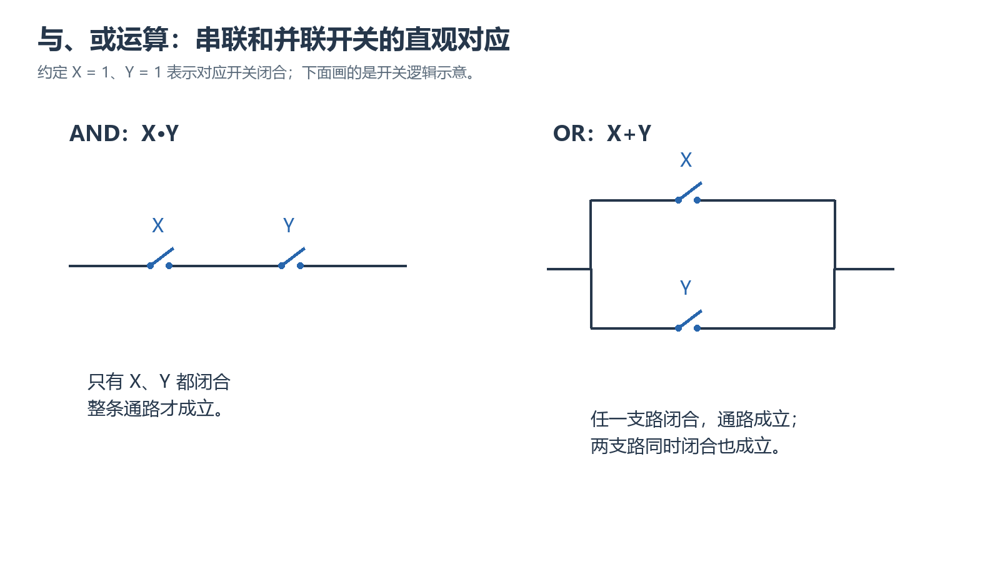

# 第 2 章 布尔代数学习笔记

## 本章要学什么

本章围绕一个问题展开：**怎样把开关状态、逻辑表达式、真值表和逻辑电路互相翻译，并用等价定律安全地化简？** 内容按“变量与基本运算 → 表达式与真值表 → 定律 → 化简与标准形式 → 求反与错误审查”推进。

学完后应能：

- 理解布尔代数的基本操作及其定律；
- 把与、或、非运算同逻辑门和开关电路联系起来；
- 用真值表验证布尔恒等式；
- 将表达式展开为积之和式（SOP），或因式分解为和之积式（POS）；
- 运用布尔定理化简逻辑表达式；
- 求布尔表达式的补，即表达式的反函数。

### 前置知识与记号

本篇 A、B、C、D、E、F、G、X、Y、Z 均可作取值为 0/1 的布尔变量或函数名；每道题会固定输入和输出。加号为 OR，相邻/点乘为 AND，撇号或横线为 NOT；优先级为非→与→或。n 为独立输入变量个数，真值表有 $2^n$ 行。SOP（sum of products）为积之和，POS（product of sums）为和之积；“标准”才要求每项含全部变量。

## 本章学习地图

| 学习阶段 | 核心问题 | 可见成果 |
| --- | --- | --- |
| 变量与基本运算 | 导通关系怎样写成逻辑？ | 固定极性并写串并联函数 |
| 表达式与真值表 | 两种写法是不是同一函数？ | 枚举全部输入或给反例 |
| 定律与化简 | 哪一步变形保证等价？ | 标注分配/吸收/共识依据 |
| 一般形式与求补 | SOP/POS、标准化、求反有何区别？ | 识别形式并逐层反相 |

> 阅读顺序：先看本章路线，再进入知识单元；小练习紧跟相应知识点，章节小结和章节检验放在本章正文末尾，最后进行隔日复习。

> **阅读边界：** 原“学习目标”是能力索引，已并入本篇开头；下面保留每个独立知识主题，不为索引机械配题。

## 2. 布尔代数与开关代数

### 本章路线

**先固定变量、常量、补和运算优先级 → 再把开关、电路和代数式互相翻译 → 最后用真值表抽查。**

> 本章要解决的问题：逻辑变量、开关状态和 NOT/AND/OR 如何表达同一个逻辑对象？
>
> 本章学完应会：能从文字或电路写出表达式，解释运算含义，并避免把逻辑抽象误当成普通数值代数。

### 学习单元

#### 2.1 布尔变量

布尔代数中的变量只能取两个值：`0` 和 `1`。它们不表示普通代数中的数量，而表示两种互斥的逻辑状态。

在数字电路中，可以把它们理解为：

| 布尔值 | 开关状态 | 常见电平含义 | 逻辑含义 |
| -----: | -------- | ------------ | -------- |
|      0 | 断开     | 低电平       | 假、否   |
|      1 | 闭合     | 高电平       | 真、是   |

实际电路中，`0` 和 `1` 对应的是两个电压范围，而不一定是精确的 `0 V` 和某个固定电压。

#### 2.2 开关与逻辑变量

设开关由变量 $X$ 控制：

- $X=0$：开关断开；
- $X=1$：开关闭合。

若一个开关的状态与 $X$ 相反，则它由 $X'$ 控制：

- $X=0$ 时，$X'=1$，反相开关闭合；
- $X=1$ 时，$X'=0$，反相开关断开。

其中 $X'$ 读作“$X$ 的补”或“非 $X$”。补也常写作变量上方加横线，但同一个等式中应统一记号。

#### 2.3 本章记号

读式时先找最外层输出运算，再向内追踪每条支路。撇号只反相其紧邻对象，括号整体反相必须保留括号；变量大小写可能代表不同输入，不能未经说明合并。

- 与（AND）：$X \cdot Y$，通常简写为 $XY$；
- 或（OR）：$X+Y$；
- 非（NOT）：$X'$。

运算优先级通常为：

1. 括号；
2. 非；
3. 与；
4. 或。

例如：

$$
A+B'C=A+(B' \cdot C)
$$

##### 小练习：条件、方法与结果复核

> **题源：** 《数逻第二章.pdf》PDF 第6—8页，开关变量与基本运算；依所列概念/方法编写的条件变式，非原书原题。

**题目：** 正逻辑下开关 A、B 串联，其支路与开关 C 并联，F=1 表示导通。写 F，并比较“C 并联整条支路”和“C 只与 B 并联”的区别。

**解析与检查：** 前者为 $F=AB+C$，后者为 $G=A(B+C)$。在 A=0、B=0、C=1 时 F=1、G=0；两式差异来自拓扑，不是换一个符号。串联需所有路径开关闭合，并联只需一条路径闭合。

### 本章小结

布尔变量只取 0、1；开关闭合/断开与电平高/低是实现约定，不能随意互换。串联对应与、并联对应或，前提是先定义信号的有效含义。

### 本章练习与检验

> **题源：** 《数逻第二章.pdf》PDF 第6—8页，开关变量与基本运算；依所列概念/方法编写的条件变式，非原书原题。

**题目：** 正逻辑下，A、B 串联的支路与 C 并联，输出 F 表示导通。写函数；若输出端换成低有效指示灯 L，写 L，并在 A=0、B=1、C=0 时验证。

**解析与检查：** $F=AB+C$；低有效指示为 $L=(AB+C)'$，导通时 L=0。给定输入下 F=0、L=1。变量仍表示开关闭合，不应把输入和输出的极性一起偷偷反转。

## 3. 三种基本运算

### 本章路线

**先固定变量、常量、补和运算优先级 → 再把开关、电路和代数式互相翻译 → 最后用真值表抽查。**

> 本章要解决的问题：逻辑变量、开关状态和 NOT/AND/OR 如何表达同一个逻辑对象？
>
> 本章学完应会：能从文字或电路写出表达式，解释运算含义，并避免把逻辑抽象误当成普通数值代数。

### 学习单元

#### 3.1 非运算（NOT）

非运算使输入取反：

| X | X' |
| -: | -: |
| 0 |  1 |
| 1 |  0 |

对应逻辑门为反相器。其基本关系为：

$$
0'=1, \qquad 1'=0
$$

从开关角度看，输入为 `0` 时反相开关闭合，输入为 `1` 时反相开关断开。

#### 3.2 与运算（AND）

只有所有输入都为 `1`，与运算的结果才为 `1`。

| X | Y | XY |
| -: | -: | -: |
| 0 | 0 |  0 |
| 0 | 1 |  0 |
| 1 | 0 |  0 |
| 1 | 1 |  1 |

与运算对应：

- 与门；
- 串联开关。只有串联的所有开关都闭合，通路才成立。

#### 3.3 或运算（OR）

只要至少有一个输入为 `1`，或运算的结果就为 `1`。

| X | Y | X+Y |
| -: | -: | --: |
| 0 | 0 |   0 |
| 0 | 1 |   1 |
| 1 | 0 |   1 |
| 1 | 1 |   1 |

或运算对应：

- 或门；
- 并联开关。只要某一支路闭合，通路就成立。

这里的或是包含或：两个输入同时为 `1` 时，输出仍为 `1`。

#### 3.4 三种运算的直观对应

| 运算 | 逻辑门 | 开关电路 | 输出为 1 的条件  |
| ---- | ------ | -------- | ---------------- |
| 非   | 反相器 | 反相开关 | 输入为 0         |
| 与   | 与门   | 串联     | 所有条件均成立   |
| 或   | 或门   | 并联     | 至少一个条件成立 |

<!-- study-note-illustration:2026-10-04:boolean-series-parallel -->

**读图提示：**把“闭合”为 1 的约定带入图中：串联通路要求两个开关都闭合，并联通路只需任意一支路闭合。或运算是包含或，两支路同时闭合时结果仍为 1。

来源：依据本篇笔记相邻段落自绘的教学示意；不是教材原图或实测记录。

<!-- /study-note-illustration -->

##### 小练习：条件、方法与结果复核

> **题源：** 《数逻第二章.pdf》PDF 第6—8页，基本运算；依所列概念/方法编写的条件变式，非原书原题。

**题目：** 比较 $F=A+BC$ 与 $G=(A+B)C$，在 A=1、B=0、C=0 时求值；解释运算优先级与“串并联相同”的误读。

**解析与检查：** 按先与后或，F=1+0=1；G=1·0=0。F 的 A 支路可独立导通，G 中 C 与整组串联。应先写括号层次再代入，不能把与和或当普通同优先级运算。

### 本章小结

非先于与、与先于或；OR 包含“两者都真”，不等于异或。基本门是逻辑抽象，电压与时间边界不能由真值表自动推得。

### 本章练习与检验

> **题源：** 《数逻第二章.pdf》PDF 第6—8页，基本运算；依所列概念/方法编写的条件变式，非原书原题。

**题目：** 比较 $F=A+B' C$ 与 $G=(A+B')C$。找一行使它们不同，再说明为何一行相同不足以证明等价。

**解析与检查：** 取 A=1、B=1、C=0，则 F=1、G=0，说明括号改变运算结构。一行反例足以否定恒等；若要用真值表证明恒等，必须检查三个变量的全部 8 行。

## 4. 布尔表达式与真值表

### 本章路线

**先确定变量顺序和运算层级 → 逐行求值并建立真值表 → 再把输出为 1/0 的行整理成标准形式。**

> 本章要解决的问题：怎样在表达式、真值表和标准项之间来回转换，并用完整证据判断两个函数是否等价？
>
> 本章学完应会：能列出真值表、编号最小项/最大项，并区分“找到反例”与“证明恒等”。

### 学习单元

#### 4.1 布尔表达式

由布尔变量、常量、运算符和括号构成的式子称为布尔表达式。例如：

$$
F=AB'+C
$$

表达式中变量或其补的一次出现称为一个文字。例如，$AB'+C$ 中有三个文字：$A$、$B'$ 和 $C$。

#### 4.2 从逻辑电路写表达式

从输入端向输出端逐级标注中间结果，是由电路写表达式最稳妥的方法。

例如：

1. $B$ 先经反相器，得到 $B'$；
2. $A$ 与 $B'$ 进入与门，得到 $AB'$；
3. 该结果再与 $C$ 进入或门。

最终输出为：

$$
F=AB'+C
$$

#### 4.3 求表达式的值

若 $A=1$、$B=0$、$C=1$，求：

$$
F=AB'+A'C
$$

先求补变量：$B'=1$、$A'=0$，再代入：

$$
F=1 \cdot 1+0 \cdot 1=1
$$

#### 4.4 真值表

真值表列出所有输入组合以及每一种组合对应的输出。若表达式含 $n$ 个变量，则真值表共有：

$$
2^n
$$

行输入组合。

建立真值表时，最好为中间运算单独设列。以 $F=A'B+AC$ 为例：

| A | B | C | A'B | AC | F |
| -: | -: | -: | --: | -: | -: |
| 0 | 0 | 0 |   0 |  0 | 0 |
| 0 | 0 | 1 |   0 |  0 | 0 |
| 0 | 1 | 0 |   1 |  0 | 1 |
| 0 | 1 | 1 |   1 |  0 | 1 |
| 1 | 0 | 0 |   0 |  0 | 0 |
| 1 | 0 | 1 |   0 |  1 | 1 |
| 1 | 1 | 0 |   0 |  0 | 0 |
| 1 | 1 | 1 |   0 |  1 | 1 |

#### 4.5 用真值表证明恒等式

若两个表达式对全部输入组合的输出都相同，则它们等价。

例如验证：

$$
X+XY=X
$$

| X | Y | XY | X+XY | X |
| -: | -: | -: | ---: | -: |
| 0 | 0 |  0 |    0 | 0 |
| 0 | 1 |  0 |    0 | 0 |
| 1 | 0 |  0 |    1 | 1 |
| 1 | 1 |  1 |    1 | 1 |

两列完全相同，因此恒等式成立。

##### 小练习：条件、方法与结果复核

> **题源：** 《数逻第二章.pdf》PDF 第8—9页，表达式与真值表；依所列概念/方法编写的条件变式，非原书原题。

**题目：** 为 $F=A(B+C)$ 和 $G=AB+AC$ 列真值表，说明是否等价，并指出最少需要检查多少行才能证明“不等价”。

**解析与检查：** 两式由分配律等价，完整证明可列 8 行；要证明不等价只需找到一行输出不同，不能只凭一行相同就证明等价。

### 本章小结

真值表枚举全部输入，是函数而非表达式写法的描述。同一函数可以有不同结构；恒等需覆盖全部输入，不等价只需一个反例。

### 本章练习与检验

> **题源：** 《数逻第二章.pdf》PDF 第8—9页，表达式与真值表；依所列概念/方法编写的条件变式，非原书原题。

**题目：** 对 $F=A' B+AC$，按 ABC 从 000 到 111 写输出序列；再审查 $G=(A'+B)(A+C)$ 是否与 F 等价。

**解析与检查：** F 的序列为 00110101。取 ABC=000 时 F=0、G=0 尚不能证明；取 010 时 F=1、G=0，已构成反例。G 是两个和项相与，不能把“积”和“和”的位置随意交换。

## 5. 布尔代数的基本定理

### 本章路线

**先识别表达式结构 → 选择对应的布尔定律逐步变形 → 用回代或真值表检查每一步没有改变函数。**

> 本章要解决的问题：哪些变形是布尔代数允许的，为什么普通代数中的约去律不能直接照搬？
>
> 本章学完应会：能标注每一步使用的定律，完成证明并指出适用边界。

### 学习单元

#### 5.1 与 0、1 有关的定理

$$
X+0=X
$$

$$
X+1=1
$$

$$
X \cdot 1=X
$$

$$
X \cdot 0=0
$$

直观理解：

- 与 `0` 相或不改变原值；
- 与 `1` 相或必为 `1`；
- 与 `1` 相与不改变原值；
- 与 `0` 相与必为 `0`。

#### 5.2 重叠律（幂等律）

$$
X+X=X
$$

$$
XX=X
$$

同一个逻辑条件重复相或或相与，不会改变结果。

#### 5.3 还原律（双重否定）

$$
(X')'=X
$$

连续取反两次，回到原变量。

#### 5.4 互补律

$$
X+X'=1
$$

$$
XX'=0
$$

变量与其补必有一个为 `1`，且不可能同时为 `1`。

#### 5.5 对偶性

把一个成立的布尔恒等式中的：

- `+` 与相乘互换；
- `0` 与 `1` 互换；

通常可得到对应的对偶恒等式。例如：

$$
X+0=X
$$

的对偶式是：

$$
X \cdot 1=X
$$

对偶性有助于成对记忆定理。

##### 小练习：条件、方法与结果复核

> **题源：** 《数逻第二章.pdf》PDF 第3页学习指导“基本定理”及《布尔代数从入门到精通.pdf》第3页；依所列概念/方法编写的条件变式，非原书原题。

**题目：** 不用真值表，用互补律和结合/分配关系证明 $A+AB=A$；再说明把普通代数的约去律直接用于布尔式会造成什么风险。

**解析与检查：** $A+AB=A(1+B)=A$。布尔代数中 $A+AB=A$ 是吸收律，不能把 $A+B=A+C$ 当作 $B=C$。

### 本章小结

0、1、幂等和互补规则是后续化简的基础。对偶交换与/或和 0/1，但不取反变量；变量取反、对偶、函数求补是三种不同动作。

### 本章练习与检验

> **题源：** 《数逻第二章.pdf》PDF 第3页学习指导“基本定理”及《布尔代数从入门到精通.pdf》第3页；依所列概念/方法编写的条件变式，非原书原题。

**题目：** 从 $X+0=X$ 写出对偶；再用 $A=1,B=0,C=1$ 审查“$A+B=A+C$，所以 $B=C$”。

**解析与检查：** 对偶是 $X\cdot1=X$，X 不取反。给定输入下两边都为 1，而 B≠C，说明或运算不可消去公共 A。互补与吸收应基于布尔定律，不能搬用普通加法消去律。

## 6. 常用运算定律

### 本章路线

**先识别表达式结构 → 选择对应的布尔定律逐步变形 → 用回代或真值表检查每一步没有改变函数。**

> 本章要解决的问题：哪些变形是布尔代数允许的，为什么普通代数中的约去律不能直接照搬？
>
> 本章学完应会：能标注每一步使用的定律，完成证明并指出适用边界。

### 学习单元

#### 6.1 交换律

$$
X+Y=Y+X
$$

$$
XY=YX
$$

变量的排列顺序不影响与、或运算结果。

#### 6.2 结合律

$$
(X+Y)+Z=X+(Y+Z)=X+Y+Z
$$

$$
(XY)Z=X(YZ)=XYZ
$$

同一种运算连续出现时，可改变运算的结合方式。

#### 6.3 分配律

与对或的分配律：

$$
X(Y+Z)=XY+XZ
$$

或对与的分配律：

$$
X+YZ=(X+Y)(X+Z)
$$

第二条是布尔代数区别于普通代数的重要规律。

#### 6.4 德摩根定理

乘积的补等于各变量的补之和：

$$
(XY)'=X'+Y'
$$

和的补等于各变量的补之积：

$$
(X+Y)'=X'Y'
$$

推广到多个变量：

$$
(XYZ)'=X'+Y'+Z'
$$

$$
(X+Y+Z)'=X'Y'Z'
$$

记忆方法：整体取反时，每个变量取反，同时把“与”和“或”互换。

##### 小练习：条件、方法与结果复核

> **题源：** 《布尔代数从入门到精通.pdf》第3—4页，分配与德摩根定律；依所列概念/方法编写的条件变式，非原书原题。

**题目：** 化简 $F=(A+B)(A+C)$，并标注每一步使用的定律。

**解析与检查：** $F=A+BC$；可用分配律展开后结合 $AA=A$ 与吸收/合并，最后回代 $A=0$ 和 $A=1$ 检查。

### 本章小结

布尔分配律有两种方向，第二种不能按普通代数判断。德摩根求补同时改变运算与变量极性，必须逐层保留括号。

### 本章练习与检验

> **题源：** 《布尔代数从入门到精通.pdf》第3—4页，分配与德摩根定律；依所列概念/方法编写的条件变式，非原书原题。

**题目：** 把 $F=(A+B)(A+C)$ 化简后求补，并用 A=0 和 A=1 两种情况检查；说明仅交换与/或却不反相变量为什么错误。

**解析与检查：** $F=AA+AC+AB+BC=A+BC$；$F'=A'(B'+C')$。A=1 时 F=1、补为 0；A=0 时 F=BC、补为 B′+C′。只换运算符是在做不完整的对偶，不是求补。

## 7. 逻辑表达式的化简

### 本章路线

**先找公共因子、吸收关系、共识项和互补项 → 比较展开与因式分解路径 → 再回代关键输入和边界组合。**

> 本章要解决的问题：怎样减少项数、文字数或门级代价，同时保证化简前后的逻辑函数完全一致？
>
> 本章学完应会：能给出合法化简链，比较不同结果，并说明何时为实现稳定性保留冗余项。

### 学习单元

#### 7.1 化简的目的

等价表达式实现同一逻辑功能，但复杂程度可能不同。表达式越简单，通常意味着：

- 所需逻辑门数量更少；
- 门的输入数更少；
- 电路成本和功耗更低；
- 信号通过的逻辑级数可能更少。

不过，代数形式最短不一定在所有工程指标上都最优，实际设计还可能考虑门延迟、现有器件和信号共享。

#### 7.2 吸收律

$$
X+XY=X
$$

证明：

$$
X+XY=X(1+Y)=X \cdot 1=X
$$

对偶形式为：

$$
X(X+Y)=X
$$

#### 7.3 常用消去形式

$$
X+X'Y=X+Y
$$

证明：

$$
X+X'Y=(X+X')(X+Y)=1 \cdot (X+Y)=X+Y
$$

其对偶形式为：

$$
X(X'+Y)=XY
$$

另一个常用形式为：

$$
XY+XY'=X
$$

因为：

$$
XY+XY'=X(Y+Y')=X
$$

#### 7.4 共识定理

$$
XY+X'Z+YZ=XY+X'Z
$$

其中 $YZ$ 是共识项，可以删除。证明如下：

$$
XY+X'Z+YZ=XY+X'Z+YZ(X+X')
$$

$$
=XY+X'Z+XYZ+X'YZ
$$

$$
=XY(1+Z)+X'Z(1+Y)
$$

$$
=XY+X'Z
$$

#### 7.5 化简示例

化简：

$$
Z=AB+CD'E+AC'E
$$

若式中某项能通过吸收律或共识定理被其他项覆盖，就可以消去。实际化简时，不应只盯着文字数量，而应主动寻找以下结构：

- $X+XY$；
- $X+X'Y$；
- $XY+XY'$；
- $XY+X'Z+YZ$；
- 可提取的公共因子。

另例：

$$
F=AB+A'B+AC
$$

先提取 $B$：

$$
F=B(A+A')+AC
$$

再用互补律：

$$
F=B+AC
$$

#### 7.6 推荐化简流程

1. 先处理括号和双重否定；
2. 用德摩根定理把整体取反展开；
3. 用互补律、零一律、幂等律消去明显项；
4. 提取公共因子；
5. 寻找吸收、消去和共识结构；
6. 用真值表或代入关键输入验证结果。

##### 小练习：条件、方法与结果复核

> **题源：** 《布尔代数从入门到精通.pdf》第4、5—6页，共识与化简；依所列概念/方法编写的条件变式，非原书原题。

**题目：** 化简 $F=A\bar B+AB+A\bar B C$，并比较“先吸收”与“先展开”两条路径。

**解析与检查：** 前两项先得 $A$，第三项被吸收，因此 $F=A$；说明识别包含关系比机械展开更短。

### 本章小结

先识别吸收、互补与共识，通常比全展开更短。删项必须保证其覆盖由保留项承担；文字数少是逻辑目标，不自动等于延迟最小。

### 本章练习与检验

> **题源：** 《布尔代数从入门到精通.pdf》第4、5—6页，共识与化简；依所列概念/方法编写的条件变式，非原书原题。

**题目：** 化简 $F=AB+A' C+BC+ABD$，逐项说明可删理由；用两种 A 值证明删除 BC 不漏覆盖。

**解析与检查：** ABD 被 AB 吸收；BC 为 AB 与 A′C 的共识项，可删除，得到 AB+A′C。若 BC=1，则 B=C=1；A=1 时由 AB 覆盖，A=0 时由 A′C 覆盖。不能因为某项看似重复就不证明覆盖关系。

## 8. 展开与因式分解

### 本章路线

**先辨认 SOP/POS 结构和变量缺口 → 用补入变量的恒等式展开或提取公共项 → 再检查每个标准项的编号和覆盖。**

> 本章要解决的问题：一般乘积项/和项怎样转换为标准形式，展开与因式分解在分析和实现中分别解决什么问题？
>
> 本章学完应会：能完成标准展开与反向因式分解，解释变量补全的依据并检查编号。

### 学习单元

#### 8.1 积之和式（SOP）

积之和式是若干乘积项相或的形式，例如：

$$
AB'+DE'F+G
$$

其中 $AB'$、$DE'F$ 和 $G$ 都是乘积项。

若表达式还不是 SOP，可使用分配律展开。例如：

$$
(A+B)(C+D)=AC+AD+BC+BD
$$

#### 8.2 和之积式（POS）

和之积式是若干和项相与的形式，例如：

$$
(A+B')(C+D+E')
$$

其中 $(A+B')$ 和 $(C+D+E')$ 都是和项。

可利用布尔分配律进行因式分解：

$$
X+YZ=(X+Y)(X+Z)
$$

例如：

$$
A+BCD=(A+B)(A+C)(A+D)
$$

#### 8.3 SOP 与 POS 的识别

判断时要看最外层运算：

- 最外层是或，且各项为乘积项：SOP；
- 最外层是与，且各因子为和项：POS。

例如：

| 表达式          | 类型       | 说明           |
| --------------- | ---------- | -------------- |
| `AB+C'D`      | SOP        | 两个乘积项相或 |
| `(A+B)(C'+D)` | POS        | 两个和项相与   |
| `A+B(C+D)`    | 两者都不是 | 仍含嵌套括号   |

#### 8.4 展开示例

将下式展开为 SOP：

$$
(A+B')(C+D)
$$

应用分配律：

$$
(A+B')(C+D)=AC+AD+B'C+B'D
$$

#### 8.5 因式分解示例

提取公共积因子意味着共享一段与逻辑；若目标是和项相与，则还须用第二分配律变换。这里一般积项允许缺变量，补成标准最小项是另一项操作，不应把两者混称。

将下式分解：

$$
AB+AC
$$

提取公共因子 $A$：

$$
AB+AC=A(B+C)
$$

若目标是 POS，还可对某些形式使用：

$$
X+YZ=(X+Y)(X+Z)
$$

##### 小练习：条件、方法与结果复核

> **题源：** 《数逻第二章.pdf》PDF 第4—5页学习指导“展开及因式分解”；依所列概念/方法编写的条件变式，非原书原题。

**题目：** 把 $F=A+BC$ 识别为一般 SOP，再写等价 POS；比较 $G=AB+AC$ 的因式分解，并说明“SOP 就是标准最小项和”的说法是否成立。

**解析与检查：** A 是一个单文字积项，BC 是二文字积项，所以 F 已是一般 SOP；等价 POS 为 $(A+B)(A+C)$。G=A(B+C)。标准 SOP 才要求每项含全部变量，因此一般形式不需强行补变量；是否省门要按可用门型评价。

### 本章小结

SOP 是乘积项的或，POS 是和项的与；一般 SOP/POS 不要求每项含全部变量，标准形式才要求补全。因式分解是否省门还取决于可用门型和共享。

### 本章练习与检验

> **题源：** 《数逻第二章.pdf》PDF 第4—5页学习指导“展开及因式分解”；依所列概念/方法编写的条件变式，非原书原题。

**题目：** 在变量 A、B、C 下，把 $F=A+BC$ 写成 POS 和标准 SOP；比较一般式与标准式的用途。

**解析与检查：** 一般 POS 为 $(A+B)(A+C)$。F=1 的编号为 3、4、5、6、7，所以标准 SOP 为 $\Sigma m(3,4,5,6,7)$，每项对应一行。一般式便于实现，标准式便于查表和编号，标准形式不保证最简。

## 9. 布尔表达式求反

### 本章路线

**先固定最外层结构 → 逐层应用德摩根定律并翻转运算符 → 用一个或多个输入组合核对。**

> 本章要解决的问题：复杂括号和多层运算取反时，怎样避免漏取反、错翻运算符或丢失变量？
>
> 本章学完应会：能写出最简补函数，并用真值表或对偶关系检查。

### 学习单元

#### 9.1 基本方法

求表达式的补，通常依次完成：

1. 对整个表达式加补；
2. 从最外层开始应用德摩根定理；
3. 每跨过一层括号，就把与、或互换；
4. 对每个变量取反；
5. 用双重否定律整理。

#### 9.2 示例一

已知：

$$
F=AB'+CD
$$

则：

$$
F'=(AB'+CD)'
$$

先把最外层的或变为与：

$$
F'=(AB')'(CD)'
$$

再分别应用德摩根定理：

$$
F'=(A'+B)(C'+D')
$$

#### 9.3 示例二：多层表达式

已知：

$$
F=(A+B'C)(D+E)
$$

求补：

$$
F'=(A+B'C)'+(D+E)'
$$

继续化简：

$$
F'=A'(B+C')+D'E'
$$

#### 9.4 求反时的检查方法

抽查几组可以发现错误，却不能保证所有输入都正确。若要靠真值表验收求补，必须枚举全部输入，并检查每行两输出恰有一个为一；或者给出逐层德摩根的完整等价变换。

可以选若干输入组合验证 $F$ 与 $F'$ 是否满足：

$$
F+F'=1
$$

$$
FF'=0
$$

若有任意一组输入不满足，说明求反过程有误。

##### 小练习：条件、方法与结果复核

> **题源：** 《数逻第三章.pdf》PDF 第2页，求反方法；《布尔代数从入门到精通.pdf》第4页；依所列概念/方法编写的条件变式，非原书原题。

**题目：** 求 $F=\overline{A(B+\bar C)}$ 的最简形式，并用一个输入组合检查德摩根变换。

**解析与检查：** $F=\bar A+\bar B C$；逐层取反，不能只给最外层加横线。

### 本章小结

整体求补不是只反相字母，也不是只换运算。由外到内展开，再用 F 与其补在同一输入下总是相反来检查。

### 本章练习与检验

> **题源：** 《数逻第三章.pdf》PDF 第2页，求反方法；《布尔代数从入门到精通.pdf》第4页；依所列概念/方法编写的条件变式，非原书原题。

**题目：** 对 $F=A(B+C')+D$ 求补；若有人写成 $A'(B'+C)+D'$，给出反例。

**解析与检查：** 正确结果为 $F'=(A'+B' C)D'$。取 A=0、B=1、C=0、D=1，原函数为 1，正确补为 0，错误式为 1。错误在最外层的或没有变为与，内层乘积也处理不当。

## 10. 常见错误与解题流程

### 本章路线

**先按对象、条件、规则、结果和检查五层分类错误 → 再用反例或回代定位失误 → 最后形成可重复的解题清单。**

> 本章要解决的问题：当一个结果看似合理但与条件、真值表或范围冲突时，怎样快速定位是模型、步骤还是边界出了问题？
>
> 本章学完应会：能审查一段错误解答，指出错误发生的位置、修正规则和防止复发的检查动作。

### 学习单元

#### 10.1 常见错误

1. **把布尔加法当成普通加法。** 布尔代数中 $1+1=1$，不是 `2`。
2. **忽略运算优先级。** $A+B'C$ 中先算 $B'$，再算 $B'C$，最后与 $A$ 相或。
3. **错误消去变量。** 布尔代数不能随意约分。例如由 $AX=AY$ 不能直接推出 $X=Y$。
4. **德摩根定理只给变量取反，却没有交换与、或。**
5. **将普通代数中的分配律理解成唯一形式。** 布尔代数还成立 $X+YZ=(X+Y)(X+Z)$。
6. **只判断两式看起来相似。** 证明等价应使用定律推导或完整真值表。
7. **SOP、POS 判断错误。** 应看最外层运算和每一项的结构。

#### 10.2 从电路到表达式

1. 标记所有输入变量；
2. 从左到右写出每个门的输出；
3. 用中间变量避免一次写出过长表达式；
4. 得到最终表达式后再统一化简。

#### 10.3 从表达式到真值表

1. 确定变量数和输入组合数；
2. 按二进制顺序列出全部输入；
3. 为补变量和中间项设列；
4. 按运算优先级逐列计算；
5. 检查是否遗漏或重复输入组合。

#### 10.4 证明恒等式

有两种主要方法：

- **代数法**：从等式一边出发，每一步依据一条已知定律，最终得到另一边；
- **真值表法**：比较两式在全部输入组合下的输出。

变量较少时真值表最直接；表达式较大时，代数法通常更简洁。

##### 小练习：条件、方法与结果复核

> **题源：** 《布尔代数从入门到精通.pdf》第3—4页，定律与误用边界；依所列概念/方法编写的条件变式，非原书原题。

**题目：** 学生以 ABC=000 通过为依据，把 $(A+B)C$ 改成 $A+BC$。给反例并写正确展开。

**解析与检查：** 取 100，前式为 0、后式为 1。正确展开为 AC+BC，分配必须让 C 同时乘到两个和项。一个相同输入不构成恒等证明。

### 本章小结

排错先查运算层次和反相范围，再查真值表漏行与化简依据。只报告错式不够，应给出导致差异的输入，并回到正确的规则。

### 本章练习与检验

> **题源：** 《布尔代数从入门到精通.pdf》第3—4页，定律与误用边界；依所列概念/方法编写的条件变式，非原书原题。

**题目：** 学生把 $(AB+C)'$ 写成 $A' B'+C'$，并只验证 ABC=000。指出两处操作错误，给出反例和正确表达式。

**解析与检查：** 外层或应变与，内层与应变或；正确为 $(A'+B')C'$。ABC=000 时两式碰巧都是 1；ABC=001 时正确为 0，错式为 1。单个通过样例不能证明恒等。

## 六、练习提示与综合检验

以下任务连接至少两个正文主题；先作答再到第九部分对照，不以标题齐全代替计算与证明。

> **题源：** 《数逻第二章.pdf》PDF 第6—8页，开关变量与基本运算，及本篇相关章节；依已核对的方法设计跨主题变式，非原书题号。

### 综合自测 C1

**题目：** 对 $F=(A+B)(A+C)$，完成一般 SOP 化简、求补、按 ABC 顺序列 1 行编号，并比较一个用“普通代数消去律”作出的错误证明。

## 七、隔日复习与自测

### 换一组条件再判断（20分钟）

> **题源：** 本篇 C1 的条件变式；依据前述本地教材方法。

复习题 R1：把第二因子改成 $(A'+C)$，写一般 SOP 并删除可删的共识项；说明原结果 $A+BC$ 能否沿用。

### 闭卷解释关键问题（20分钟）

1. 一般 SOP 和标准最小项和差在哪里？
2. 求补与对偶各改变什么？
3. 用真值表证明恒等与否定恒等分别需要什么证据？

### 阶段复盘（15分钟）

先用 5 分钟不看正文重画学习地图；再用 5 分钟重做 C1 或 R1，写出变更条件影响的步骤；最后用 5 分钟记录一条错因、对应成立条件与下一次可用的检查输入。

## 八、学习安排与阅读资料

### 主线与细节查阅

主线阅读《数逻第二章.pdf》的第2.1—2.8节；对分配、吸收、共识及标准形式，可用《布尔代数从入门到精通.pdf》第3—5页对照；题图回到原扫描教材核对。

教材文件名作为本地来源索引，不随公开笔记上传。页码均指 PDF 物理页，不混用教材印刷页码；本篇变式明确标注，不虚构原书题号。需要题图细节时回到原教材，本文给出的纯文字条件已足够作答。

## 九、自测参考答案

### C1：综合自测

$F=A+BC$，$F'=A'(B'+C')$；1 行为 3、4、5、6、7。若从 A+B=A+C 消 A 得 B=C，取 A=1、B=0、C=1 即否定该推理。合法化简靠分配和吸收，不能由“看起来相消”保证等价。

### R1：换条件复做

展开得 AC+A′B+BC，BC 为共识项，结果 AC+A′B。原结果不可沿用；取 A=1、B=0、C=0，新函数为 0，A+BC 为 1。条件改变了互补配对，必须重做结构识别。

### 闭卷问题要点

一般积项允许缺少变量，标准项必须含全部变量。求补逐层交换与/或并取反变量与常量；对偶交换与/或和 0/1，不取反变量。真值表证明须全部输入一致；一行输出不同即可否定。

## 十、公式卡

此卡仅用于复习已讲内容，不能代替正文条件和推导。

### 化简与求补

A、B、C 为布尔量，撇号为补，相邻为与，加号为或。

$$
A+AB=A,\qquad A+A'B=A+B.
$$

$$
A(B+C)=AB+AC,\qquad (A+B)(A+C)=A+BC.
$$

$$
(AB)'=A'+B',\qquad(A+B)'=A'B'.
$$

$$
AB+A'C+BC=AB+A'C.
$$

共识删除只保证稳态逻辑等价；多层求补逐层保留括号。n 个独立变量需要 $2^n$ 行真值表，一行反例只能否定恒等，不能证明恒等。一般 SOP/POS 不要求补全变量。
