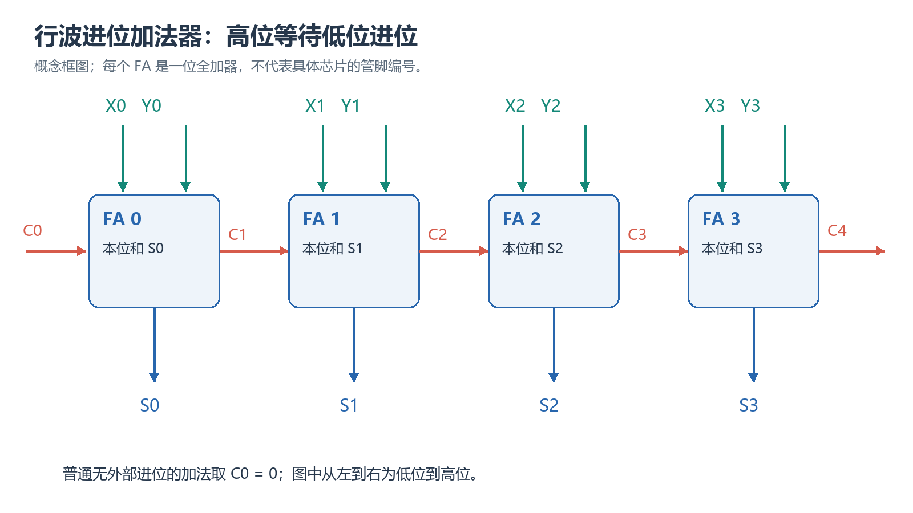

# 第 4 章 布尔代数的应用、最小项与最大项展开式学习笔记

## 本章要学什么

本章围绕一个问题展开：**怎样从文字需求或真值表构造组合逻辑，并把函数写成可编号、可核验、可实现的最小项/最大项展开式？** 内容按“需求 → 真值表 → 标准项 → 无关项 → 加法器与进位”推进。

学完后应能：

- 从自然语言中识别可取真、假的命题，并为其定义逻辑变量；
- 根据功能要求建立真值表，由输出为 `1` 或 `0` 的行写出逻辑函数；
- 区分最小项与最大项，并在代数形式、二进制编号和十进制编号之间转换；
- 写出函数唯一的标准积之和式和标准和之积式，并求函数的补；
- 正确使用无关项化简非完全给定函数；
- 由真值表设计半加器、全加器、减法器和编码检测电路；
- 解释行波进位的延迟来源和先行进位的基本思想。

### 前置知识与记号

A、B、C 等为输入逻辑量，F 或其他已指明字母为输出函数；加号、相邻、撇号仍分别表示 OR、AND、NOT。n 为变量个数；$m_i$ 是编号 i 对应的最小项，$M_i$ 是同一行的最大项，详细构造在第5节讲。$\Sigma m$ 表示最小项相或，$\Pi M$ 表示最大项相与，不是普通整数求和/相乘；d(i) 是未规定输出的无关行。

## 本章学习地图

| 学习阶段 | 核心问题 | 可见成果 |
| --- | --- | --- |
| 需求与有效输入 | 文字条件怎样成为唯一函数？ | 定义极性并列有效行 |
| 标准项与标准化 | 每行怎样编号和补全变量？ | 互换 SOP/POS 并检查补集 |
| 无关项与多输出 | 哪些行可自由选、哪些输出须独立？ | 保持约束并选择共享逻辑 |
| 加减法与进位 | 位串算术怎样落实到门级？ | 推导全加器、判溢出、展开进位 |

> 阅读顺序：先看本章路线，再进入知识单元；小练习紧跟相应知识点，章节小结和章节检验放在本章正文末尾，最后进行隔日复习。

> **阅读边界：** 原“学习目标”是能力索引，已并入本篇开头；下面保留每个独立知识主题，不为索引机械配题。

## 2. 组合逻辑设计的基本流程

### 本章路线

**先识别输入、输出、有效电平和约束 → 把文字条件改写为逻辑命题 → 再用真值表或关键用例验证。**

> 本章要解决的问题：自然语言需求怎样变成没有歧义、可验证、可实现的布尔函数？
>
> 本章学完应会：能固定信号极性，写出表达式，并用有效/无效输入检查设计。

### 学习单元

#### 2.1 从需求到真值表

组合逻辑设计的第一步不是立刻写门电路，而是先明确输入变量、输出变量、有效电平和非法输入。对每一种输入组合给出唯一输出，才能把自然语言需求变成可核验的真值表。

#### 2.2 从真值表到实现

这里 SOP 是 sum of products（积之和、与或式），POS 是 product of sums（和之积、或与式）。乘积项用逻辑与连接文字，和项用逻辑或连接文字；标准形式的每项须包含全部输入变量。扇入是一个门允许/实际使用的输入端数，层数是输入到输出经过的门级数。

得到真值表后，可以从输出为 1 的行写 SOP，也可以从输出为 0 的行写 POS；随后再用布尔代数或卡诺图化简，最后选择门级实现。验证至少包括：回代关键行、检查未定义输入、确认信号极性，并比较门数、层数和扇入。

##### 小练习：条件、方法与结果复核

> **题源：** 《数逻第四章.pdf》PDF 第1、6页，文字条件与组合设计；依所列概念/方法编写的条件变式，非原书原题。

**题目：** 为“仅当使能 $E=1$ 且传感器 $S=1$ 时报警”的需求写出输入、输出和约束，并列出至少两条验证用例。

**解析与检查：** 正逻辑定义 E 为使能、S 为触发、F 为报警，故 $F=ES$。ES 为 00、01、10、11 时 F 依次为 0、0、0、1；应检查全四行。若输出 L 为低有效，写 $L=(ES)'$，报警时引脚是 0，但输入定义不变。

### 本章小结

组合设计以需求与有效电平为起点，先给每种有效输入唯一输出，再化简和实现。验证不仅看正常用例，还要查非法输入和信号极性。

### 本章练习与检验

> **题源：** 《数逻第四章.pdf》PDF 第1、6页，文字条件与组合设计；依所列概念/方法编写的条件变式，非原书原题。

**题目：** 设计只有 E=1 且 S=1 才有效的报警输出 F，并用仅有 NAND 门实现；若实际报警端 L 为低有效，怎样输出？列全部四种输入。

**解析与检查：** ES 为 00、01、10、11 时 F 为 0、0、0、1。令 T=NAND(E,S)，则 F=NAND(T,T)，L=T。低有效输出不需要末级反相；“未使能不报警”是输出含义，不是强令引脚为 0。

## 3. 文字描述转化为布尔表达式

### 本章路线

**先识别输入、输出、有效电平和约束 → 把文字条件改写为逻辑命题 → 再用真值表或关键用例验证。**

> 本章要解决的问题：自然语言需求怎样变成没有歧义、可验证、可实现的布尔函数？
>
> 本章学完应会：能固定信号极性，写出表达式，并用有效/无效输入检查设计。

### 学习单元

#### 3.1 先识别命题

只有能够判断“真”或“假”的陈述才能作为逻辑变量。命令、愿望等没有逻辑真值，不能直接定义为变量。

设某句话包含三个命题：

- $A=1$：现在是星期一晚上；
- $B=1$：她已经完成家庭作业；
- $F=1$：她可以观看电视。

若要求“当且仅当现在是星期一晚上，并且她已经完成作业时，可以观看电视”，则：

$$
F=AB
$$

“当且仅当”表示充要条件；“并且”对应与运算。

#### 3.2 正逻辑与负逻辑表述

定义变量时要明确 `1` 表示什么。若定义 $B=1$ 表示“门已关闭”，则“门没有关闭”应写成 $B'$。不要根据句子中是否出现“没有”机械取反，应先看变量的定义。

#### 3.3 报警器示例

设：

- $A=1$：报警开关闭合；
- $B=1$：门已关闭；
- $C=1$：时间已到下午 6 点以后；
- $D=1$：窗户已关闭；
- $Z=1$：报警器响铃。

报警条件为：

1. 报警开关闭合且门未关闭；
2. 或者下午 6 点以后且窗户未关闭。

因此：

$$
Z=AB'+CD'
$$

这个例子说明：先把每个短语翻译为一个文字，再按“并且”“或者”的关系组合，能减少漏取反和括号错误。

##### 小练习：条件、方法与结果复核

> **题源：** 《数逻第四章.pdf》PDF 第6—7页，文字描述转化；依所列概念/方法编写的条件变式，非原书原题。

**题目：** 把“$A$ 或 $B$ 为真且 $C$ 为假时输出 1”写成布尔式，并给出一种容易误读的错误式。

**解析与检查：** $F=(A+B)\bar C$；错误式常把它写成 $A+B\bar C$，两者在 $A=1,B=0,C=1$ 时不同。

### 本章小结

自然语言中的或是否包含同时成立、否定作用于谁，都必须先澄清。定义命题与有效电平，再写括号；检查用例应能区分误读的式子。

### 本章练习与检验

> **题源：** 《数逻第四章.pdf》PDF 第6—7页，文字描述转化；依所列概念/方法编写的条件变式，非原书原题。

**题目：** 需求是“使能 E=1，且 A、B 中恰有一个为 1 时报警”。写 F，再比较把“恰有一个”误写为普通或的结果。

**解析与检查：** $F=E(A' B+AB')$。错式 E(A+B) 在 E=A=B=1 时输出 1，而正确输出 0。未使能 E=0 时两式都为 0，只有测试这一类输入不能发现问题。

## 4. 用真值表设计组合逻辑

### 本章路线

**先固定变量顺序和输出有效行 → 写出最小项/最大项函数 → 再化简并映射为门级电路。**

> 本章要解决的问题：怎样从真值表稳定地得到标准展开和电路，并避免编号、极性和输出行混淆？
>
> 本章学完应会：能从真值表得到 SOP/POS、半加器或多输出逻辑，并回代关键行。

### 学习单元

#### 4.1 从输出为 1 的行写函数

设三位二进制数为 $N=ABC$，其中 $A$ 为最高位。当 $N\geq 3$ 时输出 $f=1$，否则 $f=0$。

输出为 `1` 的输入组合是 `011、100、101、110、111`。对每一行写一个仅在该行取 `1` 的乘积项，再将各项相或：

$$
f=A'BC+AB'C'+AB'C+ABC'+ABC
$$

化简得：

$$
f=A+BC
$$

#### 4.2 从输出为 0 的行写函数

也可以对每个输出为 `0` 的输入组合写一个和项，再把这些和项相与。本例输出为 `0` 的组合是 `000、001、010`，因此：

$$
f=(A+B+C)(A+B+C')(A+B'+C)
$$

化简后仍得到：

$$
f=A+BC
$$

两种方法描述的是同一个函数：

- 输出为 `1` 的行产生乘积项，最后相或；
- 输出为 `0` 的行产生和项，最后相与。

##### 小练习：条件、方法与结果复核

> **题源：** 《数逻第四章.pdf》PDF 第7—9页，真值表与标准式；依所列概念/方法编写的条件变式，非原书原题。

**题目：** 若 $F(A,B,C)=1$ 的行是 $001,010,111$，写出最小项和式，并写出补集的最大项编号。

**解析与检查：** 按 $ABC$ 作为二进制编号得 $F=\Sigma m(1,2,7)$；补集为输出 0 的行，对应 $\Pi M(0,3,4,5,6)$。

### 本章小结

从 1 行写最小项的和，从 0 行写最大项的积，两条路径描述同一函数。编号前必须固定变量顺序，否则同一编号会指向别的输入。

### 本章练习与检验

> **题源：** 《数逻第四章.pdf》PDF 第7—9页，真值表与标准式；依所列概念/方法编写的条件变式，非原书原题。

**题目：** 已知 ABC 顺序下 1 行为 1、2、7，写标准 SOP 和 POS；若按 CBA 重新编号，同一组实际输入的 1 行编号是什么？

**解析与检查：** SOP 为 $\Sigma m(1,2,7)$，POS 为 $\Pi M(0,3,4,5,6)$。实际输入 001、010、111 改按 CBA 编号为 100、010、111，即 4、2、7。函数没变，编号变了；不可只换标题不换编号。

## 5. 最小项与最大项

### 本章路线

**先固定变量位序和编号规则 → 对目标行写出只在该行取值的最小项/最大项 → 再用补集编号关系校验。**

> 本章要解决的问题：为什么最小项在目标行取 1、最大项在目标行取 0，编号又如何与二进制行对应？
>
> 本章学完应会：能写出指定编号的 minterm/maxterm，并解释两种标准展开的互补关系。

### 学习单元

#### 5.1 文字、最小项和最大项

**文字**是一个变量或它的反变量，如 $A$、$B'$。

对 $n$ 个变量：

- **最小项**是包含全部 $n$ 个变量的乘积项，每个变量恰好出现一次；
- **最大项**是包含全部 $n$ 个变量的和项，每个变量恰好出现一次。

三变量函数共有 $2^3=8$ 个最小项和 8 个最大项。

#### 5.2 编号规则

最小项 $m_i$ 仅在编号为 $i$ 的输入组合上取值 `1`。按输入位写最小项时：

- 输入位为 `1`，写原变量；
- 输入位为 `0`，写反变量。

最大项 $M_i$ 仅在编号为 $i$ 的输入组合上取值 `0`。按输入位写最大项时规则相反：

- 输入位为 `0`，写原变量；
- 输入位为 `1`，写反变量。

| ABC | 十进制编号 | 最小项 | 最大项 |
|---|---:|---|---|
| 000 | 0 | A'B'C' | A+B+C |
| 001 | 1 | A'B'C | A+B+C' |
| 010 | 2 | A'BC' | A+B'+C |
| 011 | 3 | A'BC | A+B'+C' |
| 100 | 4 | AB'C' | A'+B+C |
| 101 | 5 | AB'C | A'+B+C' |
| 110 | 6 | ABC' | A'+B'+C |
| 111 | 7 | ABC | A'+B'+C' |

同一编号的最小项和最大项互为反函数：

$$
M_i=m_i'
$$

#### 5.3 两种标准展开式

记 I1 为输出 1 的行编号集合，I0 为输出 0 的行编号集合，则 $F=\sum_{i\in I_1}m_i=\prod_{i\in I_0}M_i$。此处求和表示逻辑或，连乘表示逻辑与；完全给定时两集合不相交且覆盖全部 $2^n$ 行。有无关行则单独记作未规定集合，不把它硬塞进 I0 或 I1。

若函数在编号 `3、4、5、6、7` 的输入组合上为 `1`，则最小项展开式为：

$$
f(A,B,C)=\sum m(3,4,5,6,7)
$$

函数在编号 `0、1、2` 的输入组合上为 `0`，所以最大项展开式为：

$$
f(A,B,C)=\prod M(0,1,2)
$$

最小项展开式也称标准积之和式，最大项展开式也称标准和之积式。对变量顺序已经确定的完全给定函数，这两种展开式都是唯一的。

#### 5.4 函数及其补的编号关系

对完全给定函数，全部编号集合为 $\{0,1,\ldots,2^n-1\}$。若：

$$
f=\sum m(S)
$$

则：

$$
f=\prod M(\overline{S})
$$

$$
f'=\sum m(\overline{S})
$$

$$
f'=\prod M(S)
$$

其中 $\overline{S}$ 表示在全部编号中的补集。可用一句话记忆：**函数取反时，编号集合与函数值一起互补；最小项和最大项也互换。**

##### 小练习：条件、方法与结果复核

> **题源：** 《数逻第四章.pdf》PDF 第8—9页，最小项与最大项；依所列概念/方法编写的条件变式，非原书原题。

**题目：** 解释为什么同一行的最小项取值为 1、最大项取值为 0；对变量 $A,B,C=101$ 写出对应 $m_5$ 和 $M_5$。

**解析与检查：** $m_5=A\bar B C$；$M_5=\bar A+B+\bar C$，最大项必须在该行整体为 0。

### 本章小结

最小项在对应输入行唯一为 1，最大项在该行唯一为 0；构造规则正好相反。同一编号的最大项是最小项的补，而非同值。

### 本章练习与检验

> **题源：** 《数逻第四章.pdf》PDF 第8—9页，最小项与最大项；依所列概念/方法编写的条件变式，非原书原题。

**题目：** 对 ABC=101 写 m5、M5，求它们在 101 和 100 的值；解释把 M5 当作 F=1 的行相或会有什么错。

**解析与检查：** $m_5=AB' C$，$M_5=A'+B+C'$。101 行分别为 1、0；100 行分别为 0、1。最大项用于指定某行是 0，并通过连乘排除这些行，不能像最小项一样直接相或拼出 1 行。

## 6. 标准最小项与最大项展开式

### 本章路线

**先辨认 SOP/POS 结构和变量缺口 → 用补入变量的恒等式展开或提取公共项 → 再检查每个标准项的编号和覆盖。**

> 本章要解决的问题：一般乘积项/和项怎样转换为标准形式，展开与因式分解在分析和实现中分别解决什么问题？
>
> 本章学完应会：能完成标准展开与反向因式分解，解释变量补全的依据并检查编号。

### 学习单元

#### 6.1 将一般乘积项补成最小项

若乘积项缺少变量 $X$，使用：

$$
X+X'=1
$$

例如：

$$
AB=AB(C+C')=ABC+ABC'
$$

对每个乘积项重复这一过程，合并重复项后即可得到标准最小项展开式。

#### 6.2 将一般和项补成最大项

若和项缺少变量 $X$，使用：

$$
XX'=0
$$

结合布尔分配律：

$$
Y+XX'=(Y+X)(Y+X')
$$

例如：

$$
A+B=(A+B+C)(A+B+C')
$$

#### 6.3 一般形式

对 $n$ 变量完全给定函数，令 $a_i$ 为真值表第 $i$ 行的函数值，则：

$$
F=\sum_{i=0}^{2^n-1}a_i m_i
$$

同时：

$$
F=\prod_{i=0}^{2^n-1}(a_i+M_i)
$$

因为 $a_i=1$ 时对应最小项出现在积之和式中；而 $a_i=0$ 时，对应最大项才保留在和之积式中。

一个 $n$ 变量函数有 $2^n$ 行，每行输出可独立选 `0` 或 `1`，因此不同函数总数为：

$$
2^{2^n}
$$

#### 6.4 最小项的正交性

不同最小项的乘积为 `0`：

$$
m_i m_j=0,\qquad i\ne j
$$

因此两个函数相与时，只保留它们共同包含的最小项。例如：

$$
f_1=\sum m(0,2,3,5,9,11)
$$

$$
f_2=\sum m(0,3,9,11,13,14)
$$

则：

$$
f_1f_2=\sum m(0,3,9,11)
$$

这相当于对两组最小项编号取交集。

##### 小练习：条件、方法与结果复核

> **题源：** 《数逻第四章.pdf》PDF 第3页第4.4节学习指导及第9页编号关系；依所列概念/方法编写的条件变式，非原书原题。

**题目：** 在变量 A、B、C 下把积项 AB 补成标准最小项，把和项 A+B 补成标准最大项；核对各自覆盖或排除的输入。

**解析与检查：** $AB=AB(C+C')=ABC+ABC'=m_7+m_6$；$A+B=(A+B+C)(A+B+C')=M_0M_1$。积项覆盖 110、111，和项恰在 000、001 为 0。两种补变量关系的运算不同。

### 本章小结

标准化通过互补关系补全缺失变量：积项乘“X+X′”，和项用“(P+X)(P+X′)”。这增加项数以建立统一编号，不以最少门数为目标。

### 本章练习与检验

> **题源：** 《数逻第四章.pdf》PDF 第3页第4.4节学习指导及第9页编号关系；依所列概念/方法编写的条件变式，非原书原题。

**题目：** 对 $F(A,B,C)=A+BC$，分别由补变量和输入集合得到标准 SOP/POS，并核对数量是否合为 8。

**解析与检查：** 积项 A 展成 m4+m5+m6+m7，BC 展成 m3+m7，去重得 $\Sigma m(3,4,5,6,7)$。0 行为 0、1、2，所以 POS 为 $\Pi M(0,1,2)$。两集合不相交且大小为 5+3=8；一般 SOP 的一项不一定是最小项。

## 7. 非完全给定函数与无关项

### 本章路线

**先区分有效输入、明确 0/1 和无关项 → 只在有利于化简时使用无关项 → 再检查所有有效输入的功能约束。**

> 本章要解决的问题：无关项什么时候可以当作 0 或 1，为什么不能把它当作实测输出？
>
> 本章学完应会：能安全利用无关项减少逻辑代价，并说明有效输入边界。

### 学习单元

#### 7.1 无关项的含义

某些输入组合在实际系统中不会出现，或者这些组合出现时输出取 `0`、`1` 都不影响要求，此时函数在这些行上的值可记为 `X`，对应项称为**无关项**。

无关项常记作 $d_i$，其十进制编号集合写成：

$$
\sum d(i_1,i_2,\ldots)
$$

无关项不是固定的 `0` 或 `1`。化简时可以为不同无关项分别选择值，但选择的目的必须是让最终表达式更简单。

#### 7.2 表示方法

若三变量函数在 `0、3、7` 行为 `1`，在 `1、6` 行无关，则：

$$
F=\sum m(0,3,7)+\sum d(1,6)
$$

也可写成最大项形式：

$$
F=\prod M(2,4,5)\prod D(1,6)
$$

其中 $D_i$ 表示无关最大项。

#### 7.3 使用原则

1. 先区分有效的 `1`、有效的 `0` 和无关项；
2. 任何有效输入组合的输出都不能被改变；
3. 无关项可取 `0` 或 `1`，也可以不参与化简；
4. 比较不同选择后所需的项数、文字数和门输入数，选择较简单的实现。

##### 小练习：条件、方法与结果复核

> **题源：** 《数逻第四章.pdf》PDF 第4页，非完全给定函数；《卡诺图化简：原理、方法与典型题.pdf》第7、9页；依所列概念/方法编写的条件变式，非原书原题。

**题目：** 函数 $F=\Sigma m(1,3,7)+d(5)$，说明无关项何时可并入圈组/合并，何时不能改变有效输入的输出约束。

**解析与检查：** 在 ABC 顺序下，规定 1 为 001、011、111，无关为 101。把 101 选为 1，可把所有 C=1 的行合为一组，得 F=C；规定 0 的 C=0 四行仍全为 0。若不选无关项则 F=A′C+BC；若 5 行改成规定 0，必须使用后者。

### 本章小结

无关项是未规定输出的输入，不是必须为 1，也不是一定能删除的有效行。只在保持所有有效行输出的前提下选取无关项，以减少实现代价。

### 本章练习与检验

> **题源：** 《数逻第四章.pdf》PDF 第4页，非完全给定函数；《卡诺图化简：原理、方法与典型题.pdf》第7、9页；依所列概念/方法编写的条件变式，非原书原题。

**题目：** 在 ABC 顺序下 $F=\Sigma m(1,3,7)+d(5)$。用与不用无关项分别化简；如果 5 行改成规定输出 0，原最简式还能用吗？

**解析与检查：** 使用 5 行可形成 C=1 的四格组，F=C。不使用时为 A′C+BC。若 5 行规定为 0，F=C 会在 101 输出 1 而违反要求，必须恢复原有效约束；不能把真实输入当成任意值。

## 8. 由真值表构建逻辑电路

### 本章路线

**先固定变量顺序和输出有效行 → 写出最小项/最大项函数 → 再化简并映射为门级电路。**

> 本章要解决的问题：怎样从真值表稳定地得到标准展开和电路，并避免编号、极性和输出行混淆？
>
> 本章学完应会：能从真值表得到 SOP/POS、半加器或多输出逻辑，并回代关键行。

### 学习单元

#### 8.1 半加器

半加器把两个 1 位二进制数 $A$、$B$ 相加，产生进位 $X$ 和本位和 $Y$：

$$
X=AB
$$

$$
Y=A'B+AB'=A\oplus B
$$

因此半加器由一个与门和一个异或门实现。

#### 8.2 多输出组合逻辑

多输出电路应对每个输出分别建立真值表列，并分别写出函数。例如两个 2 位数相加得到 3 位结果时，可分别求最高位、中间位和最低位的最小项展开式。若不同输出含有相同中间项，实现时还可以共享逻辑门。

#### 8.3 非法编码检测

设计编码检测电路时：

1. 列出全部输入组合；
2. 合法码对应输出 `0`，非法码对应输出 `1`；
3. 写出非法组合的最小项展开式并化简。

例如教材中的 6-3-1-1 BCD 非法码检测函数为：

$$
F=\sum m(2,6,10,13,14,15)
$$

化简后：

$$
F=CD'+ABD
$$

若输入只可能是合法 BCD 码，则 `1010` 到 `1111` 可作为无关项。例如检测一位 BCD 数能否被 3 整除时，有效的输出 `1` 对应十进制 `0、3、6、9`：

$$
Z=\sum m(0,3,6,9)+\sum d(10,11,12,13,14,15)
$$

##### 小练习：条件、方法与结果复核

> **题源：** 《数逻第四章.pdf》PDF 第4页加减法器学习指导；《布尔代数从入门到精通.pdf》第8页全加器示例；依所列概念/方法编写的条件变式，非原书原题。

**题目：** 从半加器真值关系写 S（和位）与 K（进位），检查 11；有人以“和位为 0”检测“两个输入全为 0”，给出反例并修正。

**解析与检查：** $S=A\oplus B$，$K=AB$；11 时 S=0、K=1。00 也有 S=0，故只看 S 不足；全 0 检测应为 $(A+B)'=A' B'$。多输出的位权不同，不能用一个输出替代全部数值信息。

### 本章小结

多输出电路应分别定义每个输出，再检查共享中间项。半加器的和与进位描述不同位权；非法编码检测不是把非法码当无关项。

### 本章练习与检验

> **题源：** 《数逻第四章.pdf》PDF 第4页加减法器学习指导；《布尔代数从入门到精通.pdf》第8页全加器示例；依所列概念/方法编写的条件变式，非原书原题。

**题目：** 构造两位输入 A、B 的半加器和位 S、进位 K，并验证恒等关系 $A+B=S+2K$（这里加号是普通整数加法）。若要求“输入 11 时报警”，能否只用 S？

**解析与检查：** $S=A\oplus B$，$K=AB$。00、01、10、11 时 (S,K) 为 (0,0)、(1,0)、(1,0)、(0,1)，分别还原整数和 0、1、1、2。S 在 00、11 都为 0，不能区分报警条件；应使用 K。

## 9. 二进制加法器与减法器

### 本章路线

**先推导全加器 → 再级联并判断溢出 → 最后通过补码实现减法和借位。**

> 本章要解决的问题：进位、补码溢出和减法初始进位为什么不能混为一谈？
>
> 本章学完应会：能写全加器/减法器关系，按固定位宽计算并解释进位与溢出。

### 学习单元

#### 9.1 全加器

全加器输入为两个当前位 $X_i$、$Y_i$ 和低位进位 $C_i$，输出为本位和 $S_i$ 及高位进位 $C_{i+1}$：

$$
S_i=X_i\oplus Y_i\oplus C_i
$$

$$
C_{i+1}=X_iY_i+X_iC_i+Y_iC_i
$$

第二式表示：三个输入中至少有两个为 `1` 时产生进位。

#### 9.2 行波进位加法器

把多个全加器串联起来，前一级的进位输出接到后一级的进位输入，即构成行波进位加法器。其结构规则、易于扩展，但高位必须等待低位进位逐级传播，位数越多，最坏情况下的延迟越大。

最低位没有外部进位时，可令 $C_0=0$。若采用反码加法，最高位进位还需反馈到最低位，形成循环进位。

<!-- study-note-illustration:2026-10-04:ripple-carry-adder -->

**读图提示：**图中从左到右为低位到高位，红色箭头表示前一级进位作为后一级输入，高位最坏情况下需要等待低位。每个 FA 是一位全加器；普通无外部进位的加法可令最低位输入进位为 0。

来源：依据本篇笔记相邻段落自绘的教学示意；不是教材原图或实测记录。

<!-- /study-note-illustration -->

#### 9.3 补码溢出

V 是溢出标志（1 表示溢出），下标 s 表示最高符号位。n 为总位宽，$C_{n-1}$ 是符号位的输入进位，$C_n$ 是其输出进位；同一固定位宽加法中有 $V=C_{n-1}\oplus C_n$。下文减法 A、B 改指 n 位整数位串，不是前面单个逻辑变量；$A-B\equiv A+B'+1\pmod{2^n}$ 只表达保留低 n 位的模关系。

对两个同号补码数相加，若结果符号与加数符号相反，则发生溢出。以最高符号位 $A_s$、$B_s$ 和结果符号位 $S_s$ 表示：

$$
V=A_s'B_s'S_s+A_sB_sS_s'
$$

也可以通过符号位的进位输入与进位输出是否不同来判断溢出。

#### 9.4 用全加器实现减法

补码减法利用：

$$
A-B\equiv A+B'+1\pmod{2^n}
$$

因此，将 $B$ 的每一位取反，并把最低位全加器的初始进位置为 `1`，便可用加法器完成减法。固定字长运算中，最高位的最终进位通常忽略。

##### 小练习：条件、方法与结果复核

> **题源：** 《数逻第四章.pdf》PDF 第4、19页，减法器与借位；第20页进位关系；依所列概念/方法编写的条件变式，非原书原题。

**题目：** 由两个半加器组合全加器，写出 $S$、$C_{out}$，并说明补码减法为什么需要对减数按位取反再加 1。

**解析与检查：** 第一半加器给 T=A⊕B、K1=AB，第二半加器给 S=T⊕Cin、K2=T·Cin；进位 Cout=K1+K2=AB+ACin+BCin。Cin 是低位输入进位，Cout 是高位输出进位。n 位减法按模 $2^n$ 用 A+B′+1 实现，B′是位串逐位反相，最低位初始进位置 1；之后另查数值范围。

#### 9.5 全减器

全减器输入为被减位 $x_i$、减数位 $y_i$ 和低位借位 $b_i$，输出为差 $d_i$ 和向高位的借位 $b_{i+1}$：

$$
d_i=x_i\oplus y_i\oplus b_i
$$

$$
b_{i+1}=x_i'y_i+x_i'b_i+y_ib_i
$$

把多个全减器串联即可得到并行减法器；最低位通常令 $b_0=0$。

### 本章小结

全加器包括输入进位，减法可转成固定位宽的加补码。最高进位用于无符号运算，有符号溢出比较符号位或符号位两侧进位，二者不可混同。

### 本章练习与检验

> **题源：** 《数逻第四章.pdf》PDF 第4、19页，减法器与借位；第20页进位关系；依所列概念/方法编写的条件变式，非原书原题。

**题目：** 用 4 位加法器计算 $3-5$，以及 4 位补码 $7+1$，写初始进位和位串；说明第二题为何不能用“没有最高进位”判定无溢出。

**解析与检查：** 减法为 0011+1010+1=1110，初始进位 1，补码解码 −2，正确。7+1 为 0111+0001=1000，初始进位 0；真和 8 超出 −8 至 7，补码结果 −8，虽最高进位为 0 仍溢出。

## 10. 先行进位加法器

### 本章路线

**先定义产生与传播 → 再逐级代入展开 → 最后比较并行与串行依赖。**

> 本章要解决的问题：怎样在不等待各级真实进位的情况下求出高位进位？
>
> 本章学完应会：能按已声明的传播约定展开 C2/C3，说明门规模和延迟边界。

### 学习单元

#### 10.1 产生信号与传播信号

本节 i 从最低位 0 起，Ai、Bi 是两加数的第 i 位，Ci 是输入进位，Ci+1 是输出进位，Gi 为产生，Pi 为传播。本篇选 $P_i=A_i\oplus B_i$；原教材 PDF 第20页选 $P_i=A_i+B_i$，两种都能写相同的进位递推，但只有 XOR 定义可直接用于 $S_i=P_i\oplus C_i$。切换约定时必须重写和位关系。

行波进位慢的原因是进位必须逐级经过逻辑门。先行进位加法器把每一级的进位直接表示为输入和最低位进位的函数。

定义：

$$
G_i=A_iB_i
$$

$$
P_i=A_i\oplus B_i
$$

其中 $G_i$ 表示第 $i$ 位自身产生进位，$P_i$ 表示该位会把输入进位传播到输出。于是：

$$
C_{i+1}=G_i+P_iC_i
$$

#### 10.2 进位展开

逐级代入可得：

$$
C_1=G_0+P_0C_0
$$

$$
C_2=G_1+P_1G_0+P_1P_0C_0
$$

$$
C_3=G_2+P_2G_1+P_2P_1G_0+P_2P_1P_0C_0
$$

$$
C_4=G_3+P_3G_2+P_3P_2G_1+P_3P_2P_1G_0+P_3P_2P_1P_0C_0
$$

在不限制扇入的理想逻辑模型中，这些进位可由两级与或网络并行产生；真实器件还存在门延迟与布线延迟。位数很大时，直接展开会增加门的扇入，因此常把若干位分成一组，再构成分层先行进位结构。

##### 小练习：条件、方法与结果复核

> **题源：** 《数逻第四章.pdf》PDF 第20—22页，先行进位；依所列概念/方法编写的条件变式，非原书原题。

**题目：** 定义 $P_i=A_i\oplus B_i$、$G_i=A_iB_i$，展开 $C_2$ 和 $C_3$；说明它相对行波进位减少了什么等待。

**解析与检查：** 位号从低位 i=0 开始，Ai、Bi 是当前加数位，Ci 是输入进位。$C_2=G_1+P_1G_0+P_1P_0C_0$，$C_3=G_2+P_2G_1+P_2P_1G_0+P_2P_1P_0C_0$。P 采用 XOR 时表示可传播而不自产生的位，展开避免逐级等待真实进位，但增加门输入数；实际延迟仍由门级和布线决定。

### 本章小结

产生 G 和传播 P 把进位写成输入的直接函数，避免逐位等待。XOR/OR 两种传播约定都可用于进位，但和位关系不同；并行展开仍受门扇入与布线延迟约束。

### 本章练习与检验

> **题源：** 《数逻第四章.pdf》PDF 第20—22页，先行进位；依所列概念/方法编写的条件变式，非原书原题。

**题目：** 4 位输入 A=0111、B=0001、C0=0，按 XOR 传播定义写 G、P，并由展开式求 C1 至 C4 与和；比较这和行波进位的依赖。

**解析与检查：** 按高位到低位，G=0001、P=0110；C1=1，C2=1，C3=1，C4=0，和为 1000。展开式由 G、P、C0 并行组合求得，不必等前一级实际输出到达；但不是零延迟，也不是门数必然更少。

## 11. 常见错误与解题流程

### 本章路线

**先按对象、条件、规则、结果和检查五层分类错误 → 再用反例或回代定位失误 → 最后形成可重复的解题清单。**

> 本章要解决的问题：当一个结果看似合理但与条件、真值表或范围冲突时，怎样快速定位是模型、步骤还是边界出了问题？
>
> 本章学完应会：能审查一段错误解答，指出错误发生的位置、修正规则和防止复发的检查动作。

### 学习单元

#### 11.1 常见错误

1. **变量定义不清。** 同一变量有时表示“门关闭”，有时又被当成“门打开”。
2. **最小项编号规则写反。** 最小项中输入 `0` 对应反变量，输入 `1` 对应原变量。
3. **最大项照抄最小项规则。** 最大项恰好相反，输入 `0` 对应原变量，输入 `1` 对应反变量。
4. **把 $\sum m$ 的编号当成输出为 0 的行。** $\sum m$ 列出输出为 `1` 的行；$\prod M$ 列出输出为 `0` 的行。
5. **忽略变量顺序。** 同一个二进制串在变量顺序改变后，十进制编号也会改变。
6. **一般 SOP 与标准 SOP 混淆。** 标准最小项中的每一项必须包含全部变量。
7. **把无关项固定为某个值。** 无关项应按化简需要选择，不同无关项可以取不同值。
8. **把逻辑进位与补码溢出混为一谈。** 最高位进位不等于有符号溢出。
9. **减法忘记加 1。** 用补码实现 $A-B$ 时，除逐位取反 $B$ 外，还要设置初始进位为 `1`。

#### 11.2 推荐解题流程

1. 写出每个输入、输出的含义，并明确 `1` 所表示的状态；
2. 固定变量顺序和位权，按二进制顺序列全输入组合；
3. 根据功能逐行填输出，无法出现或不关心的组合标为 `X`；
4. 需要积之和式时圈出输出为 `1` 的行，需要和之积式时圈出输出为 `0` 的行；
5. 写十进制编号前，用一行实际变量式进行反查；
6. 使用代数法、无关项或后续章节的卡诺图化简；
7. 用原真值表中的全部有效输入验证化简结果；
8. 最后再画门电路，并检查反相器、门输入数和共享项。

##### 小练习：条件、方法与结果复核

> **题源：** 《卡诺图化简：原理、方法与典型题.pdf》第7—9页，无关项与检查；依所列概念/方法编写的条件变式，非原书原题。

**题目：** 设计者只检查 001、011、111 都输出 1，就宣称 F=C 满足仅这三行为 1 的完全给定函数。补一行即可否定，并写正确式。

**解析与检查：** 101 时 C=1，但该行要求 0，因此不满足。正确式 $A' C+BC$ 覆盖 1、3、7；完整验证还要检查所有 0 行，而非只检查正样本。

### 本章小结

交付电路前应同时核对功能、有效输入、信号极性和数值解释。标准形式正确不等于实现代价最优，模结果正确也不等于有符号算术无溢出。

### 本章练习与检验

> **题源：** 《卡诺图化简：原理、方法与典型题.pdf》第7—9页，无关项与检查；依所列概念/方法编写的条件变式，非原书原题。

**题目：** 一位同学用 F=C 实现 $F=\Sigma m(1,3,7)+d(5)$，又把 5 行定义为“正常输入且必须输出 0”。定位需求冲突，并给出满足新需求的式子。

**解析与检查：** F=C 只有在 5 行无关时可用。新需求使 101 成为规定 0，已不能作为无关项。正确可用 $F=A' C+BC$，在 1、3、7 为 1，在 5 为 0；再枚举其余 0 行确认没有新增误报警。

## 六、练习提示与综合检验

以下任务连接至少两个正文主题；先作答再到第九部分对照，不以标题齐全代替计算与证明。

> **题源：** 《数逻第四章.pdf》PDF 第1、6页，文字条件与组合设计，及本篇相关章节；依已核对的方法设计跨主题变式，非原书题号。

### 综合自测 C1

**题目：** 按 ABC 顺序设计 $F=\Sigma m(1,3,7)+d(5)$：写使用无关项的最简式、把 5 改成有效 0 后的式子，以及两种要求下的 NAND 实现。

## 七、隔日复习与自测

### 换一组条件再判断（20分钟）

> **题源：** 本篇 C1 的条件变式；依据前述本地教材方法。

复习题 R1：用 4 位补码计算 $6+3$，再用 $3-5$ 检查减法初始进位。分别说明输出位串和真值是否相符。

### 闭卷解释关键问题（20分钟）

1. 同编号最小项和最大项在目标行各是多少？
2. 无关项是否必须用完？
3. 传播 P 若定义成 OR，能否直接用 S=P⊕C？

### 阶段复盘（15分钟）

先用 5 分钟不看正文重画学习地图；再用 5 分钟重做 C1 或 R1，写出变更条件影响的步骤；最后用 5 分钟记录一条错因、对应成立条件与下一次可用的检查输入。

## 八、学习安排与阅读资料

### 主线与细节查阅

《数逻第四章.pdf》第6—9页用于需求、真值表与标准项；第4页学习指导核对无关输入；第19—22页用于加减器和先行进位。原教材传播信号采用 OR，本篇采用 XOR，比较时先统一定义。

教材文件名作为本地来源索引，不随公开笔记上传。页码均指 PDF 物理页，不混用教材印刷页码；本篇变式明确标注，不虚构原书题号。需要题图细节时回到原教材，本文给出的纯文字条件已足够作答。

## 九、自测参考答案

### C1：综合自测

5 为无关行时 F=C，可直接接线。5 为规定 0 时 F=A′C+BC；令 T1=NAND(A′,C)、T2=NAND(B,C)，F=NAND(T1,T2)，其中 A′可由 NAND(A,A) 生成。两者在 5 行不同，设计是否正确取决于需求，不能只比较门数。

### R1：换条件复做

0110+0011=1001，真和 9 超过最大值 7，解码 −7，溢出；不能用该位串作真值。减法 0011+1010+1=1110，初始进位 1，解码 −2 与真差一致。进位和溢出服务于不同数值约定。

### 闭卷问题要点

最小项为 1、最大项为 0。无关项只在有利时选，绝不改变有效行。OR 与 XOR 的传播都能写进位，但 OR 定义不允许直接用 S=P⊕C；A=B=1、C=0 时 OR 传播为 1 而和位应为 0。

## 十、公式卡

此卡仅用于复习已讲内容，不能代替正文条件和推导。

### 标准形式

I1 是输出 1 的编号集合，I0 是输出 0 的编号集合，mi/Mi 是相同行的最小/最大项。

$$
F=\sum_{i\in I_1}m_i=\prod_{i\in I_0}M_i,\qquad M_i=m_i'.
$$

完全给定函数的 I0 与 I1 不相交且覆盖全部输入；有无关项时另列未规定集合。此处求和与乘积符号表示逻辑或与逻辑与。

### 全加器、减法与进位

Ai、Bi 为第 i 位，Ci 为低位进位，Si 为和位；Pi 采用 XOR，Gi 为产生。

$$
S_i=A_i\oplus B_i\oplus C_i,\qquad C_{i+1}=A_iB_i+A_iC_i+B_iC_i.
$$

$$
G_i=A_iB_i,\qquad P_i=A_i\oplus B_i,\qquad C_{i+1}=G_i+P_iC_i.
$$

$$
C_2=G_1+P_1G_0+P_1P_0C_0.
$$

n 为固定位宽，B′表示 B 的 n 位逐位取反。

$$
A-B\equiv A+B'+1\pmod{2^n}.
$$

V 为有符号溢出标志，Cn−1/Cn 是符号位的输入/输出进位。

$$
V=C_{n-1}\oplus C_n.
$$

xi、yi 为被减/减数位，bi 为输入借位，di 为差；借位符号 b 与数制部分的数字位记号无关。

$$
d_i=x_i\oplus y_i\oplus b_i,\qquad b_{i+1}=x_i'y_i+x_i'b_i+y_ib_i.
$$
