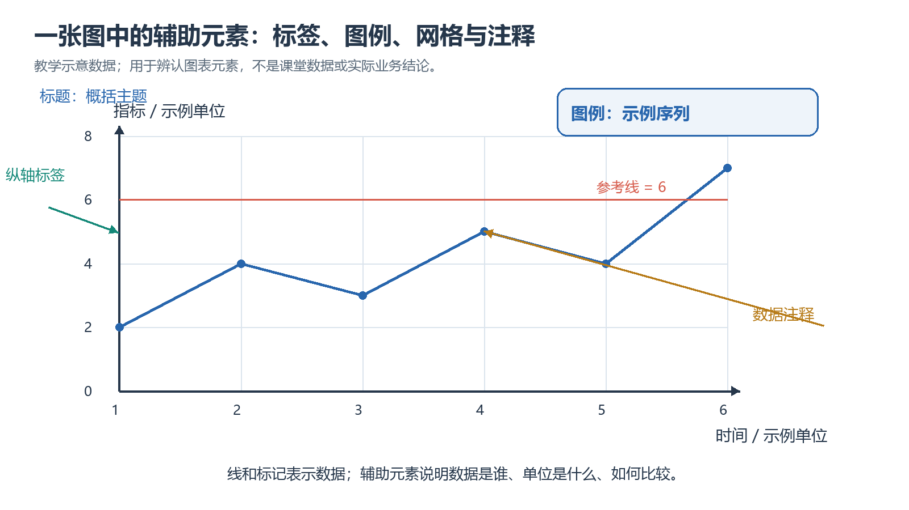

# 第四章｜图表辅助元素的定制与美化

## 本章要学什么

本章贯穿的问题是：**如何让图表中的辅助元素准确表达数据关系，而不是只增加装饰？**

图表的标题、坐标轴、刻度、图例、网格、参考线、注释、颜色、字体和填充共同决定读者能否正确读图。学习顺序采用“绘图对象与全局设置 → 坐标轴和标题 → 网格、参考线与注释 → 表格、颜色和样式 → 区域填充与综合审查”，先建立坐标和语义，再处理视觉层。

学完本章，你应能：

- 区分 `Figure`、`Axes` 和 pyplot 状态式接口；
- 为中文图表设置字体、负号和布局，避免乱码与遮挡；
- 用坐标范围、刻度、标题和图例说明数据对象、单位和比较关系；
- 用网格、参考线、参考区域和注释突出证据，而不是制造噪声；
- 选择有语义的颜色、线型、标记和字体，并处理色盲友好与黑白打印；
- 用综合检查表审查图表是否误导、难读或缺少必要上下文。

> 阅读边界：本章关注 Matplotlib 辅助元素。数据清洗和聚合见第二章；更复杂的统计图形和交互式图表不在本章主线内。

## 本章学习地图

| 学习阶段 | 要回答的核心问题 | 学完后的可见成果 |
| --- | --- | --- |
| 一、对象与全局设置 | 图表由什么对象组成，如何统一环境？ | 能创建可复用的 `Figure/Axes` 并处理中文字体 |
| 二、坐标轴、标题与图例 | 读者如何知道在比较什么？ | 图表具有明确单位、范围、刻度和图例 |
| 三、网格、参考线与注释 | 哪些判断需要被强调？ | 重点、阈值和异常有清楚但克制的视觉证据 |
| 四、颜色、线型与表格 | 多组数据如何区分？ | 样式服务于分类、序列或强调关系 |
| 五、填充与综合审查 | 图表是否完整、准确、可交付？ | 完成一张可用于汇报的趋势图并通过检查 |

**前置资料：** `课件/第四次课/第4章 图表辅助元素的定制与美化.pdf`、`课件/第四次课/第4章图表辅助元素的定制与美化——PPT课件示例代码.ipynb`。示例数据使用课件内 `data4.zip` 或第二章汇总结果；不把示例图当作实测结论。



*图 1：辅助元素应围绕数据对象、比较任务和阅读路径组织。图片为项目本地学习资料。*

## 一、绘图对象与全局设置

### 本章路线

> 先建立 `Figure` 和 `Axes` → 再设置字体、负号和布局 → 再把数据绘制到明确的坐标对象上。 本节要解决的问题是：同一段绘图代码可能因为接口混用、字体缺失或布局未调整而出现乱码、图例遮挡和元素溢出。要稳定定制图表，先理解对象层次和全局环境。 学完本节应会：解释 `Figure`、`Axes`、`Axis` 的关系；使用面向对象接口创建和操作坐标轴；解决中文字体和负号显示问题；在保存前使用 `tight_layout()` 或 `bbox_inches="tight"` 检查布局。

### 学习单元

#### 1. pyplot 与面向对象接口

```python
import matplotlib.pyplot as plt

fig, ax = plt.subplots(figsize=(8, 4.5))
ax.plot([1, 2, 3], [2, 4, 3], label="销售额")
ax.set_title("月度销售额")
ax.set_xlabel("月份")
ax.set_ylabel("金额（元）")
ax.legend()
fig.tight_layout()
plt.show()
```

`Figure` 是整张画布，`Axes` 是一个具体坐标区域。单图或多子图场景优先使用 `fig, ax = plt.subplots()`，这样可以明确元素属于哪个坐标轴，避免 pyplot 当前状态发生混淆。

#### 2. 中文字体、负号与布局

```python
plt.rcParams["font.sans-serif"] = ["SimHei", "Microsoft YaHei", "DejaVu Sans"]
plt.rcParams["axes.unicode_minus"] = False
```

字体名称必须以本机实际安装为准；如果仍显示方框，应检查字体文件和运行环境，而不是反复修改标题文字。布局问题要在 `show()` 前处理，并在保存后重新查看图像。

#### 小练习：找出图表环境问题

> 题源：《第4章 图表辅助元素的定制与美化》课件“导入 Matplotlib 并解决中文显示”“pyplot 与面向对象风格”；按课件内容整理。

一张图出现中文方框、负号变成短横线、图例挡住曲线。请按排查顺序给出修改项，并说明为什么不能只把字体大小调小。

**解析：** 先核对可用中文字体并设置 `font.sans-serif`，再设置 `axes.unicode_minus=False`，然后调整图例位置、画布尺寸和布局。字体变小只能掩盖遮挡，不能解决字符缺失或图例与数据重叠的语义问题。

### 本章小结

绘图对象和全局设置决定后续定制是否稳定。下一节的坐标轴、标题和图例必须建立在明确的 `Axes` 对象上，并围绕数据比较任务组织。

### 本章练习与检验

> 题源：第四章课件与配套 notebook 的基础绘图示例；按项目环境整理。

使用面向对象接口创建一张中文折线图：包含标题、横纵轴标签、图例、负数刻度和紧凑布局。保存为 PNG 后重新打开检查：中文是否可读、负号是否正确、图例是否遮挡数据、保存图像边界是否完整。

**验收要点：** 代码不能只依赖当前 pyplot 状态；至少说明一个“运行时检查”与一个“保存后检查”。

## 二、坐标轴、标题与图例

### 本章路线

> 先定义数据的对象和单位 → 再设置范围与刻度 → 再写标题和图例 → 最后检查读者能否仅凭图表理解比较关系。 本节要解决的问题是：刻度不是越多越好，标题也不是越长越好。辅助元素必须回答：横纵轴表示什么、单位是什么、时间或类别如何排列、不同线条分别代表谁、是否存在被截断或夸大的比较。 学完本节应会：使用 `set_xlim()`、`set_ylim()`、`set_xticks()`、`set_xticklabels()` 和 `tick_params()`；为标题、轴标签和图例提供对象、单位和范围上下文；判断截断坐标轴是否会放大差异；处理刻度标签重叠、图例重复和多组数据辨识问题。

### 学习单元

#### 1. 范围、刻度和标签

```python
fig, ax = plt.subplots(figsize=(8, 4))
ax.plot(months, values, marker="o", label="销售额")
ax.set_xlim(1, 12)
ax.set_xticks(range(1, 13))
ax.set_xlabel("月份")
ax.set_ylabel("销售额（元）")
ax.tick_params(axis="x", rotation=45)
```

`set_xlim` 和 `set_ylim` 控制可见范围；`set_xticks` 决定刻度位置，标签文本可以另行设置。自定义范围前要说明理由：是聚焦一个时间段、保持零基线，还是突出局部变化？对于柱状图，除非有明确说明，通常应保留 0 基线以避免夸大高度差。

#### 小练习：刻度设计审查

> 题源：第四章课件“坐标轴标签、范围和刻度”“刻度标签设计原则”；按课件内容整理。

某月度图把横轴标签全部旋转 90 度，纵轴从 95 开始且没有单位。指出至少三项问题，并给出修改原则。

**解析：** 横轴应优先减少标签数量、缩短文本或适度旋转，避免读者逐字竖读；纵轴应补充单位并说明范围理由；若比较柱高，非零基线可能放大差异，应恢复 0 或在标题/图注中明确这是局部放大图。

#### 2. 标题、图例与语义

```python
ax.set_title("2026 年 1—6 月各门店销售额")
ax.legend(title="门店", loc="upper left", bbox_to_anchor=(1.02, 1))
```

标题最好包含对象、时间范围和比较维度；轴标签写单位而不是只写“数值”。图例要与实际绘制对象一一对应，避免使用默认的 `Series` 名称或重复标签。

#### 小练习：改写一个无上下文标题

> 题源：第四章课件“标题与图例”部分；按课件内容整理。

把“销售情况”改写成一个可以独立阅读的标题，并说明需要补充哪些轴标签或图例信息。

**解析：** 例如改为“2026 年 1—6 月各门店月销售额（元）”。还应根据图形补充“月份”“销售额（元）”，多门店折线需要图例标明门店；若标题中的时间范围与数据不一致，应以数据核对为准。

### 本章小结

坐标轴、标题和图例负责建立阅读语境。下一节的网格、参考线和注释不是替代语境，而是对已有语境中的阈值、重点和异常进行补充。

### 本章练习与检验

> 题源：第四章课件坐标轴/标题/图例示例；结合第二章销售汇总结果整理。

选择一张多门店趋势图，完成一次语义审查：列出横轴对象、纵轴指标和单位、图例对象、坐标范围依据，以及一个可能误导读者的设计点。修改后说明差异是否仍然成立，不能只报告“看起来更美观”。

## 三、网格、参考线与注释

### 本章路线

> 先确定要比较的基准 → 用网格支持读数 → 用参考线表示阈值或统计基准 → 用注释解释关键点 → 检查是否引入视觉噪声。 本节要解决的问题是：网格、参考线和注释都能强调信息，也都可能遮挡或抢夺数据的注意力。它们只有在读者需要判断数值、阈值、趋势变化或异常原因时才有必要。 学完本节应会：用 `grid()` 控制网格轴向、线型、透明度和层级；使用 `axhline()`、`axvline()`、`axhspan()` 和 `axvspan()` 表示基准、阈值和区间；用 `annotate()` 指向数据点，用 `text()` 放置一般说明；为注释选择不遮挡数据的偏移位置和简洁文本。

### 学习单元

#### 1. 网格与参考线

```python
ax.grid(axis="y", linestyle="--", alpha=0.35)
ax.axhline(1000, color="tab:red", linestyle="--", label="目标线")
ax.axvline("2026-04", color="gray", linestyle=":")
ax.axhspan(800, 1200, color="tab:green", alpha=0.10)
```

`axhline` 和 `axvline` 分别在数据坐标中表达水平、垂直基准；`axhspan` 和 `axvspan` 表示一个范围。参考线的数值必须有来源：业务目标、实验阈值或统计基准；不能为了让图“更有内容”任意添加。

#### 小练习：参考线是否有意义

> 题源：第四章课件“参考线与参考区域”示例；按课件内容整理。

一张图同时加入均值线、目标线和三块半透明区域，但图注没有说明来源。请提出一个精简方案，并说明保留每个元素的判据。

**解析：** 先列出读者要判断的问题，只保留与判断直接相关的基准；均值线应说明计算范围，目标线应给出业务或题源依据，区域应说明上下界和含义。若三种元素表达相同信息，应合并图例或删除冗余区域，降低遮挡和认知负担。

#### 2. 指向性注释与普通文本

```python
peak = values.index(max(values))
ax.annotate(
    "峰值",
    xy=(peak, max(values)),
    xytext=(peak, max(values) * 1.15),
    arrowprops={"arrowstyle": "->", "color": "tab:red"},
)
ax.text(0.02, 0.95, "单位：元", transform=ax.transAxes, va="top")
```

`annotate()` 适合把文字与某个数据点绑定，`text()` 适合放置单位、来源、说明等一般文本。使用坐标变换时，要分清数据坐标和轴坐标；否则窗口缩放或数据范围变化后，文字可能跑出图外。

#### 小练习：注释位置与坐标系

> 题源：第四章课件“注释文本”示例；按课件内容整理。

给峰值加箭头注释，并把“单位：元”固定在坐标轴右上角。说明哪一段使用数据坐标，哪一段使用轴坐标。

**解析：** 箭头目标 `xy` 应使用数据坐标，因为它指向具体数据点；单位说明可使用 `transform=ax.transAxes`，以 0 到 1 的轴坐标固定在绘图区相对位置。注释文本还要留出偏移，避免覆盖标记。

### 本章小结

视觉强调必须有判断任务和来源依据。下一节把表格、颜色、线型、标记和字体作为编码系统处理，而不是把它们当作互相独立的装饰选项。

### 本章练习与检验

> 题源：第四章课件网格、参考线、参考区域和注释示例；结合销售趋势图整理。

为一张趋势图设计“读出目标值、找出峰值、判断是否达标”三项阅读任务，并只选择足够支持任务的网格、参考线、区域和注释。提交修改前后图，以及每个元素的功能说明和删除冗余元素的理由。

## 四、表格、颜色、线型、标记与主题

### 本章路线

> 先确定视觉编码对象 → 为类别、序列和重点分配稳定样式 → 处理文字与表格 → 在彩色、灰度和小尺寸场景下复核。 本节要解决的问题是：同一张图可能同时有多条线、多个类别和一个关键点。若颜色、线型、标记和字体没有稳定规则，读者会把视觉差异误认为数据差异，或无法在打印、投影和色觉差异下辨识。 学完本节应会：用颜色区分类别，用线型或标记补充冗余编码；区分离散颜色和连续颜色映射；用 `table()` 嵌入少量关键数字，而不是复制整张数据表；用局部字体、主题和边框控制信息层级；检查配色对比度、图例顺序和黑白打印可读性。

### 学习单元

#### 1. 表格与颜色

```python
colors = {"A店": "#1f77b4", "B店": "#ff7f0e"}
for store, group in sales.groupby("store"):
    ax.plot(group["month"], group["amount"], label=store, color=colors.get(store))

ax.table(
    cellText=[["A店", "1200"], ["B店", "980"]],
    colLabels=["门店", "销售额（元）"],
    cellLoc="center",
    loc="bottom",
)
```

离散类别应使用有限且可区分的颜色；连续数值更适合使用连续色图，并在图例或 colorbar 中说明映射。表格只适合补充少量关键值，行列应有明确标题，不能用表格代替坐标图的趋势表达。

#### 小练习：颜色映射是否正确

> 题源：第四章课件“颜色与配色”“在图中嵌入表格”；按课件内容整理。

一张折线图用颜色表示月份、用线型表示门店，但图例只解释了颜色。指出问题并给出两种改进方案。

**解析：** 读者无法知道线型含义，视觉编码不完整。可以让颜色表示门店、线型表示预测/实际，并分别使用图例；也可以减少编码维度，只保留一个主要分类，把月份放在横轴或直接标注关键点。改进后要检查图例与实际样式一一对应。

#### 2. 线型、标记、字体和主题

```python
ax.plot(x, y1, linestyle="-", marker="o", linewidth=2, label="实际")
ax.plot(x, y2, linestyle="--", marker="s", linewidth=1.5, label="目标")
ax.set_title("实际与目标", fontsize=16, fontweight="bold")
ax.tick_params(labelsize=10)
```

线型和标记应表达类别或观测状态，不能只为“好看”随机变化。主题可以统一背景、网格和边框，但不能改变数据含义；局部字体用于建立标题、标签、注释的层级。

#### 小练习：小尺寸与灰度检查

> 题源：第四章课件“线型与数据标记”“字体与全局样式”“主题风格”；按课件内容整理。

把三条趋势线设计成适合投影和黑白打印的样式，要求即使去掉颜色仍能区分。说明你的线型、标记和线宽选择。

**解析：** 为三条线分配不同线型，并使用不同标记；重要线条使用稍粗线宽，次要线条降低视觉权重。再导出灰度或打印预览，确认图例、标记和刻度仍可辨认，而不是只依赖颜色。

### 本章小结

颜色、线型、标记、字体和表格都属于视觉编码。下一节的区域填充会进一步改变面积和层次，因此必须同时检查透明度、基准线和重叠关系。

### 本章练习与检验

> 题源：第四章课件表格、颜色、线型、标记、字体和主题部分；结合项目趋势数据整理。

为两组实际/目标数据设计一张可投影、可打印的图表：使用至少一种冗余编码，补充单位和来源，必要时添加小表格。提交彩色版和灰度版，并说明在两种版本中读者如何区分数据。

## 五、区域填充与综合图表审查

### 本章路线

> 先确认填充区域的数学或业务含义 → 再选择 `fill_between()` 或 `fill()` → 控制透明度和层级 → 用完整检查表复核语义与布局。 本节要解决的问题是：填充会增加面积和视觉重量，容易让读者把“面积大”误认为“数值更大”。只有当区域表示区间、置信带、达标范围或多边形边界时，填充才有明确意义。 学完本节应会：用 `fill_between()` 表示两条曲线之间的区间；用 `fill()` 表示封闭多边形区域；处理 `alpha`、图层顺序和图例；组合本章方法完成一张可用于汇报的趋势图并审查误导风险。

### 学习单元

#### 1. `fill_between()` 与 `fill()`

```python
ax.plot(x, mean, color="tab:blue", label="均值")
ax.fill_between(x, lower, upper, color="tab:blue", alpha=0.18, label="区间")

ax.fill([0, 1, 1, 0], [0, 0, 1, 1], color="tab:orange", alpha=0.2)
```

`fill_between()` 适合两条曲线之间的带状区域，必须说明上下界是什么；`fill()` 适合由顶点构成的封闭多边形。透明度太高会遮挡曲线，图例也应明确“填充代表什么”。

#### 小练习：填充区域的边界

> 题源：第四章课件“区域填充”中 `fill_between()`、`fill()` 示例；按课件内容整理。

一张图用蓝色带表示“目标区间”，但上下界来自两条不同门店的销售额。请判断这个标签是否准确，并提出更清楚的命名方式。

**解析：** 两条门店曲线的差异不等于目标区间；应改为“门店 A 与门店 B 之间的差值区域”或改用真正的目标上下界。填充的名称必须反映边界的来源，不能仅凭颜色命名。

#### 2. 综合示例：可用于汇报的趋势图

```python
import matplotlib.pyplot as plt

plt.rcParams["font.sans-serif"] = ["SimHei", "Microsoft YaHei", "DejaVu Sans"]
plt.rcParams["axes.unicode_minus"] = False

months = ["1月", "2月", "3月", "4月", "5月", "6月"]
actual = [980, 1100, 1050, 1240, 1180, 1320]
target = [1000, 1000, 1050, 1100, 1150, 1200]

fig, ax = plt.subplots(figsize=(9, 5))
ax.plot(months, actual, marker="o", linewidth=2, label="实际")
ax.plot(months, target, linestyle="--", linewidth=1.5, label="目标")
ax.fill_between(months, target, actual, where=[a >= t for a, t in zip(actual, target)],
                color="tab:green", alpha=0.14, interpolate=True, label="达标区间")
ax.axhline(1000, color="gray", linestyle=":", linewidth=1, label="基准线")
ax.set_xticks(x, months)
ax.set_title("2026 年 1—6 月实际销售额与目标")
ax.set_xlabel("月份")
ax.set_ylabel("销售额（元）")
ax.grid(axis="y", linestyle="--", alpha=0.3)
ax.legend(ncol=2)
fig.tight_layout()
fig.savefig("output/trend_report.png", dpi=160, bbox_inches="tight")
plt.show()
```

这个示例的重点不是复制数值，而是观察元素之间的证据关系：实际线和目标线分别代表什么，填充何时出现，基准线的来源是什么，标题和单位是否完整。若换成第二章清洗后的销售数据，应重新核对月份聚合方式和目标值来源。

#### 小练习：完成图表审查表

> 题源：第四章课件综合示例与 `第4章图表辅助元素的定制与美化——PPT课件示例代码.ipynb`；结合第二章汇总数据整理。

对自己的综合图逐项回答：数据对象和时间范围是什么？纵轴单位是什么？每种颜色/线型/填充表示什么？参考线来自哪里？是否存在截断坐标轴、重叠标签、无效图例、过度装饰或无法在灰度下辨识的问题？修改后保留一份前后对照。

**验收要点：** 每一个视觉元素都要有可说明的阅读功能；删除元素后如果不损失任务所需信息，就应考虑删除。

### 本章小结

好的美化不是增加元素，而是让数据对象、比较任务、证据重点和阅读路径更清楚。提交图表前应同时检查事实、语义、视觉编码、布局和导出文件。

### 本章练习与检验

> 题源：第四章课件及配套 notebook 综合示例；结合第二章销售数据处理结果整理。

制作一张用于汇报的趋势图，至少包含：明确标题与单位、合理刻度、图例、适度网格、一个有来源的参考线或区域、一个指向性注释、一种非颜色冗余编码，以及保存后的图像检查。提交代码、PNG 和一份 5 项以上的图表审查说明。

**验收要点：** 不能用“颜色好看”“元素齐全”作为唯一标准；应说明每个元素帮助读者完成什么判断，以及哪些设计被删除或保留。

## 六、练习提示与常见问题

- 先写清对象、单位、比较任务和成功判据，再决定样式。
- `Figure` 是画布，`Axes` 是坐标区域；多子图优先使用面向对象接口。
- 坐标截断、过密刻度、无单位轴标签和默认图例都可能改变读者判断。
- 参考线、区域和注释应有来源或任务依据；没有阅读功能的元素应删除。
- 颜色不是唯一编码；投影、灰度打印和色觉差异场景要用线型、标记或位置补充。
- `tight_layout()` 和 `bbox_inches="tight"` 不能替代保存后查看；导出的图像才是交付对象。

## 七、隔日复习与自测

### 改变条件再做一次（20 分钟）

1. 把折线图改成柱状图，说明哪些刻度和基线规则需要改变。
2. 删除所有颜色，只保留线型和标记，检查图例是否仍能完成辨识。
3. 把目标线改成目标区间，说明应使用参考区域还是 `fill_between()`，以及上下界来源。

### 闭卷解释（15 分钟）

1. 为什么标题和轴标签属于数据语义，而不只是排版？
2. `annotate()` 和 `text()` 的适用对象有什么不同？
3. 什么时候填充区域会误导读者？

### 定时复盘（20 分钟）

不看笔记画出“数据对象 → 坐标轴 → 参考线 → 注释 → 样式 → 导出审查”的流程，并对一张旧图写出三条最重要的修改建议。

## 八、学习安排与阅读资料

1. 先读第四章课件中的对象、中文设置、坐标轴和标题部分；
2. 用一个简单趋势数据练习图例、网格、参考线和注释；
3. 再练习颜色、线型、标记、表格和填充；
4. 用第二章清洗后的汇总结果完成综合图，并做彩色/灰度复核。

细节查阅时，API 参数和示例回到第四章 PDF 与 notebook；数据字段、时间范围和聚合口径回到第二章学习笔记与原始数据；字体问题以当前运行环境实际安装字体为准，不把某台机器的字体名称写成普遍保证。

## 九、自测参考答案

### 1. 为什么标题和轴标签属于数据语义？

它们告诉读者图中对象、指标、单位、时间范围和比较关系。没有这些信息，读者无法判断数值代表什么，也无法检查图表是否与任务一致。

### 2. `annotate()` 和 `text()` 如何选择？

`annotate()` 用于把文字与具体数据点关联，通常带箭头；`text()` 用于单位、来源或一般说明。前者的目标常用数据坐标，后者可以用轴坐标固定在绘图区相对位置。

### 3. 什么时候填充会误导？

当上下界没有明确含义、把两条普通曲线之间的差异误标成目标区间、透明度过高遮挡数据，或读者把面积大小当成数值大小时。应说明边界来源、降低透明度并复核图例。

### 4. 为什么不能只用颜色区分三条线？

投影、灰度打印和色觉差异会降低颜色辨识度。应使用线型、标记、位置和清晰图例形成冗余编码，并检查去掉颜色后是否仍能读图。

## 逐章核验表

| 章节 | 起始标题 | 知识单元位置 | 小练习位置 | 小结位置 | 章节检验位置 | 是否在下一章前闭合 |
| --- | --- | --- | --- | --- | --- | --- |
| 一、绘图对象与全局设置 | `## 一、绘图对象与全局设置` | `### 学习单元` 至 `#### 2.` | 一个 `#### 小练习` | `### 本章小结` | `### 本章练习与检验` | 是 |
| 二、坐标轴、标题与图例 | `## 二、坐标轴、标题与图例` | `### 学习单元` 至 `#### 2.` | 两个 `#### 小练习` | `### 本章小结` | `### 本章练习与检验` | 是 |
| 三、网格、参考线与注释 | `## 三、网格、参考线与注释` | `### 学习单元` 至 `#### 2.` | 两个 `#### 小练习` | `### 本章小结` | `### 本章练习与检验` | 是 |
| 四、表格、颜色、线型、标记与主题 | `## 四、表格、颜色、线型、标记与主题` | `### 学习单元` 至 `#### 2.` | 两个 `#### 小练习` | `### 本章小结` | `### 本章练习与检验` | 是 |
| 五、区域填充与综合图表审查 | `## 五、区域填充与综合图表审查` | `### 学习单元` 至 `#### 2.` | 两个 `#### 小练习` | `### 本章小结` | `### 本章练习与检验` | 是 |


