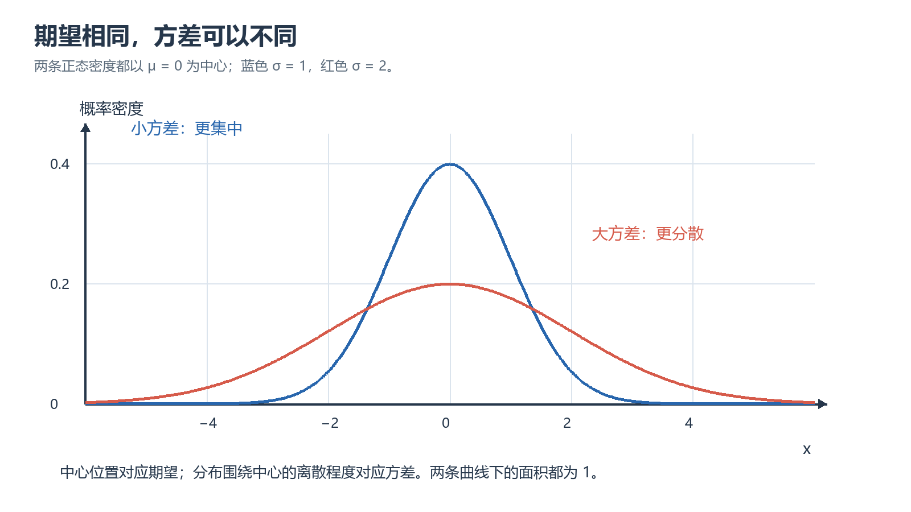

# 第五章｜随机变量的数字特征与极限定理

## 本章要学什么

本章贯穿的问题是：如何从随机试验的结构和分布信息出发，选择正确的概率工具，完成计算、推导并检查结论边界。阅读顺序遵循“先建模、再描述、后计算，最后用变式和反例检验”。本章正文以项目中的《概率论第五章.pdf》和现有讲义为边界；未能从 PDF 题号确认的练习会明确标为“按讲义整理、题号待核对”。

- 能说清本章核心对象、符号和适用条件。
- 能在条件变化时重新选择分布、公式或积分区域。
- 能完成至少一个需要推导、比较、综合或边界审查的题目。
- 能用取值范围、总概率、极端参数或独立路径检查结果。

## 本章学习地图

| 学习阶段 | 要回答的核心问题 | 学完后的可见成果 |
| --- | --- | --- |
| 数字特征 | 如何用期望、方差和矩压缩分布信息？ | 能计算平均水平、波动和线性关系。 |
| 概率界 | 没有完整分布时如何给出偏离上界？ | 能使用切比雪夫并区分上界和精确值。 |
| 大样本 | 重复观测和随机和的极限行为如何描述？ | 能选择大数定律或中心极限定理。 |
| 综合复盘 | 结论依赖哪些独立性、矩和样本量条件？ | 能识别条件并选择近似方法。 |

**前置知识：** 集合运算、基本代数、函数与积分；涉及多维分布时还需能读二维区域。

**建议节奏：** 每学完一个主章节，先完成章内小练习，再在隔日复习中闭卷复述条件、方法和边界。

## 2. 数学期望

### 本章路线
先判定分布类型和可积性，再按定义求期望，优先使用线性性和函数期望公式避免不必要地求分布。

> 本章要解决的问题：期望是对什么加权平均，何时可以直接计算 E[g(X)] 而不先求 g(X) 的分布？
>
> 本章学完应会：
> - 能判断期望存在性并计算离散、连续及函数期望。
> - 能用线性性处理和与常数倍，区分 E[g(X)] 与 g(E[X])。

### 学习单元

### 2.1 离散型随机变量的数学期望

设离散型随机变量 $X$ 的分布列为

$$
P(X=x_i)=p_i,
\qquad i=1,2,\ldots
$$

若级数绝对收敛，即

$$
\sum_{i=1}^{\infty}|x_i|p_i<+\infty,
$$

则称

$$
E(X)=\sum_{i=1}^{\infty}x_i p_i
$$

为 $X$ 的数学期望或均值。若上面的绝对收敛条件不满足，则称数学期望不存在。

**直观理解：** 数学期望是按照各个取值出现概率加权后的平均值。若把 $x_i$ 看成位置，把 $p_i$ 看成质量，则 $E(X)$ 就是质点系的重心坐标。

### 2.2 连续型随机变量的数学期望

若连续型随机变量 $X$ 的概率密度为 $f(x)$，且

$$
\int_{-\infty}^{+\infty}|x|f(x)\,dx<+\infty,
$$

则

$$
E(X)=\int_{-\infty}^{+\infty}x f(x)\,dx.
$$

同样，$E(X)$ 可以理解为密度为 $f(x)$ 的连续质点系的重心。

### 2.3 常见分布的数学期望

- **0-1 分布**：若 $P(X=1)=p$，$P(X=0)=1-p$，则

  $$
  E(X)=p.
  $$

  特别地，事件 $A$ 的示性函数 $I_A$ 满足

  $$
  E(I_A)=P(A).
  $$

- **二项分布**：若 $X$ 表示 $n$ 次独立伯努利试验中的成功次数，$X$ 服从参数为 $n,p$ 的二项分布，则

  $$
  E(X)=np.
  $$

- **泊松分布**：若 $X$ 服从参数为 $\lambda$ 的泊松分布，则

  $$
  E(X)=\lambda.
  $$

- **几何分布**：若 $X$ 表示首次成功所需的试验次数，且成功概率为 $p$，则

  $$
  E(X)=\frac{1}{p}.
  $$

- **均匀分布**：若 $X$ 在 $[a,b]$ 上服从均匀分布，则

  $$
  E(X)=\frac{a+b}{2}.
  $$

- **指数分布**：若 $X$ 服从参数为 $\lambda$ 的指数分布，则

  $$
  E(X)=\frac{1}{\lambda}.
  $$

- **正态分布**：若 $X$ 服从均值为 $\mu$、方差为 $\sigma^2$ 的正态分布，则

  $$
  E(X)=\mu.
  $$

- **柯西分布**：柯西分布的尾部衰减不够快，$E(|X|)$ 发散，因此数学期望不存在。不能仅凭密度关于原点对称，就断言数学期望存在且等于 $0$。

### 2.4 随机变量函数的数学期望

求 $Y=g(X)$ 的数学期望时，通常不必先求 $Y$ 的分布，直接利用 $X$ 的分布即可。

#### 一维离散型情形

若 $X$ 取值为 $x_i$，则

$$
E[g(X)]=\sum_i g(x_i)P(X=x_i),
$$

只要级数绝对收敛。

#### 一维连续型情形

若 $X$ 的密度为 $f_X(x)$，则

$$
E[g(X)]=\int_{-\infty}^{+\infty}g(x)f_X(x)\,dx,
$$

只要积分绝对收敛。

**重要技巧：** 如果题目只问 $E(g(X))$，优先使用上式，通常比先求 $Y=g(X)$ 的分布更简单。例如求 $E(\sin X)$ 时，直接计算

$$
E(\sin X)=\int_{-\infty}^{+\infty}\sin x\,f_X(x)\,dx.
$$

#### 二维随机变量函数

若 $(X,Y)$ 是二维离散型随机变量，则

$$
E[g(X,Y)]=\sum_i\sum_j g(x_i,y_j)P(X=x_i,Y=y_j).
$$

若 $(X,Y)$ 的联合密度为 $f_{X,Y}(x,y)$，则

$$
E[g(X,Y)]
=\iint g(x,y)f_{X,Y}(x,y)\,dx\,dy.
$$

因此，二维连续型随机变量的边缘均值可以写成

$$
E(X)=\iint x f_{X,Y}(x,y)\,dx\,dy,
$$

$$
E(Y)=\iint y f_{X,Y}(x,y)\,dx\,dy.
$$

### 2.5 数学期望的性质

在相关数学期望存在时：

1. 常数的数学期望：

   $$
   E(C)=C.
   $$

2. 数乘：

   $$
   E(CX)=C E(X).
   $$

3. 可加性：

   $$
   E(X_1+X_2+\cdots+X_n)
   =\sum_{i=1}^nE(X_i).
   $$

   **注意：** 数学期望的可加性不要求随机变量相互独立。

4. 独立变量乘积：若 $X_1,\ldots,X_n$ 相互独立，则

   $$
   E(X_1X_2\cdots X_n)
   =\prod_{i=1}^nE(X_i).
   $$

   乘积公式需要独立性，不能与期望的可加性混淆。

**常用方法：拆分随机变量。** 若一个复杂变量可以写成

$$
X=X_1+X_2+\cdots+X_n,
$$

则先分别求 $E(X_i)$，再利用期望的可加性，往往比直接求 $X$ 的分布更方便。这是指示变量法的基本思想。

---

##### 小练习：数学期望 的条件判断与迁移

> 题源：概率论第五章.pdf，对应本节例题/习题知识点；题目按项目现有讲义整理，题号待按 PDF 版本核对。

**题目：** X∼B(n,p)，求 E[X]，并用指示变量分解说明为什么不必直接对二项分布求和。

**解析：** 令 X=I_1+⋯+I_n，每个 I_i 为成功指示变量，E[I_i]=p；由线性性 E[X]=∑E[I_i]=np。这里不需要独立性，线性性只需各期望存在。

### 本章小结

本章的主线是“对象与条件 → 方法选择 → 计算/推导 → 结果检查”。最容易混淆的是把公式当成无条件规则；复习时应把适用条件和失败边界一起记忆。

### 本章练习与检验

#### 综合检验：改变一个关键条件

> 题源：概率论第五章.pdf，对应本节例题/习题知识点；题目按项目现有讲义整理，题号待按 PDF 版本核对。

**题目：** 给出非线性 g，说明一般不能把 E[g(X)] 写成 g(E[X])，并指出何时可能恰好相等。

**解析：** 一般不等，如 g(x)=x^2 时 E[X^2]≠(E[X])^2；若 X 为常数或 g 为仿射函数，则可能相等。

## 3. 方差与标准差

### 本章路线
先用方差定义理解离均差平方，再用 E[X^2]−E[X]^2 计算，最后结合线性变换和独立性简化。

> 本章要解决的问题：方差衡量什么，为什么平移不改变方差而缩放会平方放大？
>
> 本章学完应会：
> - 能计算方差、标准差和线性变换的方差。
> - 能用非负性和单位检查结果。

### 学习单元

### 3.1 方差的定义

数学期望反映平均水平，但平均值相同的两个随机变量，波动程度可能完全不同。为了衡量随机变量偏离均值的程度，定义

$$
D(X)=E\left[X-E(X)\right]^2.
$$

称

$$
\sigma_X=\sqrt{D(X)}
$$

为 $X$ 的标准差或均方差。

- 方差是偏差平方的平均值；
- 标准差与 $X$ 具有相同量纲，更便于解释；
- $D(X)$ 越小，通常表示 $X$ 越集中在均值附近。

离散型与连续型写法分别为

$$
D(X)=\sum_i\left[x_i-E(X)\right]^2p_i,
$$

$$
D(X)=\int_{-\infty}^{+\infty}\left[x-E(X)\right]^2f_X(x)\,dx.
$$

### 3.2 方差的计算公式

最常用的计算公式是

$$
D(X)=E(X^2)-[E(X)]^2.
$$

因此，求方差通常分两步：

1. 求 $E(X)$；
2. 求 $E(X^2)$，再作差。

### 3.3 常见分布的方差

- **0-1 分布**：

  $$
  D(X)=p(1-p)=pq.
  $$

- **二项分布**：

  $$
  D(X)=npq,
  \qquad q=1-p.
  $$

- **泊松分布**：

  $$
  D(X)=\lambda.
  $$

  因而泊松分布的参数同时是数学期望和方差。

- **几何分布**：

  $$
  D(X)=\frac{1-p}{p^2}=\frac{q}{p^2}.
  $$

- **均匀分布**：

  $$
  D(X)=\frac{(b-a)^2}{12}.
  $$

- **指数分布**：

  $$
  D(X)=\frac{1}{\lambda^2}.
  $$

- **正态分布**：

  $$
  D(X)=\sigma^2.
  $$

### 3.4 方差的性质

在相关方差存在时：

1. 常数的方差：

   $$
   D(C)=0.
   $$

2. 数乘：

   $$
   D(CX)=C^2D(X).
   $$

   注意系数要平方，不能写成 $CD(X)$。

3. 独立变量和的方差：若 $X_1,\ldots,X_n$ 相互独立，则

   $$
   D(X_1+\cdots+X_n)=D(X_1)+\cdots+D(X_n).
   $$

   同理，独立变量的差满足

   $$
   D(X-Y)=D(X)+D(Y).
   $$

4. 独立变量乘积：若 $X,Y$ 相互独立，则

   $$
   D(XY)=D(X)D(Y)+D(X)[E(Y)]^2+D(Y)[E(X)]^2.
   $$

5. 零方差判定：

   $$
   D(X)=0
   \Longleftrightarrow
   P(X=a)=1
   $$

   对某个常数 $a=E(X)$ 成立。也就是说，方差为零当且仅当随机变量几乎处处为同一个常数。

**方差与独立性的关系：** 独立性保证协方差为零，所以独立变量的和的方差可以直接相加；但仅仅知道协方差为零，还不能一般性地推出独立。

---

<!-- study-note-illustration:2026-10-04:expectation-versus-variance -->

**读图提示：**两条曲线的中心都在 0，但蓝色更集中、红色更分散，说明平均位置相同不意味着波动程度相同。示意取标准差 1 与 2，不是样本拟合或实验结果。

来源：依据本篇笔记相邻段落自绘的教学示意；不是教材原图或实测记录。

<!-- /study-note-illustration -->

##### 小练习：方差与标准差 的条件判断与迁移

> 题源：概率论第五章.pdf，对应本节例题/习题知识点；题目按项目现有讲义整理，题号待按 PDF 版本核对。

**题目：** 若 D(X)=4，求 D(3X−5) 和标准差，并说明常数项为什么不影响方差。

**解析：** D(3X−5)=9D(X)=36，标准差为 6。减去 5 只改变位置，不改变每个观测值与均值的离差；乘以 3 使离差放大三倍，平方后放大九倍。

### 本章小结

本章的主线是“对象与条件 → 方法选择 → 计算/推导 → 结果检查”。最容易混淆的是把公式当成无条件规则；复习时应把适用条件和失败边界一起记忆。

### 本章练习与检验

#### 综合检验：改变一个关键条件

> 题源：概率论第五章.pdf，对应本节例题/习题知识点；题目按项目现有讲义整理，题号待按 PDF 版本核对。

**题目：** 若错误写成 D(3X−5)=3D(X)−5，指出违反了方差的哪一性质。

**解析：** 方差不是线性算子，常数平移不产生 −5，系数必须平方；正确公式为 D(aX+b)=a^2D(X)。

## 4. 常见分布的数字特征速查

### 本章路线
先从分布条件确认模型，再核对均值与方差，必要时用定义或指示变量推导而不是死记表格。

> 本章要解决的问题：同一个参数在不同分布中的含义不同，如何用支持集和试验结构避免套错表？
>
> 本章学完应会：
> - 能对照分布条件使用均值、方差。
> - 能用极端参数和方差非负检查速查结果。

### 学习单元

### 4.1 离散型分布

- 0-1 分布：

  $$
  E(X)=p,\qquad D(X)=pq.
  $$

- 二项分布 $B(n,p)$：

  $$
  E(X)=np,\qquad D(X)=npq.
  $$

- 泊松分布 $P(\lambda)$：

  $$
  E(X)=\lambda,\qquad D(X)=\lambda.
  $$

- 几何分布 $G(p)$：

  $$
  E(X)=\frac1p,\qquad D(X)=\frac{q}{p^2}.
  $$

### 4.2 连续型分布

- 均匀分布 $U[a,b]$：

  $$
  E(X)=\frac{a+b}{2},
  \qquad
  D(X)=\frac{(b-a)^2}{12}.
  $$

- 指数分布：

  $$
  E(X)=\frac1\lambda,
  \qquad
  D(X)=\frac1{\lambda^2}.
  $$

- 正态分布 $N(\mu,\sigma^2)$：

  $$
  E(X)=\mu,
  \qquad D(X)=\sigma^2.
  $$

---

##### 小练习：常见分布的数字特征速查 的条件判断与迁移

> 题源：概率论第五章.pdf，对应本节例题/习题知识点；题目按项目现有讲义整理，题号待按 PDF 版本核对。

**题目：** 比较 B(n,p) 与 Poisson(λ) 的均值和方差，并解释为什么二项方差含有 (1−p) 而泊松没有。

**解析：** B(n,p): E=np,D=np(1−p)；Poisson(λ): E=λ,D=λ。二项每次成功指示变量的方差为 p(1−p)，固定试验次数带来有限总体的失败概率；泊松是稀有到达计数模型，均值和方差同为 λ。

### 本章小结

本章的主线是“对象与条件 → 方法选择 → 计算/推导 → 结果检查”。最容易混淆的是把公式当成无条件规则；复习时应把适用条件和失败边界一起记忆。

### 本章练习与检验

#### 综合检验：改变一个关键条件

> 题源：概率论第五章.pdf，对应本节例题/习题知识点；题目按项目现有讲义整理，题号待按 PDF 版本核对。

**题目：** 若把 λ=np 的泊松近似用于二项，比较两者方差并说明 p 很小时为什么接近。

**解析：** 二项方差=np(1−p)=λ(1−p)，泊松方差=λ；p→0 时二项方差趋近 λ，因此近似在均值和方差层面一致。

## 5. 协方差、相关系数与矩

### 本章路线
先由中心化乘积定义协方差，再标准化得到相关系数，最后区分线性关系、不相关与独立。

> 本章要解决的问题：相关系数为何无量纲，为什么不相关不等于独立？
>
> 本章学完应会：
> - 能计算协方差与相关系数并检查绝对值不超过 1。
> - 能解释矩与方差、尾部信息的联系。

### 学习单元

### 5.1 协方差

对具有二阶矩的随机变量 $X,Y$，定义协方差为

$$
\operatorname{Cov}(X,Y)
=E\left\{[X-E(X)][Y-E(Y)]\right\}.
$$

常用计算公式为

$$
\operatorname{Cov}(X,Y)=E(XY)-E(X)E(Y).
$$

协方差的意义：

- 协方差为正，表示两变量偏离各自均值的方向总体上倾向于相同；
- 协方差为负，表示总体上倾向于相反；
- 协方差为零，只能说明不存在**线性联系**，不代表不存在其他关系。

方差和协方差的关系：

$$
D(X+Y)=D(X)+D(Y)+2\operatorname{Cov}(X,Y),
$$

$$
D(X-Y)=D(X)+D(Y)-2\operatorname{Cov}(X,Y).
$$

协方差的基本性质：

$$
\operatorname{Cov}(X,Y)=\operatorname{Cov}(Y,X),
$$

$$
\operatorname{Cov}(aX,bY)=ab\operatorname{Cov}(X,Y),
$$

$$
\operatorname{Cov}(X_1+X_2,Y)
=\operatorname{Cov}(X_1,Y)+\operatorname{Cov}(X_2,Y).
$$

### 5.2 相关系数

当 $D(X)>0$ 且 $D(Y)>0$ 时，定义相关系数

$$
\rho_{XY}
=\frac{\operatorname{Cov}(X,Y)}{\sqrt{D(X)}\sqrt{D(Y)}}.
$$

相关系数的优点是无量纲，且满足

$$
-1\le \rho_{XY}\le 1.
$$

其绝对值越接近 $1$，线性关系越强；正负号表示线性关系的方向。

当且仅当存在常数 $a,b$，使

$$
P(Y=a+bX)=1,
$$

才有

$$
|\rho_{XY}|=1.
$$

因此，$|\rho_{XY}|=1$ 表示 $X,Y$ 几乎处处满足确定的线性关系。

### 5.3 不相关与独立

当相关系数存在时，下列条件等价：

1. $X,Y$ 不相关；
2. $\operatorname{Cov}(X,Y)=0$；
3. 

   $$
   D(X+Y)=D(X)+D(Y);
   $$

4. 

   $$
   E(XY)=E(X)E(Y).
   $$

**必须区分：**

- 相互独立 $\Rightarrow$ 不相关（在相关系数存在时）；
- 不相关 $\nRightarrow$ 相互独立。

典型反例：令 $X\sim N(0,1)$，$Y=X^2$。由于正态密度关于原点对称，$E(X^3)=0$，所以

$$
\operatorname{Cov}(X,Y)=E(X^3)-E(X)E(X^2)=0,
$$

但 $Y$ 完全由 $X$ 决定，因此二者并不独立。

**特殊情形：** 若 $(X,Y)$ 服从二维正态分布，则

$$
X,Y\text{ 不相关}
\Longleftrightarrow
X,Y\text{ 相互独立}.
$$

这里的等价性是二维正态分布的特殊性质，不能推广到一般随机变量。

### 5.4 矩

若 $E(X^k)$ 存在，则称

$$
\alpha_k=E(X^k)
$$

为 $X$ 的 $k$ 阶原点矩。

若 $E\left([X-E(X)]^k\right)$ 存在，则称

$$
\beta_k=E\left([X-E(X)]^k\right)
$$

为 $X$ 的 $k$ 阶中心矩。

二维情形还可定义混合原点矩和混合中心矩：

$$
\alpha_{kl}=E(X^kY^l),
$$

$$
\beta_{kl}=E\left([X-E(X)]^k[Y-E(Y)]^l\right).
$$

重要对应关系：

- 数学期望是一阶原点矩；
- 方差是二阶中心矩；
- 一阶中心矩恒为 $0$；
- 协方差是二阶混合中心矩。

---

##### 小练习：协方差、相关系数与矩 的条件判断与迁移

> 题源：概率论第五章.pdf，对应本节例题/习题知识点；题目按项目现有讲义整理，题号待按 PDF 版本核对。

**题目：** 若 Var(X)=4、Var(Y)=9、Cov(X,Y)=3，求 ρ_{XY}，并解释当 Y=2X+b 时相关系数符号如何判断。

**解析：** ρ=3/(2×3)=0.5。若 Y=2X+b 且 Var(X)>0，则 Cov(X,Y)=2Var(X)>0，ρ=1；若系数为负则 ρ=−1。相关系数反映线性方向和强度，不受单位缩放影响。

### 本章小结

本章的主线是“对象与条件 → 方法选择 → 计算/推导 → 结果检查”。最容易混淆的是把公式当成无条件规则；复习时应把适用条件和失败边界一起记忆。

### 本章练习与检验

#### 综合检验：改变一个关键条件

> 题源：概率论第五章.pdf，对应本节例题/习题知识点；题目按项目现有讲义整理，题号待按 PDF 版本核对。

**题目：** 说明 Cov(X,Y)=0 能推出什么、不能推出什么，并给出独立性存在时的方向。

**解析：** 只能说明没有线性协同变化；不能推出独立。若 X、Y 独立且二阶矩存在，则 E[XY]=E[X]E[Y]，所以协方差为 0。

## 6. 切比雪夫不等式

### 本章路线
先确定均值和方差，再把题目改写成偏离均值的事件，最后用不等式给出上界而不是伪装成精确概率。

> 本章要解决的问题：切比雪夫给出的是什么类型的结论，什么时候它会比较松？
>
> 本章学完应会：
> - 能把事件写成 |X−μ|≥ε。
> - 能说明上界与精确概率的区别并检查上界不超过 1。

### 学习单元

### 6.1 定理

若 $D(X)$ 存在，则对任意 $\varepsilon>0$，有

$$
P\left(|X-E(X)|\ge \varepsilon\right)
\le \frac{D(X)}{\varepsilon^2}.
$$

等价地，

$$
P\left(|X-E(X)|<\varepsilon\right)
\ge 1-\frac{D(X)}{\varepsilon^2}.
$$

它只利用 $X$ 的数学期望和方差，而不要求知道 $X$ 的具体分布，因此是一种分布未知时的概率估计工具。

### 6.2 常用形式

令 $\varepsilon=k\sqrt{D(X)}$，则

$$
P\left(|X-E(X)|<k\sqrt{D(X)}\right)
\ge 1-\frac1{k^2}.
$$

例如 $k=3$ 时，

$$
P\left(|X-E(X)|<3\sqrt{D(X)}\right)
\ge 1-\frac19=0.8889.
$$

这个估计对一般分布成立，但通常比正态分布的精确结果粗糙。例如正态变量落在均值左右 $3\sigma$ 内的概率约为 $0.9973$。

### 6.3 使用步骤

遇到“分布未知，只给出均值、方差，估计偏离概率”的题目：

1. 先把事件写成 $|X-E(X)|\ge\varepsilon$ 或 $|X-E(X)|<\varepsilon$；
2. 求或化简 $D(X)$；
3. 代入切比雪夫不等式；
4. 最后检查右端是否落在 $[0,1]$ 内。

---

##### 小练习：切比雪夫不等式 的条件判断与迁移

> 题源：概率论第五章.pdf，对应本节例题/习题知识点；题目按项目现有讲义整理，题号待按 PDF 版本核对。

**题目：** 若 E(X)=10、D(X)=4，求 P(|X−10|≥5) 的上界，并说明若计算出上界大于 1 应如何处理。

**解析：** 由切比雪夫不等式 P(|X−10|≥5)≤4/25=0.16。一般形式为 min(1,σ^2/ε^2)；若比值超过 1，只能取平凡上界 1，不能写成概率超过 1。

### 本章小结

本章的主线是“对象与条件 → 方法选择 → 计算/推导 → 结果检查”。最容易混淆的是把公式当成无条件规则；复习时应把适用条件和失败边界一起记忆。

### 本章练习与检验

#### 综合检验：改变一个关键条件

> 题源：概率论第五章.pdf，对应本节例题/习题知识点；题目按项目现有讲义整理，题号待按 PDF 版本核对。

**题目：** 若要求 P(|X−10|<5) 的下界，说明如何由补事件得到。

**解析：** P(|X−10|<5)=1−P(|X−10|≥5)≥1−0.16=0.84；这是下界，不一定等于真实概率。

## 7. 大数定律

### 本章路线
先确认独立同分布、均值存在和样本平均的对象，再区分依概率收敛与单次近似，最后解释样本量作用。

> 本章要解决的问题：大数定律说明“稳定”具体稳定到什么，为什么不是保证每次都接近均值？
>
> 本章学完应会：
> - 能写出样本平均依概率收敛的含义。
> - 能区分收敛结论与有限样本误差保证。

### 学习单元

### 7.1 伯努利大数定律

在 $n$ 重伯努利试验中，每次成功概率为 $p$，成功次数为 $Y_n$，则对任意 $\varepsilon>0$，有

$$
\lim_{n\to\infty}
P\left(\left|\frac{Y_n}{n}-p\right|\ge\varepsilon\right)=0.
$$

等价地，

$$
\frac{Y_n}{n}\xrightarrow{P}p.
$$

其中 $Y_n/n$ 是成功频率。含义是：试验次数足够大时，成功频率以很高的概率接近成功概率。

**应用结论：** 当试验次数很大时，可以用频率近似概率。

### 7.2 独立同分布与依概率收敛

若随机变量序列 $X_1,X_2,\ldots$ 对任意有限个变量都相互独立，则称它们相互独立；若它们还具有相同的分布函数，则称为独立同分布序列。

若对任意 $\varepsilon>0$，有

$$
\lim_{n\to\infty}P(|Z_n-a|<\varepsilon)=1,
$$

则称 $Z_n$ 依概率收敛于 $a$，记为

$$
Z_n\xrightarrow{P}a.
$$

### 7.3 切比雪夫大数定律

设 $X_1,X_2,\ldots$ 相互独立，并存在常数 $C$ 使

$$
D(X_i)\le C,
\qquad i=1,2,\ldots
$$

则对任意 $\varepsilon>0$，有

$$
\frac{1}{n}\sum_{i=1}^n
\left(X_i-E(X_i)\right)
\xrightarrow{P}0.
$$

等价地，

$$
\frac1n\sum_{i=1}^n X_i
-\frac1n\sum_{i=1}^nE(X_i)
\xrightarrow{P}0.
$$

特别地，若 $X_i$ 独立同分布，且 $E(X_i)=\mu$、$D(X_i)=\sigma^2<+\infty$，则

$$
\frac1n\sum_{i=1}^nX_i\xrightarrow{P}\mu.
$$

### 7.4 辛钦大数定律

若 $X_1,X_2,\ldots$ 独立同分布，且只要求数学期望有限

$$
E(X_i)=\mu,
$$

则仍有

$$
\frac1n\sum_{i=1}^nX_i\xrightarrow{P}\mu.
$$

与切比雪夫大数定律相比，辛钦大数定律不要求方差存在，因此条件更弱。

**直观解释：** 多次独立重复测量的算术平均值，可以作为总体均值的近似值。

---

##### 小练习：大数定律 的条件判断与迁移

> 题源：概率论第五章.pdf，对应本节例题/习题知识点；题目按项目现有讲义整理，题号待按 PDF 版本核对。

**题目：** X_i 独立同分布，E(X_i)=μ，令 \bar X_n 为样本平均。用文字和公式说明大数定律结论，并指出它不等于 P(\bar X_n=μ)=1。

**解析：** 在适当条件下 \bar X_n\xrightarrow{P}μ，意为对任意 ε>0，P(|\bar X_n−μ|>ε)→0；有限 n 时仍可能偏离，且并不保证每次样本平均恰好等于 μ。

### 本章小结

本章的主线是“对象与条件 → 方法选择 → 计算/推导 → 结果检查”。最容易混淆的是把公式当成无条件规则；复习时应把适用条件和失败边界一起记忆。

### 本章练习与检验

#### 综合检验：改变一个关键条件

> 题源：概率论第五章.pdf，对应本节例题/习题知识点；题目按项目现有讲义整理，题号待按 PDF 版本核对。

**题目：** 若观测值相关且具有长期趋势，说明直接套独立同分布大数定律的风险。

**解析：** 独立同分布条件失效，样本平均的方差和极限行为可能不同；需先分析依赖结构、平稳性或使用相应的相关序列定理。

## 8. 中心极限定理

### 本章路线
先确认独立同分布、均值方差存在，再标准化和/或使用连续性修正，最后区分近似概率与精确概率。

> 本章要解决的问题：中心极限定理为什么能把许多独立随机量的和近似为正态，连续性修正应放在哪里？
>
> 本章学完应会：
> - 能标准化和、均值并选择正态近似。
> - 能对二项分布使用连续性修正并检查近似条件。

### 学习单元

### 8.1 独立同分布的中心极限定理

设 $X_1,X_2,\ldots$ 独立同分布，且

$$
E(X_i)=\mu,
\qquad D(X_i)=\sigma^2>0.
$$

则对任意实数 $x$，有

$$
\lim_{n\to\infty}
P\left(
\frac{\sum_{i=1}^nX_i-n\mu}{\sigma\sqrt n}
\le x
\right)
=\Phi(x),
$$

其中 $\Phi(x)$ 是标准正态分布的分布函数。

因此，当 $n$ 足够大时：

$$
\sum_{i=1}^nX_i
\approx N(n\mu,n\sigma^2),
$$

以及

$$
\frac{\sum_{i=1}^nX_i-n\mu}{\sigma\sqrt n}
\approx N(0,1).
$$

**核心思想：** 大量相互独立、单个影响较小的随机因素相加后，和通常可以用正态分布近似。

### 8.2 棣莫弗-拉普拉斯定理

若 $Y_n\sim B(n,p)$，令 $q=1-p$，则

$$
\frac{Y_n-np}{\sqrt{npq}}
\xrightarrow{d}N(0,1).
$$

当 $n$ 足够大时，二项分布可以用正态分布近似：

$$
P(a<Y_n\le b)
\approx
\Phi\left(\frac{b-np}{\sqrt{npq}}\right)
-
\Phi\left(\frac{a-np}{\sqrt{npq}}\right).
$$

### 8.3 连续性修正

二项分布是离散型，正态分布是连续型。用正态分布近似二项概率时，最好将整数区间向左右各扩展 $0.5$。

例如，

$$
P(Y_n=m)
=P(m-0.5<Y_n\le m+0.5)
$$

近似为

$$
\Phi\left(\frac{m+0.5-np}{\sqrt{npq}}\right)
-
\Phi\left(\frac{m-0.5-np}{\sqrt{npq}}\right).
$$

累积概率例如可写为

$$
P(Y_n\le m)
\approx
\Phi\left(\frac{m+0.5-np}{\sqrt{npq}}\right).
$$

### 8.4 正态近似与泊松近似的选择

教材给出的经验判断是：

- 当 $0.1<p<0.9$ 且 $npq>9$ 时，通常采用正态近似；
- 当 $p\le0.1$ 或 $p\ge0.9$，且 $n\ge10$ 时，通常考虑泊松近似；
- 选择近似方法时，还要结合 $np$、$nq$ 是否适中以及题目精度要求。

---

##### 小练习：中心极限定理 的条件判断与迁移

> 题源：概率论第五章.pdf，对应本节例题/习题知识点；题目按项目现有讲义整理，题号待按 PDF 版本核对。

**题目：** Y∼B(100,0.4)，用正态近似求 P(35≤Y≤45)，写出连续性修正后的标准化区间。

**解析：** 均值 40，方差 24，标准差约 4.899。连续性修正为 P(34.5<Y<45.5)，标准化区间约为 (−1.122,1.122)，概率近似为 Φ(1.122)−Φ(−1.122)。

### 本章小结

本章的主线是“对象与条件 → 方法选择 → 计算/推导 → 结果检查”。最容易混淆的是把公式当成无条件规则；复习时应把适用条件和失败边界一起记忆。

### 本章练习与检验

#### 综合检验：改变一个关键条件

> 题源：概率论第五章.pdf，对应本节例题/习题知识点；题目按项目现有讲义整理，题号待按 PDF 版本核对。

**题目：** 若 n=10、p=0.01，说明正态近似与泊松近似应如何比较选择。

**解析：** np=0.1 且 nq=9.9，成功次数极稀少，正态对称近似很差；应优先考虑泊松近似或直接使用二项分布。

## 9. 拓展例题中的方法

### 本章路线
把特殊题拆成已知分布、可加结构或对称性，先找能复用的随机变量表示，再决定使用期望、递推或极限工具。

> 本章要解决的问题：拓展题的难点不是公式数量，而是能否把新情境转译为已知模型。
>
> 本章学完应会：
> - 能用指示变量、分解和对称性重写非标准问题。
> - 能说明假设、递推关系和结果检查。

### 学习单元

本章后半部分给出了一些拓展例子，重点不在记住特殊分布，而在掌握“拆分变量、利用期望和方差性质”的方法。

### 9.1 帕斯卡分布的拆分

若 $X$ 表示第 $r$ 次成功所需的总试验次数，可以把它拆成 $r$ 个“相邻两次成功之间所需试验次数”之和。每一段都服从几何分布，并且相互独立，因此

$$
E(X)=\frac{r}{p},
$$

$$
D(X)=\frac{rq}{p^2}.
$$

这种方法比直接从帕斯卡分布的分布列计算更简洁。

### 9.2 错排问题

将 $n$ 封信随机装入标有不同地址的 $n$ 个信封，令 $X$ 表示装对的信件数。设 $I_i$ 表示第 $i$ 封信是否装入正确的信封，则

$$
X=I_1+I_2+\cdots+I_n.
$$

每个 $I_i$ 都是示性函数，且

$$
E(I_i)=\frac1n.
$$

所以

$$
E(X)=n\cdot\frac1n=1.
$$

注意各个 $I_i$ 一般不独立，因此求方差时不能直接把 $D(I_i)$ 相加，而应使用协方差或直接计算 $E(X^2)$。教材结论为

$$
D(X)=1.
$$

---

##### 小练习：拓展例题中的方法 的条件判断与迁移

> 题源：概率论第五章.pdf，对应本节例题/习题知识点；题目按项目现有讲义整理，题号待按 PDF 版本核对。

**题目：** 随机排列 n 个对象，令 X 为不动点个数。用指示变量写出 E(X)，并说明为何不必先求 X 的完整分布。

**解析：** 令 I_i 表示第 i 个对象固定，X=∑I_i；由于 P(I_i=1)=1/n，故 E(X)=∑1/n=1。这里利用线性性，不需要求错排数对应的完整分布。

### 本章小结

本章的主线是“对象与条件 → 方法选择 → 计算/推导 → 结果检查”。最容易混淆的是把公式当成无条件规则；复习时应把适用条件和失败边界一起记忆。

### 本章练习与检验

#### 综合检验：改变一个关键条件

> 题源：概率论第五章.pdf，对应本节例题/习题知识点；题目按项目现有讲义整理，题号待按 PDF 版本核对。

**题目：** 若要求 Var(X)，说明为什么这次需要考虑指示变量之间的协方差。

**解析：** Var(∑I_i)=∑Var(I_i)+2∑Cov(I_i,I_j)，需计算两个位置同时固定的联合概率，不能只把各方差相加，除非确认独立。

## 六、练习提示与常见问题

### 跨章节的检查顺序

- 先写对象、样本空间/支持集、已知条件和求解目标，再选择公式、求和或积分。
- 看到“独立、等可能、放回、不放回、连续、密度、近似”等词时，先把它们当作模型条件核对。
- 结果出来后至少做一次范围检查、归一化检查或极端情形检查；不能只看数值。
- 若题号、符号或题图与 PDF 版本不一致，回到原始 PDF 核对，不用记忆补齐。

### 解题模板（跨章节回收）

### 10.1 求数学期望

1. 先判断是离散型、连续型还是二维随机变量；
2. 若求 $E[g(X)]$，优先直接使用随机变量函数的期望公式；
3. 能拆成指示变量之和时，优先使用期望的可加性；
4. 检查数学期望是否存在，尤其注意重尾分布。

### 10.2 求方差

优先使用

$$
D(X)=E(X^2)-[E(X)]^2.
$$

若 $X$ 能拆成相互独立变量之和，则使用

$$
D(X_1+\cdots+X_n)=\sum_iD(X_i).
$$

线性变换常用

$$
E(aX+b)=aE(X)+b,
$$

$$
D(aX+b)=a^2D(X).
$$

### 10.3 求协方差与相关系数

1. 先求 $E(X)$、$E(Y)$、$E(XY)$；
2. 计算

   $$
   \operatorname{Cov}(X,Y)=E(XY)-E(X)E(Y);
   $$

3. 再计算

   $$
   \rho_{XY}=\frac{\operatorname{Cov}(X,Y)}{\sqrt{D(X)D(Y)}}.
   $$

最后检查 $|\rho_{XY}|\le1$。

### 10.4 使用切比雪夫不等式

只要已知均值和方差，不知道具体分布，就可以使用

$$
P(|X-E(X)|\ge\varepsilon)\le\frac{D(X)}{\varepsilon^2}.
$$

### 10.5 使用大数定律

题目出现“独立同分布”“大量重复试验”“平均值趋于总体均值”“频率趋于概率”等关键词时，考虑大数定律。

### 10.6 使用中心极限定理

题目出现“大量独立变量之和”“二项分布中 $n$ 很大”“要求近似概率”时，考虑中心极限定理或棣莫弗-拉普拉斯定理。对二项分布近似时，优先进行连续性修正。

---

### 易错点与考前自检（跨章节回收）

### 11.1 常见易错点

1. 只写 $E(X)=\sum x_ip_i$，却不检查绝对收敛条件；
2. 把 $E[g(X)]$ 误认为 $g(E(X))$。一般情况下

   $$
   E[g(X)]\ne g(E(X)).
   $$

3. 误以为数学期望的存在只要正负项“相互抵消”即可。重尾分布可能导致数学期望不存在；
4. 把方差写成 $E(X^2)$，遗漏 $-[E(X)]^2$；
5. 把 $D(aX+b)$ 写成 $aD(X)$，正确的是

   $$
   D(aX+b)=a^2D(X);
   $$

6. 只有在变量独立时，才可以直接把方差相加；
7. 数学期望可加不需要独立，但乘积期望一般需要独立；
8. 把不相关误认为独立。一般只有“独立推出不相关”，反方向不成立；
9. 把相关系数的绝对值超过 $1$ 的计算结果当成答案，应回头检查 $E(XY)$、方差或协方差；
10. 把切比雪夫不等式当成精确概率。它通常只是下界或上界；
11. 把依概率收敛误认为每次试验结果都必然收敛；
12. 用正态近似二项分布时忘记标准化或连续性修正；
13. 二项分布参数 $p$ 接近 $0$ 或 $1$ 时，直接使用正态近似可能效果较差，应考虑泊松近似。

### 11.2 考前自检

- 能否写出离散型和连续型随机变量数学期望的定义？
- 能否直接计算 $E[g(X)]$ 而不先求 $g(X)$ 的分布？
- 能否熟练写出七种常见分布的数学期望与方差？
- 能否用 $D(X)=E(X^2)-[E(X)]^2$ 简化方差计算？
- 能否区分期望的可加性与乘积期望公式的条件？
- 能否用协方差展开 $D(X+Y)$ 和 $D(X-Y)$？
- 能否解释“不相关”和“独立”的区别，并给出反例思路？
- 能否正确使用切比雪夫不等式进行概率估计？
- 能否区分伯努利大数定律、切比雪夫大数定律和辛钦大数定律？
- 能否完成二项分布的正态近似并进行连续性修正？

---

### 一页速记（跨章节回收）

### 数学期望

$$
E(X)=\sum_i x_ip_i,
\qquad
E(X)=\int_{-\infty}^{+\infty}xf_X(x)\,dx.
$$

$$
E[g(X)]=\sum_i g(x_i)p_i
\quad\text{或}\quad
E[g(X)]=\int g(x)f_X(x)\,dx.
$$

$$
E(X+Y)=E(X)+E(Y).
$$

若 $X,Y$ 独立：

$$
E(XY)=E(X)E(Y).
$$

### 方差

$$
D(X)=E\left[X-E(X)\right]^2
=E(X^2)-[E(X)]^2.
$$

$$
D(aX+b)=a^2D(X).
$$

若 $X,Y$ 独立：

$$
D(X+Y)=D(X)+D(Y).
$$

### 协方差与相关系数

$$
\operatorname{Cov}(X,Y)=E(XY)-E(X)E(Y).
$$

$$
\rho_{XY}=\frac{\operatorname{Cov}(X,Y)}{\sqrt{D(X)D(Y)}},
\qquad |\rho_{XY}|\le1.
$$

$$
D(X+Y)=D(X)+D(Y)+2\operatorname{Cov}(X,Y).
$$

### 切比雪夫不等式

$$
P(|X-E(X)|\ge\varepsilon)
\le\frac{D(X)}{\varepsilon^2}.
$$

### 大数定律

$$
\frac1n\sum_{i=1}^nX_i\xrightarrow{P}\mu
$$

表示大量独立同分布观测值的平均数依概率趋于总体均值。

### 中心极限定理

$$
\frac{\sum_{i=1}^nX_i-n\mu}{\sigma\sqrt n}
\xrightarrow{d}N(0,1).
$$

二项分布近似：

$$
Y_n\sim B(n,p),
\qquad
\frac{Y_n-np}{\sqrt{npq}}
\approx N(0,1).
$$

使用正态近似时，离散端点通常加减 $0.5$ 做连续性修正。

## 七、隔日复习与自测

### 换一组条件再判断（20分钟）

任选本章一个章内检验，改变一个模型条件，闭卷重写“对象—条件—方法—结果—边界”；把失效的原结论单独列出。

### 闭卷解释关键问题（20分钟）

1. 本章的核心对象、输入和输出分别是什么？
2. 哪个条件一旦去掉，最容易导致公式误用？请给出一个反例或替代方法。
3. 你会用什么独立路径检查一个概率、密度、期望或近似结果？

### 阶段复盘（15分钟）

闭卷画出本章学习地图，按顺序说出每个主章节的路线和边界；再从本地 PDF 中挑一道原题，先只看题源不看解析，写出完整解题链。

## 八、学习安排与阅读资料

### 阅读资料

- 概率论第五章.pdf：优先核对定义、符号、例题和习题原文。
- 本项目中本章总结笔记的公式、边界说明和章内练习。

### 细节查阅

先查原始 PDF 的题干、图形和条件，再回到笔记对应章节；题号尚未核对的练习不作为教材原题引用。

## 九、自测参考答案

### 自测一：模型条件复述

答案要点：写出对象、支持集/样本空间、条件和目标；指出所用定义或公式的成立条件；若条件改变，说明改用的路径。

### 自测二：边界与错误审查

答案要点：检查概率是否在 [0,1]、密度是否非负且总积分为 1、方差是否非负、近似条件是否满足；发现越界时回到模型假设，而不是只改最后一个数字。

### 逐章核验说明

本文件的每个主章节均按“路线（含贯穿问题与学完应会）→ 学习单元 → 小练习 → 小结 → 章节检验”闭合；本节只保留跨章节复习和答案要点。

