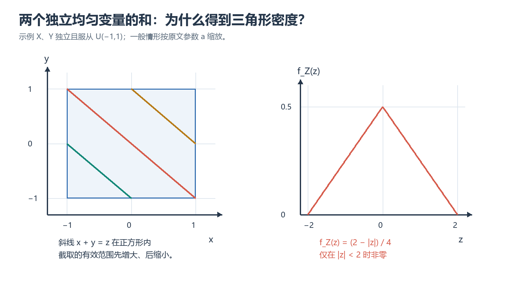

# 第四章｜多维随机变量及其分布

## 本章要学什么

本章贯穿的问题是：如何从随机试验的结构和分布信息出发，选择正确的概率工具，完成计算、推导并检查结论边界。阅读顺序遵循“先建模、再描述、后计算，最后用变式和反例检验”。本章正文以项目中的《概率论第四章.pdf》和现有讲义为边界；未能从 PDF 题号确认的练习会明确标为“按讲义整理、题号待核对”。

- 能说清本章核心对象、符号和适用条件。
- 能在条件变化时重新选择分布、公式或积分区域。
- 能完成至少一个需要推导、比较、综合或边界审查的题目。
- 能用取值范围、总概率、极端参数或独立路径检查结果。

## 本章学习地图

| 学习阶段 | 要回答的核心问题 | 学完后的可见成果 |
| --- | --- | --- |
| 联合描述 | 多个随机变量如何整体描述？ | 能读取联合、边缘和区域概率。 |
| 依赖关系 | 如何判断独立并构造条件分布？ | 能用分解式、边缘化和条件化。 |
| 函数与区域 | 和、极值、商和变换如何求分布？ | 能画支持区域并设置积分。 |
| 综合复盘 | 哪一步最容易漏区域或分支？ | 能用支持集、雅可比和归一化复查。 |

**前置知识：** 集合运算、基本代数、函数与积分；涉及多维分布时还需能读二维区域。

**建议节奏：** 每学完一个主章节，先完成章内小练习，再在隔日复习中闭卷复述条件、方法和边界。

## 1. 多维随机变量与联合分布函数

### 本章路线
先把随机点看成整体，用联合分布函数描述矩形事件，再通过差分和极限得到区域概率。

> 本章要解决的问题：联合分布包含哪些信息，如何由它得到边缘分布和矩形概率？
>
> 本章学完应会：
> - 能读写 F(x,y)=P(X≤x,Y≤y)。
> - 能用四项差分计算矩形概率并检查单调性。

### 学习单元

### 1.1 多维随机变量

若 $X_1,X_2,\ldots,X_n$ 定义在同一个样本空间 $S$ 上，则由它们组成的向量

$$
(X_1,X_2,\ldots,X_n)
$$

称为 $n$ 维随机变量或 $n$ 维随机向量。本章重点讨论二维随机变量 $(X,Y)$，更高维情形可以类推。

把 $(X,Y)$ 看作平面上的随机点时，$X$ 和 $Y$ 分别是该点的横、纵坐标。研究 $(X,Y)$，就是研究随机点在平面区域中的分布规律。

### 1.2 二维联合分布函数

二维随机变量 $(X,Y)$ 的联合分布函数定义为

$$
F(x,y)=P(X\le x,\,Y\le y).
$$

几何上，$F(x,y)$ 表示随机点 $(X,Y)$ 落在以 $(x,y)$ 为右上顶点的左下无穷矩形中的概率。

对任意 $x_1<x_2$、$y_1<y_2$，矩形区域概率可以由分布函数求出：

$$
\begin{aligned}
&P(x_1<X\le x_2,\,y_1<Y\le y_2)\\
={}&F(x_2,y_2)-F(x_1,y_2)-F(x_2,y_1)+F(x_1,y_1).
\end{aligned}
$$

这条公式是二维分布函数最常用的计算工具，本质上是“右上角减去两个多减区域，再加回左下角”。

### 1.3 联合分布函数的基本性质

二维函数 $F(x,y)$ 是某个二维随机变量的分布函数，必须满足：

1. **有界性**：
   $$
   0\le F(x,y)\le 1.
   $$
2. **分别单调不减**：固定 $y$ 时，$F(x,y)$ 关于 $x$ 单调不减；固定 $x$ 时，$F(x,y)$ 关于 $y$ 单调不减。
3. **无穷远处的极限**：
   $$
   \begin{aligned}
   &\lim_{x\to-\infty}F(x,y)=0,\qquad
   &&\lim_{y\to-\infty}F(x,y)=0,\\
   &\lim_{x,y\to-\infty}F(x,y)=0,
   &&\lim_{x,y\to+\infty}F(x,y)=1.
   \end{aligned}
   $$
4. **右连续性**：关于每个变量分别右连续。
5. **矩形增量非负**：对任意 $x_1<x_2$、$y_1<y_2$，有
   $$
   F(x_2,y_2)-F(x_1,y_2)-F(x_2,y_1)+F(x_1,y_1)\ge0.
   $$

其中第 5 条说明任意矩形区域的概率不能为负。满足这些条件的二元函数可以作为某个二维随机变量的分布函数。

### 1.4 边缘分布函数

联合分布描述了 $X$ 与 $Y$ 的整体规律。只考察其中一个随机变量时，要把另一个变量放宽到整个实数轴：

$$
F_X(x)=P(X\le x)=\lim_{y\to+\infty}F(x,y),
$$

$$
F_Y(y)=P(Y\le y)=\lim_{x\to+\infty}F(x,y).
$$

$F_X(x)$ 和 $F_Y(y)$ 称为联合分布函数 $F(x,y)$ 的边缘分布函数，分别是 $X$ 和 $Y$ 的一维分布函数。

**注意：**联合分布可以确定两个边缘分布，但仅知道两个边缘分布，通常不能唯一确定联合分布；还需要知道 $X$ 和 $Y$ 之间的依赖关系。

##### 小练习：多维随机变量与联合分布函数 的条件判断与迁移

> 题源：概率论第四章.pdf，对应本节例题/习题知识点；题目按项目现有讲义整理，题号待按 PDF 版本核对。

**题目：** 已知联合分布函数 F，写出矩形 (a,b]×(c,d] 的概率，并说明四项符号为何是“加减交错”。

**解析：** 概率为 F(b,d)−F(a,d)−F(b,c)+F(a,c)。先取右上矩形，再减去两个多算的边条，左下角被减了两次所以加回；这是二维容斥。

### 本章小结

本章的主线是“对象与条件 → 方法选择 → 计算/推导 → 结果检查”。最容易混淆的是把公式当成无条件规则；复习时应把适用条件和失败边界一起记忆。

### 本章练习与检验

#### 综合检验：改变一个关键条件

> 题源：概率论第四章.pdf，对应本节例题/习题知识点；题目按项目现有讲义整理，题号待按 PDF 版本核对。

**题目：** 若候选 F 的矩形增量为负，判断它能否作为联合分布函数。

**解析：** 不能；联合分布函数必须对每个矩形给出非负概率，负增量说明候选函数不满足二维单调性。

## 2. 二维离散型随机变量

### 本章路线
先列联合分布列，再按行列求边缘分布；求事件概率时只在支持集上求和并检查总和。

> 本章要解决的问题：联合分布表的行和列分别代表什么，为什么边缘化不能把不可能的格点算进去？
>
> 本章学完应会：
> - 能由联合分布列求边缘分布和区域概率。
> - 能用分解式判断离散型独立性。

### 学习单元

### 2.1 联合分布列

若 $(X,Y)$ 的所有可能取值是有限个或可列无穷多个数对 $(x_i,y_j)$，则称 $(X,Y)$ 为二维离散型随机变量。记

$$
p_{ij}=P(X=x_i,Y=y_j),
$$

则 $p_{ij}$ 构成 $(X,Y)$ 的联合分布列，并满足

$$
p_{ij}\ge0,\qquad \sum_i\sum_jp_{ij}=1.
$$

联合分布函数可以写成

$$
F(x,y)=\sum_{x_i\le x}\sum_{y_j\le y}p_{ij}.
$$

### 2.2 边缘分布列

由联合分布列对另一个变量求和，得到边缘分布列：

$$
P(X=x_i)=p_{i\cdot}=\sum_jp_{ij},
$$

$$
P(Y=y_j)=p_{\cdot j}=\sum_ip_{ij}.
$$

因此，二维离散型随机变量的分布表通常具有如下结构：

- 表中每个内部格子的数是联合概率 $p_{ij}$；
- 每一行的和是 $X$ 的边缘概率；
- 每一列的和是 $Y$ 的边缘概率；
- 全表所有元素之和为 $1$。

### 2.3 离散型随机变量的边缘化方法

求边缘分布时，核心是“把不关心的变量的所有可能取值加起来”。例如，若题目给出分布表并要求 $P(X=x_i)$，就把第 $i$ 行相加；要求 $P(Y=y_j)$，就把第 $j$ 列相加。

如果联合分布列由条件概率给出，则先使用乘法公式：

$$
P(X=x_i,Y=y_j)=P(X=x_i)P(Y=y_j\mid X=x_i),
$$

再根据需要求边缘分布。

##### 小练习：二维离散型随机变量 的条件判断与迁移

> 题源：概率论第四章.pdf，对应本节例题/习题知识点；题目按项目现有讲义整理，题号待按 PDF 版本核对。

**题目：** 某联合分布只在 (0,0),(0,1),(1,0),(1,1) 上取值，概率分别为 0.2,0.3,0.1,0.4。求边缘分布并判断 X、Y 是否独立。

**解析：** P_X(0)=0.5,P_X(1)=0.5；P_Y(0)=0.3,P_Y(1)=0.7。P(X=0,Y=0)=0.2，而边缘乘积为 0.15，故不独立。

### 本章小结

本章的主线是“对象与条件 → 方法选择 → 计算/推导 → 结果检查”。最容易混淆的是把公式当成无条件规则；复习时应把适用条件和失败边界一起记忆。

### 本章练习与检验

#### 综合检验：改变一个关键条件

> 题源：概率论第四章.pdf，对应本节例题/习题知识点；题目按项目现有讲义整理，题号待按 PDF 版本核对。

**题目：** 若某格联合概率为 0，但两个边缘概率均正，判断独立性可能性。

**解析：** 若独立则联合概率应为边缘乘积，正数乘积不为 0，因此不独立；“有一个零格点”本身并不自动表示互斥，需结合边缘概率判断。

## 3. 二维连续型随机变量

### 本章路线
先画联合密度的支持区域，再对一个变量积分得到边缘，对区域积分得到概率，最后检查归一化。

> 本章要解决的问题：积分上下限由区域决定，为什么先画图比直接套公式更重要？
>
> 本章学完应会：
> - 能从支持区域写出边缘密度和区域概率。
> - 能检查密度非负、总积分为 1 和边界连续性。

### 学习单元

### 3.1 联合概率密度

若存在非负函数 $f_{X,Y}(x,y)$，使得对任意实数 $x,y$ 有

$$
F(x,y)=\int_{-\infty}^{x}\int_{-\infty}^{y}f_{X,Y}(u,v)\,\mathrm{d}v\,\mathrm{d}u,
$$

则称 $(X,Y)$ 为二维连续型随机变量，$f_{X,Y}(x,y)$ 称为 $(X,Y)$ 的联合概率密度。

联合密度必须满足：

$$
f_{X,Y}(x,y)\ge0,
$$

$$
\int_{-\infty}^{+\infty}\int_{-\infty}^{+\infty}f_{X,Y}(x,y)\,\mathrm{d}x\,\mathrm{d}y=1.
$$

若 $C$ 是平面上的可测区域，则

$$
P\bigl((X,Y)\in C\bigr)=\iint_C f_{X,Y}(x,y)\,\mathrm{d}x\,\mathrm{d}y.
$$

因此，联合密度可以理解为平面上的“概率面密度”：区域概率等于密度在该区域上的二重积分。

当 $f_{X,Y}$ 足够光滑时，联合分布函数与联合密度的关系为

$$
f_{X,Y}(x,y)=\frac{\partial^2F(x,y)}{\partial x\,\partial y}.
$$

### 3.2 边缘概率密度

对联合密度关于另一个变量积分，得到边缘概率密度：

$$
f_X(x)=\int_{-\infty}^{+\infty}f_{X,Y}(x,y)\,\mathrm{d}y,
$$

$$
f_Y(y)=\int_{-\infty}^{+\infty}f_{X,Y}(x,y)\,\mathrm{d}x.
$$

这与离散情形的“求和边缘化”完全对应：

- 离散型：对不关心的变量求和；
- 连续型：对不关心的变量积分。

### 3.3 二维均匀分布

设 $C$ 是面积为 $S(C)$ 的有界平面区域。若

$$
f_{X,Y}(x,y)=
\begin{cases}
\dfrac{1}{S(C)},&(x,y)\in C,\\
0,&(x,y)\notin C,
\end{cases}
$$

则称 $(X,Y)$ 在区域 $C$ 上服从二维均匀分布。

若 $D\subset C$，则

$$
P\bigl((X,Y)\in D\bigr)=\frac{S(D)}{S(C)}.
$$

这说明二维均匀分布中的“均匀”是指按面积等可能：两个子区域的面积相同，则随机点落入它们的概率相同，而与子区域的形状和位置无关。

**求解步骤：**

1. 先求总体区域 $C$ 的面积；
2. 联合密度在 $C$ 内取 $1/S(C)$，区域外取 $0$；
3. 通过积分求边缘密度，积分上下限必须由区域边界确定。

### 3.4 二维正态分布

二维随机变量 $(X,Y)$ 服从参数为 $\mu_X,\mu_Y,\sigma_X,\sigma_Y,\rho$ 的二维正态分布时，记为

$$
(X,Y)\sim N(\mu_X,\mu_Y,\sigma_X^2,\sigma_Y^2,\rho),
$$

其中 $\sigma_X>0,\sigma_Y>0,\lvert\rho\rvert<1$，联合密度为

$$
\begin{aligned}
f_{X,Y}(x,y)=&\frac{1}{2\pi\sigma_X\sigma_Y\sqrt{1-\rho^2}}\\
&\times\exp\left\{-\frac{1}{2(1-\rho^2)}\left[\frac{(x-\mu_X)^2}{\sigma_X^2}-\frac{2\rho(x-\mu_X)(y-\mu_Y)}{\sigma_X\sigma_Y}+\frac{(y-\mu_Y)^2}{\sigma_Y^2}\right]\right\}.
\end{aligned}
$$

其边缘分布仍是正态分布：

$$
X\sim N(\mu_X,\sigma_X^2),\qquad Y\sim N(\mu_Y,\sigma_Y^2).
$$

参数 $\rho$ 反映两个变量的线性相关程度。特别地，二维正态分布中

$$
X\text{ 与 }Y\text{ 相互独立}\quad\Longleftrightarrow\quad \rho=0.
$$

这个结论依赖于联合正态性；对一般随机变量，$\rho=0$ 只能说明不相关，不能直接推出独立。

##### 小练习：二维连续型随机变量 的条件判断与迁移

> 题源：概率论第四章.pdf，对应本节例题/习题知识点；题目按项目现有讲义整理，题号待按 PDF 版本核对。

**题目：** 联合密度在三角形 D={(x,y):x>0,y>0,x+y<1} 上为常数 c，其余为 0。求 c 和 f_X(x)。

**解析：** 三角形面积为 1/2，故 c=2；对 0<x<1，f_X(x)=∫_0^{1−x}2dy=2(1−x)。积分范围来自 x+y<1，不是固定矩形。

### 本章小结

本章的主线是“对象与条件 → 方法选择 → 计算/推导 → 结果检查”。最容易混淆的是把公式当成无条件规则；复习时应把适用条件和失败边界一起记忆。

### 本章练习与检验

#### 综合检验：改变一个关键条件

> 题源：概率论第四章.pdf，对应本节例题/习题知识点；题目按项目现有讲义整理，题号待按 PDF 版本核对。

**题目：** 若把支持区域误写成 [0,1]^2，指出归一化常数和边缘密度会如何错误。

**解析：** 会把不可行的 x+y≥1 区域也算入，使总面积和 c 被错误计算；边缘积分上限也会写成 1，无法反映实际支持边界。

## 4. 随机变量的独立性

### 本章路线
分别按分布函数、联合分布列或联合密度验证分解式，再用独立性的函数封闭性处理推论。

> 本章要解决的问题：边缘分布已知为什么还不够判断独立，分解式需要在哪个对象上成立？
>
> 本章学完应会：
> - 能在离散和连续情形使用统一判据。
> - 能说明独立变量函数的独立性推论及限制。

### 学习单元

### 4.1 用分布函数判断独立

两个随机变量 $X,Y$ 相互独立，当且仅当对任意实数 $x,y$，有

$$
F_{X,Y}(x,y)=F_X(x)F_Y(y).
$$

这表示事件 $\{X\le x\}$ 与 $\{Y\le y\}$ 对任意阈值都独立。

### 4.2 离散型与连续型的判别条件

若 $(X,Y)$ 为二维离散型随机变量，则独立的充要条件是

$$
P(X=x_i,Y=y_j)=P(X=x_i)P(Y=y_j)
$$

对所有可能的 $i,j$ 都成立。

若 $(X,Y)$ 为二维连续型随机变量，则独立的充要条件是

$$
 f_{X,Y}(x,y)=f_X(x)f_Y(y)
$$

在相应区域内成立。

### 4.3 判断独立性的通用步骤

1. 求联合分布列或联合密度；
2. 求两个边缘分布列或边缘密度；
3. 计算边缘分布的乘积；
4. 与联合分布比较：处处相等则独立，否则不独立。

**易错点：**两个变量分别服从某种分布，并不能说明它们独立；必须验证联合分布能否分解。

### 4.4 独立性的推论

若 $X,Y$ 独立，则很多由它们分别定义的事件也独立。例如，对任意集合 $A,B$，事件 $\{X\in A\}$ 与 $\{Y\in B\}$ 独立。对连续型变量，还可得到

$$
 f_{X\mid Y}(x\mid y)=f_X(x),\qquad
 f_{Y\mid X}(y\mid x)=f_Y(y)
$$

在条件密度有定义的地方成立；离散情形同样有条件分布等于边缘分布的结论。

##### 小练习：随机变量的独立性 的条件判断与迁移

> 题源：概率论第四章.pdf，对应本节例题/习题知识点；题目按项目现有讲义整理，题号待按 PDF 版本核对。

**题目：** 若 f_{X,Y}(x,y)=f_X(x)f_Y(y) 在支持区域上成立，说明 X、Y 独立；若支持区域不是边缘支持集的直积，为什么需谨慎？

**解析：** 联合密度在全平面上分解且边缘由积分得到时可判独立；若支持区域不是 A×B，通常存在某些边缘允许但联合不允许的组合，分解式会失败，不能仅看公式局部成立。

### 本章小结

本章的主线是“对象与条件 → 方法选择 → 计算/推导 → 结果检查”。最容易混淆的是把公式当成无条件规则；复习时应把适用条件和失败边界一起记忆。

### 本章练习与检验

#### 综合检验：改变一个关键条件

> 题源：概率论第四章.pdf，对应本节例题/习题知识点；题目按项目现有讲义整理，题号待按 PDF 版本核对。

**题目：** 给出“不独立但协方差为 0”的风险提示，并说明独立与不相关的方向关系。

**解析：** 独立且二阶矩存在会推出协方差为 0，但协方差为 0 不能反推出独立；非线性依赖可能完全隐藏在线性相关之外。

## 5. 二维随机变量函数的分布

### 本章路线
先求变换后的取值范围，再按离散映射、分布函数法或单调变换公式求分布，并处理多分支合并。

> 本章要解决的问题：变换可能改变支持集和密度，为什么不能只把原变量代入函数而不检查单调性？
>
> 本章学完应会：
> - 能为离散函数合并相同像值的概率。
> - 能用分布函数法或雅可比公式处理连续变换。

### 学习单元

已知 $(X,Y)$ 的联合分布，求

$$
Z=g(X,Y)
$$

的分布，通常有两条主要路线：

- **分布函数法**：先求 $F_Z(z)=P(g(X,Y)\le z)$，再对 $z$ 求导；
- **变量变换法**：把 $(X,Y)$ 变换为包含 $Z$ 的二维随机变量，再使用雅可比行列式。

分布函数法的基本表达式为

$$
F_Z(z)=P(g(X,Y)\le z)=\iint_{g(x,y)\le z}f_{X,Y}(x,y)\,\mathrm{d}x\,\mathrm{d}y.
$$

关键是先在平面上画出区域 $\{(x,y):g(x,y)\le z\}$，再根据区域边界确定积分限。

### 5.1 和的分布：离散型情形

设 $X,Y$ 独立，$Z=X+Y$。若 $X,Y$ 为离散型随机变量，则

$$
P(Z=k)=\sum_iP(X=x_i)P(Y=k-x_i),
$$

其中求和只对使 $k-x_i$ 成为 $Y$ 的可能取值的项进行。

这就是离散型分布的卷积公式。它来自互斥分解：

$$
\{Z=k\}=\bigcup_i\{X=x_i,Y=k-x_i\}.
$$

**重要结论：**若 $X\sim P(\lambda_1)$、$Y\sim P(\lambda_2)$ 且相互独立，则

$$
X+Y\sim P(\lambda_1+\lambda_2).
$$

### 5.2 和的分布：连续型情形

设 $(X,Y)$ 为连续型随机变量，联合密度为 $f_{X,Y}(x,y)$，$Z=X+Y$。则

$$
 f_Z(z)=\int_{-\infty}^{+\infty}f_{X,Y}(x,z-x)\,\mathrm{d}x.
$$

若 $X,Y$ 独立，则

$$
 f_Z(z)=\int_{-\infty}^{+\infty}f_X(x)f_Y(z-x)\,\mathrm{d}x,
$$

也可以写成

$$
 f_Z(z)=\int_{-\infty}^{+\infty}f_X(z-y)f_Y(y)\,\mathrm{d}y.
$$

上述积分称为卷积，记作

$$
 f_Z=f_X*f_Y.
$$

### 5.3 典型和分布

#### （1）两个均匀分布之和

若 $X,Y$ 相互独立且均服从 $U(-a,a)$，则 $Z=X+Y$ 的密度为三角形分布：

$$
 f_Z(z)=
\begin{cases}
\dfrac{z+2a}{4a^2},&-2a<z<0,\\
\dfrac{2a-z}{4a^2},&0\le z<2a,\\
0,&\text{其他}.
\end{cases}
$$

求这类题时，先确定 $x$ 与 $z-x$ 同时落在 $[-a,a]$ 内的区间，再计算积分长度。

<!-- study-note-illustration:2026-10-04:uniform-sum-convolution -->

**读图提示：**左图是两变量的联合取值区域，斜线表示两变量之和固定；有效截取范围随和值先增大后减小，因此右图得到三角形密度。补充示例取正文参数 a 为 1，其他 a 的情形按原公式缩放。

来源：依据本篇笔记相邻段落自绘的教学示意；不是教材原图或实测记录。

<!-- /study-note-illustration -->

#### （2）两个正态分布之和

若 $X,Y$ 相互独立，且

$$
X\sim N(\mu_X,\sigma_X^2),\qquad
Y\sim N(\mu_Y,\sigma_Y^2),
$$

则

$$
X+Y\sim N(\mu_X+\mu_Y,\,\sigma_X^2+\sigma_Y^2).
$$

进一步地，多个相互独立的正态随机变量的线性组合仍服从正态分布。若 $Z=aX+bY+c$，则

$$
Z\sim N\left(a\mu_X+b\mu_Y+c,\,a^2\sigma_X^2+b^2\sigma_Y^2\right)
$$

（这里使用 $X,Y$ 独立的条件）。

### 5.4 瑞利分布

设 $X,Y$ 相互独立，且

$$
X,Y\sim N(0,\sigma^2),
$$

令

$$
Z=\sqrt{X^2+Y^2}.
$$

在极坐标变换 $x=r\cos\theta$、$y=r\sin\theta$ 下，利用雅可比行列式 $r$ 可得

$$
F_Z(z)=
\begin{cases}
0,&z<0,\\
1-\exp\left(-\dfrac{z^2}{2\sigma^2}\right),&z\ge0,
\end{cases}
$$

从而

$$
 f_Z(z)=
\begin{cases}
\dfrac{z}{\sigma^2}\exp\left(-\dfrac{z^2}{2\sigma^2}\right),&z>0,\\
0,&z\le0.
\end{cases}
$$

瑞利分布常用于描述二维正态误差点到原点的距离，例如射击弹着点到靶心的距离、加工中的偏心误差等。

### 5.5 最大值与最小值

设 $X,Y$ 相互独立，分布函数分别为 $F_X,F_Y$。令

$$
M=\max\{X,Y\},\qquad N=\min\{X,Y\}.
$$

对于最大值：

$$
\begin{aligned}
F_M(z)
&=P(M\le z)\\
&=P(X\le z,Y\le z)\\
&=F_X(z)F_Y(z).
\end{aligned}
$$

对于最小值：

$$
\begin{aligned}
F_N(z)
&=P(N\le z)\\
&=1-P(X>z,Y>z)\\
&=1-[1-F_X(z)][1-F_Y(z)].
\end{aligned}
$$

若 $X_1,\ldots,X_n$ 相互独立且同分布，分布函数为 $F$，则

$$
F_{\max}(z)=[F(z)]^n,
$$

$$
F_{\min}(z)=1-[1-F(z)]^n.
$$

**系统寿命的类比：**串联系统在任一部件失效时停止工作，对应最小值；并联系统只有所有部件都失效时才停止工作，对应最大值。

##### 小练习：二维随机变量函数的分布 的条件判断与迁移

> 题源：概率论第四章.pdf，对应本节例题/习题知识点；题目按项目现有讲义整理，题号待按 PDF 版本核对。

**题目：** X∼U(−1,1)，令 Y=X^2。求 F_Y(y) 在 0≤y≤1 的表达式，并说明为什么要同时考虑 X=√y 与 X=−√y。

**解析：** 0≤y≤1；F_Y(y)=P(X^2≤y)=P(−√y≤X≤√y)=√y。两个原像分支都贡献概率，漏掉其中一支会少算一半。

### 本章小结

本章的主线是“对象与条件 → 方法选择 → 计算/推导 → 结果检查”。最容易混淆的是把公式当成无条件规则；复习时应把适用条件和失败边界一起记忆。

### 本章练习与检验

#### 综合检验：改变一个关键条件

> 题源：概率论第四章.pdf，对应本节例题/习题知识点；题目按项目现有讲义整理，题号待按 PDF 版本核对。

**题目：** 若 X∼U(0,1) 且 Y=2X+1，求 Y 的支持区间与密度，比较单调和多分支情形。

**解析：** Y∈(1,3)，f_Y(y)=f_X((y−1)/2)·1/2=1/2；此变换单调且只有一个原像，不需分支相加。

## 6. 条件分布

### 本章路线
先固定条件变量的取值，再归一化联合分布得到条件分布；离散用比值，连续用联合密度除以边缘密度。

> 本章要解决的问题：条件分布中的分母为何是边缘量，条件值为零概率时要注意什么？
>
> 本章学完应会：
> - 能写出离散/连续条件分布并检查其归一。
> - 能用条件分布计算条件期望或条件概率。

### 学习单元

### 6.1 二维离散型随机变量的条件分布

设二维离散型随机变量的联合分布列为

$$
 p_{ij}=P(X=x_i,Y=y_j).
$$

若 $P(Y=y_j)=p_{\cdot j}>0$，则 $X$ 在 $Y=y_j$ 条件下的条件分布列为

$$
P(X=x_i\mid Y=y_j)=\frac{p_{ij}}{p_{\cdot j}}.
$$

同理，若 $P(X=x_i)=p_{i\cdot}>0$，则

$$
P(Y=y_j\mid X=x_i)=\frac{p_{ij}}{p_{i\cdot}}.
$$

对固定的 $y_j$，条件分布列关于 $i$ 的和为 $1$；对固定的 $x_i$，条件分布列关于 $j$ 的和为 $1$。

### 6.2 二维连续型随机变量的条件密度

连续型随机变量取某个单点的概率通常为 $0$，所以不能直接把离散型条件概率公式中的 $P(Y=y)$ 当作分母。条件密度通过邻域极限定义，并在联合密度连续且边缘密度为正时得到下式。

若 $f_Y(y)>0$，则

$$
 f_{X\mid Y}(x\mid y)=\frac{f_{X,Y}(x,y)}{f_Y(y)}.
$$

若 $f_X(x)>0$，则

$$
 f_{Y\mid X}(y\mid x)=\frac{f_{X,Y}(x,y)}{f_X(x)}.
$$

相应的条件分布函数为

$$
F_{X\mid Y}(x\mid y)=\int_{-\infty}^{x}f_{X\mid Y}(u\mid y)\,\mathrm{d}u.
$$

### 6.3 二维正态分布的条件分布

若 $(X,Y)$ 服从二维正态分布，则条件分布仍是正态分布：

$$
X\mid Y=y\sim N\left(\mu_X+\rho\frac{\sigma_X}{\sigma_Y}(y-\mu_Y),\,\sigma_X^2(1-\rho^2)\right),
$$

$$
Y\mid X=x\sim N\left(\mu_Y+\rho\frac{\sigma_Y}{\sigma_X}(x-\mu_X),\,\sigma_Y^2(1-\rho^2)\right).
$$

条件均值随已知变量线性变化；条件方差小于或等于原来的边缘方差，说明获得另一个变量的信息后，不确定性通常会降低。

若 $X,Y$ 独立，即 $\rho=0$，则条件分布退化为边缘分布：

$$
 f_{X\mid Y}(x\mid y)=f_X(x),\qquad
 f_{Y\mid X}(y\mid x)=f_Y(y).
$$

### 6.4 圆形区域上的条件分布示例

若随机点 $(X,Y)$ 在半径为 $R$ 的圆盘

$$
C=\{(x,y):x^2+y^2\le R^2\}
$$

上服从均匀分布，则联合密度为

$$
 f_{X,Y}(x,y)=
\begin{cases}
\dfrac{1}{\pi R^2},&x^2+y^2\le R^2,\\
0,&\text{其他}.
\end{cases}
$$

边缘密度为

$$
 f_X(x)=
\begin{cases}
\dfrac{2\sqrt{R^2-x^2}}{\pi R^2},&|x|<R,\\
0,&\text{其他},
\end{cases}
$$

条件于 $Y=y$ 且 $|y|<R$ 时，$X$ 在区间

$$
[-\sqrt{R^2-y^2},\,\sqrt{R^2-y^2}]
$$

上服从均匀分布。这里体现了一个重要区别：点在圆盘上均匀分布，并不意味着横坐标或纵坐标的边缘分布均匀。

##### 小练习：条件分布 的条件判断与迁移

> 题源：概率论第四章.pdf，对应本节例题/习题知识点；题目按项目现有讲义整理，题号待按 PDF 版本核对。

**题目：** 离散联合分布给出 P(X=0,Y=0)=0.2、P(X=1,Y=0)=0.1。求 P(X=1|Y=0)，并说明还需要什么信息才能完成计算。

**解析：** 需先求 P(Y=0)=0.2+0.1=0.3，再得 P(X=1|Y=0)=0.1/0.3=1/3。分母是给定事件 Y=0 的边缘概率，不能只除以联合表中某一格。

### 本章小结

本章的主线是“对象与条件 → 方法选择 → 计算/推导 → 结果检查”。最容易混淆的是把公式当成无条件规则；复习时应把适用条件和失败边界一起记忆。

### 本章练习与检验

#### 综合检验：改变一个关键条件

> 题源：概率论第四章.pdf，对应本节例题/习题知识点；题目按项目现有讲义整理，题号待按 PDF 版本核对。

**题目：** 连续情形中若 f_Y(y)=0，说明公式为何不能直接代入，并写出通常的处理态度。

**解析：** 比值没有定义；应只在 f_Y(y)>0 的条件值上使用，零密度点的条件分布需按正规条件概率构造或在课程约定下作几乎处处解释，不能强行相除。

## 7. 二维随机变量的进一步函数与变量变换

### 本章路线
先选取新变量使目标函数成为坐标，再求反变换和雅可比，结合新区域完成积分；商和比例问题尤其要画区域。

> 本章要解决的问题：变量变换中雅可比、支持区域和一一对应缺一不可，如何排查漏分支？
>
> 本章学完应会：
> - 能写出变换、反变换和雅可比。
> - 能说明商、比例或和的变量变换边界。

### 学习单元

### 7.1 商的分布

设 $(X,Y)$ 为二维连续型随机变量，且 $P(Y=0)=0$。令

$$
Z=\frac{X}{Y}.
$$

取变换 $(Z,Y)=(X/Y,Y)$，逆变换为 $X=ZY$。雅可比行列式的绝对值为 $|y|$，因此

$$
 f_Z(z)=\int_{-\infty}^{+\infty}|y|f_{X,Y}(zy,y)\,\mathrm{d}y.
$$

若 $X,Y$ 独立，则

$$
 f_Z(z)=\int_{-\infty}^{+\infty}|y|f_X(zy)f_Y(y)\,\mathrm{d}y.
$$

**识别要点：**商的分布不能直接把两个密度相除；应当建立变换并乘上雅可比绝对值。

### 7.2 二维变量变换定理

设 $(X,Y)$ 的联合密度为 $f_{X,Y}(x,y)$，在关注区域内作变换

$$
U=g_1(X,Y),\qquad V=g_2(X,Y).
$$

若该变换在区域内一一对应、可逆且可微，逆变换为

$$
X=x(U,V),\qquad Y=y(U,V),
$$

并且雅可比行列式不为 $0$，则 $(U,V)$ 的联合密度为

$$
 f_{U,V}(u,v)
=f_{X,Y}(x(u,v),y(u,v))
\left|\frac{\partial(x,y)}{\partial(u,v)}\right|,
$$

在变换后的区域内成立，其他地方为 $0$。

雅可比行列式为

$$
\frac{\partial(x,y)}{\partial(u,v)}
=
\begin{vmatrix}
\dfrac{\partial x}{\partial u}&\dfrac{\partial x}{\partial v}\\
\dfrac{\partial y}{\partial u}&\dfrac{\partial y}{\partial v}
\end{vmatrix}.
$$

**变量变换的标准步骤：**

1. 写出变换关系 $u=g_1(x,y)$、$v=g_2(x,y)$；
2. 求逆变换 $x=x(u,v)$、$y=y(u,v)$；
3. 求逆变换的雅可比绝对值；
4. 把原联合密度改写成 $u,v$ 的函数；
5. 确定 $(U,V)$ 的取值区域；
6. 由联合密度积分得到边缘密度，并检查是否能够分解。

### 7.3 例：指数变量的和与比例

设 $X,Y$ 相互独立且都服从参数为 $1$ 的指数分布，令

$$
U=X+Y,\qquad V=\frac{X}{X+Y}.
$$

当 $X>0,Y>0$ 时，变换后的取值范围为

$$
U>0,\qquad 0<V<1.
$$

逆变换为

$$
X=UV,\qquad Y=U(1-V),
$$

且

$$
\left|\frac{\partial(x,y)}{\partial(u,v)}\right|=u.
$$

原联合密度为 $e^{-(x+y)}$，所以

$$
 f_{U,V}(u,v)=ue^{-u},\qquad u>0,\,0<v<1.
$$

于是

$$
 f_U(u)=ue^{-u},\qquad u>0,
$$

$$
 f_V(v)=1,\qquad 0<v<1.
$$

并且

$$
 f_{U,V}(u,v)=f_U(u)f_V(v),
$$

所以 $U$ 与 $V$ 相互独立；其中 $U$ 服从形状参数为 $2$、率参数为 $1$ 的伽马型分布，$V$ 在 $(0,1)$ 上服从均匀分布。

##### 小练习：二维随机变量的进一步函数与变量变换 的条件判断与迁移

> 题源：概率论第四章.pdf，对应本节例题/习题知识点；题目按项目现有讲义整理，题号待按 PDF 版本核对。

**题目：** 令 U=X+Y、V=X/(X+Y)，说明求联合密度时需要列出哪些步骤，并指出 X+Y=0 的边界如何处理。

**解析：** 先写反变换 X=UV、Y=U(1−V)，求 |∂(x,y)/∂(u,v)|=|u|，再把原支持集映射到 (u,v) 区域并代入联合密度；X+Y=0 是变换奇异边界，需单独判断其概率，连续密度下通常为零但不能忽略定义域。

### 本章小结

本章的主线是“对象与条件 → 方法选择 → 计算/推导 → 结果检查”。最容易混淆的是把公式当成无条件规则；复习时应把适用条件和失败边界一起记忆。

### 本章练习与检验

#### 综合检验：改变一个关键条件

> 题源：概率论第四章.pdf，对应本节例题/习题知识点；题目按项目现有讲义整理，题号待按 PDF 版本核对。

**题目：** 若变换不是一一对应，说明如何把各分支的密度贡献相加。

**解析：** 分别求每个原像分支的反变换和雅可比，在同一新点可行的所有分支上求和；不能只保留一个原像。

## 8. 典型题型与解题框架

### 本章路线
按“已知联合分布→边缘/独立→函数分布→结果检查”建立决策树，避免在还未确定支持集时直接积分。

> 本章要解决的问题：同一题目包含多个目标时，哪一步应先做，怎样减少重复计算？
>
> 本章学完应会：
> - 能为联合分布、独立性、和与极值选择最短路径。
> - 能用支持集图和总概率做完整审查。

### 学习单元

### 8.1 已知联合分布求边缘分布

- 离散型：对另一个变量求和；
- 连续型：对另一个变量积分；
- 区域受限时，先根据区域边界写出正确积分上下限。

### 8.2 判断独立性

- 离散型比较 $p_{ij}$ 与 $p_{i\cdot}p_{\cdot j}$；
- 连续型比较 $f_{X,Y}(x,y)$ 与 $f_X(x)f_Y(y)$；
- 不要因为两个变量边缘分布相同，或协方差为 $0$，就直接断定独立。

### 8.3 求和的分布

- 离散型使用卷积求和；
- 连续型使用卷积积分；
- 若题目给出非矩形支持域，不能机械套用独立卷积，必须结合联合密度的实际区域。

### 8.4 求最大值、最小值

先把事件改写为便于使用独立性的形式：

$$
\{\max(X,Y)\le z\}=\{X\le z,Y\le z\},
$$

$$
\{\min(X,Y)>z\}=\{X>z,Y>z\}.
$$

### 8.5 求二维函数的分布

优先考虑以下顺序：

1. 先判断能否直接写出事件区域；
2. 若区域简单，用分布函数法；
3. 若函数适合构造可逆二维变换，用变量变换法；
4. 每一步都检查变换后的取值范围和雅可比绝对值。

##### 小练习：典型题型与解题框架 的条件判断与迁移

> 题源：概率论第四章.pdf，对应本节例题/习题知识点；题目按项目现有讲义整理，题号待按 PDF 版本核对。

**题目：** 面对“已知联合密度，求边缘密度、判断独立性，再求 X+Y 分布”的题目，写出不超过六步的解题顺序。

**解析：** ①画支持集；②归一化/检查密度；③积分求边缘；④比较联合与边缘乘积判断独立；⑤若独立使用卷积或分布函数法求和；⑥检查支持、单调性和总积分。

### 本章小结

本章的主线是“对象与条件 → 方法选择 → 计算/推导 → 结果检查”。最容易混淆的是把公式当成无条件规则；复习时应把适用条件和失败边界一起记忆。

### 本章练习与检验

#### 综合检验：改变一个关键条件

> 题源：概率论第四章.pdf，对应本节例题/习题知识点；题目按项目现有讲义整理，题号待按 PDF 版本核对。

**题目：** 如果第④步不独立，说明第⑤步应如何改写。

**解析：** 不能使用独立卷积 f_X*f_Y；应使用联合密度在约束 x+y=z 下积分，或直接用联合分布函数对区域积分。

## 六、练习提示与常见问题

### 跨章节的检查顺序

- 先写对象、样本空间/支持集、已知条件和求解目标，再选择公式、求和或积分。
- 看到“独立、等可能、放回、不放回、连续、密度、近似”等词时，先把它们当作模型条件核对。
- 结果出来后至少做一次范围检查、归一化检查或极端情形检查；不能只看数值。
- 若题号、符号或题图与 PDF 版本不一致，回到原始 PDF 核对，不用记忆补齐。

### 常见易错点与考前自检（跨章节回收）

### 9.1 常见易错点

1. 混淆联合分布函数与边缘分布函数；$F(x,y)$ 描述两个变量同时不超过阈值，$F_X(x)$ 只描述 $X$。
2. 求矩形概率时漏掉左下角的加回项。
3. 把边缘密度当成联合密度，或忘记对另一个变量积分。
4. 二维均匀分布只在给定区域内密度为常数，区域外密度为 $0$。
5. 把“边缘分布相同”误认为“相互独立”。
6. 把不相关误认为独立；只有在联合正态等特殊条件下，零相关才可推出独立。
7. 使用卷积公式时忘记独立性条件，或忽略联合密度的支持区域。
8. 求最大值和最小值时混淆 $\le z$ 与 $>z$ 的事件转换。
9. 连续型条件分布的分母应是边缘密度，而不是某个单点概率。
10. 变量变换中只求正变换的雅可比，不求逆变换的雅可比，或者漏掉绝对值。
11. 变量变换后忘记确定新变量的取值区域。
12. 用 $Z=X/Y$ 的公式时忘记因子 $|Y|$。

### 9.2 考前自检

- 能否写出二维随机变量的联合分布函数并从中求矩形概率？
- 能否由联合分布函数求两个边缘分布函数？
- 能否分别用求和和积分求边缘分布列、边缘密度？
- 能否判断给定联合分布是否为二维均匀分布或二维正态分布？
- 能否用联合分布、联合分布列或联合密度判断独立性？
- 能否写出独立随机变量之和的离散卷积或连续卷积？
- 能否求最大值和最小值的分布函数？
- 能否写出连续型条件密度和二维正态条件分布？
- 能否用分布函数法处理 $Z=g(X,Y)$？
- 能否正确使用二维变量变换定理并写出雅可比和新区域？

### 一页速记（跨章节回收）

### 10.1 联合分布与边缘分布

$$
F_{X,Y}(x,y)=P(X\le x,Y\le y).
$$

$$
F_X(x)=\lim_{y\to+\infty}F_{X,Y}(x,y),\qquad
F_Y(y)=\lim_{x\to+\infty}F_{X,Y}(x,y).
$$

离散型：

$$
p_{ij}=P(X=x_i,Y=y_j),\qquad
p_{i\cdot}=\sum_jp_{ij},\qquad
p_{\cdot j}=\sum_ip_{ij}.
$$

连续型：

$$
f_X(x)=\int f_{X,Y}(x,y)\,\mathrm{d}y,\qquad
f_Y(y)=\int f_{X,Y}(x,y)\,\mathrm{d}x.
$$

### 10.2 独立性

$$
F_{X,Y}=F_XF_Y.
$$

$$
p_{ij}=p_{i\cdot}p_{\cdot j}
$$

或

$$
f_{X,Y}(x,y)=f_X(x)f_Y(y).
$$

二维正态分布中：

$$
X\perp Y\Longleftrightarrow\rho=0.
$$

### 10.3 和、最大值、最小值

$$
f_{X+Y}(z)=\int f_{X,Y}(x,z-x)\,\mathrm{d}x.
$$

独立时：

$$
f_{X+Y}(z)=\int f_X(x)f_Y(z-x)\,\mathrm{d}x.
$$

$$
F_{\max(X,Y)}(z)=F_X(z)F_Y(z).
$$

$$
F_{\min(X,Y)}(z)=1-[1-F_X(z)][1-F_Y(z)].
$$

### 10.4 条件分布与变量变换

$$
P(X=x_i\mid Y=y_j)=\frac{p_{ij}}{p_{\cdot j}}.
$$

$$
f_{X\mid Y}(x\mid y)=\frac{f_{X,Y}(x,y)}{f_Y(y)}.
$$

$$
f_{U,V}(u,v)=f_{X,Y}(x(u,v),y(u,v))
\left|\frac{\partial(x,y)}{\partial(u,v)}\right|.
$$

商 $Z=X/Y$：

$$
f_Z(z)=\int |y|f_{X,Y}(zy,y)\,\mathrm{d}y.
$$

考试时先画出随机点所在区域，再确定分布类型、支持范围和积分限；最后检查密度是否非负、总积分是否为 $1$，并验证所得概率是否落在 $[0,1]$ 内。

## 七、隔日复习与自测

### 换一组条件再判断（20分钟）

任选本章一个章内检验，改变一个模型条件，闭卷重写“对象—条件—方法—结果—边界”；把失效的原结论单独列出。

### 闭卷解释关键问题（20分钟）

1. 本章的核心对象、输入和输出分别是什么？
2. 哪个条件一旦去掉，最容易导致公式误用？请给出一个反例或替代方法。
3. 你会用什么独立路径检查一个概率、密度、期望或近似结果？

### 阶段复盘（15分钟）

闭卷画出本章学习地图，按顺序说出每个主章节的路线和边界；再从本地 PDF 中挑一道原题，先只看题源不看解析，写出完整解题链。

## 八、学习安排与阅读资料

### 阅读资料

- 概率论第四章.pdf：优先核对定义、符号、例题和习题原文。
- 本项目中本章总结笔记的公式、边界说明和章内练习。

### 细节查阅

先查原始 PDF 的题干、图形和条件，再回到笔记对应章节；题号尚未核对的练习不作为教材原题引用。

## 九、自测参考答案

### 自测一：模型条件复述

答案要点：写出对象、支持集/样本空间、条件和目标；指出所用定义或公式的成立条件；若条件改变，说明改用的路径。

### 自测二：边界与错误审查

答案要点：检查概率是否在 [0,1]、密度是否非负且总积分为 1、方差是否非负、近似条件是否满足；发现越界时回到模型假设，而不是只改最后一个数字。

### 逐章核验说明

本文件的每个主章节均按“路线（含贯穿问题与学完应会）→ 学习单元 → 小练习 → 小结 → 章节检验”闭合；本节只保留跨章节复习和答案要点。

