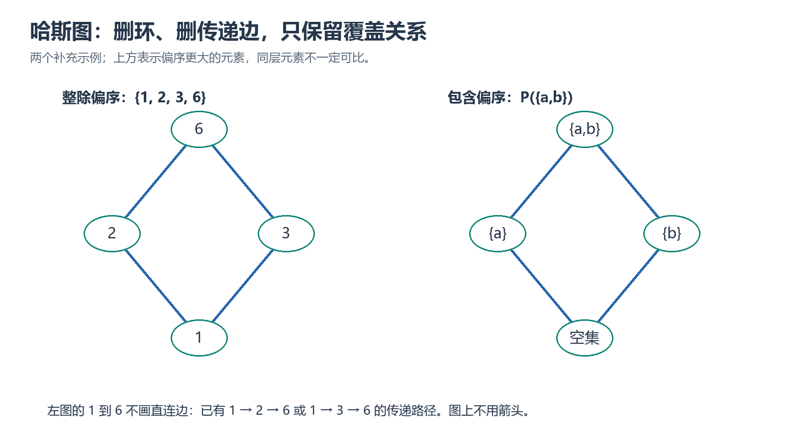

# 第七章｜二元关系

## 本章要学什么

本章围绕一个结构化问题展开：**如何把“对象之间满足某种关系”表示成序偶集合、矩阵或关系图，并进一步判断其性质、构造闭包、得到等价类/划分，或分析偏序中的层次结构？** 学习顺序从笛卡儿积和关系表示开始，经过关系运算与性质，进入闭包、等价关系和偏序关系。

本章依据三份第七章课件：关系定义与运算、关系性质与闭包、等价关系/划分与偏序关系。矩阵、关系图和集合表示是同一对象的不同视角，必须保持方向、定义域和值域一致。学完后应能：

- 计算有序对、笛卡儿积及其基数，区分序偶顺序；
- 用集合、关系图和关系矩阵表示二元关系，并完成逆、复合、限制、像和幂运算；
- 判定自反、反自反、对称、反对称和传递性；
- 用关系幂或 Warshall 算法构造自反、对称、传递闭包；
- 从等价关系得到等价类和商集，从偏序关系绘制哈斯图并判断极值、界和可比性。

> 阅读顺序：笛卡儿积 → 关系表示与运算 → 性质 → 闭包 → 等价关系/划分 → 偏序与哈斯图。

## 本章学习地图

| 学习阶段 | 要回答的核心问题 | 学完后的可见成果 |
| --- | --- | --- |
| 表示关系 | 关系由哪些有序对组成，如何换一种表示？ | 能在集合、图和矩阵之间转换 |
| 运算与性质 | 关系怎样组合，满足哪些结构性质？ | 能计算复合/逆/幂并给出性质判定证据 |
| 闭包 | 怎样补最少的边使关系满足某种性质？ | 能构造闭包并核对最小性 |
| 等价与偏序 | 关系如何产生分类或层次？ | 能求商集、画哈斯图并判断特殊元素 |

## 1. 学习目标

学完本章，应能：

1. 区分有序对与无序集合，熟练求笛卡儿积及其基数；
2. 理解从 $A$ 到 $B$ 的二元关系、$A$ 上的关系及特殊关系；
3. 在集合表达式、关系图和关系矩阵之间相互转换；
4. 求关系的定义域、值域、域、逆关系、复合、限制、像和幂；
5. 用定义、集合表达式、关系矩阵和关系图判断关系的五种基本性质；
6. 求关系的自反闭包、对称闭包和传递闭包，并理解 Warshall 算法；
7. 判断等价关系，求等价类、商集，并由划分构造等价关系；
8. 判断偏序关系，绘制哈斯图，并求极大元、极小元、最大元、最小元、上界、下界、上确界和下确界。

---

## 2. 7.1 序偶与笛卡儿积
### 本章路线

先处理序偶顺序和笛卡儿积，再把关系写成有序对集合、关系图和矩阵，保持方向约定一致。

> 本章要解决的问题：为什么 $(a,b)$ 与 $(b,a)$ 一般不同，以及如何从三种表示互相恢复同一关系？
>
> 本章学完应会：能计算笛卡儿积，列出关系矩阵和图，并按行列方向核对有序对。

### 2.1 有序对

由两个元素 $x$ 和 $y$ 按确定次序组成的二元组称为**有序对**或**序偶**，记作 $\langle x,y\rangle$。

有序对满足：

$$
\langle x,y\rangle=\langle u,v\rangle
\Longleftrightarrow
x=u\ \text{且}\ y=v.
$$

特别地：

- 当 $x\ne y$ 时，$\langle x,y\rangle\ne\langle y,x\rangle$；
- $\langle x,x\rangle$ 仍然是有序对；
- 有序对中的第一元素和第二元素可以来自不同集合。

有序对与集合的区别：

- 有序对强调位置，交换位置通常会改变对象；
- 集合中的元素无序，${x,y}={y,x}$；
- 集合中的元素互异，${x,x}={x}$，但 $\langle x,x\rangle$ 仍有两个位置。

### 2.2 n 元有序组

当 $n>1$ 时，$n$ 个元素组成的有序组记作

$$
\langle x_1,x_2,\ldots,x_n\rangle.
$$

两个 $n$ 元有序组相等，当且仅当对应位置的元素分别相等：

$$
\langle x_1,\ldots,x_n\rangle
=
\langle y_1,\ldots,y_n\rangle
\Longleftrightarrow
x_i=y_i\quad(i=1,2,\ldots,n).
$$

$n$ 元有序组本质上仍可递归地看作序偶，但在书写和理解时应注意括号层次，例如 $\langle x,\langle y,z\rangle\rangle$ 与 $\langle x,y,z\rangle$ 的形式不同。

### 2.3 笛卡儿积

设 $A,B$ 为集合，用 $A$ 中元素作为第一元素、$B$ 中元素作为第二元素构成的所有有序对组成的集合，称为 $A$ 与 $B$ 的**笛卡儿积**，记作 $A\times B$：

$$
A\times B=\{\langle x,y\rangle\mid x\in A\land y\in B\}.
$$

若 $A_1,A_2,\ldots,A_n$ 为 $n$ 个集合，则

$$
A_1\times A_2\times\cdots\times A_n
=
\{\langle x_1,\ldots,x_n\rangle\mid x_i\in A_i\ (i=1,\ldots,n)\}.
$$

当所有集合都相同，即 $A_1=\cdots=A_n=A$ 时，记作 $A^n$。

#### 例：笛卡儿积

若 $A=\{1,2\}$，$B=\{a,b,c\}$，则

$$
A\times B=\{\langle1,a\rangle,\langle1,b\rangle,\langle1,c\rangle,
\langle2,a\rangle,\langle2,b\rangle,\langle2,c\rangle\}.
$$

但 $A\times B\ne B\times A$，因为序偶的第一、第二位置不同；当 $A,B$ 为有限集合时，二者的基数相等。

若 $C=\varnothing$，则

$$
A\times C=C\times A=\varnothing.
$$

### 2.4 笛卡儿积的基数与性质

若 $A,B$ 为有限集合，则

$$
|A\times B|=|A|\cdot|B|.
$$

更一般地，若 $A_1,\ldots,A_n$ 都有限，则

$$
\lvert A_1\times\cdots\times A_n\rvert
=\lvert A_1\rvert\cdots\lvert A_n\rvert.
$$

常用性质：

- 一般不满足交换律：$A\times B\ne B\times A$；
- 满足结合意义下的自然对应，但严格形式上 $A\times(B\times C)$ 与 $(A\times B)\times C$ 的括号结构不同；
- 若 $C\ne\varnothing$，则
  $$
  A\subseteq B\Longleftrightarrow A\times C\subseteq B\times C
  $$
  以及
  $$
  A\subseteq B\Longleftrightarrow C\times A\subseteq C\times B;
  $$
- 若 $A\subseteq C$ 且 $B\subseteq D$，则
  $$
  A\times B\subseteq C\times D.
  $$

> 注意：条件 $C\ne\varnothing$ 很重要。若 $C=\varnothing$，则 $A\times C=B\times C=\varnothing$，不能反推出 $A=B$ 或 $A\subseteq B$。

---

### 本章小结

能计算笛卡儿积，列出关系矩阵和图，并按行列方向核对有序对。 本节的公式、定义或判定应回到课件条件核对，不能脱离对象、范围和适用边界单独记忆。

#### 小练习：本节核心迁移

> 题源：《07 第七章-7.1-7.3 二元关系-关系的定义+运算.pdf》7.1—7.2 节练习（按题意整理）。

**题目：** 设 $A=\{1,2\}$、$B=\{x,y,z\}$，比较 $A\times B$ 和 $B\times A$；再在 $\{1,2,3\}$ 上把 $R=\{(1,1),(1,2),(2,3)\}$ 写成矩阵。

**解析：** 两个笛卡儿积基数都为 $6$，但坐标来源和顺序不同，通常不相等。若行是第一坐标、列是第二坐标，$R$ 的矩阵为 $\begin{pmatrix}1&1&0\\0&0&1\\0&0&0\end{pmatrix}$。

### 本章练习与检验

> 题源：沿用上方小练习对应的项目课件，按同一知识点设置条件变式。

**综合检验：** 改变一条有序对、关系方向或覆盖边，重新判定性质/闭包/等价类/极值，并说明新增或删除该对象的影响。

**验收标准：** 写清对象、已知条件、适用定义或规则和关键中间步骤；最后用等式、反例、关系性质或边界条件检查结论。

## 3. 7.2 二元关系及其表示
### 本章路线

先处理序偶顺序和笛卡儿积，再把关系写成有序对集合、关系图和矩阵，保持方向约定一致。

> 本章要解决的问题：为什么 $(a,b)$ 与 $(b,a)$ 一般不同，以及如何从三种表示互相恢复同一关系？
>
> 本章学完应会：能计算笛卡儿积，列出关系矩阵和图，并按行列方向核对有序对。

### 3.1 二元关系的定义

任何序偶的集合都确定一个二元关系。若 $\langle x,y\rangle\in R$，也写作 $xRy$，表示 $x$ 与 $y$ 具有关系 $R$。

若 $R\subseteq A\times B$，则称 $R$ 是**从 $A$ 到 $B$ 的二元关系**。若 $R\subseteq A\times A$，则称 $R$ 是 **$A$ 上的关系**。

关系本质上是集合，因此集合的列举法、描述法、包含关系以及并交差补运算都适用于关系。

若 $A,B$ 为有限集合，则从 $A$ 到 $B$ 的二元关系共有

$$
2^{|A|\cdot|B|}
$$
个，因为每个关系都是 $A\times B$ 的一个子集。

### 3.2 三种特殊关系

设 $A$ 为集合，$R\subseteq A\times A$：

1. **空关系**：$\varnothing$；
2. **全域关系**：$E_A=A\times A$；
3. **恒等关系**：
   $$
   I_A=\{\langle x,x\rangle\mid x\in A\}.
   $$

例如，$A=\{1,2,3\}$ 时：

- $I_A=\{\langle1,1\rangle,\langle2,2\rangle,\langle3,3\rangle\}$；
- $E_A=A\times A$，包含全部 9 个序偶；
- 空关系不包含任何序偶。

### 3.3 关系的集合表示

关系可以用列举法或描述法表示。例如，在 $A=\{1,2,3,4\}$ 上：

$$
L_A=\{\langle x,y\rangle\mid x,y\in A\land x<y\}
$$

具体为

$$
L_A=\{\langle1,2\rangle,\langle1,3\rangle,\langle1,4\rangle,
\langle2,3\rangle,\langle2,4\rangle,\langle3,4\rangle\}.
$$

### 3.4 关系图

设 $R\subseteq A\times B$，以 $A\cup B$ 中的元素为顶点；若 $\langle x,y\rangle\in R$，则从 $x$ 向 $y$ 画一条有向边。所得图称为 $R$ 的**关系图**。

- 对于 $A$ 上的关系，只需画出 $A$ 中的顶点；
- 起点与终点相同的边称为环；
- 从 $A$ 到 $B$ 的关系图通常是有向二分图；
- 关系图直观适合观察自反、对称、传递等性质，但不如矩阵适合计算。

### 3.5 关系矩阵

设

$$
A=\{a_1,\ldots,a_m\},\qquad B=\{b_1,\ldots,b_n\},
$$

且 $R\subseteq A\times B$。关系矩阵 $M_R=(r_{ij})_{m\times n}$ 是一个布尔矩阵，其中

$$
 r_{ij}=\begin{cases}
1,&\langle a_i,b_j\rangle\in R,\\
0,&\langle a_i,b_j\rangle\notin R.
\end{cases}
$$

矩阵的行对应第一元素，列对应第二元素，因此**元素的排列顺序必须先固定**。

三种表示法的适用特点：

| 表示法 | 主要特点 |
|---|---|
| 集合表达式 | 定义准确，适合书写和证明 |
| 关系图 | 直观，适合观察环、双向边、路径和连通块 |
| 关系矩阵 | 适合有限关系的机械运算和算法处理 |

---

### 本章小结

能计算笛卡儿积，列出关系矩阵和图，并按行列方向核对有序对。 本节的公式、定义或判定应回到课件条件核对，不能脱离对象、范围和适用边界单独记忆。

#### 小练习：本节核心迁移

> 题源：《07 第七章-7.1-7.3 二元关系-关系的定义+运算.pdf》7.1—7.2 节练习（按题意整理）。

**题目：** 设 $A=\{1,2\}$、$B=\{x,y,z\}$，比较 $A\times B$ 和 $B\times A$；再在 $\{1,2,3\}$ 上把 $R=\{(1,1),(1,2),(2,3)\}$ 写成矩阵。

**解析：** 两个笛卡儿积基数都为 $6$，但坐标来源和顺序不同，通常不相等。若行是第一坐标、列是第二坐标，$R$ 的矩阵为 $\begin{pmatrix}1&1&0\\0&0&1\\0&0&0\end{pmatrix}$。

### 本章练习与检验

> 题源：沿用上方小练习对应的项目课件，按同一知识点设置条件变式。

**综合检验：** 改变一条有序对、关系方向或覆盖边，重新判定性质/闭包/等价类/极值，并说明新增或删除该对象的影响。

**验收标准：** 写清对象、已知条件、适用定义或规则和关键中间步骤；最后用等式、反例、关系性质或边界条件检查结论。

## 4. 7.3 关系的运算
### 本章路线

先求定义域、值域和逆关系，再按中间坐标计算复合和关系幂，最后用定义检查五种性质。

> 本章要解决的问题：如何在运算方向和性质定义之间建立可核验的证据，而不是凭箭头直觉判断？
>
> 本章学完应会：能计算复合关系、逆关系和限制/像，并判断自反、反自反、对称、反对称和传递性。

以下默认关系的类型相容，使运算结果仍是相应集合之间的关系。

### 4.1 定义域、值域和域

设 $R\subseteq A\times B$。

**定义域**：所有作为第一元素出现的对象组成的集合：

$$
\operatorname{dom}R
=\{x\in A\mid\exists y\in B,\ \langle x,y\rangle\in R\}.
$$

**值域**：所有作为第二元素出现的对象组成的集合：

$$
\operatorname{ran}R
=\{y\in B\mid\exists x\in A,\ \langle x,y\rangle\in R\}.
$$

**域**：

$$
\operatorname{fld}R=\operatorname{dom}R\cup\operatorname{ran}R.
$$

一定有

$$
\operatorname{dom}R\subseteq A,\qquad \operatorname{ran}R\subseteq B.
$$

#### 例

若

$$
R=\{\langle2,a\rangle,\langle2,b\rangle,\langle3,b\rangle,
\langle4,c\rangle,\langle6,c\rangle\},
$$

则

$$
\operatorname{dom}R=\{2,3,4,6\},\quad
\operatorname{ran}R=\{a,b,c\},
$$

$$
\operatorname{fld}R=\{2,3,4,6,a,b,c\}.
$$

### 4.2 并、交、差、补和对称差

设 $R,S\subseteq A\times B$：

$$
R\cup S=\{\langle x,y\rangle\mid xRy\lor xSy\},
$$

$$
R\cap S=\{\langle x,y\rangle\mid xRy\land xSy\},
$$

$$
R-S=\{\langle x,y\rangle\mid xRy\land\neg xSy\},
$$

$$
\widetilde R=(A\times B)-R,
$$

$$
R\mathbin{\triangle}S=(R\cup S)-(R\cap S).
$$

在关系矩阵上：

- 并对应逐元素逻辑或；
- 交对应逐元素逻辑与；
- 差对应“$R$ 为 1 且 $S$ 为 0”；
- 补对应在全矩阵中的 0、1 互换；
- 对称差对应逐元素异或。

### 4.3 逆关系

设 $R$ 是从 $A$ 到 $B$ 的关系，则 $R$ 的**逆关系** $R^{-1}$ 是从 $B$ 到 $A$ 的关系：

$$
R^{-1}=\{\langle y,x\rangle\mid\langle x,y\rangle\in R\}.
$$

等价地：

$$
\langle x,y\rangle\in R
\Longleftrightarrow
\langle y,x\rangle\in R^{-1}.
$$

重要性质：

$$
(R^{-1})^{-1}=R,
$$

$$
M_{R^{-1}}=M_R^{\mathsf T}.
$$

特殊情形：

$$
I_A^{-1}=I_A,\qquad \varnothing^{-1}=\varnothing,
$$

$$
(A\times B)^{-1}=B\times A.
$$

关系 $R$ 对称，当且仅当 $R=R^{-1}$。

### 4.4 复合关系

设 $R$ 是从 $A$ 到 $B$ 的关系，$S$ 是从 $B$ 到 $C$ 的关系。定义 $R$ 与 $S$ 的复合为从 $A$ 到 $C$ 的关系：

$$
R\circ S
=\{\langle x,z\rangle\mid
\exists y\in B,\ \langle x,y\rangle\in R\land\langle y,z\rangle\in S\}.
$$

理解：先沿 $R$ 从 $x$ 到中间元素 $y$，再沿 $S$ 从 $y$ 到 $z$。课件采用的记号中，$R\circ S$ 表示“先 $R$ 后 $S$”。

关系复合通常不满足交换律：

$$
R\circ S\ne S\circ R.
$$

但满足结合律：

$$
(R\circ S)\circ T=R\circ(S\circ T).
$$

恒等关系是复合单位元：

$$
I_A\circ R=R,\qquad R\circ I_B=R.
$$

空关系是复合零元：

$$
\varnothing\circ R=\varnothing,
\qquad R\circ\varnothing=\varnothing.
$$

逆关系与复合满足：

$$
(R\circ S)^{-1}=S^{-1}\circ R^{-1}.
$$

复合对并可分配：

$$
R\circ(S\cup T)=(R\circ S)\cup(R\circ T),
$$

$$
(R\cup S)\circ T=(R\circ T)\cup(S\circ T).
$$

但对交一般只有包含关系：

$$
R\circ(S\cap T)\subseteq(R\circ S)\cap(R\circ T),
$$

$$
(R\cap S)\circ T\subseteq(R\circ T)\cap(S\circ T).
$$

原因是交式左边要求两个复合同时使用同一个中间元素，而右边两个复合可以使用不同的中间元素。

### 4.5 关系的限制与像

设 $F$ 是关系，$A$ 是对象集合。

**限制**：把关系的第一元素限制在 $A$ 中，记作 $F\upharpoonright A$：

$$
F\upharpoonright A
=\{\langle x,y\rangle\in F\mid x\in A\}.
$$

**像**：集合 $A$ 在关系 $F$ 下的像，记作 $F[A]$：

$$
F[A]=\{y\mid\exists x\in A,\ \langle x,y\rangle\in F\}.
$$

限制的并、交满足：

$$
F\upharpoonright(A\cup B)
=(F\upharpoonright A)\cup(F\upharpoonright B),
$$

$$
F\upharpoonright(A\cap B)
=(F\upharpoonright A)\cap(F\upharpoonright B).
$$

像对并满足等式，但对交一般只有单向包含：

$$
F[A\cup B]=F[A]\cup F[B],
$$

$$
F[A\cap B]\subseteq F[A]\cap F[B].
$$

### 4.6 关系的幂

设 $R$ 是 $A$ 上的关系，定义：

$$
R^0=I_A,
$$

$$
R^{n+1}=R^n\circ R=R\circ R^n.
$$

$R^n$ 的含义是：从 $x$ 出发，沿关系 $R$ 走 $n$ 步可以到达 $y$。

幂的基本性质：

$$
R^m\circ R^n=R^{m+n},
$$

$$
(R^m)^n=R^{mn},
$$

$$
(R^n)^{-1}=(R^{-1})^n.
$$

关系图中，$R^2$ 表示长度为 2 的可达关系，$R^3$ 表示长度为 3 的可达关系。注意 $R^n$ 可能包含原来已有的边，也可能因为不同路径合并而产生新边。

### 4.7 关系矩阵的复合

当 $A$ 为有限集合且 $R,S$ 都是 $A$ 上关系时，复合关系的矩阵用布尔矩阵乘法计算：

$$
M_{R\circ S}=M_R\cdot M_S.
$$

其分量为

$$
(M_{R\circ S})_{ij}
=\bigvee_{k=1}^{n}(r_{ik}\land s_{kj}).
$$

这里用逻辑“或”代替普通矩阵乘法中的求和，用逻辑“与”代替乘法。

---

### 本章小结

能计算复合关系、逆关系和限制/像，并判断自反、反自反、对称、反对称和传递性。 本节的公式、定义或判定应回到课件条件核对，不能脱离对象、范围和适用边界单独记忆。

#### 小练习：本节核心迁移

> 题源：《07 第七章-7.1-7.3 二元关系-关系的定义+运算.pdf》7.3 节、《07 第七章-7.4-7.5 二元关系-关系的性质和闭包.pdf》7.4 节练习（按题意整理）。

**题目：** 设 $R=\{(1,2),(2,3)\}$、$S=\{(2,a),(3,b)\}$，按“先 $R$ 后 $S$”求 $S\circ R$；再说明判断对称性和反对称性时分别要检查什么。

**解析：** $S\circ R=\{(1,a),(2,b)\}$，中间坐标必须满足 $xRy$ 且 $ySz$。对称性要求每条边的反向边也在关系中；反对称性要求若两方向同时存在，则两端相等，二者不是互相否定的概念。

### 本章练习与检验

> 题源：沿用上方小练习对应的项目课件，按同一知识点设置条件变式。

**综合检验：** 改变全集、交集条件或一个集合运算对象，重新完成化简/证明/计数，并说明补集、交集或基数公式的适用边界。

**验收标准：** 写清对象、已知条件、适用定义或规则和关键中间步骤；最后用等式、反例、关系性质或边界条件检查结论。

## 5. 7.4 关系的性质
### 本章路线

先求定义域、值域和逆关系，再按中间坐标计算复合和关系幂，最后用定义检查五种性质。

> 本章要解决的问题：如何在运算方向和性质定义之间建立可核验的证据，而不是凭箭头直觉判断？
>
> 本章学完应会：能计算复合关系、逆关系和限制/像，并判断自反、反自反、对称、反对称和传递性。

以下默认 $R$ 是非空集合 $A$ 上的关系。

### 5.1 五种性质的定义

#### （1）自反性

若

$$
\forall x\in A,\ \langle x,x\rangle\in R,
$$

则称 $R$ 在 $A$ 上是**自反的**。

集合形式：

$$
I_A\subseteq R.
$$

关系矩阵特征：主对角线全为 1。关系图特征：每个顶点都有环。

#### （2）反自反性

若

$$
\forall x\in A,\ \langle x,x\rangle\notin R,
$$

则称 $R$ 是**反自反的**。

集合形式：

$$
R\cap I_A=\varnothing.
$$

关系矩阵特征：主对角线全为 0。关系图特征：每个顶点都没有环。

#### （3）对称性

若

$$
\forall x,y\in A,
\langle x,y\rangle\in R\Rightarrow\langle y,x\rangle\in R,
$$

则称 $R$ 是**对称的**。

集合形式：

$$
R=R^{-1}.
$$

关系矩阵特征：矩阵是对称矩阵。关系图特征：任意有向边都伴随反向边。

#### （4）反对称性

若

$$
\forall x,y\in A,
\bigl(\langle x,y\rangle\in R\land\langle y,x\rangle\in R\bigr)
\Rightarrow x=y,
$$

则称 $R$ 是**反对称的**。

集合形式：

$$
R\cap R^{-1}\subseteq I_A.
$$

关系矩阵特征：若 $i\ne j$ 且 $r_{ij}=1$，则 $r_{ji}=0$。关系图特征：不同顶点之间不能同时存在两个相反方向的边。

> 对称与反对称不是互为否定。恒等关系和空关系既对称又反对称；许多关系既不对称也不反对称。

#### （5）传递性

若

$$
\forall x,y,z\in A,
\bigl(\langle x,y\rangle\in R\land\langle y,z\rangle\in R\bigr)
\Rightarrow\langle x,z\rangle\in R,
$$

则称 $R$ 是**传递的**。

集合形式：

$$
R\circ R\subseteq R.
$$

关系矩阵特征：$M_R^2$ 中出现 1 的位置，在 $M_R$ 的对应位置也必须为 1。关系图特征：若存在 $x\to y$ 和 $y\to z$，则必须有 $x\to z$。

### 5.2 常见关系的性质

| 关系 | 自反 | 反自反 | 对称 | 反对称 | 传递 |
|---|---|---|---|---|---|
| 空关系（非空底集上） | 否 | 是 | 是 | 是 | 是 |
| 恒等关系 | 是 | 否 | 是 | 是 | 是 |
| 全域关系 | 是 | 否 | 是 | 否（当底集含不同元素时） | 是 |
| 小于关系 | 否 | 是 | 否 | 是 | 是 |
| 小于等于关系 | 是 | 否 | 否 | 是 | 是 |
| 包含关系 | 是 | 否 | 否 | 是 | 是 |
| 真包含关系 | 否 | 是 | 否 | 是 | 是 |

> 空关系和恒等关系的很多性质来自“前件为假时蕴涵为真”。判断性质时不要只凭图形直觉，应回到定义。

### 5.3 五种性质的判定速查

| 性质 | 集合表达式 | 矩阵特征 | 图形特征 |
|---|---|---|---|
| 自反 | I_A ⊆ R | 主对角线全 1 | 每个顶点有环 |
| 反自反 | R ∩ I_A = ∅ | 主对角线全 0 | 没有环 |
| 对称 | R = R⁻¹ | 对称矩阵 | 有边必有反向边 |
| 反对称 | R ∩ R⁻¹ ⊆ I_A | 非对角线不能成双 | 不存在不同顶点间双向边 |
| 传递 | R ∘ R ⊆ R | M_R² 的 1 被 M_R 覆盖 | 两段路径必有捷径 |

### 5.4 关系运算对性质的影响

课件强调：某种性质对并、交、差、复合的保持情况并不相同。例如：

- 自反关系的交仍自反；并也自反；差一般不自反；
- 对称关系的交、并、差、复合一般仍对称的情形需区分运算对象，不能一概而论；
- 传递关系的并一般不传递；
- 两个反对称关系的并一般不一定反对称；
- 对于关系性质的保持性，最稳妥的方法是直接依据定义或构造反例。

---

### 本章小结

能计算复合关系、逆关系和限制/像，并判断自反、反自反、对称、反对称和传递性。 本节的公式、定义或判定应回到课件条件核对，不能脱离对象、范围和适用边界单独记忆。

#### 小练习：本节核心迁移

> 题源：《07 第七章-7.1-7.3 二元关系-关系的定义+运算.pdf》7.3 节、《07 第七章-7.4-7.5 二元关系-关系的性质和闭包.pdf》7.4 节练习（按题意整理）。

**题目：** 设 $R=\{(1,2),(2,3)\}$、$S=\{(2,a),(3,b)\}$，按“先 $R$ 后 $S$”求 $S\circ R$；再说明判断对称性和反对称性时分别要检查什么。

**解析：** $S\circ R=\{(1,a),(2,b)\}$，中间坐标必须满足 $xRy$ 且 $ySz$。对称性要求每条边的反向边也在关系中；反对称性要求若两方向同时存在，则两端相等，二者不是互相否定的概念。

### 本章练习与检验

> 题源：沿用上方小练习对应的项目课件，按同一知识点设置条件变式。

**综合检验：** 改变一条有序对、关系方向或覆盖边，重新判定性质/闭包/等价类/极值，并说明新增或删除该对象的影响。

**验收标准：** 写清对象、已知条件、适用定义或规则和关键中间步骤；最后用等式、反例、关系性质或边界条件检查结论。

## 6. 7.5 关系的闭包
### 本章路线

先明确闭包的目标性质，再按关系幂或 Warshall 算法补入必要边，最后检查原关系包含、目标性质和最小性。

> 本章要解决的问题：闭包为什么是“最小扩张”，怎样判断补边已经足够且没有多余？
>
> 本章学完应会：能求自反、对称、传递及自反传递闭包，并说明新增边对应的路径或性质要求。

### 6.1 闭包的概念

有时给定关系不具备某种性质，但希望通过添加尽可能少的序偶，使它具备该性质。这个“包含原关系的最小扩充”称为闭包。

设 $R$ 是 $A$ 上的关系。$R$ 的某种性质闭包 $R'$ 满足：

1. $R'$ 具有所要求的性质；
2. $R\subseteq R'$；
3. 对任意包含 $R$ 且具有该性质的关系 $R''$，都有 $R'\subseteq R''$。

三种常用闭包：

- 自反闭包：$r(R)$；
- 对称闭包：$s(R)$；
- 传递闭包：$t(R)$。

### 6.2 闭包的构造公式

**自反闭包**：

$$
 r(R)=R\cup I_A.
$$

做法：补上所有缺失的环。

**对称闭包**：

$$
 s(R)=R\cup R^{-1}.
$$

做法：每有一条 $x\to y$，就补上 $y\to x$。

**传递闭包**：

$$
 t(R)=R\cup R^2\cup R^3\cup\cdots.
$$

在有限集合上，如果 $|A|=n$，则可写成

$$
 t(R)=R\cup R^2\cup\cdots\cup R^n,
$$

因为更长路径若重复顶点，可以缩短为长度不超过 $n$ 的可达路径。

### 6.3 闭包的矩阵表示

设 $M$ 是 $R$ 的关系矩阵，$E$ 是恒等关系矩阵，矩阵运算采用布尔运算，则：

$$
M_{r(R)}=M\vee E,
$$

$$
M_{s(R)}=M\vee M^{\mathsf T},
$$

$$
M_{t(R)}=M\vee M^2\vee M^3\vee\cdots.
$$

其中 $M^k$ 是布尔矩阵幂。

### 6.4 Warshall 算法求传递闭包

对于有限集合上的关系，Warshall 算法通过逐步允许中间顶点参与路径来求传递闭包。

设初始矩阵为 $W=M_R$，依次令 $k=1,2,\ldots,n$。第 $k$ 步更新：

$$
W_{ij}\leftarrow W_{ij}\vee(W_{ik}\land W_{kj}).
$$

含义：如果原来已有 $i\to j$，或者存在 $i\to k$ 且 $k\to j$，就把 $i\to j$ 置为 1。

算法结束后，$W$ 即为传递闭包 $t(R)$ 的关系矩阵。

### 6.5 闭包的性质

闭包是“最小扩充”，因此：

$$
R\text{ 自反}\Longleftrightarrow r(R)=R,
$$

$$
R\text{ 对称}\Longleftrightarrow s(R)=R,
$$

$$
R\text{ 传递}\Longleftrightarrow t(R)=R.
$$

若 $R_1\subseteq R_2$，则闭包运算具有单调性：

$$
 r(R_1)\subseteq r(R_2),
\qquad
 s(R_1)\subseteq s(R_2),
\qquad
 t(R_1)\subseteq t(R_2).
$$

此外：

- 若 $R$ 自反，则 $s(R)$、$t(R)$ 都自反；
- 若 $R$ 对称，则 $r(R)$、$t(R)$ 都对称；
- 若 $R$ 传递，则 $r(R)$ 传递；
- $r$ 与 $s$ 可交换：$r(s(R))=s(r(R))$；
- $r$ 与 $t$ 可交换：$r(t(R))=t(r(R))$；
- 一般只有
  $$
  s(t(R))\subseteq t(s(R)),
  $$
  并不保证二者相等。

#### 小例子

设 $X=\{a,b,c\}$，$R=\{\langle a,b\rangle,\langle b,c\rangle\}$。

则

$$
 t(R)=\{\langle a,b\rangle,\langle b,c\rangle,\langle a,c\rangle\}.
$$

对称闭包为

$$
 s(R)=\{\langle a,b\rangle,\langle b,a\rangle,
\langle b,c\rangle,\langle c,b\rangle\}.
$$

而 $s(t(R))$ 还要加入 $\langle c,a\rangle$、$\langle b,a\rangle$ 等反向边；$t(s(R))$ 还会因为往返路径产生环，因此通常更大。

---

### 本章小结

能求自反、对称、传递及自反传递闭包，并说明新增边对应的路径或性质要求。 本节的公式、定义或判定应回到课件条件核对，不能脱离对象、范围和适用边界单独记忆。

#### 小练习：本节核心迁移

> 题源：《07 第七章-7.4-7.5 二元关系-关系的性质和闭包.pdf》7.5 节练习（按题意整理）。

**题目：** 设 $R=\{(1,2),(2,3)\}$，求传递闭包和自反传递闭包。

**解析：** 两步路径 $1R2R3$ 要求加入 $(1,3)$，故传递闭包为 $R\cup\{(1,3)\}$；自反传递闭包还需加入 $(1,1),(2,2),(3,3)$。若缺少 $(1,3)$，传递性仍失败。

### 本章练习与检验

> 题源：沿用上方小练习对应的项目课件，按同一知识点设置条件变式。

**综合检验：** 改变一条有序对、关系方向或覆盖边，重新判定性质/闭包/等价类/极值，并说明新增或删除该对象的影响。

**验收标准：** 写清对象、已知条件、适用定义或规则和关键中间步骤；最后用等式、反例、关系性质或边界条件检查结论。

## 7. 7.6 等价关系和划分
### 本章路线

先验证自反/对称/传递，再求一个代表元的等价类，最后检查等价类是否两两不交且覆盖全集。

> 本章要解决的问题：关系如何把全集分成互不重叠的类别，为什么等价类要么相同要么不交？
>
> 本章学完应会：能求等价类、商集，并从一个划分反向构造等价关系。

### 7.1 等价关系

设 $R$ 是非空集合 $A$ 上的关系。如果 $R$ 同时满足：

1. 自反性；
2. 对称性；
3. 传递性；

则称 $R$ 为 $A$ 上的**等价关系**，记 $x\sim y$ 或 $xRy$。

等价关系的作用是把“具有某种共同特征”的元素归为同一类。

常见例子：

- “同龄”“同乡”“同寝室”；
- 三角形的相似、全等；
- 命题公式的逻辑等价；
- 整数的模 $m$ 同余；
- 集合上的恒等关系和全域关系。

### 7.2 等价类

设 $R$ 是 $A$ 上的等价关系，$x\in A$。$x$ 关于 $R$ 的**等价类**定义为

$$
[x]_R=\{y\in A\mid xRy\}.
$$

等价类的关键性质：

1. $[x]_R$ 是 $A$ 的非空子集，且 $x\in[x]_R$；
2. 若 $x\sim y$，则
   $$
   [x]_R=[y]_R;
   $$
3. 若 $x\not\sim y$，则
   $$
   [x]_R\cap[y]_R=\varnothing;
   $$
4. 所有等价类的并为 $A$：
   $$
   \bigcup_{x\in A}[x]_R=A.
   $$

因此，等价类只有两种关系：相等或不相交。

#### 例：模 3 等价关系

在 $A=\{1,2,\ldots,8\}$ 上定义

$$
 x\sim y\Longleftrightarrow x\equiv y\pmod 3.
$$

则

$$
[1]=[4]=[7]=\{1,4,7\},
$$

$$
[2]=[5]=[8]=\{2,5,8\},
$$

$$
[3]=[6]=\{3,6\}.
$$

关系图表现为：每个顶点有环；同一等价类中的顶点两两有双向边；不同等价类之间没有边。

### 7.3 商集

以等价关系 $R$ 的所有等价类为元素组成的集合，称为 $A$ 关于 $R$ 的**商集**，记作

$$
A/R=\{[x]_R\mid x\in A\}.
$$

模 3 例子中：

$$
A/R=\{\{1,4,7\},\{2,5,8\},\{3,6\}\}.
$$

特殊情形：

$$
A/I_A=\{\{x\}\mid x\in A\},
$$

即最细划分；

$$
A/E_A=\{A\},
$$

即最粗划分。

求有限集合的商集时，可按如下步骤：

1. 任取尚未归类的元素 $a$，求 $[a]$；
2. 在剩余元素中再选取一个元素，求其等价类；
3. 重复，直到所有元素都被覆盖；
4. 相同的等价类只保留一次。

### 7.4 集合的划分

设 $A\ne\varnothing$。若子集族 $\pi\subseteq\mathcal P(A)$ 满足：

1. $\varnothing\notin\pi$；
2. 任意两个不同的划分块不相交；
3. 所有划分块的并为 $A$；

则称 $\pi$ 是 $A$ 的一个**划分**，$\pi$ 中的元素称为划分块。

符号化地，划分要求：

- 每个块非空；
- 不同块两两不交；
- 块的并覆盖整个集合。

### 7.5 等价关系与划分的一一对应

由等价关系得到划分：

$$
\pi_R=\{[x]_R\mid x\in A\}.
$$

由划分 $\pi$ 得到等价关系：

$$
R_\pi=\{\langle x,y\rangle\mid
\exists B\in\pi,\ x\in B\land y\in B\}.
$$

即：两个元素属于同一划分块，当且仅当它们等价。

因此：

> 非空集合 $A$ 上的等价关系与 $A$ 的划分之间存在一一对应。

这也是处理“等价关系数量”问题的核心方法：先数划分，再对应等价关系。

### 7.6 划分的细分关系

若划分 $\pi_1$ 的每个块都包含于 $\pi_2$ 的某个块，则称 $\pi_1$ **细分** $\pi_2$，记作

$$
\pi_1\le\pi_2.
$$

直观理解：$\pi_1$ 把集合分得更细，$\pi_2$ 把集合分得更粗。

若 $R_1,R_2$ 是等价关系，且对应划分分别为 $\pi_1,\pi_2$，则

$$
R_1\subseteq R_2
\Longleftrightarrow
\pi_1\le\pi_2.
$$

因此：

- 最小等价关系 $I_A$ 对应最细划分，每个块只有一个元素；
- 最大等价关系 $E_A$ 对应最粗划分，只有一个块 $A$；
- 等价关系包含的序偶越少，对应划分越细。

---

### 本章小结

能求等价类、商集，并从一个划分反向构造等价关系。 本节的公式、定义或判定应回到课件条件核对，不能脱离对象、范围和适用边界单独记忆。

#### 小练习：本节核心迁移

> 题源：《07 第七章-7.6-7.7 二元关系-等价关系、划分、偏序关系.pdf》7.6 节练习（按题意整理）。

**题目：** 在整数集上定义 $a\sim b\Leftrightarrow 3\mid(a-b)$，求 $[0],[1],[2]$ 并验证它们构成划分。

**解析：** 三个等价类分别为 $\{3k\}$、$\{3k+1\}$、$\{3k+2\}$（$k\in\mathbb Z$）。每个整数模 $3$ 余数唯一，因此三类两两不交且并为整数集。

### 本章练习与检验

> 题源：沿用上方小练习对应的项目课件，按同一知识点设置条件变式。

**综合检验：** 改变一条有序对、关系方向或覆盖边，重新判定性质/闭包/等价类/极值，并说明新增或删除该对象的影响。

**验收标准：** 写清对象、已知条件、适用定义或规则和关键中间步骤；最后用等式、反例、关系性质或边界条件检查结论。

## 8. 7.7 偏序关系
### 本章路线

先验证偏序三条件，再判断可比性和覆盖，删去传递边后画哈斯图，最后区分极值与界。

> 本章要解决的问题：为什么最大元/最小元和极大元/极小元不同，上界/下界又依赖被考察的子集？
>
> 本章学完应会：能从有限偏序关系画哈斯图，并判断链、反链、极值、上界、下界、确界。

### 8.1 偏序关系与偏序集

若关系 $R$ 在非空集合 $A$ 上具有：

1. 自反性；
2. 反对称性；
3. 传递性；

则称 $R$ 为 $A$ 上的**偏序关系**，通常记作 $\preceq$。若 $x\preceq y$，表示 $x$ 在该偏序下不晚于 $y$，不一定表示通常数值意义下的“小于等于”。

集合 $A$ 与其上的偏序关系 $\preceq$ 组成**偏序集**，记作

$$
\langle A,\preceq\rangle.
$$

常见偏序关系：

- 实数上的 $\le$；
- 正整数上的整除关系 $\mid$；
- 幂集上的包含关系 $\subseteq$；
- 任意集合上的恒等关系。

### 8.2 可比、全序和覆盖

在偏序集 $\langle A,\preceq\rangle$ 中，$x,y$ **可比**，当且仅当

$$
 x\preceq y\quad\text{或}\quad y\preceq x.
$$

若任意两个元素都可比，则称 $\preceq$ 为**全序关系**或线序关系，$\langle A,\preceq\rangle$ 为全序集。

例如：

- $(\mathbb R,\le)$ 是全序集；
- 正整数上的整除关系不是全序关系，因为 2 和 3 不可比；
- 幂集按包含关系排序通常是偏序而非全序。

用

$$
 x\prec y\Longleftrightarrow x\preceq y\land x\ne y
$$

表示严格偏序。

若 $x\prec y$，且不存在 $z$ 使得 $x\prec z\prec y$，则称 $y$ **覆盖** $x$。覆盖关系保留了偏序中最直接的上下关系。

### 8.3 哈斯图

偏序关系的关系图可以利用三个性质进行简化：

1. 自反性：删去所有环；
2. 反对称性：不同顶点之间不出现相反方向的边，约定边向上表示偏序方向，省略箭头；
3. 传递性：删去由其他路径可以推得的传递边。

简化后的图称为**哈斯图**。

哈斯图的读图规则：

- 位置较低的元素在偏序中排在前面；
- 有直接连线的上下两个元素通常构成覆盖关系；
- 若从 $x$ 沿向上的路径到达 $y$，则 $x\preceq y$；
- 没有路径连接的两个元素通常不可比。

绘制哈斯图的一般步骤：

1. 写出关系中的所有序偶；
2. 去掉所有自反序偶；
3. 去掉由传递性可推出的非覆盖边；
4. 按偏序方向从下到上排列元素；
5. 连接覆盖关系对应的元素。

**读图提示：**左图以集合 {1,2,3,6} 上的整除关系为例，右图以 {a,b} 的幂集包含关系为例。沿边向上读偏序，只保留覆盖边；左图 1 与 6 可比，但不应重复画出已有路径表达的传递边。

来源：依据本篇笔记相邻段落自绘的教学示意；不是教材原图或实测记录。

### 8.4 链与反链

设 $B\subseteq A$：

- 若 $B$ 中任意两个元素都可比，则称 $B$ 为**链**；
- 若 $B$ 中任意两个不同元素都不可比，则称 $B$ 为**反链**。

在哈斯图中：

- 链通常表现为沿上下方向可达的一串点；
- 反链通常表现为同一层次或互不可达的一组点。

### 8.5 最大元、最小元、极大元、极小元

设 $B\subseteq A$，$y\in B$。

**最小元**：

$$
\forall x\in B,\ y\preceq x.
$$

**最大元**：

$$
\forall x\in B,\ x\preceq y.
$$

**极小元**：不存在 $B$ 中严格小于它的元素：

$$
\forall x\in B,
\bigl(x\preceq y\Rightarrow x=y\bigr).
$$

**极大元**：不存在 $B$ 中严格大于它的元素：

$$
\forall x\in B,
\bigl(y\preceq x\Rightarrow x=y\bigr).
$$

区分：

| 概念 | 与其他元素的关系 | 是否一定唯一 |
|---|---|---|
| 最小元 | 小于等于集合中所有元素 | 若存在则唯一 |
| 最大元 | 大于等于集合中所有元素 | 若存在则唯一 |
| 极小元 | 没有比它更小的元素 | 可能有多个 |
| 极大元 | 没有比它更大的元素 | 可能有多个 |

必然有：

- 最小元一定是极小元；
- 最大元一定是极大元；
- 逆命题一般不成立；
- 有限非空偏序集一定存在极小元和极大元；
- 最小元、最大元不一定存在，但若存在必唯一。

在哈斯图中：

- 极小元位于最低层且没有向下邻接点；
- 极大元位于最高层且没有向上邻接点；
- 最小元必须能通过偏序到达所有元素；
- 最大元必须能从所有元素被到达。

### 8.6 上界、下界、上确界、下确界

设 $B\subseteq A$。

若 $u\in A$ 且

$$
\forall x\in B,\ x\preceq u,
$$

则称 $u$ 是 $B$ 的**上界**。

若 $l\in A$ 且

$$
\forall x\in B,\ l\preceq x,
$$

则称 $l$ 是 $B$ 的**下界**。

若 $u$ 是 $B$ 的上界，且 $u$ 在所有上界中最小，则称 $u$ 是 $B$ 的**最小上界**或**上确界**，记作

$$
\sup B.
$$

若 $l$ 是 $B$ 的下界，且 $l$ 在所有下界中最大，则称 $l$ 是 $B$ 的**最大下界**或**下确界**，记作

$$
\inf B.
$$

关键区别：

- 最大元、最小元必须属于 $B$；
- 上界、下界只要求属于整个偏序集 $A$，不一定属于 $B$；
- 若 $B$ 有最大元，则最大元就是 $B$ 的上确界；
- 若 $B$ 有最小元，则最小元就是 $B$ 的下确界；
- 上确界和下确界若存在，分别唯一。

### 8.7 良序

若偏序集的每个非空子集都有最小元，则称该偏序为**良序关系**，称该集合为良序集。

重要结论：

- 良序集一定是全序集；
- 有限全序集一定是良序集；
- 无限全序集不一定良序，例如开区间 $(0,1)$ 按通常小于等于排序是全序集，但它没有最小元；
- 良序定理：任意集合都可以赋予某种良序关系。

---

### 本章小结

能从有限偏序关系画哈斯图，并判断链、反链、极值、上界、下界、确界。 本节的公式、定义或判定应回到课件条件核对，不能脱离对象、范围和适用边界单独记忆。

#### 小练习：本节核心迁移

> 题源：《07 第七章-7.6-7.7 二元关系-等价关系、划分、偏序关系.pdf》7.7 节练习（按题意整理）。

**题目：** 在 $P(\{a,b\})$ 上按包含关系排序，列出覆盖关系并判断最大元、最小元、极大元和极小元。

**解析：** 覆盖关系为 $\varnothing\prec\{a\}$、$\varnothing\prec\{b\}$、$\{a\}\prec\{a,b\}$、$\{b\}\prec\{a,b\}$。最大元是 $\{a,b\}$，最小元是 $\varnothing$；极大元和极小元也分别只有这两个元素。

### 本章练习与检验

> 题源：沿用上方小练习对应的项目课件，按同一知识点设置条件变式。

**综合检验：** 改变一条有序对、关系方向或覆盖边，重新判定性质/闭包/等价类/极值，并说明新增或删除该对象的影响。

**验收标准：** 写清对象、已知条件、适用定义或规则和关键中间步骤；最后用等式、反例、关系性质或边界条件检查结论。

## 9. 综合例题与解题模板

### 9.1 由条件列出关系

若

$$
R=\{\langle x,y\rangle\mid x,y\in A\land P(x,y)\},
$$

解题步骤：

1. 写出 $A\times A$ 的全部有序对；
2. 逐个检验条件 $P(x,y)$；
3. 保留满足条件的序偶；
4. 如需求逆关系，交换每个序偶的位置；
5. 如需求定义域和值域，分别收集第一、第二元素。

### 9.2 判断关系性质

优先选择最直接的判定方式：

1. 自反/反自反：只查主对角线或所有 $\langle x,x\rangle$；
2. 对称：查每个 $\langle x,y\rangle$ 是否伴随 $\langle y,x\rangle$；
3. 反对称：重点查不同元素之间是否出现双向边；
4. 传递：查长度为 2 的路径是否都有捷径；
5. 若矩阵已给出，可直接检查主对角线、转置矩阵和布尔平方。

证明模板：

- 自反：任取 $x\in A$，由条件推出 $\langle x,x\rangle\in R$；
- 对称：任取 $\langle x,y\rangle\in R$，由条件推出 $\langle y,x\rangle\in R$；
- 反对称：任取两边同时成立，推出 $x=y$；
- 传递：任取 $\langle x,y\rangle,\langle y,z\rangle\in R$，推出 $\langle x,z\rangle\in R$。

### 9.3 求闭包

- 自反闭包：直接补上所有缺失的 $\langle x,x\rangle$；
- 对称闭包：把每条边反向补齐；
- 传递闭包：先求 $R^2,R^3,\ldots$，直到并集不再增加，或用 Warshall 算法。

### 9.4 求等价类和商集

1. 先验证关系为等价关系，或使用题设已知条件；
2. 任取一个元素，收集与它相关的所有元素作为一个等价类；
3. 等价类中的每个代表元素得到相同集合；
4. 从未分类元素继续求类；
5. 所有不同等价类组成商集。

### 9.5 绘制哈斯图并求特殊元素

1. 写出所有关系序偶；
2. 删除自反边；
3. 删除传递边，只保留覆盖边；
4. 由下到上排列；
5. 最高层无上邻接点的是极大元，最低层无下邻接点的是极小元；
6. 再检查是否存在一个元素与所有元素可比，确定最大元或最小元；
7. 对子集 $B$，在整个 $A$ 中找同时高于或低于 $B$ 所有元素的点，确定上界和下界，再选其中最小或最大的点。

---

## 10. 高频结论速查

| 主题 | 结论 |
|---|---|
| 笛卡儿积基数 | |A × B| = |A||B| |
| 关系个数 | 从 A 到 B 的关系数为 2^(|A||B|) |
| 逆关系矩阵 | M_(R⁻¹) = M_Rᵀ |
| 复合关系 | <x,z> ∈ R ∘ S，当且仅当存在 y 使 xRy 且 ySz |
| 复合矩阵 | M_(R∘S) = M_R · M_S，采用布尔乘法 |
| 幂的单位元 | R⁰ = I_A |
| 幂的复合 | Rᵐ ∘ Rⁿ = Rᵐ⁺ⁿ |
| 自反判定 | I_A ⊆ R |
| 对称判定 | R = R⁻¹ |
| 反对称判定 | R ∩ R⁻¹ ⊆ I_A |
| 传递判定 | R ∘ R ⊆ R |
| 自反闭包 | r(R) = R ∪ I_A |
| 对称闭包 | s(R) = R ∪ R⁻¹ |
| 传递闭包 | t(R) = R ∪ R² ∪ R³ ∪ ⋯ |
| 等价关系 | 自反、对称、传递 |
| 偏序关系 | 自反、反对称、传递 |
| 等价类 | [x]_R = {y ∈ A ∣ xRy} |
| 商集 | A/R = {[x]_R ∣ x ∈ A} |
| 划分 | 非空块、两两不交、并为全集 |
| 偏序集 | <A, ≼> |

---

## 11. 易错点

- 把 $\langle x,y\rangle$ 当成无序集合，误认为 $\langle x,y\rangle=\langle y,x\rangle$；
- 把 $A\times B$ 与 $B\times A$ 误认为相等；
- 忘记关系矩阵的行列顺序必须固定；
- 混淆定义域、值域和域，尤其是把整个 $A$ 或 $B$ 误当成实际出现的元素集合；
- 忘记补关系的全集是 $A\times B$，而不是任意更大的全集；
- 把复合 $R\circ S$ 的中间元素顺序写反；
- 误以为关系复合满足交换律；
- 把普通矩阵乘法与布尔矩阵乘法混淆；
- 把对称性和反对称性当成互相否定；
- 只看有向边，不检查传递性所要求的两步路径；
- 认为传递闭包只需补一条边，忽略新边可能继续产生新的传递要求；
- 误把等价类 $[x]$ 和代表元 $x$ 当成同一个对象；
- 把不同代表元得到的相同等价类重复写入商集；
- 划分中出现空块、不同块相交或不能覆盖全集；
- 把偏序中的“$\preceq$”理解成通常数值大小；
- 混淆最大元与极大元、最小元与极小元；
- 忘记上界和下界不一定属于子集 $B$；
- 画哈斯图时保留环、箭头和传递边；
- 认为偏序中任意两个元素都可比，实际上这只对全序成立。

---

## 12. 自测清单

- [ ] 能说明有序对与集合的区别，并求 $A\times B$。
- [ ] 能计算笛卡儿积的基数和关系的个数。
- [ ] 能由集合表达式画关系图、写关系矩阵。
- [ ] 能由关系矩阵恢复关系的序偶集合。
- [ ] 能求 $\operatorname{dom}R$、$\operatorname{ran}R$、$\operatorname{fld}R$。
- [ ] 能求关系的并、交、差、补、对称差和逆。
- [ ] 能正确计算 $R\circ S$ 及 $R^n$。
- [ ] 能用布尔矩阵乘法计算复合关系。
- [ ] 能用五种等价条件判断自反、反自反、对称、反对称和传递。
- [ ] 能求三种闭包，并理解 Warshall 算法的更新式。
- [ ] 能证明等价关系的等价类相等或不交。
- [ ] 能由等价关系求商集，也能由划分构造等价关系。
- [ ] 能判断偏序关系和全序关系。
- [ ] 能由偏序关系画出哈斯图。
- [ ] 能区分并求极大元、极小元、最大元、最小元。
- [ ] 能求子集的上界、下界、上确界和下确界。

---

## 13. 课件作业与复习范围

课件列出的作业包括：

- 7.4-7.5 部分：第 21、22、24、25、29、30 题；
- 7.6-7.7 部分：第 32（4）（5）、33、36、39、46 题；
- 课件习题课中的关系运算、闭包、等价关系和偏序关系综合题。

复习时优先掌握以下基本运算和证明：

$$
A\times B,\quad \operatorname{dom}R,\quad \operatorname{ran}R,\quad
\operatorname{fld}R,\quad R^{-1},\quad R\circ S,\quad R^n,
$$

$$
 r(R),\quad s(R),\quad t(R),\quad A/R,
$$

以及：

1. 证明关系的性质；
2. 证明关系运算中的集合包含和等式；
3. 判断等价关系或偏序关系；
4. 求等价类、商集和划分；
5. 绘制哈斯图并求偏序集中的特殊元素。

> 本笔记用于整理和复习，具体符号约定、例题编号及作业要求以课程课件和教师讲解为准。

## 六、练习提示与常见问题

- 序偶有方向；矩阵行列约定必须先写清楚。
- 复合关系要确认中间坐标和先后顺序，通常不可交换。
- 反对称不是“没有反向边”，而是两方向同时存在时端点必须相等。
- 闭包要检查最小性；等价关系侧重分类，偏序关系侧重层次。

## 七、隔日复习与自测

### 换一组条件再判断（20分钟）

改动一个三元素关系的一条边，重新判定五种性质，并计算需要补入的传递闭包边。

### 闭卷解释关键问题（20分钟）

1. 关系的集合、图和矩阵表示如何互相转换？
2. 为什么等价类要么相同要么不交？
3. 最大元与极大元有什么区别？

### 周末/阶段复盘（15分钟）

完成一题关系复合、一题传递闭包、一组模 $3$ 等价类和一张幂集哈斯图，逐项回查定义。

## 八、学习安排与阅读资料

- 必读：第七章三份课件：7.1—7.3、7.4—7.5、7.6—7.7。
- 辅助配图：`笔记/images/study-note-figures/hasse-cover-relations.png`。
- 复习顺序：表示/运算 → 性质/闭包 → 等价分类 → 偏序层次；矩阵方向和 Warshall 下标以课件为准。

## 九、自测参考答案

1. $S\circ R=\{(1,a),(2,b)\}$；对称性检查反向边，反对称性检查双向边是否迫使端点相等。
2. $R=\{(1,2),(2,3)\}$ 的传递闭包需加 $(1,3)$，自反传递闭包再加三个自反边。
3. 模 $3$ 等价类为 $[0],[1],[2]$，两两不交且并为整数集；幂集偏序的最大/极大元为 $\{a,b\}$，最小/极小元为 $\varnothing$。

<!-- study-notes-v3-structured:2026-10-07 -->

<!-- study-notes-inline-structure:2026-10-07 -->
