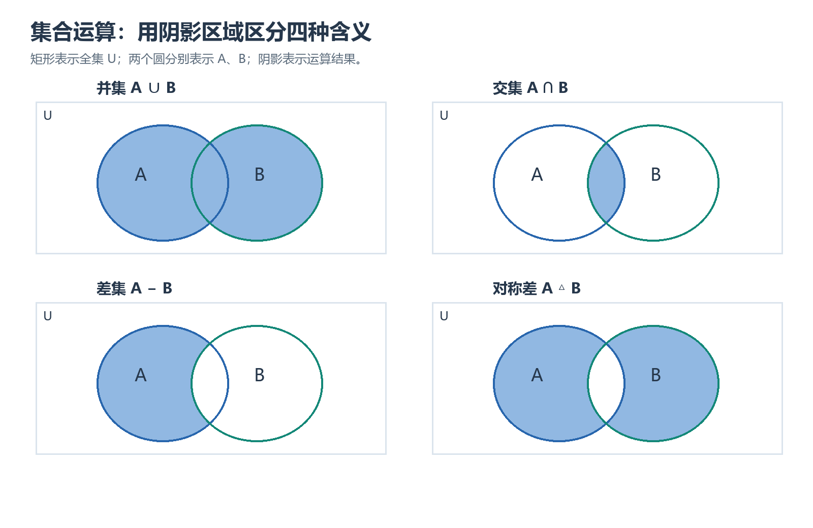

# 第六章｜集合代数

## 本章要学什么

本章围绕一个建模问题展开：**如何把对象的共同性质表示成集合，再用集合关系、运算、证明和计数回答“哪些对象满足条件、条件如何组合、结论为什么成立、共有多少个对象”？** 学习顺序从集合与元素开始，经过运算和算律，进入包含/相等证明，最后连接有限计数和自然语言建模。

本章依据 `课件/06 第六章 集合代数.pdf`。全集记为 $E$，补集采用 $\tilde A=E-A$ 的记号；涉及具体题目的数据以课件原文为准。学完后应能：

- 区分元素、集合、属于、包含、真包含、空集、全集和幂集；
- 用枚举法、描述法、归纳/递归指定和文氏图表示集合；
- 计算并、交、差、补、对称差、广义并与广义交；
- 用元素法、双重包含法、反证法和运算法证明集合关系；
- 用基数公式和包含排斥原理完成分类计数，并将自然语言条件转成集合模型。

> 阅读顺序：对象与表示 → 运算 → 算律 → 证明 → 计数 → 建模。

## 本章学习地图

| 学习阶段 | 要回答的核心问题 | 学完后的可见成果 |
| --- | --- | --- |
| 对象与表示 | 什么是元素，怎样表示一个集合？ | 能在多种表示法间转换并区分 $\in$ 与 $\subseteq$ |
| 运算与算律 | 条件组合后得到哪些对象？ | 能计算集合运算并用基本算律化简 |
| 证明 | 集合包含或相等为什么成立？ | 能选择元素法、双重包含或反证法完成证明 |
| 计数与建模 | 重叠条件下如何避免重复计数？ | 能画文氏图、写基数公式并解释建模边界 |

## 1. 学习目标

学完本章，应能：

1. 准确区分元素与集合、属于与包含、子集与真子集；
2. 使用枚举法、描述法、归纳法、递归指定和文氏图表示集合；
3. 熟练进行并、交、相对补、绝对补和对称差运算；
4. 理解广义并、广义交以及集合运算的优先级；
5. 熟记并灵活使用集合运算的基本算律；
6. 使用元素法、双重包含法、等式代入法、反证法和运算法证明集合包含或相等；
7. 使用基数公式和包含排斥原理解决集合计数问题；
8. 将实际问题抽象为集合模型，并用集合运算表达条件。

## 2. 集合的基本概念
### 本章路线

先区分元素与集合，再选择枚举、描述、归纳或文氏图表示，最后检查属于和包含的层次。

> 本章要解决的问题：怎样避免把 $x\in A$、$A\subseteq B$ 和 $\{x\}\subseteq A$ 混成同一种关系？
>
> 本章学完应会：能在多种表示法之间转换，并准确判断元素关系、子集关系和幂集。

### 2.1 集合与元素

集合可以理解为由一些离散对象组成的整体。组成集合的对象称为**元素**。集合不要求元素具有相同的类型，但必须满足以下三条基本性质：

- **确定性**：对任意对象，都能明确判断它是否属于该集合；
- **互异性**：集合中的重复元素只计一次，例如 $\{1,1,2\}=\{1,2\}$；
- **无序性**：元素的排列顺序不影响集合，例如 $\{1,2\}=\{2,1\}$。

集合中元素的重复出现和排列顺序都没有意义。判断两个集合是否相等时，只需比较它们包含的元素是否完全相同。

常用数集包括：

- 自然数集：$\mathbb N$；
- 整数集：$\mathbb Z$；
- 有理数集：$\mathbb Q$；
- 实数集：$\mathbb R$；
- 复数集：$\mathbb C$。

### 2.2 集合的表示方法

#### （1）枚举法（显式法）

把集合中的全部元素或具有代表性的元素列举出来。例如：

$$
A=\{a,b,c,d\},
$$

$$
B=\{0,1,4,9,16,\ldots\}.
$$

枚举法直观、透明，适合有限集合或元素之间规律明显的集合；元素很多或集合无限时，逐一列出会很不方便。

#### （2）描述法（隐式法）

用元素所满足的共同性质表示集合，常写作：

$$
P=\{x\mid P(x)\}.
$$

例如：

$$
\mathbb Z=\{x\mid x\text{ 是整数}\},
$$

$$
\mathbb Q^+=\{x\mid x\text{ 是正有理数}\}.
$$

描述法适合元素很多、元素无限，或元素具有容易刻画的共同特征的集合。写描述法时应明确元素所属的基本范围，否则同一个条件在不同数域中可能得到不同集合。

#### （3）归纳法

归纳定义一个集合通常包含三部分：

1. **基础**：规定若干最基本的元素属于该集合；
2. **归纳规则**：规定如何由已有元素构造新元素；
3. **极小性**：除按照前两部分得到的元素外，不再加入其他元素。

课件中的字符串集合例子说明：若规定 $0,1$ 属于集合，并规定由已有字符串 $a,b$ 可以构造 $ab,ba$，再要求有限次使用这些规则得到的字符串才属于该集合，那么该集合是通过归纳法定义的。

#### （4）递归指定

递归指定通过计算规则产生集合中的元素。例如：

$$
 a_0=1,\qquad a_{i+1}=2a_i\quad(i\geq 0),
$$

并定义

$$
S=\{a_k\mid k\geq 0\}.
$$

由此得到 $S=\{1,2,4,8,\ldots\}$。递归指定时，要同时给出初始值和递推规则。

#### （5）文氏图

文氏图用平面区域表示集合，用区域之间的位置关系表示集合之间的关系；全集通常画成矩形，集合画成矩形内的圆形或椭圆形，元素可用点表示。文氏图特别适合直观表示并、交、补和差运算。

### 2.3 元素与集合：属于关系

元素与集合之间使用属于符号：

- $x\in A$：$x$ 属于 $A$；
- $x\notin A$：$x$ 不属于 $A$。

对于任意集合 $A$ 和对象 $x$，$x\in A$ 与 $x\notin A$ 二者必有一个成立且仅有一个成立。这里的 $x$ 本身也可以是一个集合，因此要特别注意“集合是元素”和“集合是子集”是两个不同层次的关系。

例如，设

$$
A=\{a,\{b,c\},d,\{\{d\}\}\}.
$$

则：

- $\{b,c\}\in A$，但 $b\notin A$；
- $\{\{d\}\}\in A$，但 $\{d\}\notin A$；
- $d\in A$。

### 2.4 集合之间的关系

#### 子集（包含）

集合 $A$ 是集合 $B$ 的子集，记作 $A\subseteq B$，定义为：

$$
A\subseteq B\Longleftrightarrow \forall x\,(x\in A\rightarrow x\in B).
$$

也就是说，$A$ 中的每一个元素都属于 $B$。若不存在某个 $x$ 使得 $x\in A$ 且 $x\notin B$，则 $A\subseteq B$。

#### 真子集（真包含）

$A$ 是 $B$ 的真子集，记作 $A\subset B$，定义为：

$$
A\subset B\Longleftrightarrow A\subseteq B\land A\neq B.
$$

所以 $A\subset B$ 比 $A\subseteq B$ 多了一个“不相等”的条件。

#### 相等

两个集合相等，当且仅当它们互为子集：

$$
A=B\Longleftrightarrow A\subseteq B\land B\subseteq A.
$$

常用判定原则是：**证明两个集合相等，通常要分别证明两个方向的包含关系。**

> 注意：$x\in A$ 是元素与集合之间的关系；$A\subseteq B$ 是集合与集合之间的关系，二者不可混淆。

### 2.5 空集与全集

**空集**是不含任何元素的集合，记作 $\varnothing$。例如，在实数范围内满足 $x^2+1=0$ 的实数没有，因此

$$
\{x\mid x\in\mathbb R\land x^2+1=0\}=\varnothing.
$$

空集是任何集合的子集：

$$
\varnothing\subseteq A.
$$

原因是命题 $x\in\varnothing\rightarrow x\in A$ 没有反例，因而对所有 $x$ 都成立。空集具有唯一性：任意两个空集互为子集，所以它们相等。

**全集**是具体问题所讨论范围内的全部对象，记作 $E$。全集具有相对性：同一个集合在不同问题中可能对应不同的全集。任意问题中的讨论集合都满足

$$
A\subseteq E.
$$

### 2.6 幂集

集合 $A$ 的幂集是 $A$ 的所有子集组成的集合，记作 $P(A)$：

$$
P(A)=\{X\mid X\subseteq A\}.
$$

例如：

$$
P(\varnothing)=\{\varnothing\},
$$

$$
P(\{\varnothing\})=\{\varnothing,\{\varnothing\}\},
$$

$$
P(\{1,\{2,3\}\})
=\{\varnothing,\{1\},\{\{2,3\}\},\{1,\{2,3\}\}\}.
$$

若 $|A|=n$，则 $A$ 的每个元素都有“选入子集”或“不选入子集”两种可能，因此：

$$
|P(A)|=2^n.
$$

### 本章小结

能在多种表示法之间转换，并准确判断元素关系、子集关系和幂集。 本节的公式、定义或判定应回到课件条件核对，不能脱离对象、范围和适用边界单独记忆。

#### 小练习：本节核心迁移

> 题源：《06 第六章 集合代数.pdf》集合与元素练习（按题意整理）。

**题目：** 设 $A=\{a,\{b,c\},d\}$，判断 $b\in A$、$\{b,c\}\in A$、$\{b,c\}\subseteq A$、$\{a,d\}\subseteq A$。

**解析：** 依次为假、真、假、真。前两项是元素与集合的属于关系，后两项是集合与集合的包含关系；集合中有 $\{b,c\}$ 不表示其中的 $b,c$ 也直接属于 $A$。

### 本章练习与检验

> 题源：沿用上方小练习对应的项目课件，按同一知识点设置条件变式。

**综合检验：** 改变全集、交集条件或一个集合运算对象，重新完成化简/证明/计数，并说明补集、交集或基数公式的适用边界。

**验收标准：** 写清对象、已知条件、适用定义或规则和关键中间步骤；最后用等式、反例、关系性质或边界条件检查结论。

## 3. 集合的基本运算
### 本章路线

从并、交、差、补和对称差的元素条件出发，再使用分配、吸收、德摩根和补元律化简。

> 本章要解决的问题：如何把自然语言的“且/或/但不”翻译成集合运算，并用证明而不是图形直觉确认等式？
>
> 本章学完应会：能计算集合运算，证明包含或相等，并说明每一步使用的元素条件或算律。

以下运算均相对于同一个全集 $E$ 讨论。

### 3.1 并、交、相对补、绝对补和对称差

#### 并集

$$
A\cup B=\{x\mid x\in A\lor x\in B\}.
$$

元素至少属于 $A,B$ 中的一个时，属于 $A\cup B$。

#### 交集

$$
A\cap B=\{x\mid x\in A\land x\in B\}.
$$

元素同时属于 $A$ 和 $B$ 时，属于 $A\cap B$。

#### 相对补（差集）

$$
A-B=\{x\mid x\in A\land x\notin B\}.
$$

它表示从 $A$ 中删去属于 $B$ 的元素。相对补也可以写成：

$$
A-B=A\cap\tilde B.
$$

#### 绝对补

$$
\tilde A=E-A=\{x\mid x\in E\land x\notin A\}.
$$

补集必须依赖全集。没有指定全集时，$\tilde A$ 的含义可能不唯一。

#### 对称差

$$
A\oplus B=(A-B)\cup(B-A).
$$

对称差包含“只属于其中一个集合”的元素，不包含同时属于两个集合的元素。等价地：

$$
A\oplus B=(A\cup B)-(A\cap B).
$$

从逻辑角度看，$A\oplus B$ 对应“恰有一个成立”的异或关系。

### 3.2 基本包含关系

由定义可以直接得到：

$$
\varnothing\subseteq A-B\subseteq A.
$$

以及：

$$
A\subseteq B\Longleftrightarrow A-B=\varnothing,
$$

$$
A\cap B=\varnothing\Longleftrightarrow A-B=A.
$$

这些结论在集合证明和化简题中非常常用。

### 3.3 并集和交集的推广

对于有限个集合，可以写成：

$$
A_1\cup A_2\cup\cdots\cup A_n,
$$

$$
A_1\cap A_2\cap\cdots\cap A_n.
$$

也可以推广到可数个集合：

$$
\bigcup_{i=1}^{\infty}A_i
=\{x\mid \exists i\geq 1,\ x\in A_i\},
$$

$$
\bigcap_{i=1}^{\infty}A_i
=\{x\mid \forall i\geq 1,\ x\in A_i\}.
$$

其中，广义并表示“至少属于一个集合”，广义交表示“同时属于所有集合”。

### 3.4 广义并与广义交

设 $A$ 是一个集合，$A$ 的元素本身可能还是集合。由 $A$ 的所有元素中的元素组成的集合，称为 $A$ 的**广义并**：

$$
\bigcup A=\{x\mid \exists z\,(z\in A\land x\in z)\}.
$$

当 $A$ 非空时，$A$ 的所有元素的公共元素组成的集合，称为 $A$ 的**广义交**：

$$
\bigcap A=\{x\mid \forall z\,(z\in A\rightarrow x\in z)\}.
$$

例如：

$$
\bigcup\{\{1\},\{1,2\},\{1,2,3\}\}=\{1,2,3\},
$$

$$
\bigcap\{\{1\},\{1,2\},\{1,2,3\}\}=\{1\}.
$$

若 $a$ 是一个集合，则：

$$
\bigcup\{a\}=a,\qquad \bigcap\{a\}=a.
$$

特别地，

$$
\bigcup\varnothing=\varnothing,
$$

而 $\bigcap\varnothing$ 在本章的定义下无意义。

对有限集合族，广义运算可还原为普通运算：

$$
\bigcup\{A_1,A_2,\ldots,A_n\}=A_1\cup A_2\cup\cdots\cup A_n,
$$

$$
\bigcap\{A_1,A_2,\ldots,A_n\}=A_1\cap A_2\cap\cdots\cap A_n.
$$

广义运算的直观作用是减少一层集合结构：集合的元素是若干集合时，广义并、广义交可以直接对这些集合进行并、交。

### 3.5 集合运算的优先级

课件给出的优先级可概括为：

1. 单独作用于一个集合的运算优先，包括广义并、广义交、幂集和补运算；同类连续运算按约定方向处理，复杂表达式应主动加括号；
2. $\cup,\cap,-,\oplus$ 等二元运算的先后主要由括号决定；
3. 第一类运算优先于第二类运算。

遇到含有多层广义运算和普通运算的式子，建议从内到外逐步计算，并在每一步写出中间结果，避免把 $\bigcup A$ 误读成普通并集。

**读图提示：**逐格比较阴影：并集保留至少属于一个集合的区域，交集只保留重叠部分，差集只保留 A 中不属于 B 的部分，对称差排除重叠部分。矩形代表全集，阴影不是概率面积。

来源：依据本篇笔记相邻段落自绘的教学示意；不是教材原图或实测记录。

### 本章小结

能计算集合运算，证明包含或相等，并说明每一步使用的元素条件或算律。 本节的公式、定义或判定应回到课件条件核对，不能脱离对象、范围和适用边界单独记忆。

#### 小练习：本节核心迁移

> 题源：《06 第六章 集合代数.pdf》集合恒等式练习（按题意整理）。

**题目：** 证明 $A-(B\cup C)=(A-B)\cap(A-C)$。

**解析：** 任取 $x$，有 $x\in A-(B\cup C)\Leftrightarrow x\in A\land x\notin B\cup C\Leftrightarrow x\in A\land x\notin B\land x\notin C$，这等价于 $x\in(A-B)\cap(A-C)$。任意元素的成员资格等价，所以两集合相等。

### 本章练习与检验

> 题源：沿用上方小练习对应的项目课件，按同一知识点设置条件变式。

**综合检验：** 改变全集、交集条件或一个集合运算对象，重新完成化简/证明/计数，并说明补集、交集或基数公式的适用边界。

**验收标准：** 写清对象、已知条件、适用定义或规则和关键中间步骤；最后用等式、反例、关系性质或边界条件检查结论。

## 4. 集合运算的基本算律
### 本章路线

从并、交、差、补和对称差的元素条件出发，再使用分配、吸收、德摩根和补元律化简。

> 本章要解决的问题：如何把自然语言的“且/或/但不”翻译成集合运算，并用证明而不是图形直觉确认等式？
>
> 本章学完应会：能计算集合运算，证明包含或相等，并说明每一步使用的元素条件或算律。

### 4.1 交换律、结合律和幂等律

并、交、对称差都满足交换律：

$$
A\cup B=B\cup A,
$$

$$
A\cap B=B\cap A,
$$

$$
A\oplus B=B\oplus A.
$$

并、交、对称差都满足结合律：

$$
(A\cup B)\cup C=A\cup(B\cup C),
$$

$$
(A\cap B)\cap C=A\cap(B\cap C),
$$

$$
(A\oplus B)\oplus C=A\oplus(B\oplus C).
$$

并和交满足幂等律：

$$
A\cup A=A,\qquad A\cap A=A.
$$

### 4.2 分配律和吸收律

并、交之间互相满足分配律：

$$
A\cup(B\cap C)=(A\cup B)\cap(A\cup C),
$$

$$
A\cap(B\cup C)=(A\cap B)\cup(A\cap C).
$$

交与对称差也满足：

$$
A\cap(B\oplus C)=(A\cap B)\oplus(A\cap C).
$$

吸收律为：

$$
A\cup(A\cap B)=A,
$$

$$
A\cap(A\cup B)=A.
$$

吸收律的使用依赖并、交的交换性质，不能把它错误地推广到任意二元运算。

### 4.3 补、差和德摩根律

双重补律：

$$
\tilde{\tilde A}=A.
$$

差集的德摩根律：

$$
A-(B\cup C)=(A-B)\cap(A-C),
$$

$$
A-(B\cap C)=(A-B)\cup(A-C).
$$

补集的德摩根律：

$$
\widetilde{B\cup C}=\tilde B\cap\tilde C,
$$

$$
\widetilde{B\cap C}=\tilde B\cup\tilde C.
$$

### 4.4 补元律、零律、同一律

补元律：

$$
A\cap\tilde A=\varnothing,
$$

$$
A\cup\tilde A=E.
$$

零律：

$$
A\cap\varnothing=\varnothing,
$$

$$
A\cup E=E.
$$

同一律：

$$
A\cup\varnothing=A,
$$

$$
A\cap E=A.
$$

空集和全集的补：

$$
\tilde\varnothing=E,\qquad \tilde E=\varnothing.
$$

### 4.5 对称差的常用性质

除交换律、结合律和分配关系外，对称差还常用：

$$
A\oplus\varnothing=A,
$$

$$
A\oplus A=\varnothing,
$$

$$
A\oplus E=\tilde A,
$$

$$
(A\oplus B)\oplus B=A.
$$

这些性质使对称差在“只保留出现奇数次的元素”类问题中十分方便。

### 本章小结

能计算集合运算，证明包含或相等，并说明每一步使用的元素条件或算律。 本节的公式、定义或判定应回到课件条件核对，不能脱离对象、范围和适用边界单独记忆。

#### 小练习：本节核心迁移

> 题源：《06 第六章 集合代数.pdf》集合恒等式练习（按题意整理）。

**题目：** 证明 $A-(B\cup C)=(A-B)\cap(A-C)$。

**解析：** 任取 $x$，有 $x\in A-(B\cup C)\Leftrightarrow x\in A\land x\notin B\cup C\Leftrightarrow x\in A\land x\notin B\land x\notin C$，这等价于 $x\in(A-B)\cap(A-C)$。任意元素的成员资格等价，所以两集合相等。

### 本章练习与检验

> 题源：沿用上方小练习对应的项目课件，按同一知识点设置条件变式。

**综合检验：** 改变全集、交集条件或一个集合运算对象，重新完成化简/证明/计数，并说明补集、交集或基数公式的适用边界。

**验收标准：** 写清对象、已知条件、适用定义或规则和关键中间步骤；最后用等式、反例、关系性质或边界条件检查结论。

## 5. 集合包含与相等的证明方法
### 本章路线

先用元素法证明包含，再用双重包含得到相等；计数时定义集合、求交集并用包含排斥修正重复。

> 本章要解决的问题：怎样把“重叠条件下的总数”拆成互不重复的区域，并检查交集条件是否正确？
>
> 本章学完应会：能完成包含/相等证明和有限集合计数，并解释最小公倍数、交集项和补集项的来源。

### 5.1 用元素法证明包含

证明 $X\subseteq Y$ 的标准步骤是：

1. 任取 $x\in X$；
2. 根据 $X$ 的定义推导出一串条件；
3. 最后得到 $x\in Y$；
4. 因为 $x$ 是任意选取的，所以 $X\subseteq Y$。

例如证明 $A-B\subseteq A\cup B$：任取 $x\in A-B$，则 $x\in A$ 且 $x\notin B$，特别地 $x\in A$，所以 $x\in A\cup B$。

### 5.2 用双重包含证明相等

证明 $X=Y$ 时，最稳妥的方法是分别证明：

$$
X\subseteq Y,
$$

$$
Y\subseteq X.
$$

这就是集合相等的定义。也可以对任意 $x$ 证明：

$$
 x\in X\Longleftrightarrow x\in Y.
$$

### 5.3 用包含传递法

若能找到集合 $T$ 使得

$$
X\subseteq T\quad\text{且}\quad T\subseteq Y,
$$

则由包含关系的传递性可得 $X\subseteq Y$。

例如：

$$
A-B\subseteq A\subseteq A\cup B,
$$

所以 $A-B\subseteq A\cup B$。

### 5.4 用包含的等价条件

以下四个条件等价：

$$
A\subseteq B
\Longleftrightarrow A\cup B=B
\Longleftrightarrow A\cap B=A
\Longleftrightarrow A-B=\varnothing.
$$

选择哪一个形式，取决于题目给出的信息：

- 已知并集等式时，常化为 $A\cup B=B$；
- 已知交集等式时，常化为 $A\cap B=A$；
- 已知差集为空时，直接得到包含关系。

### 5.5 反证法

若要证明 $X\subseteq Y$，可以假设结论不成立，则存在元素 $x$ 满足

$$
 x\in X\land x\notin Y.
$$

再利用已知条件推出矛盾。

例如，若 $A\subseteq C$ 且 $B\subseteq C$，证明 $A\cup B\subseteq C$。反设不成立，则存在 $x\in A\cup B$ 且 $x\notin C$。由于 $x\in A\cup B$，所以 $x\in A$ 或 $x\in B$；这分别与 $A\subseteq C$ 或 $B\subseteq C$ 矛盾。

### 5.6 利用已知包含式进行并、交运算

若 $X\subseteq Y$，则对任意集合 $Z$ 都有：

$$
X\cap Z\subseteq Y\cap Z,
$$

$$
X\cup Z\subseteq Y\cup Z.
$$

例如，若

$$
A\cap C\subseteq B\cap C,
$$

且

$$
A-C\subseteq B-C,
$$

则两式取并：

$$
(A\cap C)\cup(A-C)
\subseteq
(B\cap C)\cup(B-C).
$$

因为 $A-C=A\cap\tilde C$，所以左边化为

$$
(A\cap C)\cup(A\cap\tilde C)=A\cap(C\cup\tilde C)=A.
$$

同理右边化为 $B$，因此 $A\subseteq B$。

### 5.7 等式代入法和集合运算法

集合等式证明可以像代数式化简一样，连续使用已经成立的等式进行代入。

例如证明吸收律：

$$
\begin{aligned}
A\cup(A\cap B)
&=(A\cap E)\cup(A\cap B)\\
&=A\cap(E\cup B)\\
&=A\cap E\\
&=A.
\end{aligned}
$$

若已知 $X=Y$，则可以对两边同时进行相同的集合运算，例如：

$$
X\cap Z=Y\cap Z,
$$

$$
X\cup Z=Y\cup Z,
$$

$$
X-Z=Y-Z.
$$

但每一步都应标明使用的定律，不能只写“显然”。

### 5.8 典型等价条件的证明链

证明

$$
A\subseteq B
\Longleftrightarrow A\cup B=B
\Longleftrightarrow A\cap B=A
\Longleftrightarrow A-B=\varnothing
$$

时，可以按以下顺序建立：

1. $A\subseteq B\Rightarrow A\cup B=B$；
2. $A\cup B=B\Rightarrow A\cap B=A$，将 $A\cup B$ 用 $B$ 代入 $A=A\cap(A\cup B)$；
3. $A\cap B=A\Rightarrow A-B=\varnothing$，否则存在 $x\in A-B$ 会导致 $x\in A$ 且 $x\notin B$，从而 $x\notin A\cap B$；
4. $A-B=\varnothing\Rightarrow A\subseteq B$，否则存在 $x\in A$ 且 $x\notin B$，这意味着 $x\in A-B$，与差集为空矛盾。

### 本章小结

能完成包含/相等证明和有限集合计数，并解释最小公倍数、交集项和补集项的来源。 本节的公式、定义或判定应回到课件条件核对，不能脱离对象、范围和适用边界单独记忆。

#### 小练习：本节核心迁移

> 题源：《06 第六章 集合代数.pdf》包含排斥与整除计数练习（按题意整理）。

**题目：** 在 $1$ 到 $100$ 中，求能被 $2$ 或 $3$ 整除的整数个数，并说明交集如何确定。

**解析：** $|A|=50$、$|B|=33$；交集是被 $\operatorname{lcm}(2,3)=6$ 整除的数，共 $16$ 个。因此 $|A\cup B|=50+33-16=67$。减去交集是为了消除两次相加造成的一次重复。

### 本章练习与检验

> 题源：沿用上方小练习对应的项目课件，按同一知识点设置条件变式。

**综合检验：** 把上方题目中的一个前提或结论替换为其否定或等价形式，重新判断有效性或完成证明，并指出原方法在哪一步需要调整。

**验收标准：** 写清对象、已知条件、适用定义或规则和关键中间步骤；最后用等式、反例、关系性质或边界条件检查结论。

## 6. 集合中元素的计数
### 本章路线

先用元素法证明包含，再用双重包含得到相等；计数时定义集合、求交集并用包含排斥修正重复。

> 本章要解决的问题：怎样把“重叠条件下的总数”拆成互不重复的区域，并检查交集条件是否正确？
>
> 本章学完应会：能完成包含/相等证明和有限集合计数，并解释最小公倍数、交集项和补集项的来源。

### 6.1 基数与有穷集合

集合 $A$ 中元素的个数称为 $A$ 的**基数**，记作 $\operatorname{card}(A)$ 或 $|A|$。

若存在自然数 $n$ 使得

$$
|A|=n,
$$

则称 $A$ 为有穷集。例：

$$
A=\{a,b,c\}\Rightarrow |A|=3,
$$

$$
B=\{x\mid x\in\mathbb R\land x^2+1=0\}\Rightarrow |B|=0.
$$

$\mathbb N,\mathbb Z,\mathbb Q,\mathbb R,\mathbb C$ 等都是无穷集。

### 6.2 两个集合的计数公式

对有限集合 $A,B$：

$$
|A\cup B|=|A|+|B|-|A\cap B|.
$$

原因是直接计算 $|A|+|B|$ 时，交集中的元素被计算了两次，因此要减去一次 $|A\cap B|$。

补集计数公式为：

$$
|\tilde A|=|E|-|A|.
$$

### 6.3 包含排斥原理

设 $S$ 为有限集，$P_1,P_2,\ldots,P_m$ 为 $m$ 种性质，$A_i$ 是 $S$ 中具有性质 $P_i$ 的元素组成的子集。则 $S$ 中**不具有任何一种性质**的元素数为：

$$
\left|\widetilde{A_1\cup A_2\cup\cdots\cup A_m}\right|
=|S|
-\sum_{i=1}^{m}|A_i|
+\sum_{1\leq i<j\leq m}|A_i\cap A_j|
-\sum_{1\leq i<j<k\leq m}|A_i\cap A_j\cap A_k|
+\cdots
+(-1)^m|A_1\cap A_2\cap\cdots\cap A_m|.
$$

等价地，先求至少具有一种性质的元素数：

$$
\begin{aligned}
\lvert A_1\cup\cdots\cup A_m\rvert
={}&\sum_i|A_i|
-\sum_{i<j}|A_i\cap A_j|\\
&+\sum_{i<j<k}|A_i\cap A_j\cap A_k|-\cdots.
\end{aligned}
$$

然后用

$$
|S-(A_1\cup\cdots\cup A_m)|=|S|-\lvert A_1\cup\cdots\cup A_m\rvert
$$

求出一个性质都不具有的元素数。

#### 为什么要交替加减

若某元素恰好具有 $n$ 种性质，它在右侧的贡献为

$$
\binom n1-\binom n2+\binom n3-\cdots+(-1)^{n+1}\binom nn=1,
$$

所以它只被计算一次。若某元素不具有任何性质，则它不属于任何 $A_i$，只在 $|S|$ 中贡献一次。若把“不具有任何性质”的集合写成补集公式，交替加减就能保证每个元素最终被准确计数。

### 6.4 计数例题：整除问题

求 $1$ 到 $1000$ 中既不能被 $5$ 整除、也不能被 $6$ 整除、也不能被 $8$ 整除的数的个数。

设全集

$$
S=\{x\in\mathbb Z\mid 1\leq x\leq 1000\}.
$$

定义：

$$
A=\{x\in S\mid 5\mid x\},
$$

$$
B=\{x\in S\mid 6\mid x\},
$$

$$
C=\{x\in S\mid 8\mid x\}.
$$

各集合及交集的基数为：

$$
|S|=1000,
$$

$$
|A|=\left\lfloor\frac{1000}{5}\right\rfloor=200,
\quad |B|=\left\lfloor\frac{1000}{6}\right\rfloor=166,
\quad |C|=\left\lfloor\frac{1000}{8}\right\rfloor=125,
$$

$$
|A\cap B|=\left\lfloor\frac{1000}{30}\right\rfloor=33,
$$

$$
|A\cap C|=\left\lfloor\frac{1000}{40}\right\rfloor=25,
$$

$$
|B\cap C|=\left\lfloor\frac{1000}{24}\right\rfloor=41,
$$

$$
|A\cap B\cap C|=\left\lfloor\frac{1000}{120}\right\rfloor=8.
$$

因此：

$$
\begin{aligned}
\lvert S-(A\cup B\cup C)\rvert
&=1000-(200+166+125)+(33+25+41)-8\\
&=600.
\end{aligned}
$$

所以满足条件的数共有 $600$ 个。

> 解题关键：交集对应同时满足多个整除条件，因此要使用最小公倍数；例如 $A\cap B$ 中的数是 $30$ 的倍数。

### 6.5 计数例题：兴趣爱好

在 $20$ 个大学生中，$10$ 人爱好音乐，$8$ 人爱好美术，$6$ 人同时爱好音乐和美术。设全体学生为 $U$，音乐爱好者为 $A$，美术爱好者为 $B$，则：

$$
|A\cup B|=|A|+|B|-|A\cap B|=10+8-6=12.
$$

既不爱好音乐又不爱好美术的学生属于补集：

$$
|\widetilde{A\cup B}|=|U|-|A\cup B|=20-12=8.
$$

因此有 $8$ 人两种爱好都没有。

### 本章小结

能完成包含/相等证明和有限集合计数，并解释最小公倍数、交集项和补集项的来源。 本节的公式、定义或判定应回到课件条件核对，不能脱离对象、范围和适用边界单独记忆。

#### 小练习：本节核心迁移

> 题源：《06 第六章 集合代数.pdf》包含排斥与整除计数练习（按题意整理）。

**题目：** 在 $1$ 到 $100$ 中，求能被 $2$ 或 $3$ 整除的整数个数，并说明交集如何确定。

**解析：** $|A|=50$、$|B|=33$；交集是被 $\operatorname{lcm}(2,3)=6$ 整除的数，共 $16$ 个。因此 $|A\cup B|=50+33-16=67$。减去交集是为了消除两次相加造成的一次重复。

### 本章练习与检验

> 题源：沿用上方小练习对应的项目课件，按同一知识点设置条件变式。

**综合检验：** 改变全集、交集条件或一个集合运算对象，重新完成化简/证明/计数，并说明补集、交集或基数公式的适用边界。

**验收标准：** 写清对象、已知条件、适用定义或规则和关键中间步骤；最后用等式、反例、关系性质或边界条件检查结论。

## 7. 集合的应用与建模
### 本章路线

定义全集和性质集合，判断对象是否有序，再用文氏图、集合式和基数公式交叉检查。

> 本章要解决的问题：模型中的对象、全集和“同一种结果”的判断是否与题意一致？
>
> 本章学完应会：能把分类、偏好和条件筛选题改写为集合模型，并说明模型依赖的边界条件。

### 7.1 用集合表示自然语言条件

将对象分类为集合，再用集合运算翻译条件。例如：

- “属于计算机系且属于二年级”：$R\cap S$；
- “属于数学系或计算机系”：$M\cup R$；
- “属于数学系但不属于计算机系”：$M-R$；
- “不属于数学系”：$\tilde M$；
- “只属于两个集合中的一个”：$A\oplus B$。

翻译自然语言时要注意“或”的含义通常是并集，“且”的含义是交集，“但不”对应差集，“只有……才……”通常表达必要条件，不能直接按充分条件理解。

### 7.2 有顺序与无顺序的区别

集合中的元素无序。课件中投掷三个硬币的例子说明：若把一次投掷得到的结果作为元素，原始的有序记录可能写成 $\{HHH,HHT,HTH,HTT,THH,THT,TTH,TTT\}$；但若题意认为三个硬币没有顺序，则经重新排列可以视为同一种结果，最终只保留代表性结果。

因此，建模前应先判断：

- 对象的排列位置是否有意义；
- 旋转、对称或重新标号后是否视为同一个对象；
- 是在计数“记录序列”，还是在计数“等价类别”。

### 7.3 文氏图与计数

对两个或三个集合的计数题，先画文氏图通常能避免重复计数。基本步骤是：

1. 明确全集；
2. 定义各个性质对应的集合；
3. 先填写交集，再填写只属于某一集合的区域；
4. 最后用全集减去已覆盖的区域，或直接使用包含排斥原理。

### 本章小结

能把分类、偏好和条件筛选题改写为集合模型，并说明模型依赖的边界条件。 本节的公式、定义或判定应回到课件条件核对，不能脱离对象、范围和适用边界单独记忆。

#### 小练习：本节核心迁移

> 题源：《06 第六章 集合代数.pdf》集合应用与建模练习（按题意整理）。

**题目：** 某班 $50$ 人中，$|M|=28$、$|P|=24$、$|M\cap P|=10$。求只选数学、只选物理、至少一门、两门均未选的人数。

**解析：** 只选数学 $28-10=18$，只选物理 $24-10=14$，至少一门 $28+24-10=42$，两门均未选 $50-42=8$。结果依赖于 $M,P$ 使用同一班级全集且每人分类口径一致。

### 本章练习与检验

> 题源：沿用上方小练习对应的项目课件，按同一知识点设置条件变式。

**综合检验：** 改变全集、交集条件或一个集合运算对象，重新完成化简/证明/计数，并说明补集、交集或基数公式的适用边界。

**验收标准：** 写清对象、已知条件、适用定义或规则和关键中间步骤；最后用等式、反例、关系性质或边界条件检查结论。

## 8. 高频结论速查

### 8.1 集合关系

- $A\subseteq B\Longleftrightarrow \forall x(x\in A\rightarrow x\in B)$；
- $A=B\Longleftrightarrow A\subseteq B\land B\subseteq A$；
- $A\subseteq B\Longleftrightarrow A\cup B=B$；
- $A\subseteq B\Longleftrightarrow A\cap B=A$；
- $A\subseteq B\Longleftrightarrow A-B=\varnothing$；
- $\varnothing\subseteq A$；
- $A\subseteq E$；
- $|P(A)|=2^{|A|}$（$A$ 为有限集）。

### 8.2 集合运算

- $A-B=A\cap\tilde B$；
- $A\oplus B=(A-B)\cup(B-A)$；
- $A\oplus B=(A\cup B)-(A\cap B)$；
- $\tilde{A\cup B}=\tilde A\cap\tilde B$；
- $\tilde{A\cap B}=\tilde A\cup\tilde B$；
- $A\cap\tilde A=\varnothing$；
- $A\cup\tilde A=E$；
- $\tilde{\tilde A}=A$。

### 8.3 计数

- $|A\cup B|=|A|+|B|-|A\cap B|$；
- $|\tilde A|=|E|-|A|$；
- 多集合并集按“单集合和、双交集差、三交集加、……”交替进行。

## 9. 易错点

- 把 $x\in A$ 和 $A\subseteq B$ 当成同一种关系；
- 把 $\{a\}$ 和 $a$ 混淆，前者是含有元素 $a$ 的单元集，后者是元素本身；
- 忽略集合的无序性，把 $\{a,b\}$ 和 $\{b,a\}$ 当作不同集合；
- 把重复元素计入集合基数；
- 把真子集 $A\subset B$ 和子集 $A\subseteq B$ 混淆；
- 忘记空集是任何集合的子集；
- 不指定全集就直接判断补集；
- 把差集 $A-B$ 误写成 $B-A$；
- 把对称差误认为并集，忽略同时属于 $A$ 和 $B$ 的元素应被排除；
- 把广义并 $\bigcup A$ 和普通并集 $A\cup B$ 混淆；
- 只证明 $A\subseteq B$ 就直接得出 $A=B$；
- 使用包含排斥原理时忘记交集项的符号交替变化；
- 计算整除交集时使用错误的数值，交集应使用相关数的最小公倍数；
- 在应用题中没有先确认对象是否有序，导致把同一对象重复计数。

## 10. 解题策略

### 10.1 集合化简题

1. 先明确全集和补集的含义；
2. 优先处理括号内、广义运算和补运算；
3. 尝试使用德摩根律、分配律、吸收律和补元律；
4. 每一步注明使用的集合算律；
5. 复杂表达式不要跳步，避免把元素关系和集合关系混写。

### 10.2 包含证明题

1. 目标是 $X\subseteq Y$ 时，任取 $x\in X$；
2. 根据定义把 $x\in X$ 转换为元素条件；
3. 使用已知条件推出 $x\in Y$；
4. 若直接推导困难，可考虑中间集合、等价条件或反证法；
5. 目标是相等时，优先考虑双重包含。

### 10.3 计数题

1. 先确定全集 $S$；
2. 将每个条件定义成一个子集；
3. 判断题目要求的是并集、交集还是补集；
4. 有多个条件时画文氏图或使用包含排斥原理；
5. 检查交集是否需要使用最小公倍数；
6. 最后检查每个对象是否被恰好计数一次。

## 11. 课件习题与复习建议

课件第 67 页以后为本章习题课及解答，第 83 页给出了本章总结。第 44 页列出了课堂作业编号：第 4 题、第 21 题、第 8 题的（4）（5）（6）、第 30 题的（3）（4）、第 9 题的（5）、第 35 题、第 15 题的（2）和第 18 题的（4）。具体题目内容未在课件文字提取中完整呈现，练习时应以教材或教师发放的题目为准。

建议按以下顺序复习：

1. 先默写五种基本集合运算的定义；
2. 用文氏图验证并、交、差、补和对称差；
3. 独立证明 $A\subseteq B$ 的四个等价条件；
4. 至少完成一道集合恒等式的元素法证明和一道代数法证明；
5. 完成二集合和三集合的包含排斥计数题；
6. 最后整理自然语言到集合表达式的翻译。

## 12. 自测清单

- [ ] 能解释集合的确定性、互异性和无序性。
- [ ] 能区分 $x\in A$、$A\subseteq B$、$A\subset B$ 和 $A=B$。
- [ ] 能写出空集、全集和幂集的定义，并求有限集合的幂集基数。
- [ ] 能准确写出并、交、差、补、对称差的定义。
- [ ] 能计算广义并和广义交，并判断运算优先级。
- [ ] 能默写德摩根律、吸收律、补元律、零律和同一律。
- [ ] 能用双重包含法证明两个集合相等。
- [ ] 能把 $A\subseteq B$ 转换为 $A\cup B=B$、$A\cap B=A$ 或 $A-B=\varnothing$。
- [ ] 能使用包含排斥原理处理三个集合的计数问题。
- [ ] 能判断应用题中对象是否有序，避免重复计数。

## 13. 本章小结

本章围绕“集合是什么、集合之间有什么关系、集合如何运算、集合恒等式如何证明、集合中的元素如何计数”展开。最重要的主线是：

$$
\text{集合表示}
\longrightarrow
\text{属于与包含}
\longrightarrow
\text{集合运算}
\longrightarrow
\text{集合算律与证明}
\longrightarrow
\text{基数与包含排斥计数}.
$$

学习时应特别重视三个基础：一是严格区分元素层次和集合层次；二是把自然语言条件翻译成集合运算；三是通过“任取元素”和“双向包含”建立严谨的证明习惯。

## 六、练习提示与常见问题

- 先确认对象层次和全集，再使用 $\in$、$\subseteq$ 或补集。
- 补集必须相对于指定全集；$A-B$ 与 $B-A$ 一般不同。
- 集合相等需要双向包含或元素条件等价；只证明一边不够。
- 计数先定义集合和交集，最后用文氏图或包含排斥检查重复与遗漏。

## 七、隔日复习与自测

### 换一组条件再判断（20分钟）

换一组有限集合，重新计算一个补集、一个对称差和一个三集合并集，并写出元素判定条件。

### 闭卷解释关键问题（20分钟）

1. 为什么 $A\subseteq B$ 等价于 $A\cup B=B$？
2. 为什么整除交集使用最小公倍数？
3. 什么时候计数题必须先判断有序/无序？

### 周末/阶段复盘（15分钟）

重做一个集合恒等式证明和一个包含排斥题，最后给出一个区分 $\in$ 与 $\subseteq$ 的反例。

## 八、学习安排与阅读资料

- 必读：`课件/06 第六章 集合代数.pdf`。
- 辅助配图：`笔记/images/study-note-figures/set-operations-venn.png`。
- 复习顺序：对象/表示 → 运算/算律 → 证明 → 计数/建模；补集记号和课件题号以 PDF 为准。

## 九、自测参考答案

1. 对 $A=\{a,\{b,c\},d\}$，四个判断依次为假、真、假、真。
2. $A-(B\cup C)$ 与 $(A-B)\cap(A-C)$ 的元素条件均为“属于 $A$ 且不属于 $B$、$C$”。
3. $1$ 到 $100$ 中被 $2$ 或 $3$ 整除的数为 $50+33-16=67$。

<!-- study-notes-v3-structured:2026-10-07 -->

<!-- study-notes-inline-structure:2026-10-07 -->
